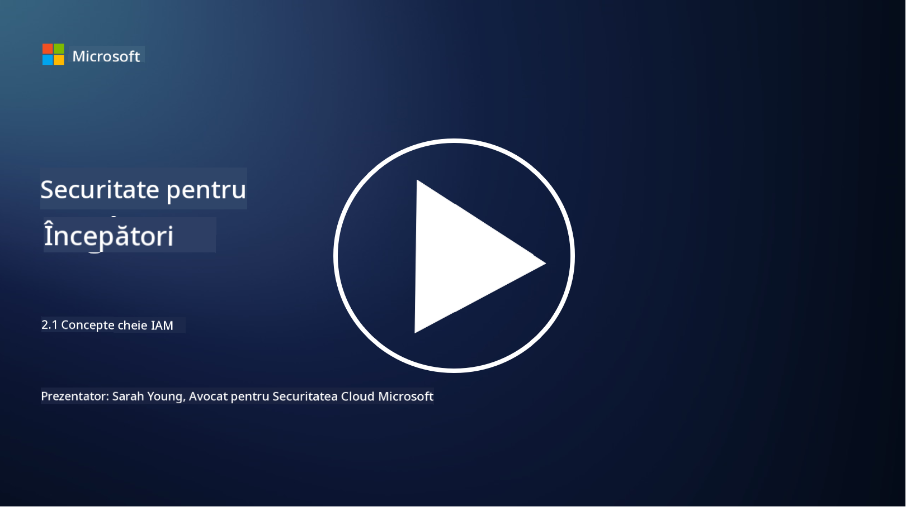

<!--
CO_OP_TRANSLATOR_METADATA:
{
  "original_hash": "2e3864e3d579f0dbb4ac2ec8c5f82acf",
  "translation_date": "2025-09-03T22:43:18+00:00",
  "source_file": "2.1 IAM key concepts.md",
  "language_code": "ro"
}
-->
# Concepte cheie IAM

Ai intrat vreodată într-un computer sau pe un site web? Desigur că da! Asta înseamnă că ai folosit deja controale de identitate în viața de zi cu zi. Managementul identității și accesului (IAM) este o componentă esențială a securității, iar în lecțiile următoare vom învăța mai multe despre acest subiect.

**Introducere**

În această lecție vom aborda:

- Ce înseamnă managementul identității și accesului (IAM) în contextul
  securității cibernetice?
  
- Ce este principiul privilegiului minim?
  
- Ce este separarea atribuțiilor?
  
- Ce sunt autentificarea și autorizarea?

## Ce înseamnă managementul identității și accesului (IAM) în contextul securității cibernetice?

Managementul identității și accesului (IAM) se referă la un set de procese, tehnologii și politici implementate pentru a asigura că persoanele potrivite au accesul adecvat la resursele din mediul digital al unei organizații. IAM implică gestionarea identităților digitale (utilizatori, angajați, parteneri) și accesul acestora la sisteme, aplicații, date și rețele. Scopul principal al IAM este de a îmbunătăți securitatea, de a simplifica accesul utilizatorilor și de a asigura conformitatea cu politicile și reglementările organizaționale. Soluțiile IAM includ, de obicei, autentificarea utilizatorilor, autorizarea, gestionarea identităților, controlul accesului și administrarea ciclului de viață al utilizatorilor (asigurându-se că conturile sunt șterse atunci când nu mai sunt utilizate).

## Ce este principiul privilegiului minim?

Principiul privilegiului minim este un concept fundamental care susține acordarea utilizatorilor și sistemelor doar a privilegiilor minime necesare pentru a-și îndeplini sarcinile sau rolurile. Acest principiu ajută la limitarea daunelor potențiale în cazul unei breșe de securitate sau a unei amenințări interne. Prin respectarea principiului privilegiului minim, organizațiile reduc suprafața de atac și minimizează riscul accesului neautorizat, al breșelor de date și al utilizării greșite a privilegiilor. În practică, acest lucru înseamnă că utilizatorii primesc acces doar la resursele și funcționalitățile specifice necesare pentru rolurile lor de muncă, și nimic mai mult. De exemplu, dacă ai nevoie doar să citești un document, ar fi excesiv să ți se acorde privilegii de administrator complet pentru acel document.

## Ce este separarea atribuțiilor?

Separarea atribuțiilor este un principiu care urmărește prevenirea conflictelor de interese și reducerea riscului de fraudă și erori prin distribuirea sarcinilor și responsabilităților critice între diferite persoane din cadrul unei organizații. În contextul securității cibernetice, separarea atribuțiilor implică asigurarea că nicio persoană nu are control asupra tuturor aspectelor unui proces sau sistem critic. Scopul este de a crea un sistem de verificări și echilibru care să împiedice orice persoană să poată efectua atât etapa de configurare, cât și cea de aprobare a unui proces. De exemplu, în sistemele financiare, acest principiu poate dicta ca persoana care introduce tranzacțiile în sistem să nu fie aceeași care le aprobă. Acest lucru reduce riscul ca acțiunile neautorizate sau frauduloase să treacă neobservate.

## Ce sunt autentificarea și autorizarea?

Autentificarea și autorizarea sunt două concepte fundamentale în securitatea cibernetică care joacă un rol crucial în asigurarea securității și integrității sistemelor informatice și a datelor. Acestea sunt adesea utilizate împreună pentru a controla accesul la resurse și pentru a proteja informațiile sensibile.

**1. Autentificarea**: Autentificarea este procesul de verificare a identității unui utilizator, sistem sau entitate care încearcă să acceseze un sistem informatic sau o resursă specifică. Acest proces asigură că identitatea revendicată este autentică și corectă. Metodele de autentificare implică, de obicei, utilizarea unuia sau mai multor factori:

   a. Ceva ce știi: Acestea includ parole, coduri PIN sau alte informații secrete pe care doar utilizatorul autorizat ar trebui să le cunoască.
   
   b. Ceva ce ai: Acestea implică utilizarea unor token-uri fizice sau dispozitive, cum ar fi carduri inteligente, token-uri de securitate sau telefoane mobile, pentru a confirma identitatea utilizatorului.
   
   c. Ceva ce ești: Acestea se referă la factori biometrici, cum ar fi amprentele, recunoașterea facială sau scanările retinei, care sunt unice pentru fiecare individ.

Mecanismele de autentificare sunt utilizate pentru a confirma că un utilizator este cine pretinde a fi înainte de a permite accesul la un sistem sau resursă. Acest lucru ajută la prevenirea accesului neautorizat și asigură că doar utilizatorii legitimi pot efectua acțiuni într-un sistem.

**2. Autorizarea**: Autorizarea este procesul de acordare sau refuzare a permisiunilor și privilegiilor specifice utilizatorilor sau entităților autentificate, odată ce identitatea lor a fost verificată. Acest proces determină ce acțiuni sau operațiuni are voie să efectueze un utilizator într-un sistem sau asupra unor resurse specifice. Autorizarea se bazează, de obicei, pe politici predefinite, reguli de control al accesului și roluri atribuite utilizatorilor.

Autorizarea poate fi considerată ca răspunsul la întrebarea: "Ce poate face un utilizator autentificat?" Acest proces implică definirea și aplicarea politicilor de control al accesului pentru a proteja datele și resursele sensibile de accesul sau modificarea neautorizată.

**Pe scurt:**

- Autentificarea stabilește identitatea utilizatorilor sau entităților.
- Autorizarea determină ce acțiuni și resurse pot accesa sau manipula utilizatorii autentificați.

## Lecturi suplimentare

- [Describe identity concepts - Training | Microsoft Learn](https://learn.microsoft.com/training/modules/describe-identity-principles-concepts/?WT.mc_id=academic-96948-sayoung)
- [Introduction to identity - Microsoft Entra | Microsoft Learn](https://learn.microsoft.com/azure/active-directory/fundamentals/identity-fundamental-concepts?WT.mc_id=academic-96948-sayoung)
- [What is Identity Access Management (IAM)? | Microsoft Security](https://www.microsoft.com/security/business/security-101/what-is-identity-access-management-iam?WT.mc_id=academic-96948-sayoung)
- [What is IAM? Identity and access management explained | CSO Online](https://www.csoonline.com/article/518296/what-is-iam-identity-and-access-management-explained.html)
- [What is IAM? (auth0.com)](https://auth0.com/blog/what-is-iam/)
- [Security+: implementing Identity and Access Management (IAM) controls [updated 2021] | Infosec (infosecinstitute.com)](https://resources.infosecinstitute.com/certifications/securityplus/security-implementing-identity-and-access-management-iam-controls/)
- [least privilege - Glossary | CSRC (nist.gov)](https://csrc.nist.gov/glossary/term/least_privilege)
- [Security: The Principle of Least Privilege (POLP) - Microsoft Community Hub](https://techcommunity.microsoft.com/t5/azure-sql-blog/security-the-principle-of-least-privilege-polp/ba-p/2067390?WT.mc_id=academic-96948-sayoung)
- [Principle of least privilege | CERT NZ](https://www.cert.govt.nz/it-specialists/critical-controls/principle-of-least-privilege/)
- [Why is separation of duties required by NIST 800-171 and CMMC? - (totem.tech)](https://www.totem.tech/cmmc-separation-of-duties/)

---

**Declinare de responsabilitate**:  
Acest document a fost tradus folosind serviciul de traducere AI [Co-op Translator](https://github.com/Azure/co-op-translator). Deși ne străduim să asigurăm acuratețea, vă rugăm să rețineți că traducerile automate pot conține erori sau inexactități. Documentul original în limba sa natală ar trebui considerat sursa autoritară. Pentru informații critice, se recomandă traducerea profesională realizată de un specialist uman. Nu ne asumăm responsabilitatea pentru eventualele neînțelegeri sau interpretări greșite care pot apărea din utilizarea acestei traduceri.