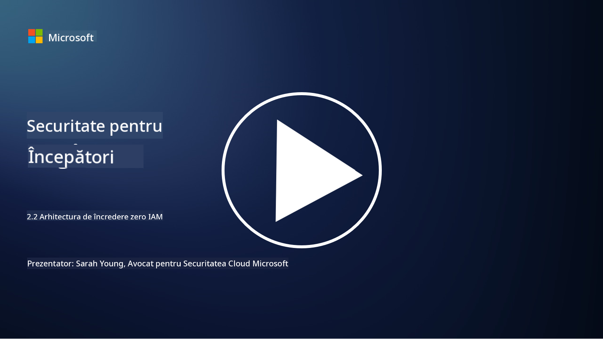

<!--
CO_OP_TRANSLATOR_METADATA:
{
  "original_hash": "4774a978af123f72ebb872199c4c4d4f",
  "translation_date": "2025-09-03T23:43:42+00:00",
  "source_file": "2.2 IAM zero trust architecture.md",
  "language_code": "ro"
}
-->
# Arhitectura IAM Zero Trust

Identitatea este o componentă esențială în implementarea unei arhitecturi de tip zero trust și în construirea unui perimetru pentru orice mediu IT. În această secțiune vom explora de ce este important să utilizăm controale de identitate pentru a implementa zero trust.

## Introducere

În această lecție, vom aborda:

 - De ce este necesar să folosim identitatea ca perimetru în mediile IT moderne?
   
 - Cum diferă acest lucru de arhitecturile IT tradiționale?

 - Cum este utilizată identitatea pentru a implementa o arhitectură de tip zero trust?

## De ce este necesar să folosim identitatea ca perimetru în mediile IT moderne?

În mediile IT moderne, conceptul tradițional de perimetru fizic (folosind instrumente precum firewall-uri și limite de rețea) ca linie principală de apărare împotriva amenințărilor cibernetice devine din ce în ce mai puțin eficient din cauza complexității crescânde a tehnologiei, a creșterii muncii la distanță și a adoptării serviciilor cloud. În schimb, organizațiile se îndreaptă spre utilizarea identității ca nou perimetru. Aceasta înseamnă că securitatea se concentrează pe verificarea și gestionarea identității utilizatorilor, dispozitivelor și aplicațiilor care încearcă să acceseze resurse, indiferent de locația lor fizică.

Iată de ce utilizarea identității ca perimetru este esențială în mediile IT moderne:

**Forța de muncă la distanță**: Cu munca la distanță și dispozitivele mobile devenind norma, utilizatorii pot accesa resurse din diverse locații și dispozitive. Abordarea tradițională a perimetrului nu funcționează atunci când utilizatorii nu mai sunt limitați la un birou fizic.

**Mediile cloud și hibride**: Organizațiile adoptă din ce în ce mai mult servicii cloud și medii hibride. Datele și aplicațiile nu mai sunt localizate exclusiv în sediul organizației, ceea ce face ca apărarea tradițională a perimetrului să fie mai puțin relevantă.

**Securitate Zero Trust**: Conceptul de securitate zero trust presupune că nicio entitate, fie din interiorul, fie din exteriorul rețelei, nu ar trebui să fie automat de încredere. Identitatea devine fundamentul pentru verificarea cererilor de acces, indiferent de unde provin.

**Peisajul amenințărilor**: Amenințările cibernetice evoluează, iar atacatorii găsesc modalități de a ocoli apărarea tradițională a perimetrului. Phishing-ul, ingineria socială și amenințările interne exploatează adesea vulnerabilitățile umane, mai degrabă decât să încerce să pătrundă în perimetrele rețelei.

**Abordare centrată pe date**: Protejarea datelor sensibile este esențială. Prin concentrarea pe identitate, organizațiile pot controla cine accesează ce date, reducând riscul de breșe de securitate.

## Cum diferă acest lucru de arhitecturile IT tradiționale?

Arhitecturile IT tradiționale se bazau în mare măsură pe modele de securitate bazate pe perimetru, unde firewall-urile și limitele de rețea jucau un rol semnificativ în protejarea împotriva amenințărilor. Principalele diferențe între abordările tradiționale și cele centrate pe identitate sunt:

|      Aspect                 |      Arhitecturi IT tradiționale                                                                  |      Abordare centrată pe identitate                                                                      |
|-----------------------------|----------------------------------------------------------------------------------------------------|------------------------------------------------------------------------------------------------------------|
|     Focalizare              |     Focalizare pe perimetru: Se baza pe apărarea perimetrului, cum ar fi firewall-uri și controlul accesului. |     Focalizare pe verificarea identității: Trecerea de la limitele rețelei la verificarea identității utilizatorilor/dispozitivelor. |
|     Locație                 |     Dependență de locație: Securitatea era legată de locațiile fizice ale birourilor și limitele rețelei. |     Independență de locație: Securitatea nu este legată de locații specifice; accesul este posibil de oriunde. |
|     Presupunerea de încredere|     Încredere presupusă: Se presupunea încrederea în interiorul perimetrului rețelei pentru utilizatori/dispozitive. |     Abordare Zero Trust: Încrederea nu este niciodată presupusă; accesul este verificat pe baza identității și contextului. |
|     Considerarea dispozitivelor|     Diversitatea dispozitivelor: Se presupunea că dispozitivele din interiorul perimetrului rețelei erau sigure. |     Conștientizarea dispozitivelor: Se ia în considerare sănătatea și postura de securitate a dispozitivelor, indiferent de locație. |
|     Protecția datelor       |     Protecția datelor: Se concentra pe securizarea perimetrului rețelei pentru protecția datelor. |     Protecție centrată pe date: Se concentrează pe controlul accesului la date pe baza identității și sensibilității datelor. |

## Cum este utilizată identitatea pentru a implementa o arhitectură de tip zero trust?

Într-o arhitectură de tip zero trust, principiul fundamental este de a nu avea încredere automat în nicio entitate, indiferent dacă aceasta se află în interiorul sau în exteriorul perimetrului rețelei. Identitatea joacă un rol central în implementarea unei abordări zero trust prin permiterea verificării continue a entităților care încearcă să acceseze resurse. Controalele moderne de securitate a identității permit ca fiecare utilizator, dispozitiv, aplicație și serviciu care solicită acces la resurse să fie identificat și autentificat complet înainte de a primi acces. Acest lucru implică verificarea identității digitale prin metode precum combinații de nume de utilizator/parolă, autentificare multi-factor (MFA), biometrie și alte mecanisme de autentificare puternice.

## Lecturi suplimentare

- [Securing identity with Zero Trust | Microsoft Learn](https://learn.microsoft.com/security/zero-trust/deploy/identity?WT.mc_id=academic-96948-sayoung)
- [Zero Trust Principles and Guidance for Identity and Access | CSA (cloudsecurityalliance.org)](https://cloudsecurityalliance.org/artifacts/zero-trust-principles-and-guidance-for-iam/)
- [Zero Trust Identity Controls - Essentials Series - Episode 2 - YouTube](https://www.youtube.com/watch?v=fQZQznIKcGM&list=PLXtHYVsvn_b_gtX1-NB62wNervQx1Fhp4&index=13)

---

**Declinarea responsabilității**:  
Acest document a fost tradus folosind serviciul de traducere AI [Co-op Translator](https://github.com/Azure/co-op-translator). Deși depunem eforturi pentru a asigura acuratețea, vă rugăm să aveți în vedere că traducerile automate pot conține erori sau inexactități. Documentul original în limba sa nativă ar trebui considerat sursa autoritară. Pentru informații critice, se recomandă traducerea profesională realizată de un specialist uman. Nu ne asumăm răspunderea pentru eventualele neînțelegeri sau interpretări greșite care pot apărea din utilizarea acestei traduceri.