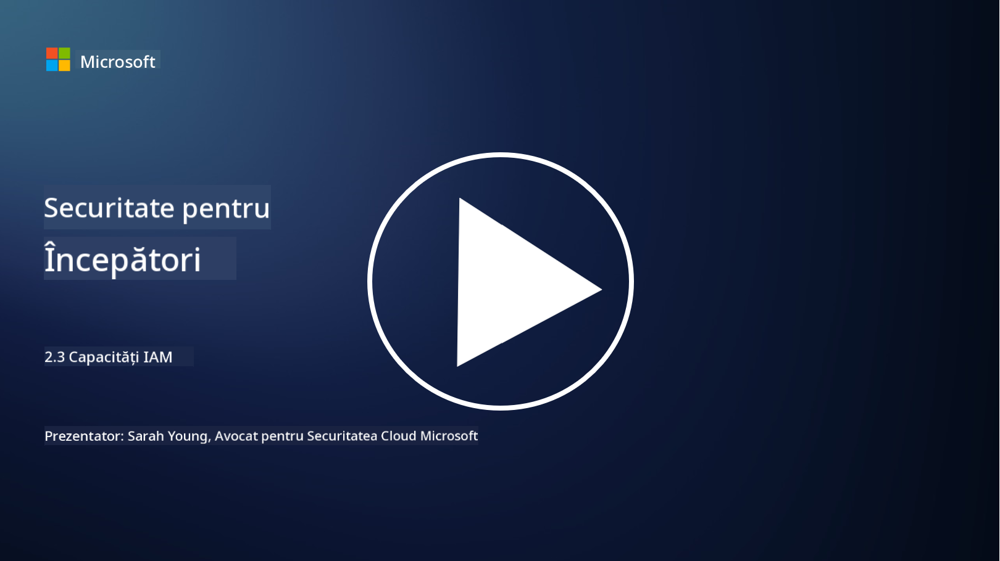

<!--
CO_OP_TRANSLATOR_METADATA:
{
  "original_hash": "bf0b8a54f2c69951744df5a94bc923f7",
  "translation_date": "2025-09-04T01:58:37+00:00",
  "source_file": "2.3 IAM capabilities.md",
  "language_code": "ro"
}
-->
# Capacități IAM

În această secțiune, vom detalia mai multe despre instrumentele și capacitățile de bază utilizate în securitatea identității.

## Introducere

În această lecție, vom discuta:

 - Ce este un serviciu de directoare?
      
     
    
 - Ce tipuri de capacități pot fi utilizate pentru a securiza identitățile?
>
>        Autentificare Multi-Factor (MFA)
> 
>        Single Sign-On (SSO)
> 
>        Control al Accesului Bazat pe Roluri (RBAC)
> 
>        Autentificare Adaptivă
> 
>        Autentificare Biometrică
> 
>        Managementul Accesului Privilegiat (PAM)
> 
>        Guvernanța și Administrarea Identității (IGA)
> 
>        Analiza Comportamentală

## Ce este un serviciu de directoare?

Un serviciu de directoare este o bază de date specializată care stochează și gestionează informații despre resursele din rețea, inclusiv utilizatori, grupuri, dispozitive, aplicații și alte obiecte. Acesta servește ca un depozit centralizat de date legate de identitate și acces, permițând organizațiilor să gestioneze și să controleze eficient autentificarea utilizatorilor, autorizarea și alte sarcini legate de securitate.

Serviciile de directoare joacă un rol crucial în mediile IT moderne, oferind o fundație pentru soluțiile de management al identității și accesului (IAM). Ele facilitează accesul securizat la resurse, aplică politici de acces și simplifică sarcinile administrative. Unul dintre cele mai cunoscute servicii de directoare este Microsoft Active Directory, dar există și alte soluții, cum ar fi directoarele LDAP (Lightweight Directory Access Protocol), care servesc scopuri similare.

Funcțiile și caracteristicile cheie ale unui serviciu de directoare în contextul securității cibernetice includ:

 - **Autentificarea Utilizatorilor**: Serviciile de directoare validează acreditivele utilizatorilor (cum ar fi numele de utilizator și parolele) pentru a se asigura că doar utilizatorii autorizați pot accesa rețeaua și resursele acesteia.
 - **Autorizarea Utilizatorilor**: Ele determină nivelul de acces pe care îl are fiecare utilizator, pe baza rolului, apartenenței la grup și altor atribute. Acest lucru asigură că utilizatorii pot accesa doar resursele la care au drepturi.
 - **Managementul Grupurilor**: Serviciile de directoare permit administratorilor să organizeze utilizatorii în grupuri logice, simplificând gestionarea controlului accesului. Permisiunile pot fi atribuite grupurilor, în locul utilizatorilor individuali.
 - **Politici de Parolă**: Ele aplică reguli de complexitate și expirare a parolelor, îmbunătățind securitatea conturilor utilizatorilor.
 - **Single Sign-On (SSO)**: Unele servicii de directoare suportă SSO, permițând utilizatorilor să acceseze mai multe aplicații și servicii cu un singur set de acreditive.
 - **Management Centralizat al Utilizatorilor**: Serviciile de directoare centralizează informațiile despre utilizatori, facilitând gestionarea conturilor, profilurilor și atributelor utilizatorilor dintr-o singură locație.
 - **Auditare și Jurnalizare**: Ele pot înregistra activitățile de autentificare și acces ale utilizatorilor, ajutând la audituri de securitate și eforturi de conformitate.

## Ce tipuri de capacități pot fi utilizate pentru a securiza identitățile?

**Autentificare Multi-Factor (MFA)**

MFA necesită ca utilizatorii să furnizeze mai multe forme de verificare înainte de a li se acorda acces. Acest lucru include, de obicei, ceva ce utilizatorul știe (parola), ceva ce utilizatorul are (smartphone sau token de securitate) și ceva ce utilizatorul este (date biometrice, cum ar fi amprenta sau recunoașterea facială).

**Single Sign-On (SSO)**

SSO permite utilizatorilor să acceseze mai multe aplicații și sisteme cu un singur set de acreditive. Acest lucru îmbunătățește experiența utilizatorului și reduce riscurile asociate cu gestionarea mai multor parole.

**Control al Accesului Bazat pe Roluri (RBAC)**

RBAC atribuie permisiuni pe baza rolurilor predefinite. Utilizatorii primesc acces în funcție de rolurile lor în cadrul organizației.

**Autentificare Adaptivă**

Autentificarea adaptivă evaluează factori de risc, cum ar fi locația, dispozitivul, ora accesului și comportamentul utilizatorului, pentru a ajusta dinamic nivelul de autentificare necesar. Dacă o cerere pare suspectă, pot fi declanșate pași suplimentari de autentificare.

**Autentificare Biometrică**

Autentificarea biometrică utilizează caracteristici biologice unice, cum ar fi amprentele, trăsăturile faciale, tiparele vocale și chiar trăsături comportamentale, cum ar fi viteza de tastare, pentru verificarea identității.

**Managementul Accesului Privilegiat (PAM)**

PAM se concentrează pe securizarea accesului la sisteme și date critice prin aplicarea unor controale stricte asupra conturilor privilegiate. Include funcții precum accesul just-in-time și monitorizarea sesiunilor.

**Guvernanța și Administrarea Identității (IGA)**

Soluțiile IGA gestionează identitățile utilizatorilor și accesul acestora la resurse pe parcursul întregului ciclu de viață. Acest lucru include integrarea, aprovizionarea, controlul accesului bazat pe roluri și dezactivarea conturilor.

**Analiza Comportamentală**

Analiza comportamentală monitorizează comportamentul utilizatorilor și stabilește modele de bază. Abaterile de la normă pot declanșa alerte pentru investigații suplimentare.

# Lecturi suplimentare
- [Documentația fundamentală Azure Active Directory - Microsoft Entra | Microsoft Learn](https://learn.microsoft.com/azure/active-directory/fundamentals/?WT.mc_id=academic-96948-sayoung)
- [Ce este Azure Active Directory? - Microsoft Entra | Microsoft Learn](https://learn.microsoft.com/azure/active-directory/fundamentals/whatis?WT.mc_id=academic-96948-sayoung)
- [Gestionează-ți infrastructura de identitate multi-cloud cu Microsoft Entra - YouTube](https://www.youtube.com/watch?v=9qQiq3wTS2Y&list=PLXtHYVsvn_b_gtX1-NB62wNervQx1Fhp4&index=18)

---

**Declinarea responsabilității**:  
Acest document a fost tradus folosind serviciul de traducere AI [Co-op Translator](https://github.com/Azure/co-op-translator). Deși depunem eforturi pentru a asigura acuratețea, vă rugăm să rețineți că traducerile automate pot conține erori sau inexactități. Documentul original în limba sa nativă ar trebui considerat sursa autoritară. Pentru informații critice, se recomandă traducerea profesională realizată de un specialist uman. Nu ne asumăm răspunderea pentru eventualele neînțelegeri sau interpretări greșite care pot apărea din utilizarea acestei traduceri.