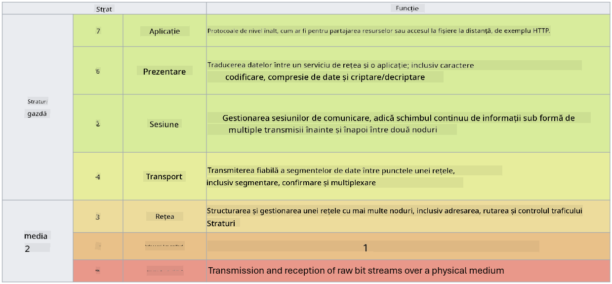

<!--
CO_OP_TRANSLATOR_METADATA:
{
  "original_hash": "252724eceeb183fb9018f88c5e1a3f0c",
  "translation_date": "2025-09-04T01:50:12+00:00",
  "source_file": "3.1 Networking key concepts.md",
  "language_code": "ro"
}
-->
# Concepte cheie despre rețele

Dacă ai lucrat în domeniul IT, este foarte probabil să fi fost expus la concepte despre rețele. Deși utilizăm identitatea ca principal control de perimetru în mediile moderne, acest lucru nu înseamnă că măsurile de control ale rețelei sunt redundante. Deși este un subiect vast, în această lecție vom acoperi câteva concepte esențiale despre rețele.

În această lecție, vom discuta despre:

 - Ce este adresarea IP?
   
 - Ce este modelul OSI?

 

 - Ce sunt TCP/UDP?

   
 

 - Ce sunt numerele de port?

   
  

 - Ce este criptarea în repaus și în tranzit?

## Ce este adresarea IP?

Adresarea IP, sau adresarea Protocolului Internet, este o etichetă numerică atribuită fiecărui dispozitiv conectat la o rețea de calculatoare care utilizează Protocolul Internet pentru comunicare. Aceasta servește drept identificator unic pentru dispozitivele dintr-o rețea, permițându-le să trimită și să primească date pe internet sau pe alte rețele interconectate. Există două versiuni principale ale adresării IP: IPv4 (Internet Protocol versiunea 4) și IPv6 (Internet Protocol versiunea 6). O adresă IP este de obicei reprezentată în format IPv4 (de exemplu, 192.168.1.1) sau în format IPv6 (de exemplu, 2001:0db8:85a3:0000:0000:8a2e:0370:7334).

## Ce este modelul OSI?

Modelul OSI (Open Systems Interconnection) este un cadru conceptual care standardizează funcțiile unui sistem de comunicație în șapte straturi distincte. Fiecare strat îndeplinește sarcini specifice și comunică cu straturile adiacente pentru a asigura o comunicare eficientă și fiabilă a datelor între dispozitivele dintr-o rețea. Straturile, de jos în sus, sunt următoarele:

 1. Strat Fizic
    
 
 2. Strat Legătură de Date

    
    

 1. Strat Rețea

    
   

 1. Strat Transport

    

 1. Strat Sesiune

    
   

 1. Strat Prezentare

    
    

 1. Strat Aplicație

Modelul OSI oferă o referință comună pentru înțelegerea modului în care protocoalele și tehnologiile de rețea interacționează, indiferent de implementările hardware sau software specifice.

_ref: https://en.wikipedia.org/wiki/OSI_model_

## Ce sunt TCP/UDP?

TCP (Transmission Control Protocol) și UDP (User Datagram Protocol) sunt două protocoale fundamentale ale stratului de transport utilizate în rețelele de calculatoare pentru a facilita comunicarea între dispozitive pe internet sau într-o rețea locală. Acestea sunt responsabile de împărțirea datelor în pachete pentru transmisie și de reasamblarea acestor pachete în datele originale la destinație. Totuși, ele diferă prin caracteristicile și cazurile lor de utilizare.

**TCP (Transmission Control Protocol)**:

TCP este un protocol orientat pe conexiune care oferă livrarea fiabilă și ordonată a datelor între dispozitive. Acesta stabilește o conexiune între expeditor și receptor înainte de începerea schimbului de date. TCP asigură că pachetele de date ajung în ordinea corectă și poate gestiona retransmisia pachetelor pierdute pentru a garanta integritatea și completitudinea datelor. Acest lucru face ca TCP să fie potrivit pentru aplicații care necesită livrarea fiabilă a datelor, cum ar fi navigarea pe web, e-mailul, transferul de fișiere (FTP) și comunicarea cu baze de date.

**UDP (User Datagram Protocol)**:

UDP este un protocol fără conexiune care oferă o transmisie mai rapidă a datelor, dar nu asigură același nivel de fiabilitate ca TCP. Nu stabilește o conexiune formală înainte de trimiterea datelor și nu include mecanisme pentru confirmarea sau retransmisia pachetelor pierdute. UDP este potrivit pentru aplicații în care viteza și eficiența sunt mai importante decât livrarea garantată, cum ar fi comunicarea în timp real, streamingul media, jocurile online și interogările DNS.

În rezumat, TCP prioritizează fiabilitatea și livrarea ordonată, fiind potrivit pentru aplicații care necesită acuratețea datelor, în timp ce UDP pune accent pe viteză și eficiență, fiind adecvat pentru aplicații în care pierderile minore de date sau rearanjarea ordinii sunt acceptabile în schimbul unei latențe reduse. Alegerea între TCP și UDP depinde de cerințele specifice ale aplicației sau serviciului utilizat.

## Ce sunt numerele de port?

În rețelistică, un număr de port este un identificator numeric utilizat pentru a diferenția între diferite servicii sau aplicații care rulează pe un singur dispozitiv dintr-o rețea. Porturile ajută la direcționarea datelor primite către aplicația corespunzătoare. Numerele de port sunt întregi fără semn pe 16 biți, ceea ce înseamnă că variază între 0 și 65535. Ele sunt împărțite în trei intervale:

- Porturi bine-cunoscute (0-1023): Rezervate pentru servicii standard precum HTTP (portul 80) și FTP (portul 21).

- Porturi înregistrate (1024-49151): Utilizate pentru aplicații și servicii care nu fac parte din intervalul bine-cunoscut, dar sunt înregistrate oficial.

- Porturi dinamice/private (49152-65535): Disponibile pentru utilizare temporară sau privată de către aplicații.

## Ce este criptarea în repaus și în tranzit?

Criptarea este procesul de transformare a datelor într-un format securizat pentru a le proteja împotriva accesului neautorizat sau a modificărilor. Criptarea poate fi aplicată atât datelor "în repaus" (când sunt stocate pe un dispozitiv sau server), cât și datelor "în tranzit" (când sunt transmise între dispozitive sau prin rețele).

Criptarea în Repaus: Aceasta implică criptarea datelor stocate pe dispozitive, servere sau sisteme de stocare. Chiar dacă un atacator obține acces fizic la mediul de stocare, nu poate accesa datele fără cheile de criptare. Acest lucru este esențial pentru protejarea datelor sensibile în cazul furtului de dispozitive, breșelor de securitate sau accesului neautorizat.

Criptarea în Tranzit: Aceasta implică criptarea datelor pe măsură ce sunt transmise între dispozitive sau prin rețele. Acest lucru previne interceptarea și accesul neautorizat la date în timpul transmisiei. Protocoale comune pentru criptarea în tranzit includ HTTPS pentru comunicarea web și TLS/SSL pentru securizarea diferitelor tipuri de trafic de rețea.

## Lecturi suplimentare
- [How Do IP Addresses Work? (howtogeek.com)](https://www.howtogeek.com/341307/how-do-ip-addresses-work/)
- [Understanding IP Address: An Introductory Guide (geekflare.com)](https://geekflare.com/understanding-ip-address/)
- [What is the OSI model? The 7 layers of OSI explained (techtarget.com)](https://www.techtarget.com/searchnetworking/definition/OSI)
- [The OSI Model – The 7 Layers of Networking Explained in Plain English (freecodecamp.org)](https://www.freecodecamp.org/news/osi-model-networking-layers-explained-in-plain-english/)
- [TCP/IP protocols - IBM Documentation](https://www.ibm.com/docs/en/aix/7.3?topic=protocol-tcpip-protocols)
- [Common Ports Cheat Sheet: The Ultimate Ports & Protocols List (stationx.net)](https://www.stationx.net/common-ports-cheat-sheet/)
- [Azure Data Encryption-at-Rest - Azure Security | Microsoft Learn](https://learn.microsoft.com/azure/security/fundamentals/encryption-atrest?WT.mc_id=academic-96948-sayoung)

---

**Declinarea responsabilității**:  
Acest document a fost tradus folosind serviciul de traducere AI [Co-op Translator](https://github.com/Azure/co-op-translator). Deși depunem eforturi pentru a asigura acuratețea, vă rugăm să rețineți că traducerile automate pot conține erori sau inexactități. Documentul original în limba sa nativă ar trebui considerat sursa autoritară. Pentru informații critice, se recomandă traducerea realizată de un profesionist uman. Nu ne asumăm răspunderea pentru eventualele neînțelegeri sau interpretări greșite care pot apărea din utilizarea acestei traduceri.