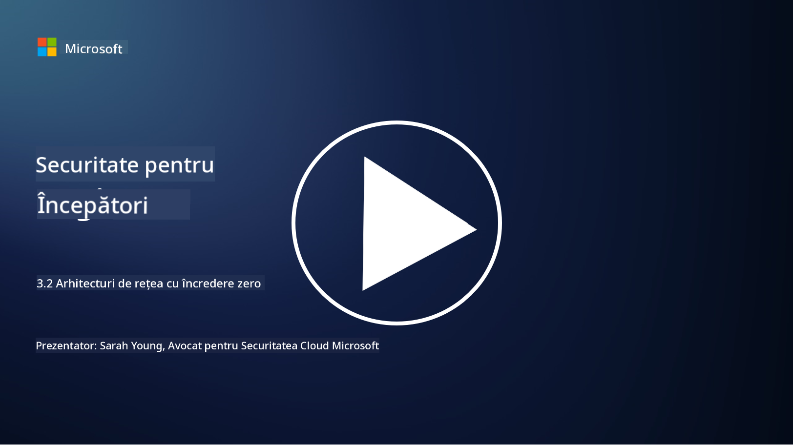

<!--
CO_OP_TRANSLATOR_METADATA:
{
  "original_hash": "680d6e14d9d33fc471c22f44679713f8",
  "translation_date": "2025-09-04T00:41:10+00:00",
  "source_file": "3.2 Networking zero trust architecture.md",
  "language_code": "ro"
}
-->
# Arhitecturi de rețea cu încredere zero

Rețeaua oferă un strat esențial în controalele de tip zero trust, iar în această lecție vom învăța mai multe despre:

- Ce este segmentarea rețelei?  
- Cum ajută segmentarea rețelei la implementarea zero trust?  
- Ce este criptarea de la un capăt la altul?

## Ce este segmentarea rețelei?

Segmentarea rețelei este practica de a împărți o rețea în segmente sau subrețele mai mici și izolate. Fiecare segment este izolat de celelalte, iar accesul între segmente este controlat și restricționat pe baza unor politici de securitate specifice. Segmentarea rețelei este utilizată pentru a îmbunătăți securitatea prin limitarea impactului potențial al breșelor și reducerea mișcării laterale a atacatorilor în rețea.

Prin implementarea segmentării rețelei, o organizație poate crea "zone" care separă diferite tipuri de utilizatori, aplicații și date. Acest lucru reduce suprafața de atac și minimizează daunele potențiale cauzate de un incident de securitate. Segmentarea rețelei poate fi realizată prin tehnologii precum rețele virtuale locale (VLAN-uri), firewall-uri și controale de acces.

## Cum ajută segmentarea rețelei la implementarea zero trust?

Segmentarea rețelei se aliniază îndeaproape cu principiile modelului Zero Trust. Într-o arhitectură Zero Trust, segmentarea rețelei ajută la aplicarea principiului "cel mai mic privilegiu" prin asigurarea faptului că utilizatorii și dispozitivele au acces doar la resursele și serviciile specifice de care au nevoie pentru a-și îndeplini sarcinile. Prin segmentarea rețelei în zone mai mici, organizațiile pot implementa controale stricte de acces, izola activele critice și preveni mișcarea laterală a atacatorilor.

Segmentarea rețelei contribuie, de asemenea, la aplicarea controalelor de acces bazate pe identitate, unde utilizatorii și dispozitivele sunt autentificate și autorizate riguros înainte de a accesa segmente specifice. Acest lucru previne accesul neautorizat la resurse sensibile și reduce impactul potențial al compromiterii acreditărilor.

## Ce este criptarea de la un capăt la altul?

Criptarea de la un capăt la altul (E2E) este o măsură de securitate care asigură că datele rămân criptate pe tot parcursul călătoriei lor de la expeditor la destinatar. În acest proces, datele sunt criptate la capătul expeditorului, iar doar destinatarul deține cheia de decriptare pentru a debloca și citi datele. Procesele de criptare și decriptare au loc la capete, ceea ce face extrem de dificil pentru părțile neautorizate, inclusiv furnizorii de servicii și intermediarii, să acceseze datele în formă clară.

Criptarea E2E oferă un nivel ridicat de confidențialitate și securitate pentru transmiterea datelor, chiar dacă acestea trec prin diverse sisteme sau rețele intermediare. Este utilizată frecvent în aplicații de mesagerie securizată, servicii de e-mail și alte platforme de comunicare pentru a proteja informațiile sensibile de interceptare și acces neautorizat.

Această metodă de criptare asigură că, chiar dacă atacatorii reușesc să obțină acces la datele în tranzit, vor vedea doar conținut criptat, care este lipsit de sens fără cheia de decriptare. Criptarea de la un capăt la altul joacă un rol crucial în protejarea confidențialității utilizatorilor și a informațiilor sensibile împotriva expunerii către părți neautorizate.

## Ce este SASE?

SASE înseamnă "Secure Access Service Edge" și reprezintă un cadru și o arhitectură de securitate cibernetică care combină securitatea rețelei și capacitățile de rețea de arie largă (WAN) într-un singur serviciu bazat pe cloud. SASE este conceput pentru a oferi acces securizat și scalabil la resursele rețelei, aplicații și date pentru utilizatorii mobili și la distanță, simplificând în același timp gestionarea rețelei și reducând complexitatea arhitecturilor tradiționale de rețea și securitate.

Caracteristici și componente cheie ale SASE includ:

1.  **Bazat pe cloud:** SASE este livrat ca un serviciu cloud, ceea ce înseamnă că funcțiile de securitate și rețea sunt furnizate din cloud, în loc să se bazeze pe hardware și dispozitive tradiționale on-premises.
    
2.  **Integrarea securității și rețelei:** SASE integrează diverse servicii de securitate, cum ar fi secure web gateways (SWG), firewall as a service (FWaaS), data loss prevention (DLP), zero-trust network access (ZTNA) și optimizarea WAN, cu capacități de rețea de arie largă. Această integrare ajută la simplificarea operațiunilor de securitate și rețea.
    
3.  **Zero Trust:** SASE funcționează pe principiul zero trust, ceea ce înseamnă că aplică controale stricte de acces și politici de acces cu cel mai mic privilegiu. Utilizatorii și dispozitivele nu sunt considerate de încredere implicit și trebuie să fie autentificate și autorizate înainte de a accesa resursele.
    
4.  **Centrat pe identitate:** SASE se concentrează pe identitatea utilizatorilor și dispozitivelor ca bază pentru controlul accesului. Politicile bazate pe identitate și context sunt utilizate pentru a determina permisiunile de acces, iar aceste politici se adaptează dinamic pe baza comportamentului utilizatorului și a contextului.
    
5.  **Scalabilitate și flexibilitate:** SASE poate fi scalat cu ușurință pentru a acomoda un număr mare de utilizatori și dispozitive, ceea ce îl face potrivit pentru organizațiile cu nevoi diverse și în continuă schimbare în materie de rețea și securitate.
    

SASE este deosebit de relevant în era modernă a muncii la distanță și a adoptării cloud-ului, deoarece oferă o abordare cuprinzătoare și agilă pentru securizarea și gestionarea accesului la rețea. Ajută organizațiile să se adapteze la cerințele în schimbare ale securității și rețelei, menținând în același timp un accent puternic pe modelele de securitate centrate pe utilizator și zero trust.

## Lecturi suplimentare

- [What Is Network Segmentation? - Cisco](https://www.cisco.com/c/en/us/products/security/what-is-network-segmentation.html#~benefits)  
- [What Is Micro-Segmentation? - Cisco](https://www.cisco.com/c/en/us/products/security/what-is-microsegmentation.html)  
- [Implementing Network Segmentation and Segregation | Cyber.gov.au](https://www.cyber.gov.au/resources-business-and-government/maintaining-devices-and-systems/system-hardening-and-administration/network-hardening/implementing-network-segmentation-and-segregation)  
- [What Is Network Segmentation and Why It Matters | CompTIA](https://www.comptia.org/blog/security-awareness-training-network-segmentation)  
- [Network Segmentation: Concepts and Practices (cmu.edu)](https://insights.sei.cmu.edu/blog/network-segmentation-concepts-and-practices/)  
- [Secure networks with Zero Trust | Microsoft Learn](https://learn.microsoft.com/security/zero-trust/deploy/networks?WT.mc_id=academic-96948-sayoung)  
- [What is end-to-end encryption? | IBM](https://www.ibm.com/topics/end-to-end-encryption)  
- [What Is End-to-End Encryption, and Why Does It Matter? (howtogeek.com)](https://www.howtogeek.com/711656/what-is-end-to-end-encryption-and-why-does-it-matter/)  
- [Definition of Secure Access Service Edge (SASE) - Gartner Information Technology Glossary](https://www.gartner.com/en/information-technology/glossary/secure-access-service-edge-sase)  
- [What Is Secure Access Service Edge (SASE)? | Microsoft Security](https://www.microsoft.com/security/business/security-101/what-is-sase?WT.mc_id=academic-96948-sayoung)  

---

**Declinarea responsabilității**:  
Acest document a fost tradus utilizând serviciul de traducere AI [Co-op Translator](https://github.com/Azure/co-op-translator). Deși depunem eforturi pentru a asigura acuratețea, vă rugăm să aveți în vedere că traducerile automate pot conține erori sau inexactități. Documentul original în limba sa nativă ar trebui considerat sursa autoritară. Pentru informații critice, se recomandă traducerea realizată de un profesionist uman. Nu ne asumăm răspunderea pentru eventualele neînțelegeri sau interpretări greșite care pot apărea din utilizarea acestei traduceri.