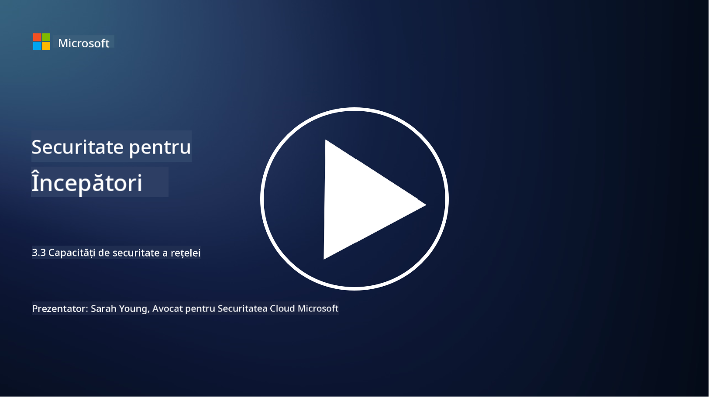

<!--
CO_OP_TRANSLATOR_METADATA:
{
  "original_hash": "c3aba077bb98eebc925dd58d870229ab",
  "translation_date": "2025-09-03T23:35:58+00:00",
  "source_file": "3.3 Network security capabilities.md",
  "language_code": "ro"
}
-->
# Capacități de securitate a rețelei

În această lecție vom învăța despre următoarele capacități care pot fi utilizate pentru a securiza o rețea:

 - Firewall-uri tradiționale
 - Firewall-uri pentru aplicații web
 - Grupuri de securitate în cloud
 - CDN
 - Balansatoare de sarcină
 - Gazde bastion
 - VPN-uri
 - Protecție împotriva atacurilor DDoS

## Firewall-uri tradiționale

Firewall-urile tradiționale sunt dispozitive de securitate care controlează și monitorizează traficul de rețea, atât cel de intrare, cât și cel de ieșire, pe baza unor reguli de securitate predefinite. Ele acționează ca o barieră între o rețea internă de încredere și rețele externe nesigure, filtrând traficul pentru a preveni accesul neautorizat și amenințările potențiale.

## Firewall-uri pentru aplicații web

Firewall-urile pentru aplicații web (WAF) sunt firewall-uri specializate concepute pentru a proteja aplicațiile web de diverse atacuri, cum ar fi injecțiile SQL, scripturile inter-site și alte vulnerabilități. Ele analizează cererile și răspunsurile HTTP pentru a identifica și bloca traficul malițios care vizează aplicațiile web.

## Grupuri de securitate în cloud

Grupurile de securitate sunt o funcție fundamentală de securitate a rețelei oferită de furnizorii de servicii cloud. Acestea acționează ca firewall-uri virtuale care controlează traficul de intrare și de ieșire către și dinspre resursele cloud, cum ar fi mașinile virtuale (VM) și instanțele. Grupurile de securitate permit organizațiilor să definească reguli care determină ce tipuri de trafic sunt permise și interzise, adăugând un strat suplimentar de apărare în implementările cloud.

## Rețea de distribuție a conținutului (CDN)

O rețea de distribuție a conținutului este o rețea distribuită de servere situate în diverse locații geografice. CDN-urile ajută la îmbunătățirea performanței și disponibilității site-urilor web prin stocarea în cache a conținutului și livrarea acestuia de la servere mai apropiate de utilizator. Ele oferă, de asemenea, un anumit nivel de protecție împotriva atacurilor DDoS prin distribuirea traficului pe mai multe locații de server.

## Balansatoare de sarcină

Balansatoarele de sarcină distribuie traficul de rețea de intrare pe mai multe servere pentru a optimiza utilizarea resurselor, a asigura o disponibilitate ridicată și a îmbunătăți performanța aplicațiilor. Ele ajută la prevenirea supraîncărcării serverelor și la menținerea timpilor de răspuns eficienți, sporind reziliența rețelei.

## Gazde bastion

Gazdele bastion sunt servere extrem de securizate și izolate care oferă acces controlat la o rețea dintr-o rețea externă nesigură (cum ar fi internetul). Ele servesc drept puncte de intrare pentru administratori pentru a accesa sistemele interne în mod securizat. Gazdele bastion sunt de obicei configurate cu măsuri de securitate stricte pentru a minimiza suprafața de atac.

## Rețele private virtuale (VPN-uri)

VPN-urile creează tuneluri criptate între dispozitivul unui utilizator și un server la distanță, asigurând o comunicare sigură și privată pe rețele potențial nesigure, cum ar fi internetul. VPN-urile sunt utilizate frecvent pentru a oferi acces la distanță la rețele interne, permițând utilizatorilor să acceseze resurse ca și cum ar fi fizic pe aceeași rețea.

## Instrumente de protecție împotriva atacurilor DDoS

Instrumentele și serviciile de protecție împotriva atacurilor DDoS (Distributed Denial of Service) sunt concepute pentru a reduce impactul atacurilor DDoS, în care mai multe dispozitive compromise inundă o rețea sau un serviciu pentru a-l copleși. Soluțiile de protecție DDoS identifică și filtrează traficul malițios, asigurând că traficul legitim poate ajunge la destinația sa.

## Lecturi suplimentare

- [Ce este un firewall? - Cisco](https://www.cisco.com/c/en/us/products/security/firewalls/what-is-a-firewall.html#~types-of-firewalls)
- [Ce face de fapt un firewall? (howtogeek.com)](https://www.howtogeek.com/144269/htg-explains-what-firewalls-actually-do/)
- [Ce este un firewall? Cum funcționează și tipuri de firewall-uri (kaspersky.com)](https://www.kaspersky.com/resource-center/definitions/firewall)
- [Grup de securitate a rețelei - cum funcționează | Microsoft Learn](https://learn.microsoft.com/azure/virtual-network/network-security-group-how-it-works)
- [Introducere în Azure Content Delivery Network (CDN) - Training | Microsoft Learn](https://learn.microsoft.com/training/modules/intro-to-azure-content-delivery-network/?WT.mc_id=academic-96948-sayoung)
- [Ce este o rețea de distribuție a conținutului (CDN)? - Azure | Microsoft Learn](https://learn.microsoft.com/azure/cdn/cdn-overview?WT.mc_id=academic-96948-sayoung)
- [Ce este balansarea sarcinii? Cum funcționează balansatoarele de sarcină (nginx.com)](https://www.nginx.com/resources/glossary/load-balancing/)
- [Gazde bastion vs. VPN-uri · Tailscale](https://tailscale.com/learn/bastion-hosts-vs-vpns/)
- [Ce este un VPN? Cum funcționează, tipuri de VPN (kaspersky.com)](https://www.kaspersky.com/resource-center/definitions/what-is-a-vpn)
- [Introducere în protecția Azure DDoS - Training | Microsoft Learn](https://learn.microsoft.com/training/modules/introduction-azure-ddos-protection/?WT.mc_id=academic-96948-sayoung)
- [Ce este un atac DDoS? | Microsoft Security](https://www.microsoft.com/security/business/security-101/what-is-a-ddos-attack?WT.mc_id=academic-96948-sayoung)

---

**Declinare de responsabilitate**:  
Acest document a fost tradus folosind serviciul de traducere AI [Co-op Translator](https://github.com/Azure/co-op-translator). Deși ne străduim să asigurăm acuratețea, vă rugăm să rețineți că traducerile automate pot conține erori sau inexactități. Documentul original în limba sa maternă ar trebui considerat sursa autoritară. Pentru informații critice, se recomandă traducerea profesională realizată de un specialist uman. Nu ne asumăm responsabilitatea pentru eventualele neînțelegeri sau interpretări greșite care pot apărea din utilizarea acestei traduceri.