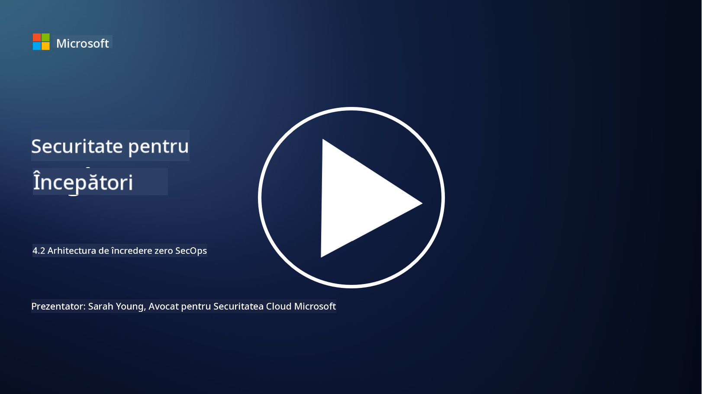

<!--
CO_OP_TRANSLATOR_METADATA:
{
  "original_hash": "45bbdc114e70936816b0b3e7c40189cf",
  "translation_date": "2025-09-04T00:47:12+00:00",
  "source_file": "4.2 SecOps zero trust architecture.md",
  "language_code": "ro"
}
-->
# Arhitectura zero trust pentru operațiuni de securitate

Operațiunile de securitate formează două părți ale arhitecturii zero trust, iar în această lecție vom învăța despre ambele:

- Cum trebuie construite arhitecturile IT pentru a permite colectarea centralizată a jurnalelor?

- Care sunt cele mai bune practici pentru operațiunile de securitate în mediile IT moderne?

## Cum trebuie construite arhitecturile IT pentru a permite colectarea centralizată a jurnalelor?

Colectarea centralizată a jurnalelor este o componentă esențială a operațiunilor moderne de securitate. Aceasta permite organizațiilor să adune jurnale și date din diverse surse, cum ar fi servere, aplicații, dispozitive de rețea și instrumente de securitate, într-un depozit central pentru analiză, monitorizare și răspuns la incidente. Iată câteva bune practici pentru construirea arhitecturilor IT care susțin colectarea centralizată a jurnalelor:

1. **Integrarea surselor de jurnal**:

- Asigurați-vă că toate dispozitivele și sistemele relevante sunt configurate pentru a genera jurnale. Acestea includ servere, firewall-uri, routere, switch-uri, aplicații și echipamente de securitate.

- Configurați sursele de jurnal pentru a transmite jurnalele către un colector sau sistem de gestionare centralizat.

2. **Selectarea instrumentului SIEM potrivit**:

- Alegeți o soluție SIEM (Security Information and Event Management) care se aliniază nevoilor și dimensiunii organizației dvs.

- Asigurați-vă că soluția aleasă susține colectarea, agregarea, analiza și raportarea jurnalelor.

3. **Scalabilitate și redundanță**:

- Proiectați arhitectura pentru scalabilitate, astfel încât să acomodeze un număr tot mai mare de surse de jurnal și un volum crescut de jurnale.

- Implementați redundanță pentru disponibilitate ridicată, pentru a preveni întreruperile cauzate de defecțiuni hardware sau de rețea.

4. **Transportul securizat al jurnalelor**:

- Utilizați protocoale sigure, cum ar fi TLS/SSL sau IPsec, pentru transportul jurnalelor de la surse la depozitul centralizat.

- Implementați autentificare și controale de acces pentru a asigura că doar dispozitivele autorizate pot trimite jurnale.

5. **Normalizare**:

- Standardizați formatele jurnalelor și normalizați datele pentru a asigura consistența și ușurința analizei.

6. **Stocare și retenție**:

- Determinați perioada de retenție adecvată pentru jurnale, bazată pe cerințele de conformitate și securitate.

- Stocați jurnalele în siguranță, protejându-le de accesul neautorizat și de modificări.

## Care sunt cele mai bune practici pentru operațiunile de securitate în mediile IT moderne?

Pe lângă colectarea centralizată a jurnalelor, iată câteva bune practici pentru operațiunile de securitate în mediile IT moderne:

1. **Monitorizare continuă**: Implementați monitorizarea continuă a activităților rețelei și sistemelor pentru a detecta și răspunde amenințărilor în timp real.

2. **Inteligența amenințărilor**: Rămâneți informat despre amenințările și vulnerabilitățile emergente utilizând fluxuri și servicii de inteligență a amenințărilor.

3. **Instruirea utilizatorilor**: Organizați sesiuni regulate de instruire privind conștientizarea securității pentru angajați, pentru a reduce riscurile asociate cu ingineria socială și atacurile de tip phishing.

4. **Plan de răspuns la incidente**: Dezvoltați și testați un plan de răspuns la incidente pentru a asigura un răspuns rapid și eficient la incidentele de securitate.

5. **Automatizarea securității**: Utilizați instrumente de automatizare și orchestrare a securității pentru a simplifica răspunsul la incidente și sarcinile repetitive.

6. **Backup și recuperare**: Implementați soluții robuste de backup și recuperare în caz de dezastru pentru a asigura disponibilitatea datelor în cazul pierderii acestora sau al atacurilor de tip ransomware.

## Lecturi suplimentare

- [Microsoft Security Best Practices module: Security operations | Microsoft Learn](https://learn.microsoft.com/security/operations/security-operations-videos-and-decks?WT.mc_id=academic-96948-sayoung)
- [Security operations - Cloud Adoption Framework | Microsoft Learn](https://learn.microsoft.com/azure/cloud-adoption-framework/secure/security-operations?WT.mc_id=academic-96948-sayoung)
- [What is Security Operations and Analytics Platform Architecture? A Definition of SOAPA, How It Works, Benefits, and More (digitalguardian.com)](https://www.digitalguardian.com/blog/what-security-operations-and-analytics-platform-architecture-definition-soapa-how-it-works#:~:text=All%20in%20all%2C%20security%20operations%20and%20analytics%20platform,become%20more%20efficient%20and%20operative%20with%20your%20security.)

---

**Declinare de responsabilitate**:  
Acest document a fost tradus folosind serviciul de traducere AI [Co-op Translator](https://github.com/Azure/co-op-translator). Deși ne străduim să asigurăm acuratețea, vă rugăm să rețineți că traducerile automate pot conține erori sau inexactități. Documentul original în limba sa natală ar trebui considerat sursa autoritară. Pentru informații critice, se recomandă traducerea profesională realizată de un specialist uman. Nu ne asumăm responsabilitatea pentru eventualele neînțelegeri sau interpretări greșite care pot apărea din utilizarea acestei traduceri.