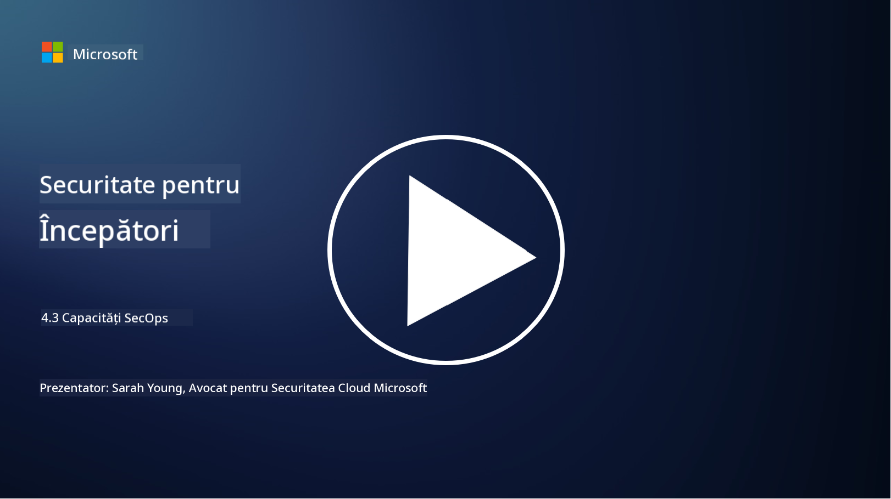

<!--
CO_OP_TRANSLATOR_METADATA:
{
  "original_hash": "553eb694c89f1caca0694e8d8ab89e0e",
  "translation_date": "2025-09-04T01:22:42+00:00",
  "source_file": "4.3 SecOps capabilities.md",
  "language_code": "ro"
}
-->
# Capacități SecOps

În această secțiune, vom detalia mai multe despre instrumentele și capacitățile de bază care pot fi utilizate în operațiunile de securitate.

În această lecție, vom discuta:

- Ce este un instrument de gestionare a informațiilor și evenimentelor de securitate (SIEM)?

- Ce este XDR?

- Ce tipuri de capacități pot fi utilizate pentru a îmbunătăți operațiunile de securitate?

## Ce este un instrument de gestionare a informațiilor și evenimentelor de securitate (SIEM)?

Un instrument de Gestionare a Informațiilor și Evenimentelor de Securitate (SIEM) oferă analiza alertelor de securitate generate în mediul IT al unei organizații. Acestea colectează, agregă, corelează și analizează datele din jurnale și evenimentele de securitate din diverse surse, cum ar fi dispozitivele de rețea, serverele, aplicațiile și sistemele de securitate.

Funcțiile și capacitățile cheie ale instrumentelor SIEM includ:

1. **Colectarea Jurnalelor**: Instrumentele SIEM colectează jurnale și date despre evenimentele de securitate dintr-o gamă largă de dispozitive, sisteme și aplicații, inclusiv firewall-uri, sisteme de detectare a intruziunilor, software antivirus și altele.

2. **Normalizarea Datelor**: Acestea normalizează datele din jurnale într-un format comun pentru a facilita analiza și corelarea.

3. **Corelarea Evenimentelor**: Instrumentele SIEM corelează evenimentele pentru a identifica modele și anomalii care pot indica incidente sau amenințări de securitate.

4. **Alerte și Notificări**: Instrumentele SIEM generează alerte și notificări în timp real atunci când sunt detectate activități suspecte sau încălcări de securitate, permițând un răspuns imediat.

5. **Detectarea Incidentelor**: Acestea facilitează detectarea incidentelor de securitate, inclusiv accesul neautorizat, breșele de date, infecțiile cu malware și amenințările interne.

6. **Analiza Comportamentului Utilizatorilor și Entităților (UEBA)**: Unele instrumente SIEM includ capacități UEBA pentru a identifica comportamente anormale ale utilizatorilor și entităților care pot indica conturi compromise sau amenințări interne.

7. **Integrarea Inteligenței de Amenințări**: Instrumentele SIEM pot fi integrate cu fluxuri de inteligență de amenințări pentru a îmbunătăți detectarea amenințărilor prin compararea indicatorilor cunoscuți de compromitere (IOC) cu activitatea din rețea.

8. **Automatizare și Orchestrare**: Funcțiile de automatizare permit instrumentelor SIEM să automatizeze răspunsurile la incidentele comune de securitate, reducând timpii de răspuns și efortul manual.

9. **Tablouri de Bord și Vizualizare**: Acestea oferă tablouri de bord și instrumente de vizualizare pentru monitorizarea datelor de securitate și crearea de rapoarte personalizate.

10. **Integrarea cu Alte Instrumente de Securitate**: Instrumentele SIEM se integrează adesea cu alte instrumente și tehnologii de securitate, cum ar fi soluțiile de detectare și răspuns la nivel de endpoint (EDR), pentru a oferi o imagine de ansamblu asupra posturii de securitate a unei organizații.

## Ce este XDR?

XDR (Extended Detection and Response) este o tehnologie care extinde capacitățile soluțiilor tradiționale de Detectare și Răspuns la nivel de Endpoint (EDR) și le combină cu telemetria de securitate mai largă din diverse surse pentru a oferi o imagine mai cuprinzătoare asupra posturii de securitate a unei organizații. XDR își propune să îmbunătățească detectarea amenințărilor, răspunsul la incidente și securitatea generală, abordând limitările utilizării exclusive a EDR, SIEM sau altor instrumente individuale de securitate.

Caracteristicile și componentele cheie ale XDR includ:

1. **Integrarea Datelor**: XDR integrează date din mai multe surse, inclusiv endpoint-uri, trafic de rețea, servicii cloud, e-mailuri și altele. Această agregare cuprinzătoare de date oferă un context mai larg pentru detectarea și analiza amenințărilor.

2. **Analitică Avansată**: XDR utilizează analitică avansată, învățare automată și analiza comportamentală pentru a identifica și prioritiza amenințările de securitate. Caută modele și anomalii în datele integrate pentru a detecta atât amenințările cunoscute, cât și cele necunoscute.

3. **Detectarea Automată a Amenințărilor**: XDR automatizează detectarea amenințărilor și anomaliilor prin corelarea informațiilor din diverse surse. Poate identifica lanțuri complexe de atac care pot implica mai mulți vectori.

4. **Investigația și Răspunsul la Incidente**: XDR oferă instrumente pentru investigarea și răspunsul la incidente, ajutând echipele de securitate să evalueze rapid amploarea și impactul incidentelor și să ia măsuri corective adecvate.

5. **Integrarea Inteligenței de Amenințări**: Integrează fluxuri și date de inteligență de amenințări pentru a îmbunătăți detectarea amenințărilor prin compararea indicatorilor cunoscuți de compromitere (IOC) cu activitatea din rețea și endpoint-uri.

6. **Consolă Unificată**: XDR oferă de obicei o consolă sau un tablou de bord unificat unde echipele de securitate pot vizualiza și gestiona alertele și incidentele de securitate din diferite surse într-un mod centralizat.

7. **Acoperire Multi-Platformă**: Soluțiile XDR acoperă o gamă largă de platforme, inclusiv endpoint-uri, servere, medii cloud și dispozitive mobile, fiind potrivite pentru medii IT moderne, multi-platformă.

## Ce tipuri de capacități pot fi utilizate pentru a îmbunătăți operațiunile de securitate?

Pentru a îmbunătăți operațiunile de securitate, organizațiile pot valorifica mai multe capacități, pe lângă instrumentele SIEM:

1. **Învățare Automată și Inteligență Artificială**: Implementați analitică avansată, învățare automată și AI pentru a detecta amenințările în evoluție și a automatiza căutarea amenințărilor.

2. **Analiza Comportamentului Utilizatorilor și Entităților (UEBA)**: Analizați comportamentul utilizatorilor și entităților pentru a detecta anomalii și amenințări interne.

3. **Fluxuri de Inteligență de Amenințări**: Integrați fluxuri de inteligență de amenințări pentru a rămâne la curent cu cele mai recente amenințări și indicatori de compromitere.

4. **Orchestrare, Automatizare și Răspuns în Securitate (SOAR)**: Implementați platforme SOAR pentru a automatiza răspunsul la incidente și a eficientiza fluxurile de lucru din operațiunile de securitate.

5. **Tehnologii de Decepție**: Implementați tehnologii de decepție pentru a induce în eroare și a detecta atacatorii din rețea.

## Lecturi suplimentare

- [What is SIEM? | Microsoft Security](https://www.microsoft.com/security/business/security-101/what-is-siem?WT.mc_id=academic-96948-sayoung)
- [What Is SIEM? - Security Information and Event Management - Cisco](https://www.cisco.com/c/en/us/products/security/what-is-siem.html)
- [Security information and event management - Wikipedia](https://en.wikipedia.org/wiki/Security_information_and_event_management)
- [What Is XDR? | Microsoft Security](https://www.microsoft.com/security/business/security-101/what-is-xdr?WT.mc_id=academic-96948-sayoung)
- [XDR & XDR Security (kaspersky.com.au)](https://www.kaspersky.com.au/resource-center/definitions/what-is-xdr)
- [The Power of SecOps: Redefining Core Security Capabilities - The New Stack](https://thenewstack.io/the-power-of-secops-redefining-core-security-capabilities/)
- [Seven Steps to Improve Your Security Operations and Response (securityintelligence.com)](https://securityintelligence.com/seven-steps-to-improve-your-security-operations-and-response/)

---

**Declinarea responsabilității**:  
Acest document a fost tradus folosind serviciul de traducere AI [Co-op Translator](https://github.com/Azure/co-op-translator). Deși depunem eforturi pentru a asigura acuratețea, vă rugăm să aveți în vedere că traducerile automate pot conține erori sau inexactități. Documentul original în limba sa nativă ar trebui considerat sursa autoritară. Pentru informații critice, se recomandă traducerea profesională realizată de un specialist uman. Nu ne asumăm răspunderea pentru eventualele neînțelegeri sau interpretări greșite care pot apărea din utilizarea acestei traduceri.