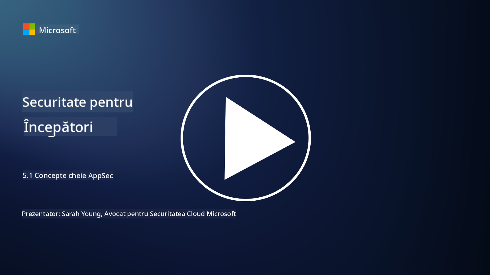

<!--
CO_OP_TRANSLATOR_METADATA:
{
  "original_hash": "e4b56bb23078d3ffb7ad407d280b0c36",
  "translation_date": "2025-09-04T00:34:09+00:00",
  "source_file": "5.1 AppSec key concepts.md",
  "language_code": "ro"
}
-->
# Concepte cheie în securitatea aplicațiilor

Securitatea aplicațiilor este o specializare în domeniul securității. În această parte a cursului vom analiza mai detaliat securitatea aplicațiilor.

## Introducere

În această lecție vom aborda:

- Ce este securitatea aplicațiilor?

- Care sunt conceptele/principiile cheie ale securității aplicațiilor?

## Ce este securitatea aplicațiilor?

Securitatea aplicațiilor, adesea abreviată ca "AppSec," se referă la practica de protejare a aplicațiilor software împotriva amenințărilor, vulnerabilităților și atacurilor de securitate. Aceasta include procesele, tehnicile și instrumentele utilizate pentru identificarea, atenuarea și prevenirea riscurilor de securitate pe parcursul ciclului de dezvoltare, implementare și întreținere al unei aplicații.

Securitatea aplicațiilor este esențială deoarece aplicațiile sunt ținte frecvente ale atacurilor cibernetice. Actorii rău intenționați exploatează vulnerabilitățile și punctele slabe ale software-ului pentru a obține acces neautorizat, a fura date, a perturba serviciile sau a desfășura alte activități malițioase. O securitate eficientă a aplicațiilor ajută la asigurarea confidențialității, integrității și disponibilității unei aplicații și a datelor asociate acesteia.

## Care sunt conceptele/principiile cheie ale securității aplicațiilor?

Conceptele și principiile cheie care stau la baza securității aplicațiilor includ:

1. **Securitate prin design**:

- Securitatea ar trebui integrată în designul și arhitectura aplicației încă de la început, nu adăugată ulterior.

2. **Validarea inputului**:

- Toate datele introduse de utilizatori trebuie validate pentru a se asigura că respectă formatele așteptate și sunt lipsite de cod sau date malițioase.

3. **Codificarea outputului**:

- Datele trimise către client trebuie codificate corespunzător pentru a preveni vulnerabilități precum cross-site scripting (XSS).

4. **Autentificare și autorizare**:

- Autentificați utilizatorii și autorizați accesul lor la resurse pe baza rolurilor și permisiunilor.

5. **Protecția datelor**:

- Datele sensibile trebuie criptate atunci când sunt stocate, transmise și procesate pentru a preveni accesul neautorizat.

6. **Gestionarea sesiunilor**:

- Gestionarea sigură a sesiunilor asigură protecția sesiunilor utilizatorilor împotriva preluării și accesului neautorizat.

7. **Dependențe sigure**:

- Mențineți toate dependențele software actualizate cu patch-uri de securitate pentru a preveni vulnerabilitățile.

8. **Gestionarea erorilor și logarea**:

- Implementați gestionarea sigură a erorilor pentru a evita dezvăluirea informațiilor sensibile și asigurați practici sigure de logare.

9. **Testarea securității**:

- Testați regulat aplicațiile pentru vulnerabilități folosind metode precum testarea de penetrare, revizuirea codului și instrumente automate de scanare.

10. **Ciclul de viață sigur al dezvoltării software (SDLC)**:

- Integrați practicile de securitate în fiecare fază a ciclului de viață al dezvoltării software, de la cerințe la implementare și întreținere.

## Lecturi suplimentare

- [SheHacksPurple: What is Application Security? - YouTube](https://www.youtube.com/watch?v=eNmccQNzSSY)
- [What Is Application Security? - Cisco](https://www.cisco.com/c/en/us/solutions/security/application-first-security/what-is-application-security.html#~how-does-it-work)
- [What is application security? A process and tools for securing software | CSO Online](https://www.csoonline.com/article/566471/what-is-application-security-a-process-and-tools-for-securing-software.html)
- [OWASP Cheat Sheet Series | OWASP Foundation](https://owasp.org/www-project-cheat-sheets/)

---

**Declinare de responsabilitate**:  
Acest document a fost tradus folosind serviciul de traducere AI [Co-op Translator](https://github.com/Azure/co-op-translator). Deși ne străduim să asigurăm acuratețea, vă rugăm să rețineți că traducerile automate pot conține erori sau inexactități. Documentul original în limba sa natală ar trebui considerat sursa autoritară. Pentru informații critice, se recomandă traducerea profesională realizată de un specialist uman. Nu ne asumăm responsabilitatea pentru eventualele neînțelegeri sau interpretări greșite care pot apărea din utilizarea acestei traduceri.