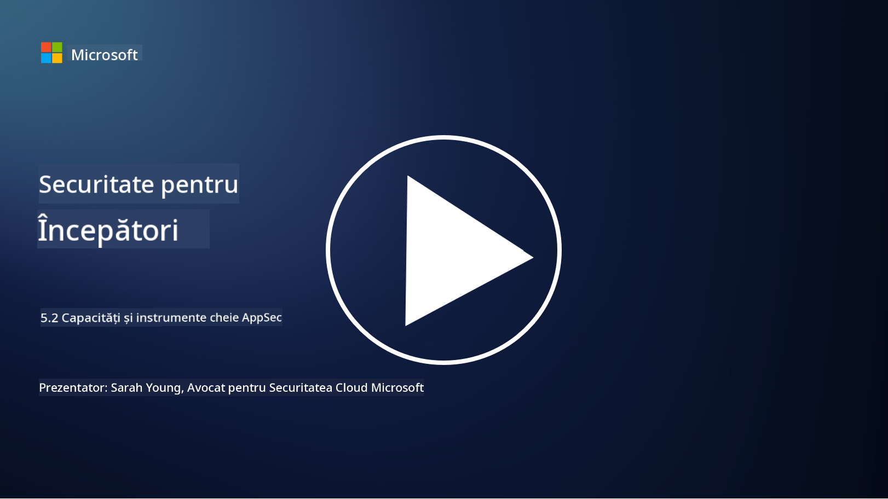

<!--
CO_OP_TRANSLATOR_METADATA:
{
  "original_hash": "790a3fa7e535ec60bb51bde13e759781",
  "translation_date": "2025-09-04T00:52:55+00:00",
  "source_file": "5.2 AppSec key capabilities.md",
  "language_code": "ro"
}
-->
## Introducere

În această lecție, vom discuta despre capabilitățile și instrumentele cheie utilizate în securitatea aplicațiilor.

## Capabilități și instrumente cheie în AppSec

Capabilitățile și instrumentele cheie utilizate în securitatea aplicațiilor sunt esențiale pentru identificarea, atenuarea și prevenirea vulnerabilităților și amenințărilor de securitate în aplicațiile software. Iată câteva dintre cele mai importante:

**1. Testarea Statică a Securității Aplicațiilor (SAST)**:

- **Capabilități**: Analizează codul sursă, bytecode-ul sau codul binar pentru a identifica vulnerabilități de securitate în baza de cod a aplicației.

- **Instrumente**: Exemple includ Fortify, Checkmarx și Veracode.

**2. Testarea Dinamică a Securității Aplicațiilor (DAST)**:

- **Capabilități**: Scanează o aplicație în execuție pentru a identifica vulnerabilități prin trimiterea de cereri de intrare și analizarea răspunsurilor.

- **Instrumente**: Exemple includ ZAP, Burp Suite și Qualys Web Application Scanning.

**3. Testarea Interactivă a Securității Aplicațiilor (IAST)**:

- **Capabilități**: Combină elemente din SAST și DAST pentru a analiza codul în timpul execuției, oferind rezultate mai precise și reducând alarmele false.

- **Instrumente**: Exemple includ Contrast Security și HCL AppScan.

**4. Protecția Aplicațiilor în Timp Real (RASP)**:

- **Capabilități**: Monitorizează și protejează aplicațiile în timp real, detectând și răspunzând la amenințările de securitate pe măsură ce apar.

- **Instrumente**: Exemple includ Veracode Runtime Protection și F5 Advanced WAF cu RASP.

**5. Firewall-uri pentru Aplicații Web (WAFs)**:

- **Capabilități**: Oferă un strat de protecție între aplicație și internet, filtrând traficul de intrare și blocând cererile malițioase.

- **Instrumente**: Exemple includ ModSecurity, AWS WAF și Akamai Kona Site Defender.

**6. Scanarea Dependențelor**:

- **Capabilități**: Identifică vulnerabilități în bibliotecile și componentele terțe utilizate în aplicație.

- **Instrumente**: Exemple includ OWASP Dependency-Check și Snyk.

**7. Testarea de Penetrare (Pen Testing)**:

- **Capabilități**: Simulează atacuri reale pentru a descoperi vulnerabilități și a evalua securitatea unei aplicații.

- **Instrumente**: Realizată de hackeri etici certificați și profesioniști în securitate folosind diverse instrumente precum Metasploit și Nmap.

**8. Scanarea și Analiza Securității**:

- **Capabilități**: Scanează vulnerabilități cunoscute, erori de configurare și configurări greșite de securitate.

- **Instrumente**: Exemple includ Nessus, Qualys Vulnerability Management și OpenVAS.

**9. Instrumente pentru Securitatea Containerelor**:

- **Capabilități**: Se concentrează pe securizarea aplicațiilor containerizate și a mediilor acestora.

- **Instrumente**: Exemple includ Docker Security Scanning și Aqua Security.

**10. Instruirea pentru Dezvoltare Securizată**:

- **Capabilități**: Oferă programe de instruire și conștientizare pentru echipele de dezvoltare pentru a promova practici de codare sigură.

- **Instrumente**: Programe și platforme de instruire personalizate.

**11. Framework-uri pentru Testarea Securității**:

- **Capabilități**: Oferă framework-uri de testare cuprinzătoare pentru diferite nevoi de testare a securității aplicațiilor.

- **Instrumente**: OWASP Amass, OWASP OWTF și FrAppSec.

**12. Instrumente pentru Revizuirea Codului Securizat**:

- **Capabilități**: Revizuiesc codul sursă pentru vulnerabilități de securitate și bune practici de codare.

- **Instrumente**: Exemple includ SonarQube și Checkmarx.

**13. Instrumente pentru Securizarea API-urilor și Microserviciilor**:

- **Capabilități**: Se concentrează pe securizarea API-urilor și microserviciilor, inclusiv autentificarea, autorizarea și protecția datelor.

- **Instrumente**: Exemple includ Apigee, AWS API Gateway și Istio.

## Lecturi suplimentare

- [Ce este securitatea aplicațiilor? Concepte, instrumente și bune practici | HackerOne](https://www.hackerone.com/knowledge-center/what-application-security-concepts-tools-best-practices)
- [Ce este IAST? (Testarea Interactivă a Securității Aplicațiilor) (comparitech.com)](https://www.comparitech.com/net-admin/what-is-iast/)
- [10 tipuri de instrumente pentru testarea securității aplicațiilor: Când și cum să le folosești (cmu.edu)](https://insights.sei.cmu.edu/blog/10-types-of-application-security-testing-tools-when-and-how-to-use-them/)
- [Schimbarea balanței riscurilor de securitate cibernetică: Principii și abordări pentru securitate prin design și implicit | Cyber.gov.au](https://www.cyber.gov.au/about-us/view-all-content/publications/principles-and-approaches-for-security-by-design-and-default)

---

**Declinarea responsabilității**:  
Acest document a fost tradus folosind serviciul de traducere AI [Co-op Translator](https://github.com/Azure/co-op-translator). Deși depunem eforturi pentru a asigura acuratețea, vă rugăm să aveți în vedere că traducerile automate pot conține erori sau inexactități. Documentul original în limba sa nativă ar trebui considerat sursa autoritară. Pentru informații critice, se recomandă traducerea profesională realizată de un specialist uman. Nu ne asumăm răspunderea pentru eventualele neînțelegeri sau interpretări greșite care pot apărea din utilizarea acestei traduceri.