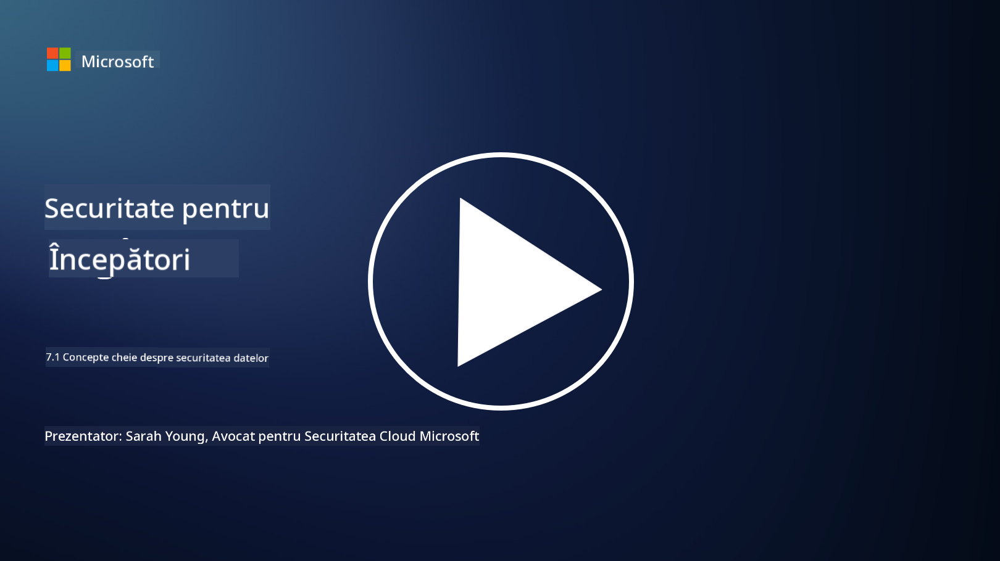

<!--
CO_OP_TRANSLATOR_METADATA:
{
  "original_hash": "9703868f41dcddd5a98dea9ea6fcd94d",
  "translation_date": "2025-09-03T23:59:46+00:00",
  "source_file": "7.1 Data security key concepts.md",
  "language_code": "ro"
}
-->
# Concepte cheie despre securitatea datelor

Am menționat securitatea datelor și am abordat-o de mai multe ori în acest curs. Acum, să explorăm acest subiect mai în detaliu. În această lecție vei învăța:

- Ce este securitatea datelor?

- Ce este clasificarea datelor?

- Ce este gestionarea ciclului de viață al datelor?

- Ce este prevenirea pierderii datelor (DLP)?

- De ce este importantă securitatea datelor pentru o organizație?

## Ce este securitatea datelor?

**Securitatea datelor** se referă la practica de protejare a datelor digitale, cum ar fi bazele de date, fișierele și informațiile sensibile, împotriva accesului neautorizat, divulgării, modificării sau distrugerii. Obiectivul principal al securității datelor este de a asigura confidențialitatea, integritatea și disponibilitatea datelor. Aceasta implică implementarea unei combinații de măsuri de securitate tehnice, administrative și fizice pentru a proteja datele împotriva diverselor amenințări și vulnerabilități, inclusiv atacuri cibernetice, amenințări interne și breșe de securitate. Măsurile de securitate a datelor pot include criptarea, controale de acces, autentificare, trasee de audit și politici de securitate.

## Ce este clasificarea datelor?

**Clasificarea datelor** este procesul de categorisire a datelor pe baza sensibilității, valorii și importanței lor pentru o organizație. Scopul clasificării datelor este de a ajuta organizațiile să identifice și să prioritizeze protecția și gestionarea diferitelor tipuri de date. Categorii comune de clasificare a datelor includ "public," "intern," "confidențial" și "restricționat" sau "foarte confidențial." După ce datele sunt clasificate, organizațiile pot aplica controale de securitate și restricții de acces adecvate pentru a se asigura că datele sensibile sunt protejate corespunzător și că cerințele de conformitate cu reglementările sunt respectate.

## Ce este gestionarea ciclului de viață al datelor?

**Gestionarea ciclului de viață al datelor** este o abordare structurată pentru gestionarea datelor pe parcursul întregului lor ciclu de viață, de la creare sau achiziție până la arhivare sau ștergere. Ciclul de viață al datelor constă, de obicei, în etape precum creare, stocare, procesare, transmitere, arhivare și eliminare. Gestionarea ciclului de viață al datelor implică definirea politicilor și procedurilor pentru fiecare etapă a ciclului de viață al datelor, inclusiv păstrarea datelor, controale de acces, backup-uri și curățarea datelor. O gestionare eficientă a ciclului de viață al datelor ajută organizațiile să optimizeze stocarea datelor, să îmbunătățească calitatea datelor și să asigure conformitatea cu reglementările privind protecția datelor.

## Ce este prevenirea pierderii datelor (DLP)?

**Prevenirea pierderii datelor (DLP)** se referă la un set de tehnologii, politici și practici concepute pentru a preveni accesul, partajarea sau scurgerea neautorizată a datelor sensibile sau confidențiale. Soluțiile DLP utilizează inspecția conținutului și analiza contextuală pentru a monitoriza și controla datele în mișcare (de exemplu, e-mailuri, trafic web), datele în repaus (de exemplu, fișiere stocate și baze de date) și datele în utilizare (de exemplu, date accesate sau manipulate de utilizatori). DLP are scopul de a identifica și bloca sau cripta datele sensibile pentru a preveni breșele de securitate, a respecta reglementările privind protecția datelor și a proteja reputația unei organizații.

## De ce este importantă securitatea datelor pentru o organizație?

Securitatea datelor este extrem de importantă pentru organizații din mai multe motive:

- **Protecția informațiilor sensibile**: Organizațiile stochează adesea date sensibile, cum ar fi înregistrările clienților, proprietatea intelectuală, datele financiare și informațiile angajaților. Securitatea datelor protejează aceste informații sensibile împotriva accesului sau furtului neautorizat.

- **Conformitate**: Multe industrii și jurisdicții au reglementări stricte privind protecția și confidențialitatea datelor. Securitatea datelor ajută organizațiile să respecte aceste legi, evitând sancțiuni legale și daune reputaționale.

- **Prevenirea breșelor de securitate**: Breșele de securitate pot duce la pierderi financiare, daune reputaționale și consecințe legale. Măsurile eficiente de securitate a datelor ajută la prevenirea breșelor de securitate sau la limitarea impactului acestora.

- **Păstrarea încrederii**: Clienții și părțile interesate au încredere în organizații pentru a le proteja datele. Breșele de securitate a datelor erodează această încredere. Menținerea unei securități solide a datelor ajută la păstrarea încrederii și a încrederii clienților.

- **Avantaj competitiv**: Demonstrând un angajament față de securitatea datelor, organizațiile pot obține un avantaj competitiv. Clienții și partenerii sunt mai predispuși să colaboreze cu organizații care iau în serios securitatea datelor.

- **Continuitatea operațională**: Măsurile de securitate a datelor, inclusiv backup-urile și planificarea recuperării în caz de dezastru, ajută la asigurarea disponibilității datelor critice și a continuității afacerii în cazul pierderii datelor sau al dezastrelor.

- **Protecția împotriva amenințărilor interne**: Măsurile de securitate a datelor abordează și amenințările din interiorul organizației, inclusiv expunerea accidentală a datelor de către angajați și acțiunile malițioase ale persoanelor din interior.

În concluzie, securitatea datelor este esențială pentru protejarea informațiilor sensibile, respectarea reglementărilor, prevenirea breșelor de securitate, păstrarea încrederii și asigurarea succesului și reputației continue ale unei organizații.

## Lecturi suplimentare

- [What Is Data Security? | Microsoft Security](https://www.microsoft.com/en-au/security/business/security-101/what-is-data-security?WT.mc_id=academic-96948-sayoung)
- [Automatically Classify & Protect Documents & Data | Microsoft Purview Information Protection](https://youtu.be/v8LqmzBUaOo)
- [Example data classification policy](https://www.cmu.edu/data/guidelines/data-classification.html)
- [What is Data Security? Data Security Definition and Overview | IBM](https://www.ibm.com/topics/data-security)
- [Data Lifecycle Management: A 2023 Guide for Your Business (cloudwards.net)](https://www.cloudwards.net/data-lifecycle-management/)
- [What is data loss prevention (DLP)? | Microsoft Security](https://www.microsoft.com/security/business/security-101/what-is-data-loss-prevention-dlp?WT.mc_id=academic-96948-sayoung)
- [What is DLP? How data loss prevention software works and why you need it | CSO Online](https://www.csoonline.com/article/569559/what-is-dlp-how-data-loss-prevention-software-works-and-why-you-need-it.html)

---

**Declinarea responsabilității**:  
Acest document a fost tradus utilizând serviciul de traducere AI [Co-op Translator](https://github.com/Azure/co-op-translator). Deși depunem eforturi pentru a asigura acuratețea, vă rugăm să rețineți că traducerile automate pot conține erori sau inexactități. Documentul original în limba sa nativă ar trebui considerat sursa autoritară. Pentru informații critice, se recomandă traducerea profesională realizată de un specialist uman. Nu ne asumăm răspunderea pentru eventualele neînțelegeri sau interpretări greșite care pot apărea din utilizarea acestei traduceri.