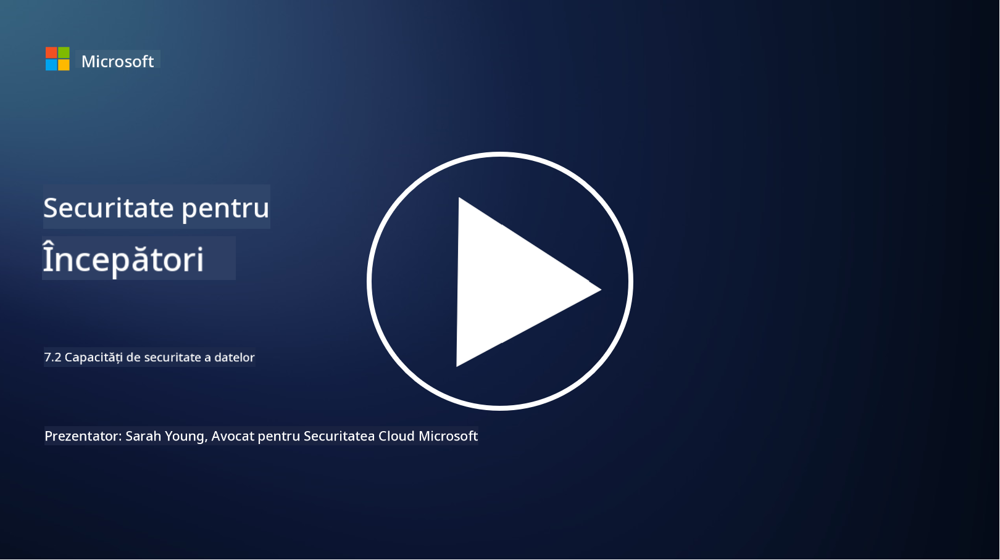

<!--
CO_OP_TRANSLATOR_METADATA:
{
  "original_hash": "50697add9758e54693442d502d2d5f8a",
  "translation_date": "2025-09-04T00:58:03+00:00",
  "source_file": "7.2 Data security capabilities.md",
  "language_code": "ro"
}
-->
# Capacități de securitate a datelor

În această secțiune, vom aborda mai multe detalii despre instrumentele și capacitățile de bază utilizate în securitatea datelor:

**Introducere**

În această lecție, vom discuta despre:

- Ce sunt instrumentele de prevenire a pierderii datelor?

- Ce sunt instrumentele de gestionare a riscurilor interne?

- Ce instrumente de retenție a datelor sunt disponibile?

## Ce sunt instrumentele de prevenire a pierderii datelor?

Instrumentele de Prevenire a Pierderii Datelor (DLP) se referă la un set de soluții software și tehnologii concepute pentru a preveni accesul neautorizat, partajarea sau scurgerea datelor sensibile sau confidențiale în cadrul unei organizații. Aceste instrumente utilizează inspecția conținutului, aplicarea politicilor și monitorizarea pentru a identifica și proteja datele sensibile împotriva expunerii sau utilizării necorespunzătoare. Exemple de produse DLP includ: Symantec Data Loss Prevention, McAfee Total Protection for Data Loss Prevention, Microsoft 365 DLP**: Se integrează cu aplicațiile Microsoft 365 pentru a ajuta organizațiile să identifice și să protejeze datele sensibile din e-mailuri, documente și mesaje.

## Ce sunt instrumentele de gestionare a riscurilor interne?

Instrumentele de Gestionare a Riscurilor Interne ajută organizațiile să identifice și să atenueze riscurile generate de angajați, contractori sau parteneri care pot compromite intenționat sau neintenționat securitatea datelor. Aceste instrumente monitorizează comportamentul utilizatorilor, modelele de acces și utilizarea datelor pentru a detecta activități suspecte și potențiale amenințări interne. Exemple de produse de gestionare a riscurilor interne includ: Microsoft Insider Risk Management (parte din Microsoft 365), Forcepoint Insider Threat Data Protection, Varonis Insider Threat Detection.

## Ce instrumente de retenție a datelor sunt disponibile?

Instrumentele de retenție a datelor includ software și soluții concepute pentru a gestiona păstrarea și ștergerea datelor în conformitate cu politicile de retenție ale unei organizații și cerințele legale. Aceste instrumente ajută la automatizarea procesului de păstrare a datelor pentru perioade specifice și la ștergerea lor în siguranță atunci când nu mai sunt necesare. Exemple de produse de retenție a datelor includ: Veritas Enterprise Vault, Commvault Complete Data Protection, Microsoft data lifecycle management. Aceste soluții ajută organizațiile să mențină controlul asupra păstrării și eliminării datelor, asigurând conformitatea cu reglementările privind protecția datelor, în timp ce gestionează eficient datele pe parcursul ciclului lor de viață.

## Lecturi suplimentare

- [Ghid pentru Managementul Posturii de Securitate a Datelor (DSPM) | CSA (cloudsecurityalliance.org)](https://cloudsecurityalliance.org/blog/2023/03/31/the-big-guide-to-data-security-posture-management-dspm/)
- [Prevenirea pierderii datelor pe dispozitive, aplicații și servicii | Microsoft Purview](https://youtu.be/hvqq8L_0kgI)
- [18 Cele mai bune instrumente software de prevenire a pierderii datelor 2023 (Gratuite + Plătite) (comparitech.com)](https://www.comparitech.com/data-privacy-management/data-loss-prevention-tools-software/)
- [Prevenirea pierderii datelor (nist.gov)](https://tsapps.nist.gov/publication/get_pdf.cfm?pub_id=904672)
- [Aflați despre gestionarea riscurilor interne | Microsoft Learn](https://learn.microsoft.com/purview/insider-risk-management?WT.mc_id=academic-96948-sayoung)
- [Managementul ciclului de viață al datelor | IBM](https://www.ibm.com/topics/data-lifecycle-management)
- [Ce este Managementul Ciclului de Viață al Datelor (DLM)? | Cele mai bune practici 2023 (selecthub.com)](https://www.selecthub.com/big-data-analytics/data-lifecycle-management/)

---

**Declinarea responsabilității**:  
Acest document a fost tradus utilizând serviciul de traducere AI [Co-op Translator](https://github.com/Azure/co-op-translator). Deși depunem eforturi pentru a asigura acuratețea, vă rugăm să aveți în vedere că traducerile automate pot conține erori sau inexactități. Documentul original în limba sa nativă ar trebui considerat sursa autoritară. Pentru informații critice, se recomandă traducerea profesională realizată de un specialist. Nu ne asumăm răspunderea pentru eventualele neînțelegeri sau interpretări greșite care pot apărea din utilizarea acestei traduceri.