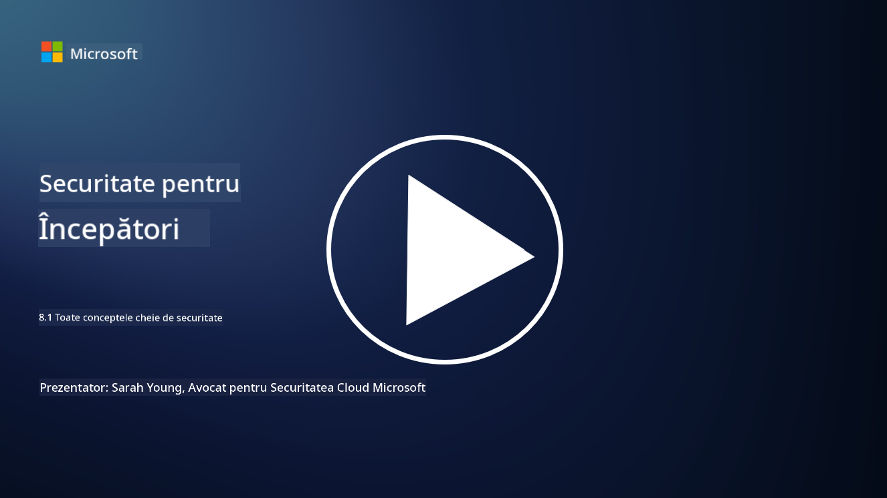

<!--
CO_OP_TRANSLATOR_METADATA:
{
  "original_hash": "66b61d96936cf25d20fcb411d4ce5227",
  "translation_date": "2025-09-03T22:51:02+00:00",
  "source_file": "8.1 AI security key concepts.md",
  "language_code": "ro"
}
-->
# Concepte cheie despre securitatea AI

## Cum diferă securitatea AI de securitatea cibernetică tradițională?

Protejarea sistemelor AI prezintă provocări unice comparativ cu securitatea cibernetică tradițională, în principal din cauza naturii capacităților de învățare și proceselor de luare a deciziilor ale AI. Iată câteva diferențe cheie:

-   **Integritatea datelor**: Sistemele AI se bazează foarte mult pe date pentru învățare. [Asigurarea integrității acestor date este esențială, deoarece atacatorii pot manipula datele pentru a influența comportamentul AI, o tactică cunoscută sub numele de "data poisoning".
-   **Securitatea modelului**: Modelul de luare a deciziilor al AI poate fi o țintă. [Atacatorii pot încerca să reverse-engineereze modelul sau să exploateze vulnerabilitățile acestuia pentru a genera decizii incorecte sau dăunătoare.
-   **Atacuri adversariale**: Sistemele AI pot fi vulnerabile la atacuri adversariale, unde modificări subtile, adesea imperceptibile, ale datelor de intrare pot determina AI să facă erori sau predicții greșite.
-   **Securitatea infrastructurii**: Deși securitatea cibernetică tradițională se concentrează și pe protejarea infrastructurii, sistemele AI pot avea straturi suplimentare de complexitate, cum ar fi servicii bazate pe cloud sau hardware specializat, care necesită măsuri de securitate specifice.
-   **Considerații etice**: Utilizarea AI în securitate aduce în discuție considerații etice, cum ar fi preocupările legate de confidențialitate și posibilitatea de apariție a prejudecăților în procesul de luare a deciziilor, care trebuie abordate în strategia de securitate.

În general, protejarea sistemelor AI necesită o abordare diferită, care să ia în considerare aspectele unice ale tehnologiei AI, inclusiv protecția datelor, modelelor și procesului de învățare al AI, abordând totodată implicațiile etice ale implementării AI.

Securitatea AI și securitatea cibernetică tradițională au multe asemănări, dar și unele diferențe distincte datorate caracteristicilor și capacităților unice ale sistemelor de inteligență artificială. Iată cum diferă:

- **Complexitatea amenințărilor**: Sistemele AI introduc noi straturi de complexitate în securitatea cibernetică. Securitatea cibernetică tradițională se ocupă în principal de amenințări precum malware, atacuri de phishing și intruziuni în rețea. Totuși, sistemele AI pot fi vulnerabile la atacuri precum atacuri adversariale, "data poisoning" și evaziunea modelului, care vizează în mod specific algoritmii de învățare automată.

- **Suprafața de atac**: Sistemele AI au adesea suprafețe de atac mai mari comparativ cu sistemele tradiționale. Acest lucru se datorează faptului că ele se bazează nu doar pe software, ci și pe date și modele. Atacatorii pot viza datele de antrenament, manipula modelele sau exploata vulnerabilitățile algoritmilor în sine.

- **Adaptabilitatea amenințărilor**: Sistemele AI pot să se adapteze și să învețe din mediul lor, ceea ce le poate face mai susceptibile la amenințări adaptive și în evoluție. Măsurile tradiționale de securitate cibernetică pot să nu fie suficiente pentru a apăra împotriva atacurilor care evoluează constant pe baza comportamentului sistemului AI.

- **Interpretabilitate și explicabilitate**: Înțelegerea motivului pentru care un sistem AI a luat o anumită decizie este adesea mai dificilă comparativ cu sistemele software tradiționale. Această lipsă de interpretabilitate și explicabilitate poate face dificilă detectarea și atenuarea atacurilor asupra sistemelor AI în mod eficient.

- **Preocupări legate de confidențialitatea datelor**: Sistemele AI se bazează adesea pe cantități mari de date, ceea ce poate introduce riscuri de confidențialitate dacă nu sunt gestionate corespunzător. Măsurile tradiționale de securitate cibernetică pot să nu abordeze în mod adecvat aceste preocupări specifice legate de confidențialitatea datelor în sistemele AI.

- **Conformitate cu reglementările**: Peisajul reglementar pentru securitatea AI este încă în evoluție, cu reglementări și standarde specifice care apar pentru a aborda provocările unice ale sistemelor AI. Cadrul tradițional de securitate cibernetică poate necesita extindere sau adaptare pentru a asigura conformitatea cu aceste noi reglementări.

- **Considerații etice**: Securitatea AI implică nu doar protejarea sistemelor împotriva atacurilor malițioase, ci și asigurarea utilizării sistemelor AI într-un mod etic și responsabil. Acest lucru include considerații precum echitatea, transparența și responsabilitatea, care pot să nu fie la fel de proeminente în securitatea cibernetică tradițională.

## Cum este AI similar cu protejarea sistemelor IT tradiționale?

Protejarea sistemelor AI împărtășește mai multe principii fundamentale cu securitatea cibernetică tradițională:

-   **Protecția împotriva amenințărilor**: Atât sistemele AI, cât și cele tradiționale trebuie să fie protejate împotriva accesului neautorizat, modificării datelor și distrugerii, precum și împotriva altor amenințări comune.
-   **Gestionarea vulnerabilităților**: Multe vulnerabilități care afectează sistemele tradiționale, cum ar fi erorile software sau configurările greșite, pot afecta și sistemele AI.
-   **Securitatea datelor**: Protecția datelor procesate este crucială în ambele domenii pentru a preveni breșele de securitate și pentru a asigura confidențialitatea.
-   **Securitatea lanțului de aprovizionare**: Ambele tipuri de sisteme sunt susceptibile la atacuri asupra lanțului de aprovizionare, unde un component compromis poate submina securitatea întregului sistem.

Aceste asemănări subliniază faptul că, deși sistemele AI introduc noi provocări de securitate, ele necesită și aplicarea practicilor de securitate cibernetică consacrate pentru a asigura o protecție robustă. Este o combinație între valorificarea înțelepciunii tradiționale în materie de securitate și adaptarea la aspectele unice ale tehnologiei AI.

## Lecturi suplimentare

- [Not with a Bug, But with a Sticker [Book] (oreilly.com)](https://www.oreilly.com/library/view/not-with-a/9781119883982/)
   
- [Intro to AI Security Part 1: AI Security 101 | by HarrietHacks | Medium](https://medium.com/@harrietfarlow/intro-to-ai-security-part-1-ai-security-101-b8662a9efe5)
   
- [Best practices for AI security risk management | Microsoft Security Blog](https://www.microsoft.com/en-us/security/blog/2021/12/09/best-practices-for-ai-security-risk-management/?WT.mc_id=academic-96948-sayoung)
   
- [OWASP AI Security and Privacy Guide | OWASP Foundation](https://owasp.org/www-project-ai-security-and-privacy-guide/)

---

**Declinare de responsabilitate**:  
Acest document a fost tradus folosind serviciul de traducere AI [Co-op Translator](https://github.com/Azure/co-op-translator). Deși ne străduim să asigurăm acuratețea, vă rugăm să rețineți că traducerile automate pot conține erori sau inexactități. Documentul original în limba sa natală ar trebui considerat sursa autoritară. Pentru informații critice, se recomandă traducerea profesională realizată de un specialist uman. Nu ne asumăm responsabilitatea pentru eventualele neînțelegeri sau interpretări greșite care pot apărea din utilizarea acestei traduceri.