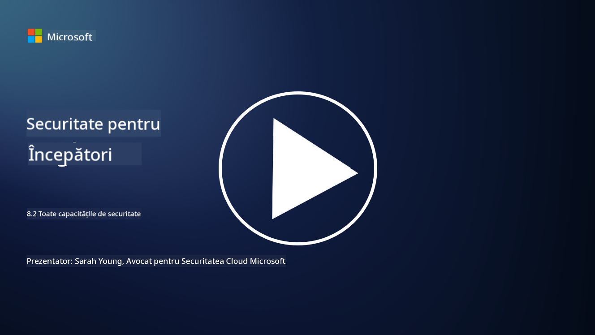

<!--
CO_OP_TRANSLATOR_METADATA:
{
  "original_hash": "b6bb7175672298d1e2f73ba7e0006f95",
  "translation_date": "2025-09-04T01:07:08+00:00",
  "source_file": "8.2 AI security capabilities.md",
  "language_code": "ro"
}
-->
# Capacități de securitate AI

## Ce instrumente și capacități avem în prezent pentru a securiza sistemele AI?

În prezent, există mai multe instrumente și capacități disponibile pentru a securiza sistemele AI:

-   **Counterfit**: Un instrument open-source de automatizare pentru testarea securității sistemelor AI, conceput pentru a ajuta organizațiile să efectueze evaluări ale riscurilor de securitate AI și să asigure robustețea algoritmilor lor.
-   **Instrumente pentru Machine Learning Adversarial**: Aceste instrumente evaluează robustețea modelelor de machine learning împotriva atacurilor adversariale, ajutând la identificarea și atenuarea vulnerabilităților.
-   **Kituri de instrumente pentru securitatea AI**: Există kituri de instrumente open-source care oferă resurse pentru securizarea sistemelor AI, inclusiv biblioteci și cadre pentru implementarea măsurilor de securitate.
-   **Platforme colaborative**: Parteneriate între companii și comunități AI pentru a dezvolta scanere de securitate specifice AI și alte instrumente pentru a securiza lanțul de aprovizionare AI.

Aceste instrumente și capacități fac parte dintr-un domeniu în creștere dedicat îmbunătățirii securității sistemelor AI împotriva unei varietăți de amenințări. Ele reprezintă o combinație de cercetare, instrumente practice și colaborare în industrie, menite să abordeze provocările unice ale tehnologiilor AI.

## Ce este red teaming-ul AI? Cum diferă de red teaming-ul tradițional în securitate?

Red teaming-ul AI diferă de red teaming-ul tradițional în securitate prin mai multe aspecte cheie:

-   **Concentrare pe sistemele AI**: Red teaming-ul AI vizează vulnerabilitățile unice ale sistemelor AI, cum ar fi modelele de machine learning și fluxurile de date, mai degrabă decât infrastructura IT tradițională.
-   **Testarea comportamentului AI**: Implică testarea modului în care sistemele AI răspund la intrări neobișnuite sau neașteptate, ceea ce poate dezvălui vulnerabilități exploatabile de atacatori.
-   **Explorarea eșecurilor AI**: Red teaming-ul AI analizează atât eșecurile rău intenționate, cât și cele benigne, luând în considerare un set mai larg de scenarii și posibile defecțiuni ale sistemului, dincolo de breșele de securitate.
-   **Injecție de prompturi și generare de conținut**: Include testarea pentru eșecuri precum injecția de prompturi, unde atacatorii manipulează sistemele AI pentru a produce conținut dăunător sau nefondat.
-   **AI etic și responsabil**: Face parte din asigurarea unui AI responsabil prin design, garantând că sistemele AI sunt robuste împotriva încercărilor de a le face să se comporte în moduri neintenționate.

În ansamblu, red teaming-ul AI este o practică extinsă care nu doar că acoperă identificarea vulnerabilităților de securitate, dar include și testarea altor tipuri de defecțiuni specifice tehnologiilor AI. Este o parte esențială a dezvoltării unor sisteme AI mai sigure, prin înțelegerea și atenuarea riscurilor noi asociate implementării AI.

## Lecturi suplimentare

 - [Microsoft AI Red Team building future of safer AI | Microsoft Security Blog](https://www.microsoft.com/en-us/security/blog/2023/08/07/microsoft-ai-red-team-building-future-of-safer-ai/?WT.mc_id=academic-96948-sayoung)
 - [Announcing Microsoft’s open automation framework to red team generative AI Systems | Microsoft Security Blog](https://www.microsoft.com/en-us/security/blog/2024/02/22/announcing-microsofts-open-automation-framework-to-red-team-generative-ai-systems/?WT.mc_id=academic-96948-sayoung)
 - [AI Security Tools: The Open-Source Toolkit | Wiz](https://www.wiz.io/academy/ai-security-tools)

---

**Declinarea responsabilității**:  
Acest document a fost tradus folosind serviciul de traducere AI [Co-op Translator](https://github.com/Azure/co-op-translator). Deși depunem eforturi pentru a asigura acuratețea, vă rugăm să rețineți că traducerile automate pot conține erori sau inexactități. Documentul original în limba sa nativă ar trebui considerat sursa autoritară. Pentru informații critice, se recomandă traducerea profesională realizată de un specialist uman. Nu ne asumăm răspunderea pentru eventualele neînțelegeri sau interpretări greșite care pot apărea din utilizarea acestei traduceri.