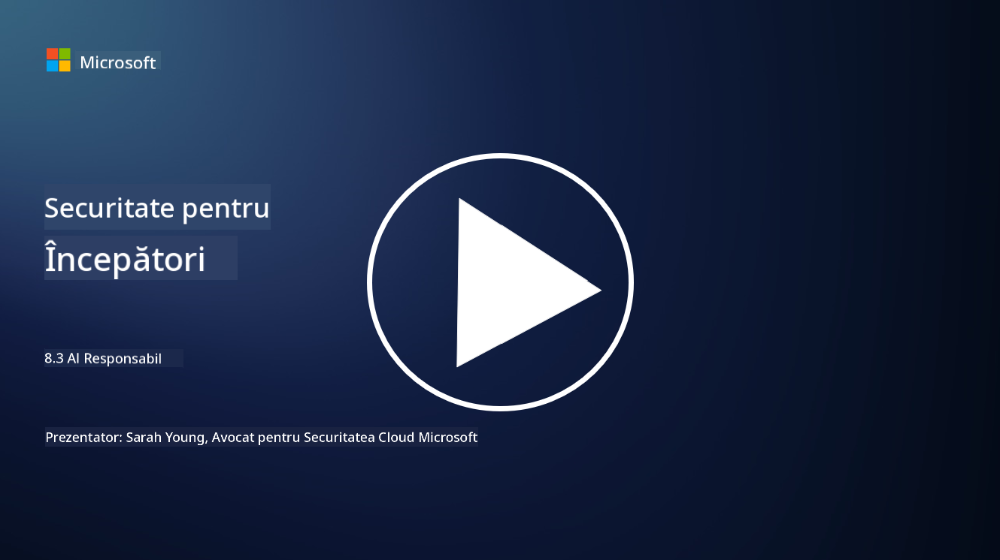

<!--
CO_OP_TRANSLATOR_METADATA:
{
  "original_hash": "5e9775ee91bde7d44577891d5f11c4c5",
  "translation_date": "2025-09-04T00:08:17+00:00",
  "source_file": "8.3 Responsible AI.md",
  "language_code": "ro"
}
-->
# Inteligența Artificială Responsabilă

## Ce este inteligența artificială responsabilă și cum se leagă de securitatea AI?

Inteligența artificială responsabilă se referă la dezvoltarea și utilizarea inteligenței artificiale într-un mod etic, transparent și în concordanță cu valorile societății. Aceasta include principii precum echitatea, responsabilitatea și robustețea, asigurând că sistemele AI sunt concepute și operate pentru a aduce beneficii indivizilor, comunităților și societății în ansamblu.

Relația dintre inteligența artificială responsabilă și securitatea AI este semnificativă deoarece:

-   **Considerații Etice**: Inteligența artificială responsabilă implică considerații etice care au un impact direct asupra securității, cum ar fi protecția datelor și confidențialitatea. Asigurarea că sistemele AI respectă confidențialitatea utilizatorilor și protejează datele personale este un aspect esențial al AI responsabilă.
-   **Robustețe și Fiabilitate**: Sistemele AI trebuie să fie robuste împotriva manipulării și atacurilor, ceea ce reprezintă un principiu de bază atât pentru AI responsabilă, cât și pentru securitatea AI. Acest lucru include protecția împotriva atacurilor adversariale și asigurarea integrității proceselor de luare a deciziilor ale AI.
-   **Transparență și Explicabilitate**: O parte din AI responsabilă este asigurarea că sistemele AI sunt transparente și deciziile lor pot fi explicate. Acest lucru este crucial pentru securitate, deoarece părțile interesate trebuie să înțeleagă cum funcționează sistemele AI pentru a avea încredere în măsurile de securitate.
-   **Responsabilitate**: Sistemele AI ar trebui să fie responsabile pentru acțiunile lor, ceea ce înseamnă că trebuie să existe mecanisme pentru a urmări deciziile și a corecta eventualele probleme. Acest lucru se aliniază cu practicile de securitate care monitorizează și auditează activitățile sistemului pentru a preveni și răspunde la breșe.

În esență, AI responsabilă și securitatea AI sunt interconectate, practicile AI responsabile îmbunătățind securitatea sistemelor AI și invers. Implementarea principiilor AI responsabile ajută la crearea unor sisteme AI care sunt nu doar etice, ci și mai sigure împotriva amenințărilor potențiale.

## Cum pot să mă asigur că sistemul meu AI este atât sigur, cât și etic?

Asigurarea că sistemul tău AI este atât sigur, cât și etic implică o abordare complexă care include următorii pași:

- **Respectă Principiile Etice**: Urmează ghidurile etice stabilite care subliniază bunăstarea umană, societală și de mediu; echitatea; protecția confidențialității; fiabilitatea; transparența; contestabilitatea; și responsabilitatea.

- **Implementează Măsuri de Securitate Robuste**: Utilizează testarea proactivă a securității și programe de gestionare a încrederii, riscurilor și securității AI pentru a proteja împotriva amenințărilor și vulnerabilităților.

- **Implică Părți Interesate Diverse**: Include o gamă largă de participanți în procesul de dezvoltare AI, inclusiv eticieni, sociologi și reprezentanți ai comunităților afectate, pentru a asigura luarea în considerare a perspectivelor și valorilor diverse.

- **Asigură Transparența și Explicabilitatea**: Asigură-te că procesele de luare a deciziilor ale AI sunt transparente și pot fi explicate, permițând o mai mare încredere și identificarea mai ușoară a eventualelor prejudecăți sau erori.

- **Menține Confidențialitatea Datelor**: Protejează confidențialitatea și autenticitatea datelor prin criptare și alte măsuri de protecție a datelor pentru a respecta drepturile de confidențialitate ale utilizatorilor.

- **Permite Supravegherea Umană**: Implementează mecanisme pentru supravegherea umană, care să permită contestarea deciziilor luate de sistemele AI și să asigure responsabilitatea.

- **Fii la Curent cu Siguranța AI**: Rămâi informat cu privire la cele mai recente cercetări și discuții despre siguranța AI pentru a înțelege peisajul în continuă evoluție al securității și eticii AI.

- **Respectă Reglementările**: Asigură-te că sistemul tău AI respectă toate legile și reglementările relevante, care pot include legi privind protecția datelor, legi anti-discriminare și ghiduri specifice industriei.

## Poți să-mi dai câteva exemple de probleme de securitate cauzate de utilizarea neetică a AI?

Iată câteva exemple de probleme de securitate care pot apărea din utilizarea neetică a AI:

- **Luarea Deciziilor Părtinitoare**: Sistemele AI pot perpetua și amplifica prejudecățile existente dacă sunt antrenate pe seturi de date părtinitoare. De exemplu, dacă un motor de căutare este antrenat pe date care reflectă stereotipuri sociale, acesta poate afișa rezultate părtinitoare, ceea ce poate duce la tratament nedrept sau discriminare.

- **AI în Sistemele Judiciare**: Utilizarea AI în luarea deciziilor legale poate ridica probleme etice, mai ales dacă procesul de luare a deciziilor al AI lipsește de transparență sau este influențat de date părtinitoare. Acest lucru ar putea duce la rezultate juridice nedrepte și la încălcarea drepturilor indivizilor.

- **Manipularea Sistemelor AI**: Sistemele AI pot fi susceptibile la atacuri adversariale, unde modificări minore ale datelor de intrare pot provoca rezultate incorecte. De exemplu, vehiculele autonome ar putea fi induse în eroare să interpreteze greșit semnele de circulație, ceea ce ar putea duce la riscuri de siguranță.

- **Supravegherea Alimentată de AI**: Utilizarea AI pentru supraveghere poate duce la încălcări ale confidențialității, mai ales dacă este utilizată fără consimțământ adecvat sau în moduri care încalcă libertățile individuale. Acest lucru poate fi deosebit de problematic în regimurile autoritare care pot folosi AI pentru a monitoriza și suprima disidența.

Aceste exemple subliniază importanța considerațiilor etice în dezvoltarea și implementarea sistemelor AI pentru a preveni problemele de securitate și a proteja drepturile și confidențialitatea indivizilor.

## Lecturi suplimentare

 - [Microsoft Responsible AI Standard v2 General Requirements](https://query.prod.cms.rt.microsoft.com/cms/api/am/binary/RE5cmFl?culture=en-us&country=us&WT.mc_id=academic-96948-sayoung)
 - [Responsible AI (mit.edu)](https://sloanreview.mit.edu/big-ideas/responsible-ai/)
 - [13 Principles for Using AI Responsibly (hbr.org)](https://hbr.org/2023/06/13-principles-for-using-ai-responsibly)

---

**Declinarea responsabilității**:  
Acest document a fost tradus folosind serviciul de traducere AI [Co-op Translator](https://github.com/Azure/co-op-translator). Deși depunem eforturi pentru a asigura acuratețea, vă rugăm să rețineți că traducerile automate pot conține erori sau inexactități. Documentul original în limba sa nativă ar trebui considerat sursa autoritară. Pentru informații critice, se recomandă traducerea profesională realizată de un specialist uman. Nu ne asumăm răspunderea pentru eventualele neînțelegeri sau interpretări greșite care pot apărea din utilizarea acestei traduceri.