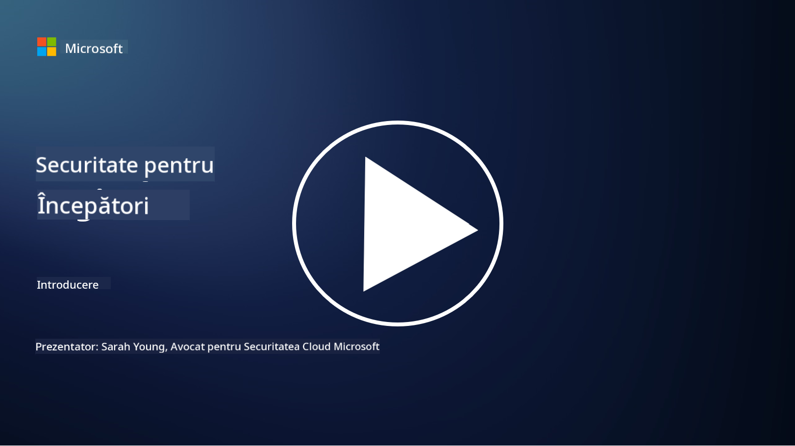

<!--
CO_OP_TRANSLATOR_METADATA:
{
  "original_hash": "33e83c2beb28a1b6e031416624dc23aa",
  "translation_date": "2025-10-11T11:08:33+00:00",
  "source_file": "README.md",
  "language_code": "ro"
}
-->

### 🌐 Suport Multi-Limbă

#### Suportat prin GitHub Action (Automat & Mereu Actualizat)

<!-- CO-OP TRANSLATOR LANGUAGES TABLE START -->
[Arabă](../ar/README.md) | [Bengaleză](../bn/README.md) | [Bulgară](../bg/README.md) | [Birmaneză (Myanmar)](../my/README.md) | [Chineză (Simplificată)](../zh/README.md) | [Chineză (Tradițională, Hong Kong)](../hk/README.md) | [Chineză (Tradițională, Macau)](../mo/README.md) | [Chineză (Tradițională, Taiwan)](../tw/README.md) | [Croată](../hr/README.md) | [Cehă](../cs/README.md) | [Daneză](../da/README.md) | [Olandeză](../nl/README.md) | [Estonă](../et/README.md) | [Finlandeză](../fi/README.md) | [Franceză](../fr/README.md) | [Germană](../de/README.md) | [Greacă](../el/README.md) | [Ebraică](../he/README.md) | [Hindi](../hi/README.md) | [Maghiară](../hu/README.md) | [Indoneziană](../id/README.md) | [Italiană](../it/README.md) | [Japoneză](../ja/README.md) | [Coreeană](../ko/README.md) | [Lituaniană](../lt/README.md) | [Malayeză](../ms/README.md) | [Marathi](../mr/README.md) | [Nepaleză](../ne/README.md) | [Norvegiană](../no/README.md) | [Persană (Farsi)](../fa/README.md) | [Poloneză](../pl/README.md) | [Portugheză (Brazilia)](../br/README.md) | [Portugheză (Portugalia)](../pt/README.md) | [Punjabi (Gurmukhi)](../pa/README.md) | [Română](./README.md) | [Rusă](../ru/README.md) | [Sârbă (Chirilică)](../sr/README.md) | [Slovacă](../sk/README.md) | [Slovenă](../sl/README.md) | [Spaniolă](../es/README.md) | [Swahili](../sw/README.md) | [Suedeză](../sv/README.md) | [Tagalog (Filipineză)](../tl/README.md) | [Tamil](../ta/README.md) | [Thailandeză](../th/README.md) | [Turcă](../tr/README.md) | [Ucraineană](../uk/README.md) | [Urdu](../ur/README.md) | [Vietnameză](../vi/README.md)
<!-- CO-OP TRANSLATOR LANGUAGES TABLE END -->

**Dacă doriți să fie suportate alte limbi, lista completă este disponibilă [aici](https://github.com/Azure/co-op-translator/blob/main/getting_started/supported-languages.md)**

#### Alăturați-vă Comunității Noastre 

# 🚀 Cybersecurity pentru Începători – un curriculum

În această eră în continuă schimbare a adoptării tehnologiei AI, este cu atât mai important să înțelegem cum să securizăm sistemele IT. Acest curs este conceput pentru a vă învăța conceptele fundamentale de securitate cibernetică, oferindu-vă un start în învățarea despre securitate. Este independent de furnizori și este împărțit în lecții scurte care ar trebui să dureze aproximativ 30-60 de minute fiecare. Fiecare lecție include un mic test și linkuri pentru lecturi suplimentare, dacă doriți să aprofundați subiectul.

Ce acoperă acest curs 📚

- 🔐 Concepte de bază în securitatea cibernetică, cum ar fi triada CIA, diferențele dintre riscuri, amenințări etc.
- 🛡️ Înțelegerea a ceea ce este un control de securitate și ce forme poate lua.
- 🌐 Înțelegerea conceptului de zero trust și de ce este important în securitatea cibernetică modernă.
- 🔑 Înțelegerea conceptelor și temelor cheie legate de identitate, rețele, operațiuni de securitate, infrastructură și securitatea datelor.
- 🔧 Exemple de instrumente utilizate pentru implementarea controalelor de securitate.

Ce nu acoperă acest curs 🙅‍♂️

- 🚫 Cum să utilizați instrumente de securitate specifice.
- 🚫 Cum să "hack-uiți" sau să faci red teaming/securitate ofensivă.
- 🚫 Învățarea despre standarde de conformitate specifice.

După ce ați finalizat acest curs, puteți trece la unele dintre modulele noastre Microsoft Learn. Vă recomandăm să continuați învățarea cu [Microsoft Security, Compliance, and Identity Fundamentals.](https://learn.microsoft.com/training/paths/describe-concepts-of-security-compliance-identity/?WT.mc_id=academic-96948-sayoung) 

În cele din urmă, puteți lua în considerare susținerea [Examenului SC-900: Microsoft Security, Compliance, and Identity Fundamentals.](https://learn.microsoft.com/credentials/certifications/exams/sc-900/?WT.mc_id=academic-96948-sayoung)

> 💁 Dacă aveți feedback sau sugestii despre acest curs și conținutul care lipsește, ne-ar plăcea să auzim de la voi!

## Prezentare Generală a Modulelor 📝 
| **Numărul Modulului** | **Numele Modulului**                   | **Concepte Predate**                 | **Obiective de Învățare**                                                                                       |
|-----------------------|---------------------------------------|--------------------------------------|-----------------------------------------------------------------------------------------------------------------|
| **1.1**               | Concepte de bază în securitate        | [Triada CIA](https://github.com/microsoft/Security-101/blob/main/1.1%20The%20CIA%20triad%20and%20other%20key%20concepts.md)                        | Aflați despre confidențialitate, disponibilitate și integritate. De asemenea, autenticitate, nerepudiere și confidențialitate. |
| **1.2**               | Concepte de bază în securitate        | [Amenințări comune în securitatea cibernetică](https://github.com/microsoft/Security-101/blob/main/1.2%20Common%20cybersecurity%20threats.md)        | Aflați despre amenințările comune în securitatea cibernetică cu care se confruntă indivizii și organizațiile.                             |
| **1.3**               | Concepte de bază în securitate        | [Înțelegerea managementului riscurilor](https://github.com/microsoft/Security-101/blob/main/1.3%20Understanding%20risk%20management.md)       | Aflați despre evaluarea și înțelegerea riscurilor – impact/probabilitate și implementarea controalelor.                                                                                                               | |
| **1.4**               | Concepte de bază în securitate        | [Practici și documentație de securitate](https://github.com/microsoft/Security-101/blob/main/1.4%20Security%20practices%20and%20documentation.md) | Aflați despre diferența dintre politici, proceduri, standarde și reglementări/legi.                         |
| **1.5**               | Concepte de bază în securitate        | [Zero trust](https://github.com/microsoft/Security-101/blob/main/1.5%20Zero%20trust.md)                           | Aflați despre ce este zero trust și cum afectează arhitectura. Ce este apărarea în profunzime?                   |
| **1.6**               | Concepte de bază în securitate        | [Modelul de responsabilitate partajată](https://github.com/microsoft/Security-101/blob/main/1.6%20Shared%20responsibility%20model.md)                           | Ce este modelul de responsabilitate partajată și cum afectează securitatea cibernetică?                  |
| **1.7**               | [Test de sfârșit de modul](https://github.com/microsoft/Security-101/blob/main/1.7%20End%20of%20module%20quiz.md)                        |                                      |                                                                                                                 |
| **2.1**               | Fundamentele managementului identității și accesului | [Concepte cheie IAM](https://github.com/microsoft/Security-101/blob/main/2.1%20IAM%20key%20concepts.md)                     | Aflați despre principiul privilegiului minim, segregarea sarcinilor, cum IAM susține zero trust.               |
| **2.2**               | Fundamentele managementului identității și accesului | [Arhitectura IAM zero trust](https://github.com/microsoft/Security-101/blob/main/2.2%20IAM%20zero%20trust%20architecture.md)          | Aflați despre cum identitatea este noul perimetru pentru mediile IT moderne și amenințările pe care le atenuează.          |
| **2.3**               | Fundamentele managementului identității și accesului | [Capabilități IAM](https://github.com/microsoft/Security-101/blob/main/2.3%20IAM%20capabilities.md)                     | Aflați despre capabilitățile IAM și controalele pentru securizarea identităților.                                                  |
| **2.4**               | [Test de sfârșit de modul](https://github.com/microsoft/Security-101/blob/main/2.4%20End%20of%20module%20quiz.md)                        |                                      |                                                                                                                 |
| **3.1**               | Fundamentele securității rețelelor    | [Concepte cheie de rețelistică](https://github.com/microsoft/Security-101/blob/main/3.1%20Networking%20key%20concepts.md)              | Aflați despre concepte de rețelistică (adresare IP, numere de porturi, criptare etc.)                                 |
| **3.2**               | Fundamentele securității rețelelor    | [Arhitectura zero trust în rețelistică](https://github.com/microsoft/Security-101/blob/main/3.2%20Networking%20zero%20trust%20architecture.md)   | Aflați despre cum rețelistica contribuie la o arhitectură E2E ZT și amenințările pe care le atenuează.                  |
| **3.3**               | Fundamentele securității rețelelor    | [Capabilități de securitate a rețelelor](https://github.com/microsoft/Security-101/blob/main/3.3%20Network%20security%20capabilities.md)        | Aflați despre instrumente de securitate a rețelelor – firewall-uri, WAF, protecție DDoS etc.                                    |
| **3.4**               | [Test de sfârșit de modul](https://github.com/microsoft/Security-101/blob/main/3.4%20End%20of%20module%20quiz.md)                        |                                      |                                                                                                                 |
| **4.1**               | Fundamentele operațiunilor de securitate | [Concepte cheie SecOps](https://github.com/microsoft/Security-101/blob/main/4.1%20SecOps%20key%20concepts.md)                  | Aflați despre de ce operațiunile de securitate sunt importante și cum diferă de echipele IT obișnuite.                  |
| **4.2**               | Fundamentele operațiunilor de securitate | [Arhitectura zero trust în SecOps](https://github.com/microsoft/Security-101/blob/main/4.2%20SecOps%20zero%20trust%20architecture.md)       | Aflați despre cum SecOps contribuie la o arhitectură E2E ZT și amenințările pe care le atenuează.                      |
| **4.3**               | Fundamentele operațiunilor de securitate | [Capabilități SecOps](https://github.com/microsoft/Security-101/blob/main/4.3%20SecOps%20capabilities.md)                  | Aflați despre instrumente SecOps – SIEM, XDR etc.                                                                    |
| **4.4**               | [Test de sfârșit de modul](https://github.com/microsoft/Security-101/blob/main/4.4%20End%20of%20module%20quiz.md)                        |                                      |                                                                                                                 |
| **5.1**               | Fundamentele securității aplicațiilor | [Concepte cheie AppSec](https://github.com/microsoft/Security-101/blob/main/5.1%20AppSec%20key%20concepts.md)                  | Aflați despre concepte AppSec, cum ar fi securitatea prin design, validarea inputului etc.                                    |
| **5.2**           | Fundamentele securității aplicațiilor         | [Capabilități AppSec](https://github.com/microsoft/Security-101/blob/main/5.2%20AppSec%20key%20capabilities.md)                  | Învață despre instrumentele AppSec: instrumente de securitate pentru pipeline, scanare de cod, scanare de secrete etc.                       |
| **5.3**           | [Test final al modulului](https://github.com/microsoft/Security-101/blob/main/5.3%20End%20of%20module%20quiz.md)                        |                                      |                                                                                                                 |
| **6.1**           | Fundamentele securității infrastructurii      | [Concepte cheie ale securității infrastructurii](https://github.com/microsoft/Security-101/blob/main/6.1%20Infrastructure%20security%20key%20concepts.md) | Învață despre întărirea sistemelor, aplicarea patch-urilor, igiena securității, securitatea containerelor.                                  |
| **6.2**           | Fundamentele securității infrastructurii      | [Capabilități ale securității infrastructurii](https://github.com/microsoft/Security-101/blob/main/6.2%20Infrastructure%20security%20capabilities.md) | Învață despre instrumentele care pot ajuta la securitatea infrastructurii, de exemplu CSPM, securitatea containerelor etc.            |
| **6.3**           | [Test final al modulului](https://github.com/microsoft/Security-101/blob/main/6.3%20End%20of%20module%20quiz.md)                        |                                      |                                                                                                                 |
| **7.1**           | Fundamentele securității datelor                | [Concepte cheie ale securității datelor](https://github.com/microsoft/Security-101/blob/main/7.1%20Data%20security%20key%20concepts.md)           | Învață despre clasificarea și păstrarea datelor și de ce acestea sunt importante pentru o organizație.                     |
| **7.2**           | Fundamentele securității datelor                | [Capabilități ale securității datelor](https://github.com/microsoft/Security-101/blob/main/7.2%20Data%20security%20capabilities.md)           | Învață despre instrumentele de securitate a datelor – DLP, gestionarea riscurilor interne, guvernanța datelor etc.                          |
| **7.3**           | [Test final al modulului](https://github.com/microsoft/Security-101/blob/main/7.3%20End%20of%20module%20quiz.md)                        |
| **8.1**           | Fundamentele securității AI                | [Concepte cheie ale securității AI](https://github.com/microsoft/Security-101/blob/main/8.1%20AI%20security%20key%20concepts.md)          | Învață despre diferențele și asemănările dintre securitatea tradițională și securitatea AI.                 |
| **8.2**           | Fundamentele securității AI                | [Capabilități ale securității AI](https://github.com/microsoft/Security-101/blob/main/8.2%20AI%20security%20capabilities.md)           | Învață despre instrumentele de securitate AI și controalele care pot fi utilizate pentru a securiza AI-ul.                         |
| **8.3**           | Fundamentele securității AI                | [AI responsabil](https://github.com/microsoft/Security-101/blob/main/8.3%20Responsible%20AI.md)          | Învață despre ce înseamnă AI responsabil și despre daunele specifice AI-ului pe care profesioniștii în securitate trebuie să le cunoască.                          |
| **8.4**           | [Test final al modulului](https://github.com/microsoft/Security-101/blob/main/8.4%20End%20of%20module%20quiz.md)     

## 🎒 Alte cursuri 

Echipa noastră produce și alte cursuri! Descoperă:

- [Generative AI pentru începători](https://aka.ms/genai-beginners)
- [Generative AI pentru începători .NET](https://github.com/microsoft/Generative-AI-for-beginners-dotnet)
- [Generative AI cu JavaScript](https://github.com/microsoft/generative-ai-with-javascript)
- [Generative AI cu Java](https://github.com/microsoft/Generative-AI-for-beginners-java)
- [AI pentru începători](https://aka.ms/ai-beginners)
- [Data Science pentru începători](https://aka.ms/datascience-beginners)
- [ML pentru începători](https://aka.ms/ml-beginners)
- [Cybersecurity pentru începători](https://github.com/microsoft/Security-101) 
- [Web Dev pentru începători](https://aka.ms/webdev-beginners)
- [IoT pentru începători](https://aka.ms/iot-beginners)
- [Dezvoltare XR pentru începători](https://github.com/microsoft/xr-development-for-beginners)
- [Stăpânirea GitHub Copilot pentru programare în pereche](https://github.com/microsoft/Mastering-GitHub-Copilot-for-Paired-Programming)
- [Stăpânirea GitHub Copilot pentru dezvoltatori C#/.NET](https://github.com/microsoft/mastering-github-copilot-for-dotnet-csharp-developers)
- [Alege-ți propria aventură Copilot](https://github.com/microsoft/CopilotAdventures)

---

**Declinare de responsabilitate**:  
Acest document a fost tradus folosind serviciul de traducere AI [Co-op Translator](https://github.com/Azure/co-op-translator). Deși ne străduim să asigurăm acuratețea, vă rugăm să fiți conștienți că traducerile automate pot conține erori sau inexactități. Documentul original în limba sa natală ar trebui considerat sursa autoritară. Pentru informații critice, se recomandă traducerea profesională realizată de un specialist uman. Nu ne asumăm responsabilitatea pentru eventualele neînțelegeri sau interpretări greșite care pot apărea din utilizarea acestei traduceri.