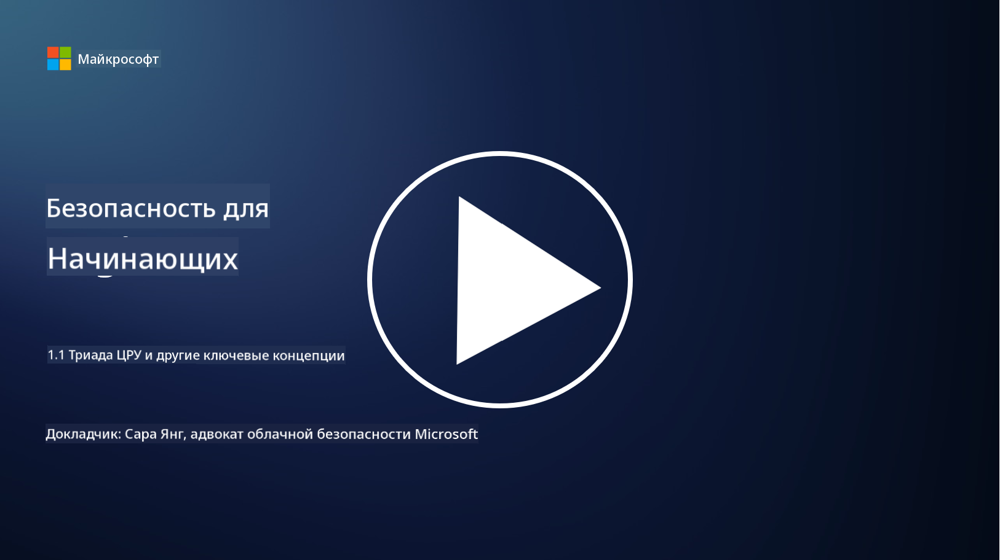
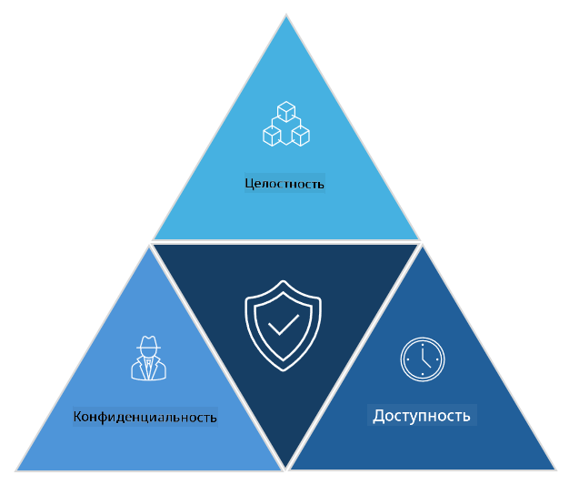

<!--
CO_OP_TRANSLATOR_METADATA:
{
  "original_hash": "16a76f9fa372fb63cffb6d76b855f023",
  "translation_date": "2025-09-04T01:08:28+00:00",
  "source_file": "1.1 The CIA triad and other key concepts.md",
  "language_code": "ru"
}
-->
# Триада CIA и другие ключевые концепции

## Введение

В этом уроке мы рассмотрим:

 - Что такое кибербезопасность?
   
 
 - Что такое триада CIA в кибербезопасности?

   

 - Что такое аутентичность, непреложность и конфиденциальность в контексте кибербезопасности?

## Что такое кибербезопасность?

Кибербезопасность, также известная как информационная безопасность, — это практика защиты компьютерных систем, сетей, устройств и данных от цифровых атак, несанкционированного доступа, повреждений или кражи. Основная цель кибербезопасности — обеспечить конфиденциальность, целостность и доступность цифровых активов и информации. Специалисты по кибербезопасности разрабатывают и внедряют средства защиты для обеспечения безопасности активов, данных и информации. С развитием цифровых технологий и интернета кибербезопасность стала одной из главных задач как для частных лиц, так и для организаций.

## Что такое триада CIA в кибербезопасности?

Триада кибербезопасности представляет собой модель, которая включает три основных аспекта, учитываемых при любой работе в области кибербезопасности или проектировании системы/среды:

### Конфиденциальность

Это аспект, с которым большинство людей ассоциируют термин "кибербезопасность": конфиденциальность — это процесс защиты данных и информации от попыток несанкционированного доступа, то есть только те, кому необходимо видеть информацию, могут получить к ней доступ. Однако не все данные одинаково важны, и обычно данные классифицируются и защищаются в зависимости от того, какой ущерб может быть нанесен, если они попадут в руки посторонних.

### Целостность

Означает защиту точности и надежности данных, содержащихся в среде, и предотвращение их изменения или корректировки несанкционированными лицами. Например, студент изменяет дату своего рождения в водительских записях в DMV, чтобы стать старше и получить переизданное удостоверение с более ранней датой рождения для покупки алкоголя.

### Доступность

Этот аспект важен для операционной ИТ-деятельности, но доступность также имеет значение для кибербезопасности. Существуют определенные типы атак, направленных на доступность, от которых специалисты по безопасности должны защищаться (например, атаки типа "отказ в обслуживании" – DDoS).

**Триада CIA в кибербезопасности**

## Что такое аутентичность, непреложность и конфиденциальность в контексте кибербезопасности?

Это дополнительные важные концепции, связанные с обеспечением безопасности и надежности систем и данных:

**Аутентичность** - означает уверенность в том, что информация, коммуникация или объект, с которым вы взаимодействуете, являются подлинными и не были изменены или подделаны несанкционированными сторонами.

**Непреложность** - это концепция, которая гарантирует, что сторона не может отрицать свое участие или подлинность транзакции или коммуникации. Она предотвращает возможность заявить, что сообщение не было отправлено или действие не было выполнено, если есть доказательства обратного.

**Конфиденциальность** - подразумевает защиту чувствительной и персонально идентифицируемой информации от несанкционированного доступа, использования, раскрытия или манипуляции. Это включает контроль над тем, кто имеет доступ к личным данным, а также как эти данные собираются, хранятся и передаются.

## Дополнительное чтение

[Что такое информационная безопасность (InfoSec)? | Microsoft Security](https://www.microsoft.com/security/business/security-101/what-is-information-security-infosec#:~:text=Three%20pillars%20of%20information%20security%3A%20the%20CIA%20triad,as%20guiding%20principles%20for%20implementing%20an%20InfoSec%20plan.)

---

**Отказ от ответственности**:  
Этот документ был переведен с использованием сервиса автоматического перевода [Co-op Translator](https://github.com/Azure/co-op-translator). Хотя мы стремимся к точности, пожалуйста, имейте в виду, что автоматические переводы могут содержать ошибки или неточности. Оригинальный документ на его исходном языке следует считать авторитетным источником. Для получения критически важной информации рекомендуется профессиональный перевод человеком. Мы не несем ответственности за любые недоразумения или неправильные толкования, возникшие в результате использования данного перевода.