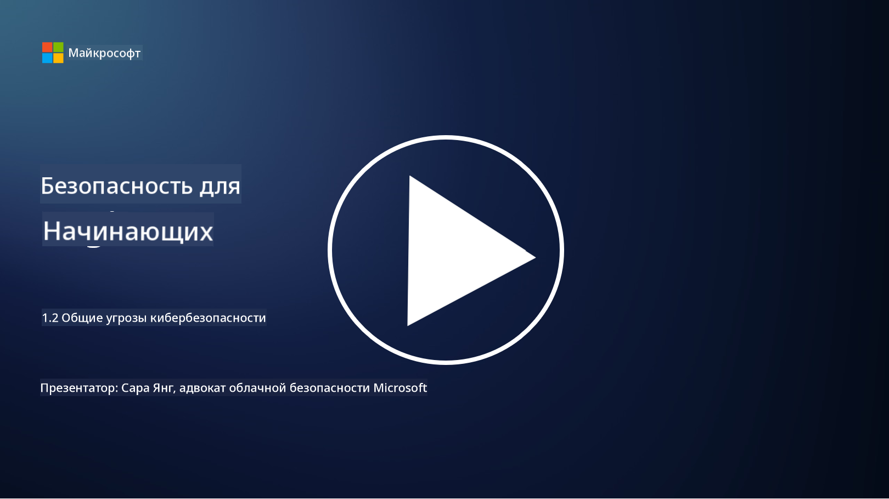

<!--
CO_OP_TRANSLATOR_METADATA:
{
  "original_hash": "6fc3030323139d7134a4ca9d03eccac9",
  "translation_date": "2025-09-03T23:20:50+00:00",
  "source_file": "1.2 Common cybersecurity threats.md",
  "language_code": "ru"
}
-->
# Основные угрозы кибербезопасности

## Введение

В этом уроке мы рассмотрим:

- Что такое угроза кибербезопасности?

- Почему злоумышленники стремятся скомпрометировать данные и ИТ-системы?

- Какие типы угроз кибербезопасности наиболее распространены?

- Что такое MITRE ATT&CK framework?

- Где можно следить за актуальной ситуацией в области угроз кибербезопасности?

## Что такое угроза кибербезопасности?

Угроза кибербезопасности — это потенциальная опасность или риск, который может поставить под угрозу конфиденциальность, целостность или доступность данных или ИТ-систем. Эти угрозы исходят от злоумышленников, которые пытаются использовать уязвимости для получения несанкционированного доступа, кражи конфиденциальной информации, нарушения работы систем или нанесения вреда людям, организациям или даже целым государствам. Угрозы кибербезопасности могут принимать различные формы и нацеливаться на разные аспекты цифровых систем и данных.

## Почему злоумышленники стремятся скомпрометировать данные и ИТ-системы?

Злоумышленники атакуют данные и ИТ-системы по разным причинам, часто руководствуясь личной выгодой, идеологическими мотивами или желанием вызвать хаос. Понимание этих мотивов помогает организациям и людям лучше защищаться от киберугроз. Вот некоторые из наиболее распространенных причин, по которым злоумышленники совершают кибератаки:

1. **Финансовая выгода**: Многие атаки направлены на получение финансовой прибыли. Злоумышленники могут похищать конфиденциальную информацию, такую как номера кредитных карт, банковские реквизиты или персональные данные, чтобы совершать мошенничество, кражу личности, вымогательство или продавать украденные данные на теневом рынке.

2. **Шпионаж**: Государства, конкуренты или другие субъекты могут заниматься кибершпионажем, чтобы похищать конфиденциальные данные правительств, компаний или исследовательских организаций для получения политического, экономического или военного преимущества.

3. **Саботаж и дестабилизация**: Некоторые атаки направлены на нарушение работы критически важных инфраструктур, сервисов или операций по политическим или идеологическим причинам. Такие атаки могут вызывать хаос, финансовые потери и урон репутации.

4. **Идеологические мотивы**: Хактивисты и группы с идеологическими или политическими целями могут взламывать системы, чтобы привлечь внимание к определенным вопросам, продвигать свои убеждения или протестовать против действий или организаций.

5. **Непреднамеренные действия**: Не все вредоносные действия совершаются намеренно; некоторые люди могут случайно способствовать киберугрозам, став жертвами социальной инженерии или частью скомпрометированной сети.

В конечном итоге мотивы атак могут быть самыми разными, а их последствия — серьезными. Поэтому важно, чтобы люди, организации и правительства серьезно относились к кибербезопасности и принимали меры для защиты от угроз.

## Какие типы угроз кибербезопасности наиболее распространены?

Существует несколько распространенных типов кибератак, которые злоумышленники используют для компрометации систем, кражи данных и создания сбоев. Вот некоторые из наиболее актуальных на момент написания:

1. **Фишинг**:

Фишинг включает отправку обманчивых писем или сообщений, которые выглядят как исходящие от надежных источников, чтобы обманом заставить получателей раскрыть конфиденциальную информацию, такую как пароли, номера кредитных карт или личные данные. Фишинг также может перенаправить жертв на вредоносные сайты или заставить их загрузить вредоносное ПО.

2. **Вредоносное ПО (Malware)**:

Вредоносное ПО охватывает широкий спектр программ, созданных для заражения систем, кражи данных или нанесения ущерба. Типы вредоносного ПО включают:

- **Вымогатели (Ransomware)**: Шифруют файлы и требуют выкуп за их расшифровку.

- **Трояны**: Маскируются под легитимное ПО, предоставляя злоумышленникам несанкционированный доступ.

- **Вирусы**: Самовоспроизводящиеся программы, которые прикрепляются к файлам и распространяются.

- **Черви**: Самовоспроизводящиеся программы, распространяющиеся через сети.

3. **Атаки типа "отказ в обслуживании" (DoS) и распределенные атаки (DDoS)**:

DoS-атаки перегружают целевую систему, делая ее недоступной для пользователей. DDoS-атаки используют сеть скомпрометированных устройств для создания огромного трафика, что затрудняет работу системы или полностью выводит ее из строя.

4. **SQL-инъекции**:

В таких атаках злоумышленники манипулируют полями ввода веб-приложений, чтобы внедрить вредоносные SQL-запросы, что может привести к несанкционированному доступу к базам данных и конфиденциальным данным.

5. **Межсайтовый скриптинг (XSS)**:

Злоумышленники внедряют вредоносные скрипты в веб-приложения, которые затем выполняются в браузерах ничего не подозревающих пользователей. Это может привести к краже данных пользователей и/или распространению вредоносного ПО.

6. **Социальная инженерия**:

Социальная инженерия использует человеческую психологию для манипуляции людьми с целью получения конфиденциальной информации или выполнения действий, которые нарушают безопасность.

7. **Эксплойты нулевого дня (Zero-Day)**:

Эти атаки нацелены на уязвимости в программном или аппаратном обеспечении, которые еще не известны поставщику или общественности. Злоумышленники используют эти уязвимости до того, как будут разработаны исправления. Хотя атаки нулевого дня вызывают серьезные опасения, они встречаются реже, чем другие атаки из этого списка. После обнаружения уязвимости исследователи безопасности быстро разрабатывают исправления, поэтому такие атаки обычно недолговечны.

8. **Атаки на учетные данные**:

Эти атаки включают подбор паролей (brute force), когда злоумышленники многократно пытаются угадать пароль, и атаки с использованием украденных учетных данных (credential stuffing), когда похищенные данные с одного сайта используются для доступа к другим сайтам.

## Что такое MITRE ATT&CK framework?

[MITRE ATT&CK framework](https://attack.mitre.org/) (Adversarial Tactics, Techniques, and Common Knowledge) — это структура, которая каталогизирует и классифицирует тактики, техники и процедуры (TTPs), используемые злоумышленниками во время кибератак. Эта структура была создана корпорацией MITRE, некоммерческой организацией, которая управляет исследовательскими и разработческими центрами для различных государственных агентств.

MITRE ATT&CK framework предоставляет стандартизированный способ описания и анализа киберугроз, что позволяет специалистам по кибербезопасности лучше понимать и защищаться от различных методов атак. Она широко используется командами безопасности, охотниками за угрозами и специалистами по реагированию на инциденты для:

1. **Понимания поведения злоумышленников**: Структура документирует реальные методы атак, описывая шаги, которые предпринимают злоумышленники — от начального проникновения до достижения своих целей. Она охватывает широкий спектр техник, используемых различными группами угроз.

2. **Планирования и реализации стратегий защиты**: Команды безопасности могут использовать структуру для разработки проактивных стратегий защиты, соответствующих тактикам и техникам, которые могут использовать злоумышленники.

3. **Реагирования на инциденты и охоты за угрозами**: При расследовании инцидентов или проведении охоты за угрозами специалисты могут обращаться к структуре для идентификации и нейтрализации конкретных техник, используемых злоумышленниками.

MITRE ATT&CK framework организована в виде матриц, которые группируют техники атак в зависимости от платформ и сред, таких как Windows, macOS, Linux и облачные сервисы. Каждая матрица делится на тактики (высокоуровневые цели) и техники (конкретные методы достижения этих целей). Для каждой техники структура предоставляет информацию о том, как она работает, возможные меры противодействия и ссылки на реальные группы угроз, которые использовали эту технику.

Структура постоянно обновляется и расширяется по мере сбора новой информации об угрозах и изменения ландшафта кибербезопасности. Это ценный ресурс для повышения уровня кибербезопасности организаций, позволяющий глубже понять методы злоумышленников и способы защиты от их тактик.

## Где можно следить за актуальной ситуацией в области угроз кибербезопасности?

Существует множество источников, которые можно использовать для отслеживания угроз кибербезопасности. Вот некоторые из них:

- [Open Web Application Security Project (OWASP) top 10 vulnerabilities](https://owasp.org/Top10/)
- [Common Vulnerabilities and Exposures (CVEs)](https://www.bing.com/ck/a?!&&p=53df6007f017bca2JmltdHM9MTY5MjU3NjAwMCZpZ3VpZD0zYmY4N2RiYS1jYWI1LTYwMDgtMWY1YS02ZmYyY2JjNjYxZWUmaW5zaWQ9NTc2OQ&ptn=3&hsh=3&fclid=3bf87dba-cab5-6008-1f5a-6ff2cbc661ee&psq=cve&u=a1aHR0cHM6Ly9iaW5nLmNvbS9hbGluay9saW5rP3VybD1odHRwcyUzYSUyZiUyZmN2ZS5taXRyZS5vcmclMmYmc291cmNlPXNlcnAtcnImaD1BZXN4S0VBWTNnbGhNZEFpd3daMlNSZkZQNTlrODhIUnYxRUtlSkY1RTk0JTNkJnA9a2NvZmZjaWFsd2Vic2l0ZQ&ntb=1 "Common Vulnerabilities and Exposures")
- [Microsoft Security Response Center blogs](https://msrc.microsoft.com/blog/)
- [Национальный институт стандартов и технологий (NIST)](https://www.dhs.gov/topics/cybersecurity): NIST предоставляет ресурсы, предупреждения и последние обновления о потенциальных угрозах кибербезопасности.
- [Агентство по кибербезопасности и инфраструктурной безопасности (CISA)](https://www.cisa.gov/resources-tools/resources/free-cybersecurity-services-and-tools): CISA предоставляет ресурсы и лучшие практики в области кибербезопасности для бизнеса, государственных учреждений и других организаций. CISA делится актуальной информацией о наиболее значимых угрозах и проводит углубленный анализ новых и развивающихся киберугроз.
- [Национальный центр кибербезопасности (NCCoE)](https://www.dhs.gov/topics/cybersecurity): NCCoE — это центр, предоставляющий практические решения в области кибербезопасности, которые можно применять в реальных ситуациях.
- [US-CERT](https://www.cisa.gov/resources-tools/resources/free-cybersecurity-services-and-tools): Команда реагирования на компьютерные чрезвычайные ситуации США (US-CERT) предоставляет различные ресурсы по кибербезопасности, включая предупреждения, советы и многое другое.
- Центр реагирования на компьютерные инциденты (CERT) вашей страны.

---

**Отказ от ответственности**:  
Этот документ был переведен с помощью сервиса автоматического перевода [Co-op Translator](https://github.com/Azure/co-op-translator). Несмотря на наши усилия обеспечить точность, автоматические переводы могут содержать ошибки или неточности. Оригинальный документ на его родном языке следует считать авторитетным источником. Для получения критически важной информации рекомендуется профессиональный перевод человеком. Мы не несем ответственности за любые недоразумения или неправильные интерпретации, возникшие в результате использования данного перевода.