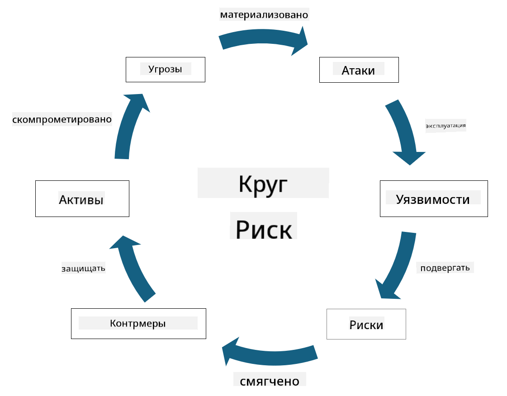

<!--
CO_OP_TRANSLATOR_METADATA:
{
  "original_hash": "fcca304f072cabf206388199e8e2e578",
  "translation_date": "2025-09-04T01:26:25+00:00",
  "source_file": "1.3 Understanding risk management.md",
  "language_code": "ru"
}
-->
# Понимание управления рисками

## Введение

В этом уроке мы рассмотрим:

- Определения часто используемой терминологии безопасности

- Типы средств управления безопасностью

- Оценка рисков безопасности

## Определения часто используемой терминологии безопасности

Эти термины являются основополагающими концепциями в области кибербезопасности и управления рисками. Давайте разберем каждый из них и их взаимосвязь:

1. **Источник угрозы**:

Источник угрозы — это человек, группа, организация или автоматизированная система, которые могут использовать уязвимости системы или сети для нанесения вреда или ущерба. Источниками угроз могут быть хакеры, авторы вредоносного ПО, недовольные сотрудники или любые другие субъекты, представляющие риск для информационных и технологических систем.

2. **Угроза**:

Угроза — это потенциальное событие или действие, которое может использовать уязвимости системы и нанести ущерб активу. Угрозы могут включать такие действия, как взлом, утечка данных, атаки типа "отказ в обслуживании" и другие. Угрозы — это "что" в контексте потенциального вреда, который может быть нанесен активам организации.

3. **Уязвимость**:

Уязвимость — это слабое место или недостаток в дизайне, реализации или конфигурации системы, который может быть использован источником угрозы для компрометации безопасности системы. Уязвимости могут быть в программном обеспечении, оборудовании, процессах или поведении людей. Выявление и устранение уязвимостей крайне важно для минимизации риска успешных атак.

4. **Риск**:

Риск — это вероятность потерь, вреда или ущерба, возникающая в результате взаимодействия угрозы и уязвимости. Это вероятность того, что источник угрозы использует уязвимость для нанесения негативного воздействия. Риски часто оцениваются с точки зрения их потенциального влияния и вероятности возникновения.

5. **Актив**:

Актив — это все, что имеет ценность и что организация стремится защитить. Активы могут включать физические объекты (например, компьютеры и серверы), данные (информация о клиентах, финансовые записи), интеллектуальную собственность (коммерческие тайны, патенты) и даже человеческие ресурсы (навыки и знания сотрудников). Защита активов — ключевая цель кибербезопасности.

6. **Экспозиция**:

Экспозиция — это состояние уязвимости к потенциальным угрозам. Она возникает, когда существует уязвимость, которая может быть использована источником угрозы. Экспозиция подчеркивает риск, связанный с наличием уязвимостей в системе или сети.

7. **Контроль**:

Контроль — это мера, направленная на снижение риска, связанного с уязвимостями и угрозами. Контроли могут быть техническими, процедурными или административными. Они предназначены для предотвращения, обнаружения или смягчения потенциальных угроз и уязвимостей. Примеры включают брандмауэры, средства контроля доступа, шифрование, политики безопасности и обучение сотрудников.

Подводя итог взаимосвязи этих терминов: источники угроз используют уязвимости для реализации угроз, которые могут привести к рискам, способным нанести ущерб ценным активам. Экспозиция возникает при наличии уязвимостей, а контроли внедряются для снижения риска путем предотвращения или смягчения воздействия угроз на активы. Эта структура лежит в основе управления рисками в кибербезопасности, помогая организациям выявлять, оценивать и устранять потенциальные риски для их информационных систем и активов.

## Типы средств управления безопасностью

Средства управления безопасностью — это меры или механизмы, внедряемые для защиты информационных систем и активов от различных угроз и уязвимостей. Их можно классифицировать на несколько категорий в зависимости от их цели и назначения. Вот некоторые распространенные типы средств управления безопасностью:

1. **Административные контроли**:

Эти контроли связаны с политиками, процедурами и руководствами, которые регулируют практики безопасности и поведение пользователей в организации.

- Политики и процедуры безопасности: Документированные руководства, определяющие, как поддерживается безопасность в организации.

- Повышение осведомленности и обучение безопасности: Программы для обучения сотрудников лучшим практикам безопасности и потенциальным угрозам.

- Реагирование на инциденты и управление ими: Планы реагирования на инциденты безопасности и их смягчения.

2. **Технические контроли**:

Технические контроли включают использование технологий для обеспечения мер безопасности и защиты систем и данных. Примеры технических контролей:

- Средства контроля доступа: Меры, ограничивающие доступ пользователей к ресурсам в зависимости от их ролей и разрешений.

- Шифрование: Преобразование данных в защищенный формат для предотвращения несанкционированного доступа.

- Брандмауэры: Устройства сетевой безопасности, фильтрующие и контролирующие входящий и исходящий трафик.

- Системы обнаружения и предотвращения вторжений (IDPS): Инструменты, отслеживающие сетевой трафик на предмет подозрительной активности.

- Антивирусное и антишпионское ПО: Программы, обнаруживающие и удаляющие вредоносное ПО.

- Механизмы аутентификации: Методы проверки личности пользователей, такие как пароли, биометрия и многофакторная аутентификация.

- Управление патчами: Регулярное обновление программного обеспечения для устранения известных уязвимостей.

3. **Физические контроли**:

Физические контроли — это меры для защиты физических активов и объектов.

- Охрана и персонал контроля доступа: Сотрудники, которые следят за доступом к физическим помещениям.

- Камеры наблюдения: Системы видеомониторинга для отслеживания и записи активности.

- Замки и физические барьеры: Физические меры для ограничения доступа к чувствительным зонам.

- Контроль окружающей среды: Меры для регулирования температуры, влажности и других факторов, влияющих на оборудование и центры обработки данных.

4. **Операционные контроли**:

Эти контроли связаны с повседневными операциями и действиями, обеспечивающими постоянную безопасность систем.

- Управление изменениями: Процессы отслеживания и утверждения изменений в системах и конфигурациях.

- Резервное копирование и восстановление после сбоев: Планы резервного копирования данных и их восстановления в случае сбоев или катастроф.

- Логирование и аудит: Мониторинг и запись активности системы для целей безопасности и соответствия.

- Безопасные практики программирования: Руководства по написанию программного обеспечения для минимизации уязвимостей.

5. **Юридические и нормативные контроли**:

Эти контроли обеспечивают соответствие применимым законам, нормативным актам и отраслевым стандартам. Необходимые стандарты зависят от юрисдикции, отрасли и других факторов.

- Регулирование защиты данных: Соблюдение законов, таких как GDPR, HIPAA и CCPA.

- Отраслевые стандарты: Соблюдение стандартов, таких как PCI DSS для безопасности данных платежных карт.

Эти категории средств управления безопасностью работают вместе, создавая комплексную защиту для организаций, помогая защищать их системы, данные и активы от широкого спектра угроз.

## Оценка рисков безопасности

Некоторые специалисты по безопасности считают, что управление рисками — это задача исключительно специалистов по рискам, но понимание процесса управления рисками безопасности важно для любого специалиста по безопасности, чтобы выражать риски безопасности на языке, понятном и применимом для всей организации.

Организации должны постоянно оценивать риски безопасности и принимать решения о том, какие действия (или их отсутствие) предпринять в отношении рисков для бизнеса. Ниже приведен обзор того, как это обычно делается. Обратите внимание, что этот процесс обычно выполняется несколькими командами внутри организации, и редко одна команда отвечает за полный цикл управления рисками.

1. **Идентификация активов и угроз**:

Организация определяет активы, которые она хочет защитить. Это могут быть данные, системы, оборудование, программное обеспечение, интеллектуальная собственность и многое другое. Затем они определяют потенциальные угрозы, которые могут быть направлены на эти активы.

2. **Оценка уязвимостей**:

Организации выявляют уязвимости или слабые места в системах или процессах, которые могут быть использованы угрозами. Эти уязвимости могут быть связаны с ошибками в программном обеспечении, неправильной конфигурацией, отсутствием средств управления безопасностью и человеческими ошибками.

3. **Оценка вероятности**:

Организация оценивает вероятность возникновения каждой угрозы. Это включает анализ исторических данных, информации об угрозах, отраслевых тенденций и внутренних факторов. Вероятность может быть классифицирована как низкая, средняя или высокая в зависимости от вероятности реализации угрозы.

4. **Оценка воздействия**:

Далее организация определяет потенциальное воздействие каждой угрозы, если она использует уязвимость. Воздействие может включать финансовые потери, сбои в работе, ущерб репутации, юридические последствия и многое другое. Воздействие также может быть классифицировано как низкое, среднее или высокое в зависимости от возможных последствий.

5. **Расчет риска**:

Оценки вероятности и воздействия объединяются для расчета общего уровня риска для каждой выявленной угрозы. Это часто делается с использованием матрицы рисков, которая присваивает числовые значения или качественные описания уровням вероятности и воздействия. Полученный уровень риска помогает определить приоритетность рисков, требующих немедленного внимания.

6. **Приоритизация и принятие решений**:

Организация определяет приоритеты рисков, сосредотачиваясь на тех, которые имеют самые высокие значения вероятности и воздействия. Это позволяет более эффективно распределять ресурсы и внедрять средства управления. Угрозы с высоким риском требуют немедленного внимания, тогда как угрозы с низким риском могут быть решены в более длительной перспективе.

7. **Обработка рисков**:

На основе оценки рисков организация определяет, как смягчить или управлять каждым риском. Это может включать внедрение средств управления безопасностью, передачу риска через страхование или даже принятие определенных уровней остаточного риска, если они считаются управляемыми/слишком дорогими для устранения и т. д.

8. **Непрерывный мониторинг и пересмотр**:

Оценка рисков — это не разовый процесс. Она должна проводиться периодически или при значительных изменениях в среде организации. Непрерывный мониторинг гарантирует, что новые угрозы, уязвимости или изменения в бизнес-среде учитываются.

Оценивая риски безопасности таким структурированным образом, организации могут принимать обоснованные решения о распределении ресурсов, средствах управления безопасностью и общих стратегиях управления рисками. Цель состоит в том, чтобы снизить общий уровень риска организации, одновременно согласовывая усилия по обеспечению безопасности с бизнес-целями и задачами организации.

---

**Отказ от ответственности**:  
Этот документ был переведен с использованием сервиса автоматического перевода [Co-op Translator](https://github.com/Azure/co-op-translator). Хотя мы стремимся к точности, пожалуйста, имейте в виду, что автоматические переводы могут содержать ошибки или неточности. Оригинальный документ на его исходном языке следует считать авторитетным источником. Для получения критически важной информации рекомендуется профессиональный перевод человеком. Мы не несем ответственности за любые недоразумения или неправильные толкования, возникшие в результате использования данного перевода.