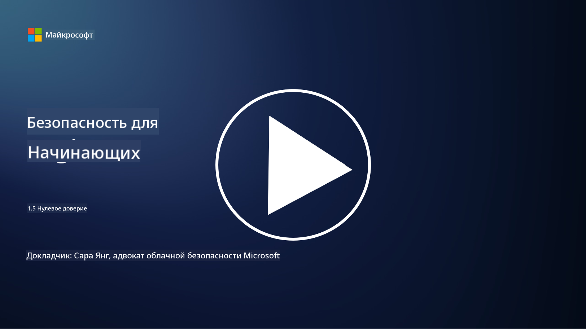
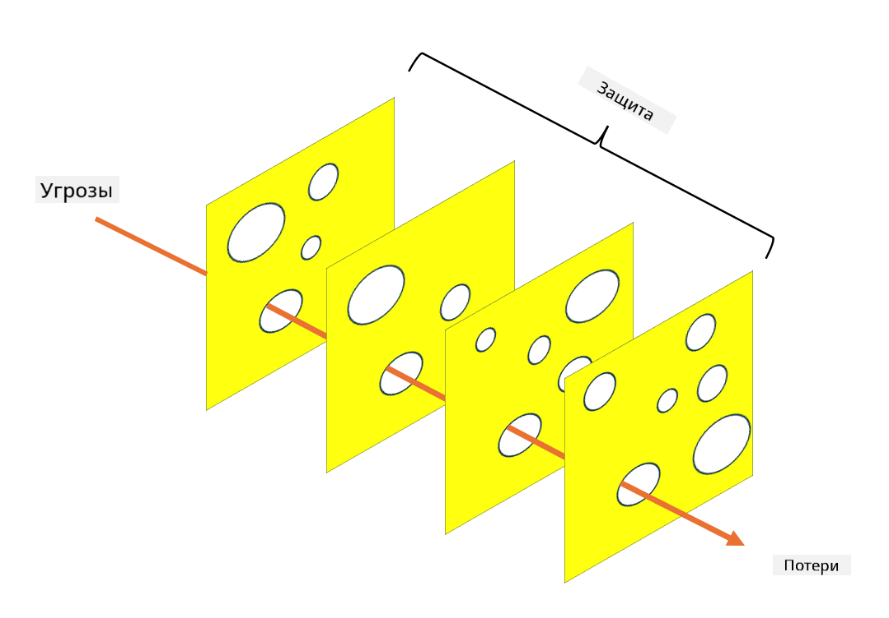

<!--
CO_OP_TRANSLATOR_METADATA:
{
  "original_hash": "75f77f972d2233c584f87c1eb96c983b",
  "translation_date": "2025-09-03T23:45:26+00:00",
  "source_file": "1.5 Zero trust.md",
  "language_code": "ru"
}
-->
# Нулевое доверие

«Нулевое доверие» — это термин, который сейчас часто используется в кругах, связанных с безопасностью. Но что он означает? Это просто модное слово? В этом уроке мы подробно разберем, что такое нулевое доверие.

## Введение

 - В этом уроке мы рассмотрим:
   
   
 - Что такое нулевое доверие?

   
  

 - Чем нулевое доверие отличается от традиционных архитектур безопасности?

   
   

 - Что такое защита в глубину?

## Нулевое доверие

Нулевое доверие — это подход к кибербезопасности, который ставит под сомнение традиционное представление «доверяй, но проверяй», предполагая, что ни одна сущность, будь то внутри или вне сети организации, не должна быть автоматически доверенной. Вместо этого нулевое доверие требует проверки каждого пользователя, устройства и приложения, пытающегося получить доступ к ресурсам, независимо от их местоположения. Основной принцип нулевого доверия — минимизация «поверхности атаки» и снижение потенциального ущерба от нарушений безопасности.

В модели нулевого доверия акцент делается на следующих принципах:

1. **Проверка идентичности**: Аутентификация и авторизация строго применяются ко всем пользователям и устройствам, независимо от их местоположения. Помните, что идентичность — это не обязательно человек: это может быть устройство, приложение и т.д.

2. **Минимальные привилегии**: Пользователям и устройствам предоставляется минимальный уровень доступа, необходимый для выполнения их задач, что снижает потенциальный ущерб в случае компрометации.

3. **Микросегментация**: Ресурсы сети делятся на небольшие сегменты, чтобы ограничить перемещение внутри сети в случае нарушения.

4. **Непрерывный мониторинг**: Проводится постоянный мониторинг и анализ поведения пользователей и устройств для выявления аномалий и потенциальных угроз. Современные методы мониторинга также используют машинное обучение, искусственный интеллект и информацию об угрозах для предоставления дополнительных данных и контекста.

5. **Шифрование данных**: Данные шифруются как при передаче, так и в состоянии покоя, чтобы предотвратить несанкционированный доступ.

6. **Строгий контроль доступа**: Контроль доступа осуществляется на основе контекста, такого как роли пользователей, состояние устройств и местоположение в сети.

Microsoft разделяет нулевое доверие на пять столпов, которые мы обсудим в следующем уроке.

## Отличия от традиционных архитектур безопасности

Нулевое доверие отличается от традиционных архитектур безопасности, таких как модели, основанные на периметре, по нескольким ключевым аспектам:

1. **Периметр против идентичности**: Традиционные модели сосредоточены на защите периметра сети и предполагают, что внутренним пользователям и устройствам можно доверять после попадания внутрь. Нулевое доверие, напротив, предполагает, что угрозы могут исходить как изнутри, так и извне сети, и требует строгого контроля, основанного на идентичности.

2. **Неявное против явного доверия**: Традиционные модели автоматически доверяют устройствам и пользователям внутри сети до тех пор, пока не доказано обратное. Нулевое доверие явно проверяет идентичности и постоянно отслеживает аномалии.

3. **Плоская против сегментированной сети**: Традиционные архитектуры часто включают плоские сети, где внутренние пользователи имеют широкий доступ. Нулевое доверие предполагает сегментацию сети на небольшие изолированные зоны для ограничения потенциальных нарушений.

4. **Реактивный против проактивного подхода**: Традиционная безопасность часто полагается на реактивные меры, такие как периметровые брандмауэры и системы обнаружения вторжений. Нулевое доверие использует проактивный подход, предполагая, что нарушения вероятны, и минимизируя их последствия.

## Защита в глубину

Защита в глубину, также известная как многослойная безопасность, — это стратегия кибербезопасности, которая предполагает использование нескольких слоев средств и мер безопасности для защиты активов организации. Цель состоит в создании перекрывающихся слоев защиты, чтобы в случае нарушения одного слоя другие могли обеспечить защиту. Каждый слой сосредоточен на разных аспектах безопасности и повышает общий уровень безопасности организации.

Защита в глубину включает сочетание технических, процедурных и физических мер безопасности. Это могут быть брандмауэры, системы обнаружения вторжений, контроль доступа, шифрование, обучение пользователей, политики безопасности и многое другое. Идея заключается в создании множества барьеров, которые в совокупности затрудняют злоумышленникам проникновение в системы и сети организации. Это также иногда называют «моделью швейцарского сыра», которая используется для предотвращения аварий в других отраслях (например, транспорт).

## Дополнительные материалы

[Что такое нулевое доверие?](https://learn.microsoft.com/security/zero-trust/zero-trust-overview?WT.mc_id=academic-96948-sayoung)

[Эволюция нулевого доверия – позиционный документ Microsoft](https://query.prod.cms.rt.microsoft.com/cms/api/am/binary/RWJJdT?WT.mc_id=academic-96948-sayoung)

[Нулевое доверие и BeyondCorp Google Cloud | Google Cloud Blog](https://cloud.google.com/blog/topics/developers-practitioners/zero-trust-and-beyondcorp-google-cloud)

---

**Отказ от ответственности**:  
Этот документ был переведен с использованием сервиса автоматического перевода [Co-op Translator](https://github.com/Azure/co-op-translator). Несмотря на наши усилия обеспечить точность, автоматические переводы могут содержать ошибки или неточности. Оригинальный документ на его исходном языке следует считать авторитетным источником. Для получения критически важной информации рекомендуется профессиональный перевод человеком. Мы не несем ответственности за любые недоразумения или неправильные толкования, возникшие в результате использования данного перевода.