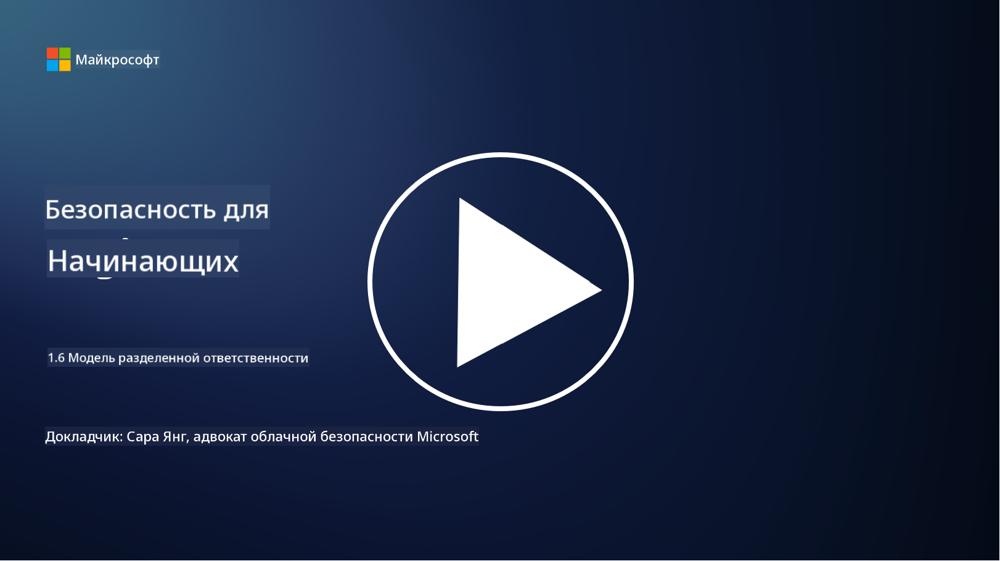

<!--
CO_OP_TRANSLATOR_METADATA:
{
  "original_hash": "a48db640d80c786b928ca178c414f084",
  "translation_date": "2025-09-04T00:23:56+00:00",
  "source_file": "1.6 Shared responsibility model.md",
  "language_code": "ru"
}
-->
# Модель совместной ответственности

Совместная ответственность — это относительно новая концепция в сфере ИТ, которая появилась с развитием облачных вычислений. С точки зрения кибербезопасности важно понимать, кто предоставляет какие меры безопасности, чтобы избежать пробелов в защите.

## Введение

В этом уроке мы рассмотрим:

- Что такое совместная ответственность в контексте кибербезопасности?

- Чем отличается совместная ответственность за меры безопасности 
  между IaaS, PaaS и SaaS?

- Где можно узнать, какие меры безопасности предоставляет ваша облачная платформа?

- Что означает «доверяй, но проверяй»?

## Что такое совместная ответственность в контексте кибербезопасности?

Совместная ответственность в кибербезопасности подразумевает распределение обязанностей по обеспечению безопасности между поставщиком облачных услуг (CSP) и его клиентами. В облачных вычислительных средах, таких как Infrastructure as a Service (IaaS), Platform as a Service (PaaS) и Software as a Service (SaaS), как CSP, так и клиент играют важные роли в обеспечении безопасности данных, приложений и систем.

## Чем отличается совместная ответственность за меры безопасности между IaaS, PaaS и SaaS?

Распределение обязанностей обычно зависит от типа используемой облачной услуги:

- **IaaS (Инфраструктура как услуга)**: CSP предоставляет базовую инфраструктуру (серверы, сети, хранилище), а клиент отвечает за управление операционными системами, приложениями и настройками безопасности на этой инфраструктуре.

- **PaaS (Платформа как услуга)**: CSP предлагает платформу, на которой клиенты могут создавать и развертывать приложения. CSP управляет базовой инфраструктурой, а клиент сосредотачивается на разработке приложений и защите данных.

- **SaaS (Программное обеспечение как услуга)**: CSP предоставляет полностью функциональные приложения, доступные через интернет. В этом случае CSP отвечает за безопасность приложения и инфраструктуры, а клиент управляет доступом пользователей и использованием данных.

Понимание совместной ответственности важно, так как оно уточняет, какие аспекты безопасности покрываются CSP, а какие должен решать клиент. Это помогает избежать недоразумений и обеспечивает комплексное внедрение мер безопасности.

## Где можно узнать, какие меры безопасности предоставляет ваша облачная платформа?

Чтобы узнать, какие меры безопасности предоставляет ваша облачная платформа, необходимо обратиться к документации и ресурсам поставщика облачных услуг. Это включает:

- **Веб-сайт и документация CSP**: На веб-сайте CSP обычно представлена информация о функциях безопасности и мерах, предлагаемых в рамках их услуг. CSP, как правило, предоставляет подробную документацию, объясняющую их практики безопасности, меры и рекомендации. Это может включать технические руководства, белые книги и руководства по безопасности.

- **Оценки и аудиты безопасности**: Большинство CSP проводят независимые оценки своих мер безопасности экспертами и организациями. Эти обзоры могут дать представление о качестве мер безопасности CSP. Иногда это приводит к получению сертификатов соответствия безопасности (см. следующий пункт).

- **Сертификаты соответствия безопасности**: Большинство CSP получают сертификаты, такие как ISO:27001, SOC 2 и FedRAMP и др. Эти сертификаты подтверждают, что поставщик соответствует определенным стандартам безопасности и соответствия.

Помните, что уровень детализации и доступность информации могут варьироваться у разных поставщиков облачных услуг. Всегда обращайтесь к официальным и актуальным ресурсам, предоставленным CSP, чтобы принимать обоснованные решения о безопасности ваших облачных активов.

## Что означает «доверяй, но проверяй»?

В контексте использования CSP, стороннего программного обеспечения или других ИТ-услуг организация может изначально доверять заявлениям поставщика о мерах безопасности. Однако, чтобы действительно убедиться в безопасности своих данных и систем, она должна проверять эти заявления через оценки безопасности, тестирование на проникновение и обзор мер безопасности внешней стороны перед полной интеграцией программного обеспечения или услуги в свои операции. Все люди и организации должны стремиться доверять, но проверять меры безопасности, за которые они не несут ответственности.

## Совместная ответственность внутри организации

Помните, что совместная ответственность за безопасность внутри организации между различными командами также должна учитываться. Команда безопасности редко реализует все меры самостоятельно и должна сотрудничать с операционными командами, разработчиками и другими подразделениями бизнеса, чтобы внедрить все необходимые меры безопасности для защиты организации.

## Дополнительные материалы
- [Совместная ответственность в облаке - Microsoft Azure | Microsoft Learn](https://learn.microsoft.com/azure/security/fundamentals/shared-responsibility?WT.mc_id=academic-96948-sayoung)
- [Что такое модель совместной ответственности? – Определение от TechTarget.com](https://www.techtarget.com/searchcloudcomputing/definition/shared-responsibility-model)
- [Модель совместной ответственности объяснена и что она означает для облачной безопасности | CSO Online](https://www.csoonline.com/article/570779/the-shared-responsibility-model-explained-and-what-it-means-for-cloud-security.html)
- [Совместная ответственность за облачную безопасность: что нужно знать (cisecurity.org)](https://www.cisecurity.org/insights/blog/shared-responsibility-cloud-security-what-you-need-to-know)

---

**Отказ от ответственности**:  
Этот документ был переведен с помощью сервиса автоматического перевода [Co-op Translator](https://github.com/Azure/co-op-translator). Хотя мы стремимся к точности, пожалуйста, учитывайте, что автоматические переводы могут содержать ошибки или неточности. Оригинальный документ на его родном языке следует считать авторитетным источником. Для получения критически важной информации рекомендуется профессиональный перевод человеком. Мы не несем ответственности за любые недоразумения или неправильные интерпретации, возникающие в результате использования данного перевода.