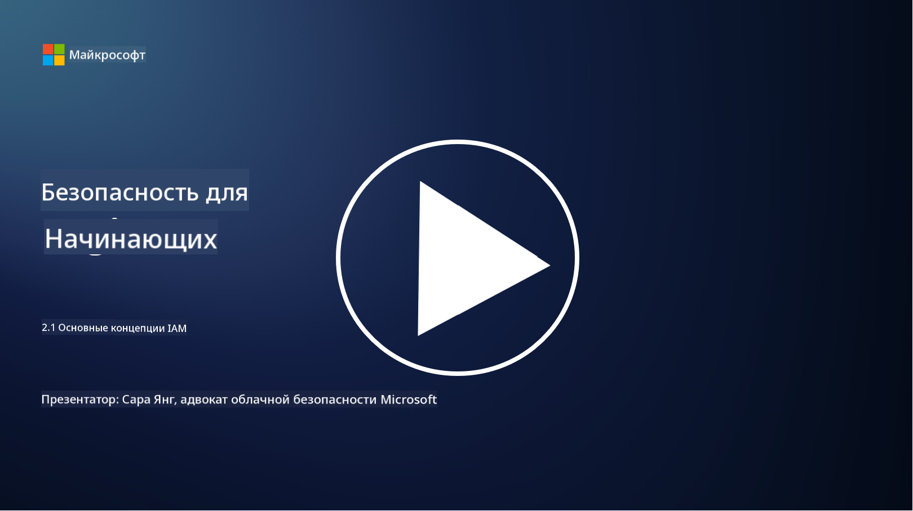

<!--
CO_OP_TRANSLATOR_METADATA:
{
  "original_hash": "2e3864e3d579f0dbb4ac2ec8c5f82acf",
  "translation_date": "2025-09-03T22:37:31+00:00",
  "source_file": "2.1 IAM key concepts.md",
  "language_code": "ru"
}
-->
# Основные концепции IAM

Вы когда-нибудь входили в компьютер или на сайт? Конечно, да! Это значит, что вы уже использовали средства управления идентификацией в повседневной жизни. Управление идентификацией и доступом (IAM) — это ключевой элемент безопасности, о котором мы узнаем больше в следующих уроках.

**Введение**

В этом уроке мы рассмотрим:

- Что мы подразумеваем под управлением идентификацией и доступом (IAM) в контексте кибербезопасности?

- Что такое принцип минимальных привилегий?

- Что такое разделение обязанностей?

- Что такое аутентификация и авторизация?

## Что мы подразумеваем под управлением идентификацией и доступом (IAM) в контексте кибербезопасности?

Управление идентификацией и доступом (IAM) — это набор процессов, технологий и политик, которые внедряются для обеспечения того, чтобы нужные люди имели соответствующий доступ к ресурсам в цифровой среде организации. IAM включает управление цифровыми идентификациями (пользователи, сотрудники, партнеры) и их доступом к системам, приложениям, данным и сетям. Основная цель IAM — повысить безопасность, упростить доступ пользователей и обеспечить соответствие организационным политикам и нормативным требованиям. Решения IAM обычно включают аутентификацию пользователей, авторизацию, предоставление идентификаций, контроль доступа и управление жизненным циклом пользователей (например, удаление учетных записей, которые больше не используются).

## Что такое принцип минимальных привилегий?

Принцип минимальных привилегий — это фундаментальная концепция, которая предполагает предоставление пользователям и системам только тех привилегий, которые необходимы для выполнения их задач или ролей. Этот принцип помогает ограничить потенциальный ущерб в случае нарушения безопасности или внутренней угрозы. Соблюдение принципа минимальных привилегий позволяет организациям уменьшить поверхность атаки и минимизировать риск несанкционированного доступа, утечек данных и случайного злоупотребления привилегиями. На практике это означает, что пользователям предоставляется доступ только к тем ресурсам и функциям, которые необходимы для выполнения их рабочих обязанностей, и не более того. Например, если вам нужно просто прочитать документ, предоставление вам полных административных прав на этот документ будет избыточным.

## Что такое разделение обязанностей?

Разделение обязанностей — это принцип, направленный на предотвращение конфликта интересов и снижение риска мошенничества и ошибок путем распределения критически важных задач и обязанностей между различными сотрудниками внутри организации. В контексте кибербезопасности разделение обязанностей предполагает, что ни один человек не должен иметь полный контроль над всеми аспектами критического процесса или системы. Цель состоит в создании системы проверок и балансов, которая предотвращает возможность выполнения одного человека как этапа настройки, так и этапа утверждения процесса. Например, в финансовых системах это может означать, что человек, который вводит транзакции в систему, не должен быть тем же человеком, который их утверждает. Это снижает риск несанкционированных или мошеннических действий, остающихся незамеченными.

## Что такое аутентификация и авторизация?

Аутентификация и авторизация — это два фундаментальных понятия в кибербезопасности, которые играют ключевую роль в обеспечении безопасности и целостности компьютерных систем и данных. Они часто используются вместе для контроля доступа к ресурсам и защиты конфиденциальной информации.

**1. Аутентификация**: Аутентификация — это процесс проверки личности пользователя, системы или сущности, пытающейся получить доступ к компьютерной системе или конкретному ресурсу. Она гарантирует, что заявленная личность является подлинной и точной. Методы аутентификации обычно включают использование одного или нескольких из следующих факторов:

   a. Что-то, что вы знаете: Это включает пароли, PIN-коды или другие секретные знания, которые должны быть известны только авторизованному пользователю.

   b. Что-то, что у вас есть: Это включает физические токены или устройства, такие как смарт-карты, токены безопасности или мобильные телефоны, используемые для подтверждения личности пользователя.

   c. Что-то, чем вы являетесь: Это относится к биометрическим факторам, таким как отпечатки пальцев, распознавание лица или сканирование сетчатки, которые уникальны для каждого человека.

Механизмы аутентификации используются для подтверждения того, что пользователь является тем, за кого себя выдает, прежде чем предоставить доступ к системе или ресурсу. Это помогает предотвратить несанкционированный доступ и гарантирует, что только легитимные пользователи могут выполнять действия в системе.

**2. Авторизация**: Авторизация — это процесс предоставления или отказа в конкретных разрешениях и привилегиях аутентифицированным пользователям или сущностям после проверки их личности. Она определяет, какие действия или операции пользователь может выполнять в системе или с конкретными ресурсами. Авторизация часто основывается на заранее определенных политиках, правилах контроля доступа и ролях, назначенных пользователям.

Авторизацию можно представить как ответ на вопрос: "Что может делать аутентифицированный пользователь?" Она включает определение и применение политик контроля доступа для защиты конфиденциальных данных и ресурсов от несанкционированного доступа или изменения.

**Вкратце:**

- Аутентификация устанавливает личность пользователей или сущностей.
- Авторизация определяет, какие действия и ресурсы аутентифицированные пользователи могут использовать или изменять.

## Дополнительные материалы

- [Describe identity concepts - Training | Microsoft Learn](https://learn.microsoft.com/training/modules/describe-identity-principles-concepts/?WT.mc_id=academic-96948-sayoung)
- [Introduction to identity - Microsoft Entra | Microsoft Learn](https://learn.microsoft.com/azure/active-directory/fundamentals/identity-fundamental-concepts?WT.mc_id=academic-96948-sayoung)
- [What is Identity Access Management (IAM)? | Microsoft Security](https://www.microsoft.com/security/business/security-101/what-is-identity-access-management-iam?WT.mc_id=academic-96948-sayoung)
- [What is IAM? Identity and access management explained | CSO Online](https://www.csoonline.com/article/518296/what-is-iam-identity-and-access-management-explained.html)
- [What is IAM? (auth0.com)](https://auth0.com/blog/what-is-iam/)
- [Security+: implementing Identity and Access Management (IAM) controls [updated 2021] | Infosec (infosecinstitute.com)](https://resources.infosecinstitute.com/certifications/securityplus/security-implementing-identity-and-access-management-iam-controls/)
- [least privilege - Glossary | CSRC (nist.gov)](https://csrc.nist.gov/glossary/term/least_privilege)
- [Security: The Principle of Least Privilege (POLP) - Microsoft Community Hub](https://techcommunity.microsoft.com/t5/azure-sql-blog/security-the-principle-of-least-privilege-polp/ba-p/2067390?WT.mc_id=academic-96948-sayoung)
- [Principle of least privilege | CERT NZ](https://www.cert.govt.nz/it-specialists/critical-controls/principle-of-least-privilege/)
- [Why is separation of duties required by NIST 800-171 and CMMC? - (totem.tech)](https://www.totem.tech/cmmc-separation-of-duties/)

---

**Отказ от ответственности**:  
Этот документ был переведен с помощью сервиса автоматического перевода [Co-op Translator](https://github.com/Azure/co-op-translator). Хотя мы стремимся к точности, пожалуйста, учитывайте, что автоматические переводы могут содержать ошибки или неточности. Оригинальный документ на его исходном языке следует считать авторитетным источником. Для получения критически важной информации рекомендуется профессиональный перевод человеком. Мы не несем ответственности за любые недоразумения или неправильные интерпретации, возникшие в результате использования данного перевода.