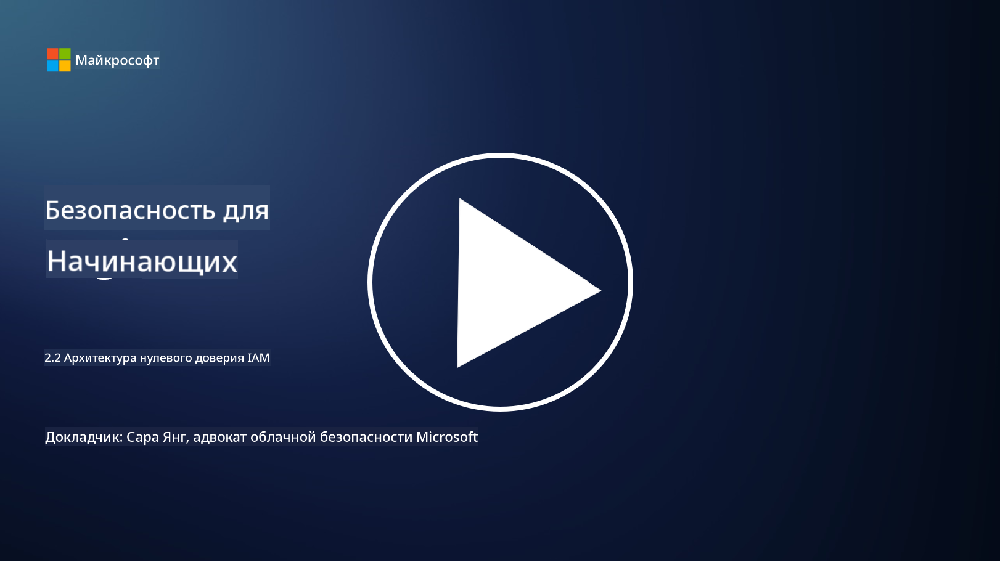

<!--
CO_OP_TRANSLATOR_METADATA:
{
  "original_hash": "4774a978af123f72ebb872199c4c4d4f",
  "translation_date": "2025-09-03T23:38:53+00:00",
  "source_file": "2.2 IAM zero trust architecture.md",
  "language_code": "ru"
}
-->
# Архитектура нулевого доверия в IAM

Идентификация является ключевым элементом при внедрении архитектуры нулевого доверия и создании периметра для любой IT-среды. В этом разделе мы рассмотрим, почему важно использовать контроль идентификации для реализации нулевого доверия.

## Введение

В этом уроке мы рассмотрим:

- Почему важно использовать идентификацию в качестве периметра в современных IT-средах?

- Чем это отличается от традиционных IT-архитектур?

- Как идентификация используется для реализации архитектуры нулевого доверия?

## Почему важно использовать идентификацию в качестве периметра в современных IT-средах?

В современных IT-средах традиционная концепция физического периметра (с использованием таких инструментов, как межсетевые экраны и сетевые границы) как основного средства защиты от киберугроз становится менее эффективной из-за растущей сложности технологий, увеличения удаленной работы и внедрения облачных сервисов. Вместо этого организации переходят к использованию идентификации в качестве нового периметра. Это означает, что безопасность сосредоточена на проверке и управлении идентификацией пользователей, устройств и приложений, пытающихся получить доступ к ресурсам, независимо от их физического местоположения.

Вот почему использование идентификации в качестве периметра важно в современных IT-средах:

**Удаленная работа**: С ростом удаленной работы и использования мобильных устройств пользователи могут получать доступ к ресурсам из различных мест и с разных устройств. Традиционный подход к периметру не работает, когда пользователи больше не ограничены физическим офисом.

**Облачные и гибридные среды**: Организации все чаще внедряют облачные сервисы и гибридные среды. Данные и приложения больше не находятся исключительно в пределах организации, что делает традиционные периметры менее актуальными.

**Безопасность нулевого доверия**: Концепция безопасности нулевого доверия предполагает, что ни одному объекту, будь то внутри или вне сети, нельзя автоматически доверять. Идентификация становится основой для проверки запросов на доступ, независимо от их происхождения.

**Угрозы**: Киберугрозы развиваются, и злоумышленники находят способы обхода традиционных периметров. Фишинг, социальная инженерия и внутренние угрозы часто эксплуатируют человеческие слабости, а не пытаются прорвать сетевые границы.

**Подход, ориентированный на данные**: Защита конфиденциальных данных имеет первостепенное значение. Сосредоточившись на идентификации, организации могут контролировать, кто получает доступ к каким данным, снижая риск утечек.

## Чем это отличается от традиционных IT-архитектур?

Традиционные IT-архитектуры сильно опирались на модели безопасности, основанные на периметре, где межсетевые экраны и сетевые границы играли важную роль в защите от угроз. Основные различия между традиционным и подходом, ориентированным на идентификацию, заключаются в следующем:

|      Аспект                |      Традиционные IT-архитектуры                                                                  |      Подход, ориентированный на идентификацию                                                              |
|-----------------------------|----------------------------------------------------------------------------------------------------|------------------------------------------------------------------------------------------------------------|
|     Фокус                  |     Фокус на периметре: Опора на защиту периметра, такую как межсетевые экраны и контроль доступа. |     Фокус на проверке идентификации: Переход от сетевых границ к проверке идентификации пользователей/устройств. |
|     Локация                |     Зависимость от местоположения: Безопасность привязана к физическим офисам и сетевым границам.  |     Независимость от местоположения: Безопасность не привязана к конкретным местам; доступ возможен откуда угодно. |
|     Предположение о доверии|     Предполагаемое доверие: Доверие внутри сетевого периметра для пользователей/устройств.         |     Подход нулевого доверия: Доверие никогда не предполагается; доступ проверяется на основе идентификации и контекста. |
|     Учет устройств         |     Разнообразие устройств: Предполагается, что устройства внутри сетевого периметра безопасны.    |     Учет устройств: Учитывается состояние и безопасность устройства, независимо от местоположения.          |
|     Защита данных          |     Защита данных: Сосредоточена на защите сетевых периметров для защиты данных.                   |     Ориентация на данные: Сосредоточена на контроле доступа к данным на основе идентификации и чувствительности данных. |

## Как идентификация используется для реализации архитектуры нулевого доверия?

В архитектуре нулевого доверия основным принципом является никогда не доверять автоматически ни одному объекту, независимо от того, находится он внутри или вне сетевого периметра. Идентификация играет центральную роль в реализации подхода нулевого доверия, обеспечивая постоянную проверку объектов, пытающихся получить доступ к ресурсам. Современные средства безопасности идентификации позволяют каждому пользователю, устройству, приложению и сервису, запрашивающему доступ к ресурсам, быть тщательно идентифицированным и аутентифицированным перед предоставлением доступа. Это включает проверку их цифровой идентификации с использованием таких методов, как комбинации имени пользователя и пароля, многофакторная аутентификация (MFA), биометрия и другие надежные механизмы аутентификации.

## Дополнительные материалы

- [Securing identity with Zero Trust | Microsoft Learn](https://learn.microsoft.com/security/zero-trust/deploy/identity?WT.mc_id=academic-96948-sayoung)
- [Zero Trust Principles and Guidance for Identity and Access | CSA (cloudsecurityalliance.org)](https://cloudsecurityalliance.org/artifacts/zero-trust-principles-and-guidance-for-iam/)
- [Zero Trust Identity Controls - Essentials Series - Episode 2 - YouTube](https://www.youtube.com/watch?v=fQZQznIKcGM&list=PLXtHYVsvn_b_gtX1-NB62wNervQx1Fhp4&index=13)

---

**Отказ от ответственности**:  
Этот документ был переведен с помощью сервиса автоматического перевода [Co-op Translator](https://github.com/Azure/co-op-translator). Хотя мы стремимся к точности, пожалуйста, учитывайте, что автоматические переводы могут содержать ошибки или неточности. Оригинальный документ на его исходном языке следует считать авторитетным источником. Для получения критически важной информации рекомендуется профессиональный перевод человеком. Мы не несем ответственности за любые недоразумения или неправильные интерпретации, возникшие в результате использования данного перевода.