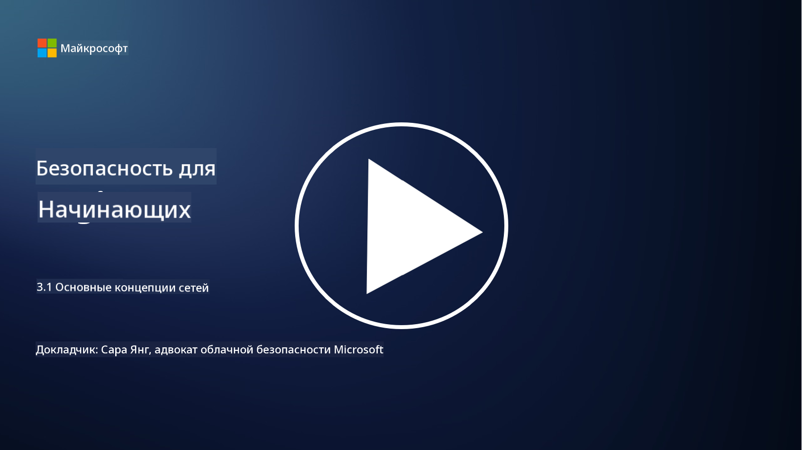
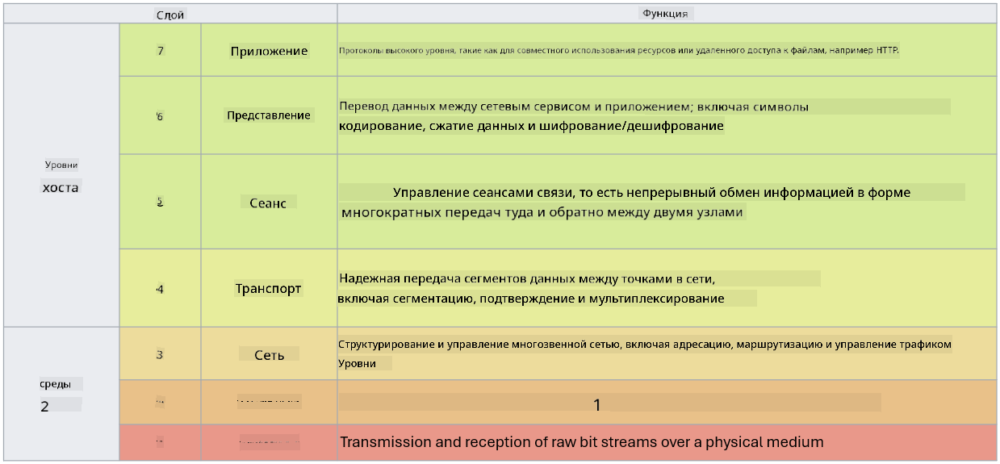

<!--
CO_OP_TRANSLATOR_METADATA:
{
  "original_hash": "252724eceeb183fb9018f88c5e1a3f0c",
  "translation_date": "2025-09-04T01:42:54+00:00",
  "source_file": "3.1 Networking key concepts.md",
  "language_code": "ru"
}
-->
# Основные концепции сетей

Если вы когда-либо работали в сфере ИТ, то, скорее всего, сталкивались с концепциями сетей. Хотя в современных средах мы используем идентификацию как основной способ контроля периметра, это не означает, что сетевые средства контроля утратили свою актуальность. Несмотря на обширность этой темы, в этом уроке мы рассмотрим ключевые концепции сетей.

В этом уроке мы обсудим:

- Что такое IP-адресация?
  
- Что такое модель OSI?

- Что такое TCP/UDP?

- Что такое номера портов?

- Что такое шифрование данных в состоянии покоя и при передаче?

## Что такое IP-адресация?

IP-адресация, или адресация по протоколу интернета, представляет собой числовую метку, присваиваемую каждому устройству, подключенному к компьютерной сети, использующей протокол интернета для связи. Она служит уникальным идентификатором устройств в сети, позволяя им отправлять и получать данные через интернет или другие взаимосвязанные сети. Существует две основные версии IP-адресации: IPv4 (версия 4) и IPv6 (версия 6). IP-адрес обычно представлен в формате IPv4 (например, 192.168.1.1) или IPv6 (например, 2001:0db8:85a3:0000:0000:8a2e:0370:7334).

## Что такое модель OSI?

Модель OSI (Open Systems Interconnection) — это концептуальная структура, которая стандартизирует функции коммуникационной системы на семь отдельных уровней. Каждый уровень выполняет определенные задачи и взаимодействует с соседними уровнями, чтобы обеспечить эффективную и надежную передачу данных между устройствами в сети. Уровни, начиная с нижнего, следующие:

1. Физический уровень

2. Канальный уровень

3. Сетевой уровень

4. Транспортный уровень

5. Сеансовый уровень

6. Уровень представления

7. Прикладной уровень

Модель OSI предоставляет общий ориентир для понимания того, как взаимодействуют сетевые протоколы и технологии, независимо от конкретных аппаратных или программных реализаций.

  
_ref: https://en.wikipedia.org/wiki/OSI_model_

## Что такое TCP/UDP?

TCP (Transmission Control Protocol) и UDP (User Datagram Protocol) — это два основных протокола транспортного уровня, используемых в компьютерных сетях для обеспечения связи между устройствами через интернет или в локальной сети. Они отвечают за разбиение данных на пакеты для передачи и последующую сборку этих пакетов в исходные данные на принимающей стороне. Однако они различаются по своим характеристикам и областям применения.

**TCP (Transmission Control Protocol):**

TCP — это протокол с установлением соединения, который обеспечивает надежную и упорядоченную доставку данных между устройствами. Он устанавливает соединение между отправителем и получателем перед началом обмена данными. TCP гарантирует, что пакеты данных будут доставлены в правильном порядке, и может повторно отправлять потерянные пакеты, чтобы обеспечить целостность и полноту данных. Это делает TCP подходящим для приложений, требующих надежной передачи данных, таких как веб-серфинг, электронная почта, передача файлов (FTP) и работа с базами данных.

**UDP (User Datagram Protocol):**

UDP — это протокол без установления соединения, который обеспечивает более быструю передачу данных, но не гарантирует такой же надежности, как TCP. Он не устанавливает формального соединения перед отправкой данных и не включает механизмы подтверждения или повторной отправки потерянных пакетов. UDP подходит для приложений, где скорость и эффективность важнее гарантированной доставки, таких как голосовая связь в реальном времени, потоковое мультимедиа, онлайн-игры и DNS-запросы.

Вкратце, TCP приоритетно обеспечивает надежность и упорядоченную доставку, что делает его подходящим для приложений, требующих точности данных, тогда как UDP акцентируется на скорости и эффективности, что делает его подходящим для приложений, где допустимы незначительные потери данных или изменение порядка в обмен на снижение задержки. Выбор между TCP и UDP зависит от конкретных требований приложения или сервиса.

## Что такое номера портов?

В сетях номер порта — это числовой идентификатор, используемый для различения различных сервисов или приложений, работающих на одном устройстве в сети. Порты помогают направлять входящие данные к соответствующему приложению. Номера портов представляют собой 16-битные целые числа без знака, что означает, что они варьируются от 0 до 65535. Они делятся на три диапазона:

- Известные порты (0-1023): Зарезервированы для стандартных сервисов, таких как HTTP (порт 80) и FTP (порт 21).

- Зарегистрированные порты (1024-49151): Используются для приложений и сервисов, которые не входят в диапазон известных портов, но официально зарегистрированы.

- Динамические/частные порты (49152-65535): Доступны для временного или частного использования приложениями.

## Что такое шифрование данных в состоянии покоя и при передаче?

Шифрование — это процесс преобразования данных в защищенный формат для защиты от несанкционированного доступа или изменений. Шифрование может применяться как к данным "в состоянии покоя" (хранящимся на устройстве или сервере), так и к данным "при передаче" (передаваемым между устройствами или через сети).

Шифрование в состоянии покоя: Это включает шифрование данных, хранящихся на устройствах, серверах или системах хранения. Даже если злоумышленник получит физический доступ к носителю данных, он не сможет получить доступ к данным без ключей шифрования. Это важно для защиты конфиденциальных данных в случае кражи устройства, утечек данных или несанкционированного доступа.

Шифрование при передаче: Это включает шифрование данных во время их передачи между устройствами или через сети. Это предотвращает подслушивание и несанкционированное перехватывание данных во время передачи. Общие протоколы для шифрования при передаче включают HTTPS для веб-коммуникации и TLS/SSL для защиты различных типов сетевого трафика.

## Дополнительные материалы
- [How Do IP Addresses Work? (howtogeek.com)](https://www.howtogeek.com/341307/how-do-ip-addresses-work/)  
- [Understanding IP Address: An Introductory Guide (geekflare.com)](https://geekflare.com/understanding-ip-address/)  
- [What is the OSI model? The 7 layers of OSI explained (techtarget.com)](https://www.techtarget.com/searchnetworking/definition/OSI)  
- [The OSI Model – The 7 Layers of Networking Explained in Plain English (freecodecamp.org)](https://www.freecodecamp.org/news/osi-model-networking-layers-explained-in-plain-english/)  
- [TCP/IP protocols - IBM Documentation](https://www.ibm.com/docs/en/aix/7.3?topic=protocol-tcpip-protocols)  
- [Common Ports Cheat Sheet: The Ultimate Ports & Protocols List (stationx.net)](https://www.stationx.net/common-ports-cheat-sheet/)  
- [Azure Data Encryption-at-Rest - Azure Security | Microsoft Learn](https://learn.microsoft.com/azure/security/fundamentals/encryption-atrest?WT.mc_id=academic-96948-sayoung)  

---

**Отказ от ответственности**:  
Этот документ был переведен с использованием сервиса автоматического перевода [Co-op Translator](https://github.com/Azure/co-op-translator). Хотя мы стремимся к точности, пожалуйста, имейте в виду, что автоматические переводы могут содержать ошибки или неточности. Оригинальный документ на его исходном языке следует считать авторитетным источником. Для получения критически важной информации рекомендуется профессиональный перевод человеком. Мы не несем ответственности за любые недоразумения или неправильные толкования, возникшие в результате использования данного перевода.