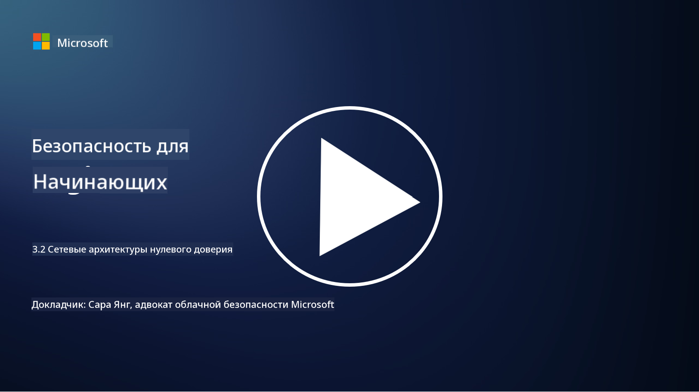

<!--
CO_OP_TRANSLATOR_METADATA:
{
  "original_hash": "680d6e14d9d33fc471c22f44679713f8",
  "translation_date": "2025-09-04T00:35:30+00:00",
  "source_file": "3.2 Networking zero trust architecture.md",
  "language_code": "ru"
}
-->
# Сетевые архитектуры нулевого доверия

Сеть играет ключевую роль в реализации принципов нулевого доверия. В этом уроке мы узнаем больше о следующих темах:

- Что такое сегментация сети?  
- Как сегментация сети помогает внедрить нулевое доверие?  
- Что такое сквозное шифрование?

## Что такое сегментация сети?

Сегментация сети — это практика разделения сети на более мелкие, изолированные сегменты или подсети. Каждый сегмент изолирован от других, а доступ между сегментами контролируется и ограничивается на основе определенных политик безопасности. Сегментация сети используется для повышения безопасности, ограничивая последствия потенциальных нарушений и уменьшая возможность бокового перемещения злоумышленников внутри сети.

С помощью сегментации сети организация может создавать "зоны", которые разделяют различные типы пользователей, приложений и данных. Это уменьшает поверхность атаки и минимизирует потенциальный ущерб, вызванный инцидентом безопасности. Сегментация сети может быть реализована с помощью таких технологий, как виртуальные локальные сети (VLAN), межсетевые экраны и средства контроля доступа.

## Как сегментация сети помогает внедрить нулевое доверие?

Сегментация сети тесно связана с принципами модели нулевого доверия. В архитектуре нулевого доверия сегментация сети помогает реализовать принцип "минимально необходимого доступа", гарантируя, что пользователи и устройства имеют доступ только к тем ресурсам и сервисам, которые необходимы для выполнения их задач. Разделяя сеть на более мелкие зоны, организации могут внедрять строгие средства контроля доступа, изолировать критически важные активы и предотвращать боковое перемещение злоумышленников.

Сегментация сети также способствует внедрению контроля доступа на основе идентификации, где пользователи и устройства проходят тщательную аутентификацию и авторизацию перед доступом к определенным сегментам. Это предотвращает несанкционированный доступ к конфиденциальным ресурсам и снижает потенциальные риски, связанные с компрометацией учетных данных.

## Что такое сквозное шифрование?

Сквозное (E2E) шифрование — это мера безопасности, которая гарантирует, что данные остаются зашифрованными на протяжении всего пути от отправителя до получателя. В этом процессе данные шифруются на стороне отправителя, и только получатель обладает ключом расшифровки, чтобы разблокировать и прочитать данные. Процессы шифрования и расшифровки происходят на конечных точках, что делает практически невозможным доступ к данным для несанкционированных сторон, включая поставщиков услуг и посредников.

Сквозное шифрование обеспечивает высокий уровень конфиденциальности и безопасности передачи данных, даже если данные проходят через различные промежуточные системы или сети. Оно широко используется в защищенных приложениях для обмена сообщениями, сервисах электронной почты и других платформах связи для защиты конфиденциальной информации от перехвата и несанкционированного доступа.

Этот метод шифрования гарантирует, что даже если злоумышленники получат доступ к данным в процессе передачи, они увидят только зашифрованный контент, который не имеет смысла без ключа расшифровки. Сквозное шифрование играет важную роль в защите конфиденциальности пользователей и предотвращении утечки конфиденциальной информации.

## Что такое SASE?

SASE расшифровывается как "Secure Access Service Edge" (Безопасный доступ на границе сервиса) и представляет собой архитектуру и концепцию кибербезопасности, которая объединяет функции сетевой безопасности и широкомасштабной сети (WAN) в единую облачную услугу. SASE предназначен для обеспечения безопасного и масштабируемого доступа к сетевым ресурсам, приложениям и данным для удаленных и мобильных пользователей, упрощая управление сетью и снижая сложность традиционных сетевых и защитных архитектур.

Ключевые характеристики и компоненты SASE:

1. **Облачная основа:** SASE предоставляется как облачная услуга, что означает, что функции безопасности и сетевые возможности реализуются из облака, а не через традиционное локальное оборудование и устройства.  

2. **Интеграция безопасности и сетевых функций:** SASE объединяет различные сервисы безопасности, такие как защищенные веб-шлюзы (SWG), межсетевой экран как услуга (FWaaS), предотвращение утечек данных (DLP), доступ к сети с нулевым доверием (ZTNA) и оптимизация WAN, с возможностями широкомасштабной сети. Эта интеграция помогает упростить операции безопасности и сетевого управления.  

3. **Нулевое доверие:** SASE работает на основе принципа нулевого доверия, что означает строгий контроль доступа и политики минимально необходимого доступа. Пользователи и устройства не доверяются по умолчанию, и они должны пройти аутентификацию и авторизацию перед доступом к ресурсам.  

4. **Ориентация на идентификацию:** SASE фокусируется на идентификации пользователей и устройств как основе для контроля доступа. Политики на основе идентификации и контекста используются для определения разрешений на доступ, и эти политики динамически адаптируются в зависимости от поведения пользователя и контекста.  

5. **Масштабируемость и гибкость:** SASE легко масштабируется для поддержки большого количества пользователей и устройств, что делает его подходящим для организаций с разнообразными и изменяющимися потребностями в области сетей и безопасности.  

SASE особенно актуален в современную эпоху удаленной работы и облачных технологий, так как он предоставляет комплексный и гибкий подход к обеспечению безопасности и управлению доступом к сети. Он помогает организациям адаптироваться к изменяющимся требованиям безопасности и сетевого управления, сохраняя при этом сильный акцент на модели безопасности, ориентированной на пользователя и нулевое доверие.

## Дополнительные материалы

- [Что такое сегментация сети? - Cisco](https://www.cisco.com/c/en/us/products/security/what-is-network-segmentation.html#~benefits)  
- [Что такое микросегментация? - Cisco](https://www.cisco.com/c/en/us/products/security/what-is-microsegmentation.html)  
- [Реализация сегментации и разделения сети | Cyber.gov.au](https://www.cyber.gov.au/resources-business-and-government/maintaining-devices-and-systems/system-hardening-and-administration/network-hardening/implementing-network-segmentation-and-segregation)  
- [Что такое сегментация сети и почему это важно | CompTIA](https://www.comptia.org/blog/security-awareness-training-network-segmentation)  
- [Сегментация сети: концепции и практики (cmu.edu)](https://insights.sei.cmu.edu/blog/network-segmentation-concepts-and-practices/)  
- [Защита сетей с помощью нулевого доверия | Microsoft Learn](https://learn.microsoft.com/security/zero-trust/deploy/networks?WT.mc_id=academic-96948-sayoung)  
- [Что такое сквозное шифрование? | IBM](https://www.ibm.com/topics/end-to-end-encryption)  
- [Что такое сквозное шифрование и почему оно важно? (howtogeek.com)](https://www.howtogeek.com/711656/what-is-end-to-end-encryption-and-why-does-it-matter/)  
- [Определение Secure Access Service Edge (SASE) - Gartner Information Technology Glossary](https://www.gartner.com/en/information-technology/glossary/secure-access-service-edge-sase)  
- [Что такое Secure Access Service Edge (SASE)? | Microsoft Security](https://www.microsoft.com/security/business/security-101/what-is-sase?WT.mc_id=academic-96948-sayoung)  

---

**Отказ от ответственности**:  
Этот документ был переведен с помощью сервиса автоматического перевода [Co-op Translator](https://github.com/Azure/co-op-translator). Хотя мы стремимся к точности, пожалуйста, имейте в виду, что автоматические переводы могут содержать ошибки или неточности. Оригинальный документ на его исходном языке следует считать авторитетным источником. Для получения критически важной информации рекомендуется профессиональный перевод человеком. Мы не несем ответственности за любые недоразумения или неправильные интерпретации, возникшие в результате использования данного перевода.