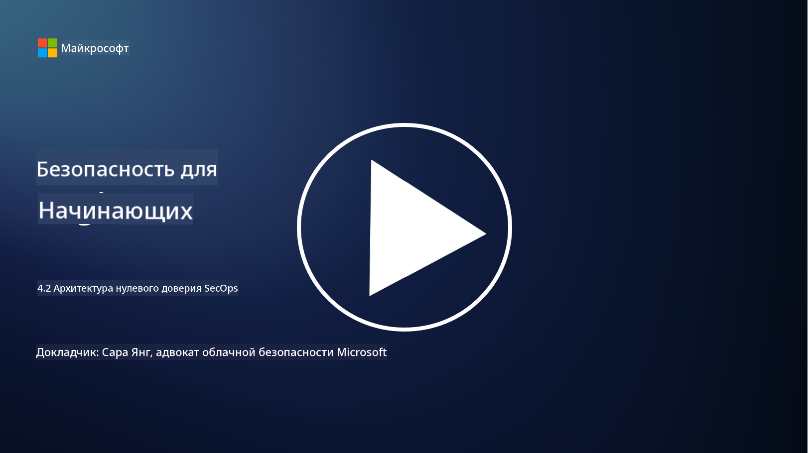

<!--
CO_OP_TRANSLATOR_METADATA:
{
  "original_hash": "45bbdc114e70936816b0b3e7c40189cf",
  "translation_date": "2025-09-04T00:43:10+00:00",
  "source_file": "4.2 SecOps zero trust architecture.md",
  "language_code": "ru"
}
-->
# Архитектура нулевого доверия в SecOps

Операции безопасности составляют две части архитектуры нулевого доверия, и в этом уроке мы рассмотрим обе:

- Как должна быть построена IT-архитектура для обеспечения централизованного сбора логов?

- Какие лучшие практики существуют для операций безопасности в современных IT-средах?

## Как должна быть построена IT-архитектура для обеспечения централизованного сбора логов?

Централизованный сбор логов — это ключевой компонент современных операций безопасности. Он позволяет организациям собирать логи и данные из различных источников, таких как серверы, приложения, сетевые устройства и инструменты безопасности, в центральное хранилище для анализа, мониторинга и реагирования на инциденты. Вот несколько лучших практик для построения IT-архитектуры, поддерживающей централизованный сбор логов:

1. **Интеграция источников логов**:

- Убедитесь, что все соответствующие устройства и системы настроены на генерацию логов. Это включает серверы, межсетевые экраны, маршрутизаторы, коммутаторы, приложения и устройства безопасности.

- Настройте источники логов на передачу данных в централизованный сборщик или систему управления логами.

2. **Выбор подходящего инструмента SIEM (Security Information and Event Management)**:

- Выберите решение SIEM, которое соответствует потребностям и масштабу вашей организации.

- Убедитесь, что выбранное решение поддерживает сбор, агрегирование, анализ и отчетность логов.

3. **Масштабируемость и резервирование**:

- Спроектируйте архитектуру с учетом масштабируемости для поддержки увеличения числа источников логов и объема данных.

- Реализуйте резервирование для обеспечения высокой доступности и предотвращения сбоев из-за отказа оборудования или сети.

4. **Безопасная передача логов**:

- Используйте защищенные протоколы, такие как TLS/SSL или IPsec, для передачи логов от источников в центральное хранилище.

- Реализуйте аутентификацию и контроль доступа, чтобы только авторизованные устройства могли отправлять логи.

5. **Нормализация**:

- Стандартизируйте форматы логов и нормализуйте данные для обеспечения их согласованности и удобства анализа.

6. **Хранение и удержание**:

- Определите подходящий срок хранения логов в соответствии с требованиями безопасности и соблюдения нормативов.

- Храните логи в защищенном виде, предотвращая несанкционированный доступ и подделку.

## Какие лучшие практики существуют для операций безопасности в современных IT-средах?

Помимо централизованного сбора логов, вот несколько лучших практик для операций безопасности в современных IT-средах:

1. **Непрерывный мониторинг**: Реализуйте непрерывный мониторинг сетевой и системной активности для обнаружения и реагирования на угрозы в реальном времени.

2. **Информация о угрозах**: Оставайтесь в курсе новых угроз и уязвимостей, используя источники и сервисы информации о угрозах.

3. **Обучение пользователей**: Проводите регулярное обучение сотрудников по вопросам безопасности, чтобы снизить риски, связанные с социальной инженерией и фишинг-атаками.

4. **План реагирования на инциденты**: Разработайте и протестируйте план реагирования на инциденты для обеспечения быстрого и эффективного реагирования на угрозы.

5. **Автоматизация безопасности**: Используйте инструменты автоматизации и оркестрации безопасности для упрощения реагирования на инциденты и выполнения повторяющихся задач.

6. **Резервное копирование и восстановление**: Реализуйте надежные решения для резервного копирования и восстановления данных, чтобы обеспечить их доступность в случае потери данных или атак программ-вымогателей.

## Дополнительные материалы

- [Модуль лучших практик безопасности Microsoft: Операции безопасности | Microsoft Learn](https://learn.microsoft.com/security/operations/security-operations-videos-and-decks?WT.mc_id=academic-96948-sayoung)
- [Операции безопасности - Cloud Adoption Framework | Microsoft Learn](https://learn.microsoft.com/azure/cloud-adoption-framework/secure/security-operations?WT.mc_id=academic-96948-sayoung)
- [Что такое архитектура платформы операций и аналитики безопасности? Определение SOAPA, как это работает, преимущества и многое другое (digitalguardian.com)](https://www.digitalguardian.com/blog/what-security-operations-and-analytics-platform-architecture-definition-soapa-how-it-works#:~:text=All%20in%20all%2C%20security%20operations%20and%20analytics%20platform,become%20more%20efficient%20and%20operative%20with%20your%20security.)

---

**Отказ от ответственности**:  
Этот документ был переведен с помощью сервиса автоматического перевода [Co-op Translator](https://github.com/Azure/co-op-translator). Хотя мы стремимся к точности, пожалуйста, имейте в виду, что автоматические переводы могут содержать ошибки или неточности. Оригинальный документ на его исходном языке следует считать авторитетным источником. Для получения критически важной информации рекомендуется профессиональный перевод человеком. Мы не несем ответственности за любые недоразумения или неправильные толкования, возникшие в результате использования данного перевода.