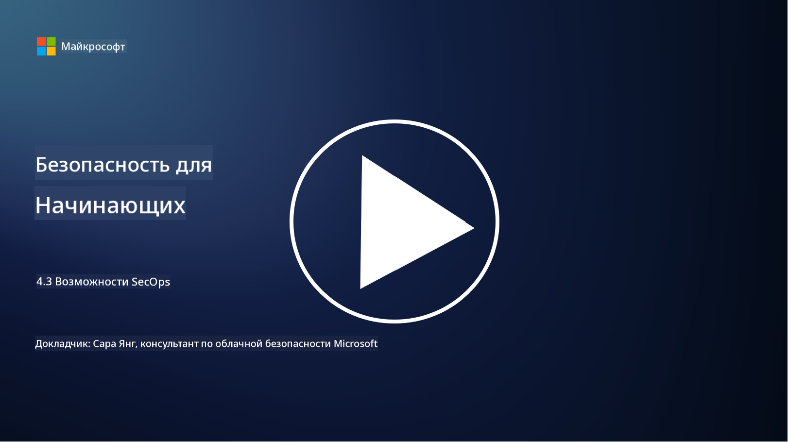

<!--
CO_OP_TRANSLATOR_METADATA:
{
  "original_hash": "553eb694c89f1caca0694e8d8ab89e0e",
  "translation_date": "2025-09-04T01:15:42+00:00",
  "source_file": "4.3 SecOps capabilities.md",
  "language_code": "ru"
}
-->
# Возможности SecOps

В этом разделе мы рассмотрим более подробно основные инструменты и возможности, которые можно использовать в операциях безопасности.

В этом уроке мы обсудим:

- Что такое инструмент управления информацией и событиями безопасности (SIEM)?

- Что такое XDR?

- Какие возможности можно использовать для улучшения операций безопасности?

## Что такое инструмент управления информацией и событиями безопасности (SIEM)?

Инструмент управления информацией и событиями безопасности (SIEM) используется для анализа оповещений о безопасности, которые генерируются в ИТ-среде организации. Он собирает, агрегирует, коррелирует и анализирует данные журналов и события безопасности из различных источников, таких как сетевые устройства, серверы, приложения и системы безопасности.

Основные функции и возможности инструментов SIEM включают:

1. **Сбор журналов**: Инструменты SIEM собирают журналы и данные о событиях безопасности из широкого спектра устройств, систем и приложений, включая межсетевые экраны, системы обнаружения вторжений, антивирусное программное обеспечение и другие.

2. **Нормализация данных**: Они нормализуют данные журналов в общий формат для упрощения анализа и корреляции.

3. **Корреляция событий**: Инструменты SIEM коррелируют события для выявления шаблонов и аномалий, которые могут указывать на инциденты безопасности или угрозы.

4. **Оповещения и уведомления**: SIEM генерирует оповещения и уведомления в реальном времени при обнаружении подозрительных действий или нарушений безопасности, что позволяет оперативно реагировать.

5. **Обнаружение инцидентов**: Они помогают обнаруживать инциденты безопасности, включая несанкционированный доступ, утечки данных, заражения вредоносным ПО и внутренние угрозы.

6. **Аналитика поведения пользователей и объектов (UEBA)**: Некоторые инструменты SIEM включают возможности UEBA для выявления аномального поведения пользователей и объектов, которое может указывать на компрометированные учетные записи или внутренние угрозы.

7. **Интеграция с данными о угрозах**: SIEM может интегрироваться с источниками данных о угрозах для улучшения обнаружения угроз путем сравнения известных индикаторов компрометации (IOC) с сетевой активностью.

8. **Автоматизация и оркестрация**: Функции автоматизации позволяют SIEM автоматизировать ответы на распространенные инциденты безопасности, сокращая время реакции и ручные усилия.

9. **Панель управления и визуализация**: Они предоставляют панели управления и инструменты визуализации для мониторинга данных безопасности и создания пользовательских отчетов.

10. **Интеграция с другими инструментами безопасности**: SIEM часто интегрируется с другими инструментами и технологиями безопасности, такими как решения для обнаружения и реагирования на угрозы на конечных устройствах (EDR), чтобы обеспечить целостное представление о состоянии безопасности организации.

## Что такое XDR?

XDR (Extended Detection and Response) — это технология, которая расширяет возможности традиционного обнаружения и реагирования на угрозы на конечных устройствах (EDR) и объединяет их с более широкими данными о безопасности из различных источников, чтобы предоставить более полное представление о состоянии безопасности организации. XDR направлен на улучшение обнаружения угроз, реагирования на инциденты и общей безопасности, устраняя ограничения, связанные с использованием только EDR, SIEM или других отдельных инструментов безопасности.

Основные характеристики и компоненты XDR включают:

1. **Интеграция данных**: XDR интегрирует данные из множества источников, включая конечные устройства, сетевой трафик, облачные сервисы, электронную почту и другие. Этот комплексный сбор данных обеспечивает более широкий контекст для обнаружения и анализа угроз.

2. **Продвинутая аналитика**: XDR использует продвинутую аналитику, машинное обучение и поведенческий анализ для выявления и приоритизации угроз безопасности. Он ищет шаблоны и аномалии в интегрированных данных для обнаружения как известных, так и неизвестных угроз.

3. **Автоматическое обнаружение угроз**: XDR автоматизирует процесс обнаружения угроз и аномалий, коррелируя информацию из различных источников. Он может выявлять сложные цепочки атак, охватывающие несколько векторов.

4. **Расследование и реагирование на инциденты**: XDR предоставляет инструменты для расследования и реагирования на инциденты, помогая командам безопасности быстро оценивать масштаб и последствия инцидентов и принимать соответствующие меры.

5. **Интеграция данных о угрозах**: XDR интегрирует источники данных о угрозах для улучшения обнаружения угроз путем сравнения известных индикаторов компрометации (IOC) с активностью сети и конечных устройств.

6. **Единая консоль**: XDR обычно предлагает единую консоль или панель управления, где команды безопасности могут централизованно просматривать и управлять оповещениями и инцидентами из различных источников.

7. **Межплатформенное покрытие**: Решения XDR охватывают широкий спектр платформ, включая конечные устройства, серверы, облачные среды и мобильные устройства, что делает их подходящими для современных многоплатформенных ИТ-сред.

## Какие возможности можно использовать для улучшения операций безопасности?

Для улучшения операций безопасности организации могут использовать несколько возможностей, помимо инструментов SIEM:

1. **Машинное обучение и искусственный интеллект**: Внедрение продвинутой аналитики, машинного обучения и ИИ для обнаружения развивающихся угроз и автоматизации поиска угроз.

2. **Аналитика поведения пользователей и объектов (UEBA)**: Анализ поведения пользователей и объектов для выявления аномалий и внутренних угроз.

3. **Источники данных о угрозах**: Интеграция источников данных о угрозах для получения актуальной информации о последних угрозах и индикаторах компрометации.

4. **Оркестрация, автоматизация и реагирование на угрозы (SOAR)**: Внедрение платформ SOAR для автоматизации реагирования на инциденты и оптимизации рабочих процессов операций безопасности.

5. **Технологии обмана**: Развертывание технологий обмана для введения в заблуждение и обнаружения злоумышленников внутри сети.

## Дополнительные материалы

- [What is SIEM? | Microsoft Security](https://www.microsoft.com/security/business/security-101/what-is-siem?WT.mc_id=academic-96948-sayoung)
- [What Is SIEM? - Security Information and Event Management - Cisco](https://www.cisco.com/c/en/us/products/security/what-is-siem.html)
- [Security information and event management - Wikipedia](https://en.wikipedia.org/wiki/Security_information_and_event_management)
- [What Is XDR? | Microsoft Security](https://www.microsoft.com/security/business/security-101/what-is-xdr?WT.mc_id=academic-96948-sayoung)
- [XDR & XDR Security (kaspersky.com.au)](https://www.kaspersky.com.au/resource-center/definitions/what-is-xdr)
- [The Power of SecOps: Redefining Core Security Capabilities - The New Stack](https://thenewstack.io/the-power-of-secops-redefining-core-security-capabilities/)
- [Seven Steps to Improve Your Security Operations and Response (securityintelligence.com)](https://securityintelligence.com/seven-steps-to-improve-your-security-operations-and-response/)

---

**Отказ от ответственности**:  
Этот документ был переведен с помощью сервиса автоматического перевода [Co-op Translator](https://github.com/Azure/co-op-translator). Хотя мы стремимся к точности, пожалуйста, имейте в виду, что автоматические переводы могут содержать ошибки или неточности. Оригинальный документ на его исходном языке следует считать авторитетным источником. Для получения критически важной информации рекомендуется профессиональный перевод человеком. Мы не несем ответственности за любые недоразумения или неправильные интерпретации, возникшие в результате использования данного перевода.