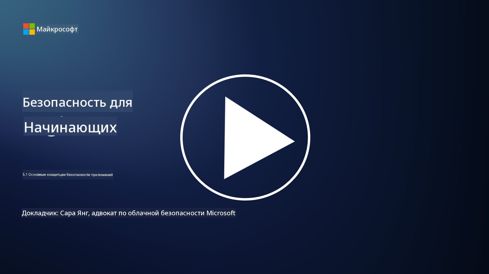

<!--
CO_OP_TRANSLATOR_METADATA:
{
  "original_hash": "e4b56bb23078d3ffb7ad407d280b0c36",
  "translation_date": "2025-09-04T00:30:25+00:00",
  "source_file": "5.1 AppSec key concepts.md",
  "language_code": "ru"
}
-->
# Основные концепции AppSec

Безопасность приложений — это отдельная область специализации в сфере безопасности. В этой части курса мы подробнее рассмотрим безопасность приложений.

## Введение

В этом уроке мы рассмотрим:

- Что такое безопасность приложений?

- Какие ключевые концепции/принципы лежат в основе безопасности приложений?

## Что такое безопасность приложений?

Безопасность приложений, часто сокращаемая как "AppSec", относится к практике защиты программных приложений от угроз безопасности, уязвимостей и атак. Она охватывает процессы, методы и инструменты, используемые для выявления, снижения и предотвращения рисков безопасности на протяжении всего жизненного цикла разработки, развертывания и поддержки приложения.

Безопасность приложений имеет критическое значение, поскольку приложения часто становятся целями кибератак. Злоумышленники используют уязвимости и слабые места в программном обеспечении, чтобы получить несанкционированный доступ, украсть данные, нарушить работу сервисов или выполнить другие вредоносные действия. Эффективная безопасность приложений помогает обеспечить конфиденциальность, целостность и доступность приложения и связанных с ним данных.

## Какие ключевые концепции/принципы лежат в основе безопасности приложений?

Ключевые концепции и принципы, лежащие в основе безопасности приложений, включают:

1. **Безопасность по умолчанию**:

- Безопасность должна быть интегрирована в дизайн и архитектуру приложения с самого начала, а не добавляться впоследствии.

2. **Валидация ввода**:

- Все пользовательские данные должны быть проверены, чтобы убедиться, что они соответствуют ожидаемым форматам и не содержат вредоносного кода или данных.

3. **Кодирование вывода**:

- Данные, отправляемые клиенту, должны быть правильно закодированы, чтобы предотвратить уязвимости, такие как межсайтовый скриптинг (XSS).

4. **Аутентификация и авторизация**:

- Аутентифицируйте пользователей и предоставляйте доступ к ресурсам на основе их ролей и разрешений.

5. **Защита данных**:

- Конфиденциальные данные должны быть зашифрованы при хранении, передаче и обработке, чтобы предотвратить несанкционированный доступ.

6. **Управление сессиями**:

- Безопасное управление сессиями защищает пользовательские сессии от захвата и несанкционированного доступа.

7. **Безопасные зависимости**:

- Все зависимости программного обеспечения должны быть обновлены с учетом исправлений безопасности, чтобы предотвратить уязвимости.

8. **Обработка ошибок и ведение логов**:

- Реализуйте безопасную обработку ошибок, чтобы избежать раскрытия конфиденциальной информации, и обеспечьте безопасные практики ведения логов.

9. **Тестирование безопасности**:

- Регулярно тестируйте приложения на наличие уязвимостей с помощью методов, таких как тестирование на проникновение, ревизия кода и автоматизированные инструменты сканирования.

10. **Безопасный жизненный цикл разработки ПО (SDLC)**:

- Интегрируйте практики безопасности на каждом этапе жизненного цикла разработки программного обеспечения, от требований до развертывания и поддержки.

## Дополнительные материалы

- [SheHacksPurple: Что такое безопасность приложений? - YouTube](https://www.youtube.com/watch?v=eNmccQNzSSY)
- [Что такое безопасность приложений? - Cisco](https://www.cisco.com/c/en/us/solutions/security/application-first-security/what-is-application-security.html#~how-does-it-work)
- [Что такое безопасность приложений? Процессы и инструменты для защиты программного обеспечения | CSO Online](https://www.csoonline.com/article/566471/what-is-application-security-a-process-and-tools-for-securing-software.html)
- [Серия шпаргалок OWASP | Фонд OWASP](https://owasp.org/www-project-cheat-sheets/)

---

**Отказ от ответственности**:  
Этот документ был переведен с использованием сервиса автоматического перевода [Co-op Translator](https://github.com/Azure/co-op-translator). Несмотря на наши усилия обеспечить точность, автоматические переводы могут содержать ошибки или неточности. Оригинальный документ на его исходном языке следует считать авторитетным источником. Для получения критически важной информации рекомендуется профессиональный перевод человеком. Мы не несем ответственности за любые недоразумения или неправильные интерпретации, возникшие в результате использования данного перевода.