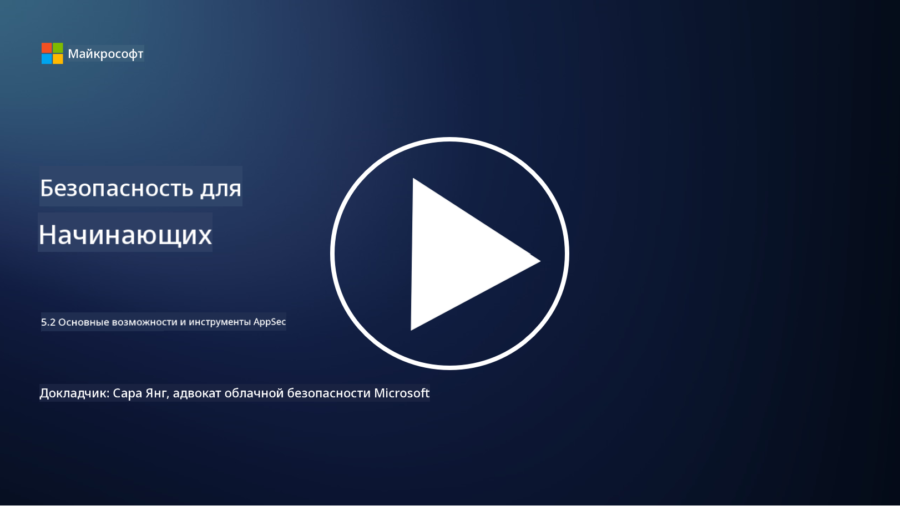

<!--
CO_OP_TRANSLATOR_METADATA:
{
  "original_hash": "790a3fa7e535ec60bb51bde13e759781",
  "translation_date": "2025-09-04T00:48:37+00:00",
  "source_file": "5.2 AppSec key capabilities.md",
  "language_code": "ru"
}
-->
## Введение

В этом уроке мы рассмотрим ключевые возможности и инструменты, которые используются для обеспечения безопасности приложений.

## Основные возможности и инструменты AppSec

Ключевые возможности и инструменты, используемые в безопасности приложений, играют важную роль в выявлении, устранении и предотвращении уязвимостей и угроз в программных приложениях. Вот некоторые из самых важных:

**1. Статическое тестирование безопасности приложений (SAST)**:

- **Возможности**: Анализирует исходный код, байт-код или бинарный код для выявления уязвимостей в кодовой базе приложения.

- **Инструменты**: Примеры включают Fortify, Checkmarx и Veracode.

**2. Динамическое тестирование безопасности приложений (DAST)**:

- **Возможности**: Сканирует работающие приложения, отправляя запросы и анализируя ответы для выявления уязвимостей.

- **Инструменты**: Примеры включают ZAP, Burp Suite и Qualys Web Application Scanning.

**3. Интерактивное тестирование безопасности приложений (IAST)**:

- **Возможности**: Объединяет элементы SAST и DAST для анализа кода во время выполнения, обеспечивая более точные результаты и снижая количество ложных срабатываний.

- **Инструменты**: Примеры включают Contrast Security и HCL AppScan.

**4. Самозащита приложений во время выполнения (RASP)**:

- **Возможности**: Мониторит и защищает приложения в реальном времени, обнаруживая и реагируя на угрозы безопасности по мере их возникновения.

- **Инструменты**: Примеры включают Veracode Runtime Protection и F5 Advanced WAF с RASP.

**5. Межсетевые экраны веб-приложений (WAFs)**:

- **Возможности**: Обеспечивает защитный слой между приложением и интернетом, фильтруя входящий трафик и блокируя вредоносные запросы.

- **Инструменты**: Примеры включают ModSecurity, AWS WAF и Akamai Kona Site Defender.

**6. Сканирование зависимостей**:

- **Возможности**: Выявляет уязвимости в сторонних библиотеках и компонентах, используемых в приложении.

- **Инструменты**: Примеры включают OWASP Dependency-Check и Snyk.

**7. Тестирование на проникновение (Pen Testing)**:

- **Возможности**: Симулирует реальные атаки для обнаружения уязвимостей и оценки безопасности приложения.

- **Инструменты**: Выполняется сертифицированными этическими хакерами и специалистами по безопасности с использованием различных инструментов, таких как Metasploit и Nmap.

**8. Сканирование и анализ безопасности**:

- **Возможности**: Сканирует на наличие известных уязвимостей, ошибок конфигурации и неправильных настроек безопасности.

- **Инструменты**: Примеры включают Nessus, Qualys Vulnerability Management и OpenVAS.

**9. Инструменты безопасности контейнеров**:

- **Возможности**: Сосредоточены на защите контейнеризированных приложений и их окружений.

- **Инструменты**: Примеры включают Docker Security Scanning и Aqua Security.

**10. Обучение безопасной разработке**:

- **Возможности**: Предоставляет программы обучения и повышения осведомленности для команд разработчиков, способствуя внедрению безопасных практик кодирования.

- **Инструменты**: Индивидуальные программы обучения и платформы.

**11. Фреймворки тестирования безопасности**:

- **Возможности**: Предоставляет комплексные фреймворки для различных потребностей тестирования безопасности приложений.

- **Инструменты**: OWASP Amass, OWASP OWTF и FrAppSec.

**12. Инструменты для анализа безопасного кода**:

- **Возможности**: Анализирует исходный код на наличие уязвимостей и соответствие лучшим практикам кодирования.

- **Инструменты**: Примеры включают SonarQube и Checkmarx.

**13. Инструменты для защиты API и микросервисов**:

- **Возможности**: Сосредоточены на защите API и микросервисов, включая аутентификацию, авторизацию и защиту данных.

- **Инструменты**: Примеры включают Apigee, AWS API Gateway и Istio.

## Дополнительные материалы

- [Что такое безопасность приложений? Концепции, инструменты и лучшие практики | HackerOne](https://www.hackerone.com/knowledge-center/what-application-security-concepts-tools-best-practices)
- [Что такое IAST? (Интерактивное тестирование безопасности приложений) (comparitech.com)](https://www.comparitech.com/net-admin/what-is-iast/)
- [10 типов инструментов тестирования безопасности приложений: когда и как их использовать (cmu.edu)](https://insights.sei.cmu.edu/blog/10-types-of-application-security-testing-tools-when-and-how-to-use-them/)
- [Смещение баланса рисков кибербезопасности: принципы и подходы к безопасности по дизайну и умолчанию | Cyber.gov.au](https://www.cyber.gov.au/about-us/view-all-content/publications/principles-and-approaches-for-security-by-design-and-default)

---

**Отказ от ответственности**:  
Этот документ был переведен с использованием сервиса автоматического перевода [Co-op Translator](https://github.com/Azure/co-op-translator). Несмотря на наши усилия обеспечить точность, автоматические переводы могут содержать ошибки или неточности. Оригинальный документ на его исходном языке следует считать авторитетным источником. Для получения критически важной информации рекомендуется профессиональный перевод человеком. Мы не несем ответственности за любые недоразумения или неправильные толкования, возникшие в результате использования данного перевода.