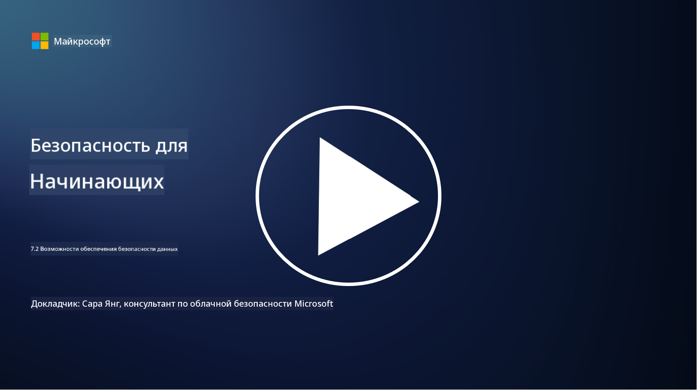

<!--
CO_OP_TRANSLATOR_METADATA:
{
  "original_hash": "50697add9758e54693442d502d2d5f8a",
  "translation_date": "2025-09-04T00:54:42+00:00",
  "source_file": "7.2 Data security capabilities.md",
  "language_code": "ru"
}
-->
# Возможности обеспечения безопасности данных

В этом разделе мы рассмотрим основные инструменты и возможности, используемые для обеспечения безопасности данных:

**Введение**

В этом уроке мы обсудим:

- Что такое инструменты предотвращения утечек данных?

- Что такое инструменты управления внутренними рисками?

- Какие инструменты для управления хранением данных доступны?

## Что такое инструменты предотвращения утечек данных?

Инструменты предотвращения утечек данных (Data Loss Prevention, DLP) представляют собой набор программных решений и технологий, предназначенных для предотвращения несанкционированного доступа, передачи или утечки конфиденциальной информации внутри организации. Эти инструменты используют анализ содержимого, применение политик и мониторинг для выявления и защиты чувствительных данных от утечек или неправильного использования. Примеры продуктов DLP включают: Symantec Data Loss Prevention, McAfee Total Protection for Data Loss Prevention, Microsoft 365 DLP**: интегрируется с приложениями Microsoft 365, помогая организациям выявлять и защищать конфиденциальные данные в электронных письмах, документах и сообщениях.

## Что такое инструменты управления внутренними рисками?

Инструменты управления внутренними рисками помогают организациям выявлять и минимизировать риски, связанные с сотрудниками, подрядчиками или партнерами, которые могут намеренно или случайно нарушить безопасность данных. Эти инструменты отслеживают поведение пользователей, шаблоны доступа и использование данных для выявления подозрительной активности и потенциальных внутренних угроз. Примеры продуктов для управления внутренними рисками включают: Microsoft Insider Risk Management (часть Microsoft 365), Forcepoint Insider Threat Data Protection, Varonis Insider Threat Detection.

## Какие инструменты для управления хранением данных доступны?

Инструменты для управления хранением данных включают программное обеспечение и решения, предназначенные для управления хранением и удалением данных в соответствии с политиками хранения данных и юридическими требованиями организации. Эти инструменты помогают автоматизировать процесс хранения данных на определенные сроки и их безопасного удаления, когда они больше не нужны. Примеры продуктов для управления хранением данных включают: Veritas Enterprise Vault, Commvault Complete Data Protection, Microsoft data lifecycle management. Эти решения помогают организациям контролировать хранение и удаление данных, обеспечивая соответствие требованиям по защите данных и эффективное управление данными на протяжении их жизненного цикла.

## Дополнительные материалы

- [Руководство по управлению состоянием безопасности данных (DSPM) | CSA (cloudsecurityalliance.org)](https://cloudsecurityalliance.org/blog/2023/03/31/the-big-guide-to-data-security-posture-management-dspm/)
- [Предотвращение утечек данных на устройствах, в приложениях и сервисах | Microsoft Purview](https://youtu.be/hvqq8L_0kgI)
- [18 лучших инструментов для предотвращения утечек данных в 2023 году (платные и бесплатные) (comparitech.com)](https://www.comparitech.com/data-privacy-management/data-loss-prevention-tools-software/)
- [Предотвращение утечек данных (nist.gov)](https://tsapps.nist.gov/publication/get_pdf.cfm?pub_id=904672)
- [Узнайте об управлении внутренними рисками | Microsoft Learn](https://learn.microsoft.com/purview/insider-risk-management?WT.mc_id=academic-96948-sayoung)
- [Управление жизненным циклом данных | IBM](https://www.ibm.com/topics/data-lifecycle-management)
- [Что такое управление жизненным циклом данных (DLM)? | Лучшие практики 2023 года (selecthub.com)](https://www.selecthub.com/big-data-analytics/data-lifecycle-management/)

---

**Отказ от ответственности**:  
Этот документ был переведен с помощью сервиса автоматического перевода [Co-op Translator](https://github.com/Azure/co-op-translator). Хотя мы стремимся к точности, пожалуйста, имейте в виду, что автоматические переводы могут содержать ошибки или неточности. Оригинальный документ на его исходном языке следует считать авторитетным источником. Для получения критически важной информации рекомендуется профессиональный перевод человеком. Мы не несем ответственности за любые недоразумения или неправильные толкования, возникшие в результате использования данного перевода.