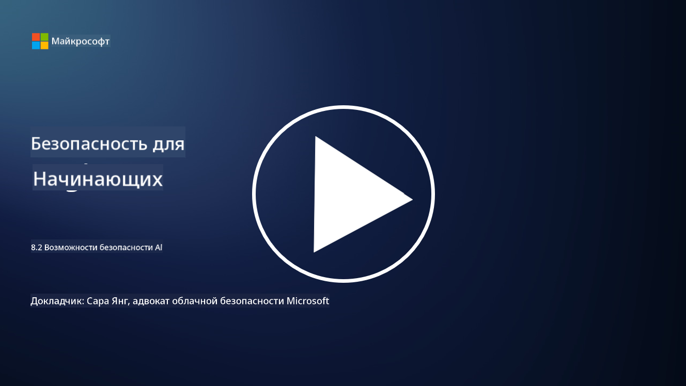

<!--
CO_OP_TRANSLATOR_METADATA:
{
  "original_hash": "b6bb7175672298d1e2f73ba7e0006f95",
  "translation_date": "2025-09-04T01:03:48+00:00",
  "source_file": "8.2 AI security capabilities.md",
  "language_code": "ru"
}
-->
# Возможности обеспечения безопасности ИИ

## Какие инструменты и возможности существуют для обеспечения безопасности ИИ-систем?

На данный момент существует несколько инструментов и возможностей для обеспечения безопасности ИИ-систем:

-   **Counterfit**: Открытый инструмент автоматизации для тестирования безопасности ИИ-систем, разработанный для помощи организациям в проведении оценки рисков безопасности ИИ и обеспечения устойчивости их алгоритмов.
-   **Инструменты для противодействия атакам на машинное обучение**: Эти инструменты оценивают устойчивость моделей машинного обучения к атакам, помогая выявлять и устранять уязвимости.
-   **Наборы инструментов для безопасности ИИ**: Существуют открытые наборы инструментов, предоставляющие ресурсы для защиты ИИ-систем, включая библиотеки и фреймворки для реализации мер безопасности.
-   **Платформы для сотрудничества**: Партнерства между компаниями и сообществами ИИ для разработки сканеров безопасности, специфичных для ИИ, и других инструментов для защиты цепочки поставок ИИ.

Эти инструменты и возможности являются частью развивающейся области, направленной на повышение безопасности ИИ-систем перед различными угрозами. Они представляют собой сочетание исследований, практических инструментов и отраслевого сотрудничества, направленного на решение уникальных задач, связанных с технологиями ИИ.

## Что такое red teaming для ИИ? Чем он отличается от традиционного red teaming в области безопасности?

Red teaming для ИИ отличается от традиционного red teaming в области безопасности по нескольким ключевым аспектам:

-   **Фокус на ИИ-системах**: Red teaming для ИИ специально нацелен на уникальные уязвимости ИИ-систем, такие как модели машинного обучения и конвейеры данных, а не на традиционную ИТ-инфраструктуру.
-   **Тестирование поведения ИИ**: Включает проверку того, как ИИ-системы реагируют на необычные или неожиданные входные данные, что позволяет выявить уязвимости, которые могут быть использованы злоумышленниками.
-   **Исследование отказов ИИ**: Red teaming для ИИ рассматривает как злонамеренные, так и доброкачественные сбои, учитывая более широкий спектр сценариев и потенциальных отказов системы, выходящих за рамки только нарушений безопасности.
-   **Инъекция запросов и генерация контента**: Включает проверку на сбои, такие как инъекция запросов, когда злоумышленники манипулируют ИИ-системами, чтобы они создавали вредоносный или недостоверный контент.
-   **Этика и ответственность в ИИ**: Является частью обеспечения ответственного подхода к разработке ИИ, гарантируя, что системы ИИ устойчивы к попыткам заставить их вести себя нежелательным образом.

В целом, red teaming для ИИ — это расширенная практика, которая охватывает не только поиск уязвимостей безопасности, но и тестирование других типов отказов, специфичных для технологий ИИ. Это важный элемент разработки более безопасных ИИ-систем, позволяющий понять и минимизировать новые риски, связанные с внедрением ИИ.

## Дополнительные материалы

 - [Microsoft AI Red Team building future of safer AI | Microsoft Security Blog](https://www.microsoft.com/en-us/security/blog/2023/08/07/microsoft-ai-red-team-building-future-of-safer-ai/?WT.mc_id=academic-96948-sayoung)
 - [Announcing Microsoft’s open automation framework to red team generative AI Systems | Microsoft Security Blog](https://www.microsoft.com/en-us/security/blog/2024/02/22/announcing-microsofts-open-automation-framework-to-red-team-generative-ai-systems/?WT.mc_id=academic-96948-sayoung)
 - [AI Security Tools: The Open-Source Toolkit | Wiz](https://www.wiz.io/academy/ai-security-tools)

---

**Отказ от ответственности**:  
Этот документ был переведен с использованием сервиса автоматического перевода [Co-op Translator](https://github.com/Azure/co-op-translator). Хотя мы стремимся к точности, пожалуйста, имейте в виду, что автоматические переводы могут содержать ошибки или неточности. Оригинальный документ на его исходном языке следует считать авторитетным источником. Для получения критически важной информации рекомендуется профессиональный перевод человеком. Мы не несем ответственности за любые недоразумения или неправильные толкования, возникшие в результате использования данного перевода.