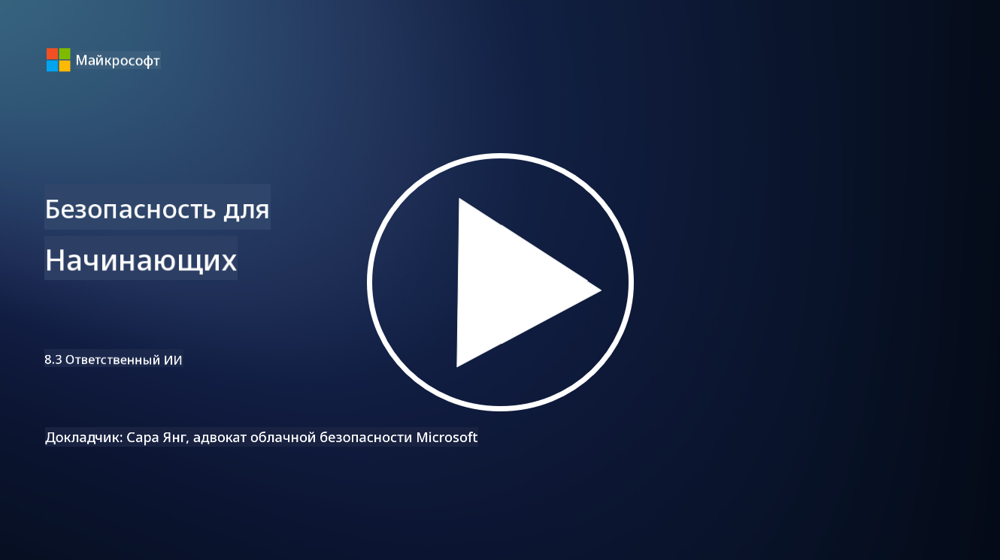

<!--
CO_OP_TRANSLATOR_METADATA:
{
  "original_hash": "5e9775ee91bde7d44577891d5f11c4c5",
  "translation_date": "2025-09-04T00:03:11+00:00",
  "source_file": "8.3 Responsible AI.md",
  "language_code": "ru"
}
-->
# Ответственный ИИ

## Что такое ответственный ИИ и как он связан с безопасностью ИИ?

Ответственный ИИ подразумевает разработку и использование искусственного интеллекта таким образом, чтобы это было этично, прозрачно и соответствовало общественным ценностям. Он охватывает такие принципы, как справедливость, ответственность и надежность, гарантируя, что системы ИИ создаются и функционируют на благо людей, сообществ и общества в целом.

Связь между ответственным ИИ и безопасностью ИИ важна, потому что:

-   **Этические аспекты**: Ответственный ИИ включает этические аспекты, которые напрямую влияют на безопасность, такие как защита конфиденциальности и данных. Обеспечение уважения к конфиденциальности пользователей и защита персональных данных — ключевые элементы ответственного ИИ.
-   **Надежность и устойчивость**: Системы ИИ должны быть устойчивыми к манипуляциям и атакам, что является основным принципом как ответственного ИИ, так и безопасности ИИ. Это включает защиту от атак злоумышленников и обеспечение целостности процессов принятия решений ИИ.
-   **Прозрачность и объяснимость**: Часть ответственного ИИ заключается в обеспечении прозрачности систем ИИ и возможности объяснить их решения. Это важно для безопасности, так как заинтересованные стороны должны понимать, как работают системы ИИ, чтобы доверять их мерам безопасности.
-   **Ответственность**: Системы ИИ должны быть ответственными за свои действия, что означает наличие механизмов для отслеживания решений и исправления любых проблем. Это соответствует практикам безопасности, которые мониторят и проверяют деятельность системы для предотвращения и реагирования на нарушения.

Таким образом, ответственный ИИ и безопасность ИИ взаимосвязаны: практики ответственного ИИ усиливают безопасность систем ИИ, и наоборот. Внедрение принципов ответственного ИИ помогает создавать системы ИИ, которые не только этичны, но и более защищены от потенциальных угроз.

## Как я могу гарантировать, что моя система ИИ одновременно безопасна и этична?

Обеспечение того, чтобы ваша система ИИ была одновременно безопасной и этичной, требует комплексного подхода, включающего следующие шаги:

- **Следуйте этическим принципам**: Соблюдайте установленные этические рекомендации, которые подчеркивают благополучие человека, общества и окружающей среды; справедливость; защиту конфиденциальности; надежность; прозрачность; возможность оспаривания решений; и ответственность.

- **Реализуйте надежные меры безопасности**: Используйте проактивное тестирование безопасности и программы управления доверием, рисками и безопасностью ИИ для защиты от угроз и уязвимостей.

- **Привлекайте разнообразных участников**: Включайте широкий круг участников в процесс разработки ИИ, включая этиков, социальных ученых и представителей затронутых сообществ, чтобы учитывать разнообразные точки зрения и ценности.

- **Обеспечьте прозрачность и объяснимость**: Убедитесь, что процессы принятия решений ИИ прозрачны и могут быть объяснены, что способствует большему доверию и облегчает выявление потенциальных предвзятостей или ошибок.

- **Сохраняйте конфиденциальность данных**: Защищайте конфиденциальность и подлинность данных с помощью шифрования и других мер защиты данных, чтобы уважать права пользователей на конфиденциальность.

- **Обеспечьте человеческий контроль**: Внедрите механизмы для человеческого контроля, чтобы можно было оспаривать решения, принимаемые системами ИИ, и обеспечивать ответственность.

- **Будьте в курсе вопросов безопасности ИИ**: Следите за последними исследованиями и обсуждениями по безопасности ИИ, чтобы понимать изменяющийся ландшафт безопасности и этики ИИ.

- **Соблюдайте нормативные требования**: Убедитесь, что ваша система ИИ соответствует всем применимым законам и нормативным требованиям, включая законы о защите данных, законы против дискриминации и отраслевые рекомендации.

## Можете привести примеры проблем безопасности, вызванных неэтичным использованием ИИ?

Вот несколько примеров проблем безопасности, которые могут возникнуть из-за неэтичного использования ИИ:

- **Предвзятое принятие решений**: Системы ИИ могут сохранять и усиливать существующие предвзятости, если они обучены на предвзятых наборах данных. Например, если поисковая система обучена на данных, отражающих социальные стереотипы, она может отображать предвзятые результаты поиска, что может привести к несправедливому обращению или дискриминации.

- **ИИ в судебных системах**: Использование ИИ в принятии юридических решений может вызывать этические вопросы, особенно если процесс принятия решений ИИ непрозрачен или основан на предвзятых данных. Это может привести к несправедливым юридическим результатам и нарушению прав людей.

- **Манипуляция системами ИИ**: Системы ИИ могут быть уязвимы к атакам злоумышленников, когда небольшие изменения входных данных приводят к неправильным результатам. Например, автономные транспортные средства могут быть введены в заблуждение, неправильно интерпретируя дорожные знаки, что создает риски для безопасности.

- **ИИ для наблюдения**: Использование ИИ в целях наблюдения может привести к нарушениям конфиденциальности, особенно если оно осуществляется без должного согласия или способами, которые ущемляют свободы личности. Это может быть особенно проблематично в авторитарных режимах, которые могут использовать ИИ для мониторинга и подавления инакомыслия.

Эти примеры подчеркивают важность этических аспектов при разработке и внедрении систем ИИ для предотвращения проблем безопасности и защиты прав и конфиденциальности людей.

## Дополнительные материалы

 - [Microsoft Responsible AI Standard v2 General Requirements](https://query.prod.cms.rt.microsoft.com/cms/api/am/binary/RE5cmFl?culture=en-us&country=us&WT.mc_id=academic-96948-sayoung)
 - [Responsible AI (mit.edu)](https://sloanreview.mit.edu/big-ideas/responsible-ai/)
 - [13 Principles for Using AI Responsibly (hbr.org)](https://hbr.org/2023/06/13-principles-for-using-ai-responsibly)

---

**Отказ от ответственности**:  
Этот документ был переведен с помощью сервиса автоматического перевода [Co-op Translator](https://github.com/Azure/co-op-translator). Несмотря на наши усилия обеспечить точность, автоматические переводы могут содержать ошибки или неточности. Оригинальный документ на его исходном языке следует считать авторитетным источником. Для получения критически важной информации рекомендуется профессиональный перевод человеком. Мы не несем ответственности за любые недоразумения или неправильные толкования, возникшие в результате использования данного перевода.