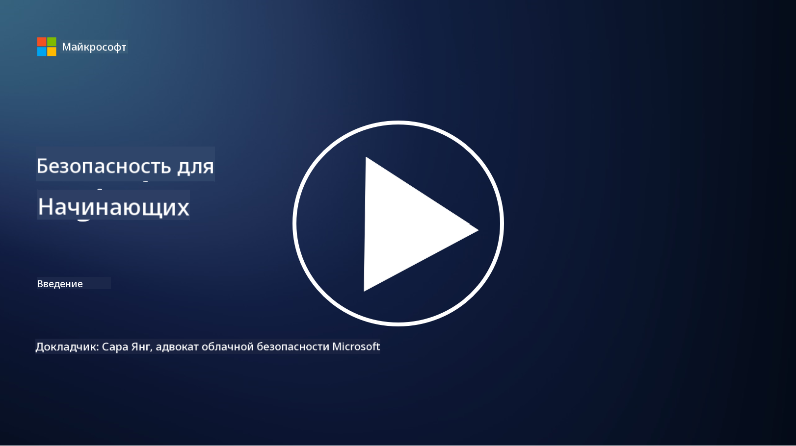

<!--
CO_OP_TRANSLATOR_METADATA:
{
  "original_hash": "5946c53720de84d57b17eafd98095d72",
  "translation_date": "2025-10-12T08:49:17+00:00",
  "source_file": "README.md",
  "language_code": "ru"
}
-->

### 🌐 Поддержка нескольких языков

#### Поддерживается через GitHub Action (автоматически и всегда актуально)

<!-- CO-OP TRANSLATOR LANGUAGES TABLE START -->
[Арабский](../ar/README.md) | [Бенгальский](../bn/README.md) | [Болгарский](../bg/README.md) | [Бирманский (Мьянма)](../my/README.md) | [Китайский (упрощенный)](../zh/README.md) | [Китайский (традиционный, Гонконг)](../hk/README.md) | [Китайский (традиционный, Макао)](../mo/README.md) | [Китайский (традиционный, Тайвань)](../tw/README.md) | [Хорватский](../hr/README.md) | [Чешский](../cs/README.md) | [Датский](../da/README.md) | [Нидерландский](../nl/README.md) | [Эстонский](../et/README.md) | [Финский](../fi/README.md) | [Французский](../fr/README.md) | [Немецкий](../de/README.md) | [Греческий](../el/README.md) | [Иврит](../he/README.md) | [Хинди](../hi/README.md) | [Венгерский](../hu/README.md) | [Индонезийский](../id/README.md) | [Итальянский](../it/README.md) | [Японский](../ja/README.md) | [Корейский](../ko/README.md) | [Литовский](../lt/README.md) | [Малайский](../ms/README.md) | [Маратхи](../mr/README.md) | [Непальский](../ne/README.md) | [Норвежский](../no/README.md) | [Персидский (фарси)](../fa/README.md) | [Польский](../pl/README.md) | [Португальский (Бразилия)](../br/README.md) | [Португальский (Португалия)](../pt/README.md) | [Панджаби (гурмукхи)](../pa/README.md) | [Румынский](../ro/README.md) | [Русский](./README.md) | [Сербский (кириллица)](../sr/README.md) | [Словацкий](../sk/README.md) | [Словенский](../sl/README.md) | [Испанский](../es/README.md) | [Суахили](../sw/README.md) | [Шведский](../sv/README.md) | [Тагальский (филиппинский)](../tl/README.md) | [Тамильский](../ta/README.md) | [Тайский](../th/README.md) | [Турецкий](../tr/README.md) | [Украинский](../uk/README.md) | [Урду](../ur/README.md) | [Вьетнамский](../vi/README.md)
<!-- CO-OP TRANSLATOR LANGUAGES TABLE END -->

**Если вы хотите добавить поддержку других языков, список доступных языков можно найти [здесь](https://github.com/Azure/co-op-translator/blob/main/getting_started/supported-languages.md)**

#### Присоединяйтесь к нашему сообществу

# 🚀 Кибербезопасность для начинающих – учебная программа

В эпоху стремительного внедрения технологий искусственного интеллекта особенно важно понимать, как защищать IT-системы. Этот курс создан для того, чтобы познакомить вас с основами кибербезопасности и помочь начать обучение в этой области. Курс не привязан к конкретным поставщикам и состоит из небольших уроков, каждый из которых занимает около 30-60 минут. В конце каждого урока есть небольшой тест и ссылки на дополнительные материалы для углубленного изучения темы.

Что охватывает этот курс 📚

- 🔐 Основные концепции кибербезопасности, такие как триада CIA, различия между рисками, угрозами и т.д.
- 🛡️ Понимание того, что такое средства контроля безопасности и какие формы они принимают.
- 🌐 Понимание концепции "нулевого доверия" и её важности в современной кибербезопасности.
- 🔑 Изучение ключевых концепций и тем в области управления идентификацией, сетевой безопасности, операций безопасности, инфраструктуры и защиты данных.
- 🔧 Примеры инструментов, используемых для реализации средств контроля безопасности.

Что этот курс не охватывает 🙅‍♂️

- 🚫 Использование конкретных инструментов безопасности.
- 🚫 "Хакерство" или проведение атак (red teaming/offensive security).
- 🚫 Изучение конкретных стандартов соответствия.

После завершения курса вы можете перейти к некоторым модулям Microsoft Learn. Мы рекомендуем продолжить обучение с [Microsoft Security, Compliance, and Identity Fundamentals.](https://learn.microsoft.com/training/paths/describe-concepts-of-security-compliance-identity/?WT.mc_id=academic-96948-sayoung)

В конечном итоге вы можете рассмотреть возможность сдачи [Экзамена SC-900: Microsoft Security, Compliance, and Identity Fundamentals.](https://learn.microsoft.com/credentials/certifications/exams/sc-900/?WT.mc_id=academic-96948-sayoung)

> 💁 Если у вас есть отзывы или предложения по этому курсу, а также идеи о том, что можно добавить, мы будем рады услышать их!

## Обзор модулей 📝 
| **Номер модуля** | **Название модуля**                       | **Изучаемые концепции**              | **Цели обучения**                                                                                              |
|------------------|-------------------------------------------|--------------------------------------|----------------------------------------------------------------------------------------------------------------|
| **1.1**          | Основные концепции безопасности           | [Триада CIA](https://github.com/microsoft/Security-101/blob/main/1.1%20The%20CIA%20triad%20and%20other%20key%20concepts.md)                        | Узнайте о конфиденциальности, доступности и целостности, а также об аутентичности, непреложности и конфиденциальности. |
| **1.2**          | Основные концепции безопасности           | [Распространенные угрозы кибербезопасности](https://github.com/microsoft/Security-101/blob/main/1.2%20Common%20cybersecurity%20threats.md)        | Узнайте о распространенных угрозах кибербезопасности, с которыми сталкиваются люди и организации.              |
| **1.3**          | Основные концепции безопасности           | [Понимание управления рисками](https://github.com/microsoft/Security-101/blob/main/1.3%20Understanding%20risk%20management.md)       | Узнайте, как оценивать и понимать риски – их влияние/вероятность и внедрение средств контроля.                                                                                                               | |
| **1.4**          | Основные концепции безопасности           | [Практики безопасности и документация](https://github.com/microsoft/Security-101/blob/main/1.4%20Security%20practices%20and%20documentation.md) | Узнайте о различиях между политиками, процедурами, стандартами и нормативными актами/законами.                  |
| **1.5**          | Основные концепции безопасности           | [Нулевое доверие](https://github.com/microsoft/Security-101/blob/main/1.5%20Zero%20trust.md)                           | Узнайте, что такое "нулевое доверие" и как оно влияет на архитектуру. Что такое защита в глубину?               |
| **1.6**          | Основные концепции безопасности           | [Модель разделения ответственности](https://github.com/microsoft/Security-101/blob/main/1.6%20Shared%20responsibility%20model.md)                           | Что такое модель разделения ответственности и как она влияет на кибербезопасность?                  |
| **1.7**          | [Тест в конце модуля](https://github.com/microsoft/Security-101/blob/main/1.7%20End%20of%20module%20quiz.md)                        |                                      |                                                                                                                 |
| **2.1**          | Основы управления идентификацией и доступом | [Ключевые концепции IAM](https://github.com/microsoft/Security-101/blob/main/2.1%20IAM%20key%20concepts.md)                     | Узнайте о принципе минимальных привилегий, разделении обязанностей и о том, как IAM поддерживает "нулевое доверие". |
| **2.2**          | Основы управления идентификацией и доступом | [Архитектура IAM с нулевым доверием](https://github.com/microsoft/Security-101/blob/main/2.2%20IAM%20zero%20trust%20architecture.md)          | Узнайте, как идентификация становится новой границей для современных IT-сред и какие угрозы она устраняет.      |
| **2.3**          | Основы управления идентификацией и доступом | [Возможности IAM](https://github.com/microsoft/Security-101/blob/main/2.3%20IAM%20capabilities.md)                     | Узнайте о возможностях IAM и средствах контроля для защиты идентификаций.                                       |
| **2.4**          | [Тест в конце модуля](https://github.com/microsoft/Security-101/blob/main/2.4%20End%20of%20module%20quiz.md)                        |                                      |                                                                                                                 |
| **3.1**          | Основы сетевой безопасности               | [Ключевые концепции сетей](https://github.com/microsoft/Security-101/blob/main/3.1%20Networking%20key%20concepts.md)              | Узнайте о концепциях сетей (IP-адресация, номера портов, шифрование и т.д.).                                    |
| **3.2**          | Основы сетевой безопасности               | [Архитектура сетей с нулевым доверием](https://github.com/microsoft/Security-101/blob/main/3.2%20Networking%20zero%20trust%20architecture.md)   | Узнайте, как сети способствуют архитектуре E2E ZT и какие угрозы они устраняют.                                 |
| **3.3**          | Основы сетевой безопасности               | [Возможности сетевой безопасности](https://github.com/microsoft/Security-101/blob/main/3.3%20Network%20security%20capabilities.md)        | Узнайте о средствах сетевой безопасности – межсетевые экраны, WAF, защита от DDoS-атак и т.д.                   |
| **3.4**          | [Тест в конце модуля](https://github.com/microsoft/Security-101/blob/main/3.4%20End%20of%20module%20quiz.md)                        |                                      |                                                                                                                 |
| **4.1**          | Основы операций безопасности              | [Ключевые концепции SecOps](https://github.com/microsoft/Security-101/blob/main/4.1%20SecOps%20key%20concepts.md)                  | Узнайте, почему операции безопасности важны и чем они отличаются от обычных IT-операций.                       |
| **4.2**          | Основы операций безопасности              | [Архитектура SecOps с нулевым доверием](https://github.com/microsoft/Security-101/blob/main/4.2%20SecOps%20zero%20trust%20architecture.md)       | Узнайте, как SecOps способствует архитектуре E2E ZT и какие угрозы она устраняет.                               |
| **4.3**          | Основы операций безопасности              | [Возможности SecOps](https://github.com/microsoft/Security-101/blob/main/4.3%20SecOps%20capabilities.md)                  | Узнайте о средствах SecOps – SIEM, XDR и т.д.                                                                   |
| **4.4**          | [Тест в конце модуля](https://github.com/microsoft/Security-101/blob/main/4.4%20End%20of%20module%20quiz.md)                        |                                      |                                                                                                                 |
| **5.1**          | Основы безопасности приложений            | [Ключевые концепции AppSec](https://github.com/microsoft/Security-101/blob/main/5.1%20AppSec%20key%20concepts.md)                  | Узнайте о концепциях AppSec, таких как безопасный дизайн, проверка ввода и т.д.                                 |
| **5.2**           | Основы безопасности приложений           | [Возможности AppSec](https://github.com/microsoft/Security-101/blob/main/5.2%20AppSec%20key%20capabilities.md)                  | Узнайте о инструментах AppSec: инструменты безопасности для конвейеров, сканирование кода, сканирование секретов и др. |
| **5.3**           | [Тест в конце модуля](https://github.com/microsoft/Security-101/blob/main/5.3%20End%20of%20module%20quiz.md)                        |                                      |                                                                                                                 |
| **6.1**           | Основы безопасности инфраструктуры       | [Ключевые концепции безопасности инфраструктуры](https://github.com/microsoft/Security-101/blob/main/6.1%20Infrastructure%20security%20key%20concepts.md) | Узнайте о защите систем, установке обновлений, гигиене безопасности, безопасности контейнеров.                  |
| **6.2**           | Основы безопасности инфраструктуры       | [Возможности безопасности инфраструктуры](https://github.com/microsoft/Security-101/blob/main/6.2%20Infrastructure%20security%20capabilities.md) | Узнайте о инструментах, которые могут помочь с безопасностью инфраструктуры, например CSPM, безопасность контейнеров и др. |
| **6.3**           | [Тест в конце модуля](https://github.com/microsoft/Security-101/blob/main/6.3%20End%20of%20module%20quiz.md)                        |                                      |                                                                                                                 |
| **7.1**           | Основы безопасности данных               | [Ключевые концепции безопасности данных](https://github.com/microsoft/Security-101/blob/main/7.1%20Data%20security%20key%20concepts.md)           | Узнайте о классификации и хранении данных и почему это важно для организации.                                   |
| **7.2**           | Основы безопасности данных               | [Возможности безопасности данных](https://github.com/microsoft/Security-101/blob/main/7.2%20Data%20security%20capabilities.md)           | Узнайте о инструментах безопасности данных – DLP, управление внутренними рисками, управление данными и др.      |
| **7.3**           | [Тест в конце модуля](https://github.com/microsoft/Security-101/blob/main/7.3%20End%20of%20module%20quiz.md)                        |
| **8.1**           | Основы безопасности ИИ                   | [Ключевые концепции безопасности ИИ](https://github.com/microsoft/Security-101/blob/main/8.1%20AI%20security%20key%20concepts.md)          | Узнайте о различиях и сходствах между традиционной безопасностью и безопасностью ИИ.                             |
| **8.2**           | Основы безопасности ИИ                   | [Возможности безопасности ИИ](https://github.com/microsoft/Security-101/blob/main/8.2%20AI%20security%20capabilities.md)           | Узнайте о инструментах безопасности ИИ и контролях, которые можно использовать для защиты ИИ.                   |
| **8.3**           | Основы безопасности ИИ                   | [Ответственный ИИ](https://github.com/microsoft/Security-101/blob/main/8.3%20Responsible%20AI.md)          | Узнайте, что такое ответственный ИИ и о специфических рисках ИИ, которые должны учитывать специалисты по безопасности. |
| **8.4**           | [Тест в конце модуля](https://github.com/microsoft/Security-101/blob/main/8.4%20End%20of%20module%20quiz.md)     

## 🎒 Другие курсы 

Наша команда создает и другие курсы! Ознакомьтесь с:

- [Generative AI для начинающих](https://aka.ms/genai-beginners)
- [Generative AI для начинающих .NET](https://github.com/microsoft/Generative-AI-for-beginners-dotnet)
- [Generative AI с JavaScript](https://github.com/microsoft/generative-ai-with-javascript)
- [Generative AI с Java](https://github.com/microsoft/Generative-AI-for-beginners-java)
- [ИИ для начинающих](https://aka.ms/ai-beginners)
- [Data Science для начинающих](https://aka.ms/datascience-beginners)
- [ML для начинающих](https://aka.ms/ml-beginners)
- [Кибербезопасность для начинающих](https://github.com/microsoft/Security-101) 
- [Веб-разработка для начинающих](https://aka.ms/webdev-beginners)
- [IoT для начинающих](https://aka.ms/iot-beginners)
- [Разработка XR для начинающих](https://github.com/microsoft/xr-development-for-beginners)
- [Мастерство GitHub Copilot для парного программирования](https://github.com/microsoft/Mastering-GitHub-Copilot-for-Paired-Programming)
- [Мастерство GitHub Copilot для разработчиков C#/.NET](https://github.com/microsoft/mastering-github-copilot-for-dotnet-csharp-developers)
- [Выбери свое приключение с Copilot](https://github.com/microsoft/CopilotAdventures)

## Получение помощи

Если вы столкнулись с трудностями или у вас есть вопросы о создании приложений на основе ИИ, присоединяйтесь:

Если у вас есть отзывы о продукте или ошибки при разработке, посетите:

---

**Отказ от ответственности**:  
Этот документ был переведен с помощью сервиса автоматического перевода [Co-op Translator](https://github.com/Azure/co-op-translator). Несмотря на наши усилия обеспечить точность, автоматические переводы могут содержать ошибки или неточности. Оригинальный документ на его родном языке следует считать авторитетным источником. Для получения критически важной информации рекомендуется профессиональный перевод человеком. Мы не несем ответственности за любые недоразумения или неправильные интерпретации, возникшие в результате использования данного перевода.