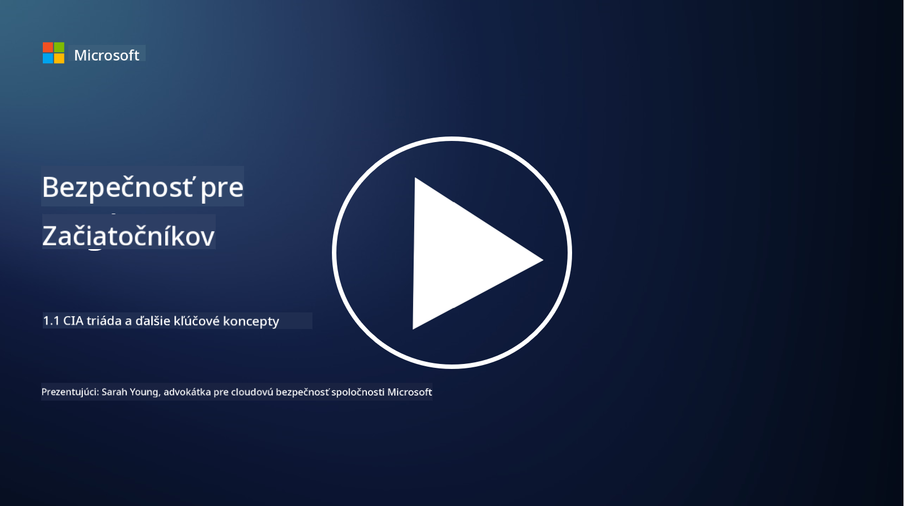
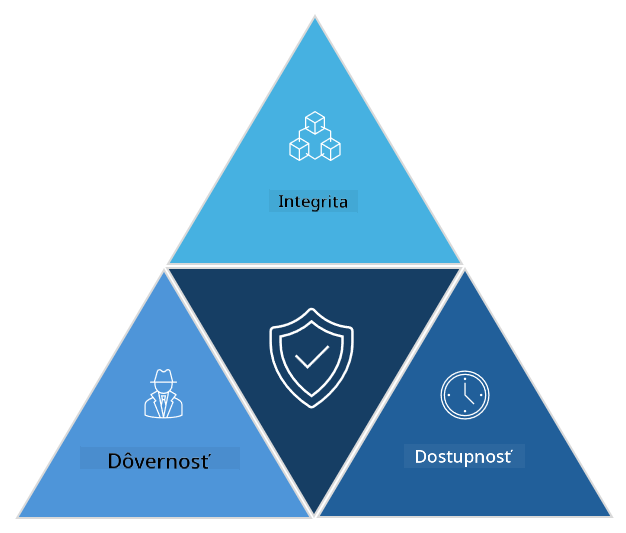

<!--
CO_OP_TRANSLATOR_METADATA:
{
  "original_hash": "16a76f9fa372fb63cffb6d76b855f023",
  "translation_date": "2025-09-04T01:11:52+00:00",
  "source_file": "1.1 The CIA triad and other key concepts.md",
  "language_code": "sk"
}
-->
# CIA triáda a ďalšie kľúčové koncepty

## Úvod

V tejto lekcii sa budeme venovať:

 - Čo je kybernetická bezpečnosť?
   
 - Čo je CIA triáda kybernetickej bezpečnosti?

 - Čo znamenajú autentickosť, nepopierateľnosť a súkromie v kontexte kybernetickej bezpečnosti?

## Čo je kybernetická bezpečnosť?

Kybernetická bezpečnosť, známa aj ako informačná bezpečnosť, je prax ochrany počítačových systémov, sietí, zariadení a údajov pred digitálnymi útokmi, neoprávneným prístupom, poškodením alebo krádežou. Hlavným cieľom kybernetickej bezpečnosti je zabezpečiť dôvernosť, integritu a dostupnosť digitálnych aktív a informácií. Odborníci na kybernetickú bezpečnosť navrhujú a implementujú bezpečnostné opatrenia na ochranu aktív, údajov a informácií. Keďže čoraz viac aspektov nášho života sa digitalizuje a presúva online, kybernetická bezpečnosť sa stala prioritou pre jednotlivcov aj organizácie.

## Čo je CIA triáda kybernetickej bezpečnosti?

CIA triáda kybernetickej bezpečnosti predstavuje model, ktorý zahŕňa tri hlavné aspekty každej práce v oblasti kybernetickej bezpečnosti alebo návrhu systému/prostredia:

### Dôvernosť

Tento aspekt je pravdepodobne najznámejší, keď sa povie „kybernetická bezpečnosť“: dôvernosť je proces ochrany údajov a informácií pred pokusmi o neoprávnený prístup, t. j. iba osoby, ktoré potrebujú vidieť informácie, k nim majú prístup. Nie všetky údaje sú však rovnaké, a preto sa údaje zvyčajne kategorizujú a chránia na základe toho, aké škody by mohli vzniknúť, ak by sa dostali do nesprávnych rúk.

### Integrita

Vzťahuje sa na ochranu presnosti a dôveryhodnosti údajov v prostrediach a na zabránenie tomu, aby boli údaje zmenené alebo upravené neoprávnenými osobami. Napríklad študent zmení svoj dátum narodenia v evidencii vodičských preukazov, aby sa stal starším a mohol si nechať preukaz vytlačiť s upraveným dátumom narodenia na nákup alkoholu.

### Dostupnosť

Tento aspekt je dôležitý v rámci prevádzkovej IT infraštruktúry, ale dostupnosť je rovnako dôležitá aj pre kybernetickú bezpečnosť. Existujú špecifické typy útokov, ktoré cielia na dostupnosť, a bezpečnostní odborníci musia proti nim chrániť (napr. útoky distribuovaného odmietnutia služby – DDoS).

**CIA triáda kybernetickej bezpečnosti**

## Čo znamenajú autentickosť, nepopierateľnosť a súkromie v kontexte kybernetickej bezpečnosti?

Ide o ďalšie dôležité koncepty, ktoré súvisia so zabezpečením a dôveryhodnosťou systémov a údajov:

**Autentickosť** - označuje istotu, že informácie, komunikácia alebo entita, s ktorou komunikujete, sú pravé a neboli neoprávnene zmenené alebo upravené.

**Nepopierateľnosť** - je koncept, ktorý zabezpečuje, že strana nemôže poprieť svoju účasť alebo pravosť transakcie či komunikácie. Zabraňuje tomu, aby niekto tvrdil, že neposlal správu alebo nevykonal určitú akciu, keď existujú dôkazy o opaku.

**Súkromie** - označuje ochranu citlivých a osobne identifikovateľných informácií pred neoprávneným prístupom, použitím, zverejnením alebo manipuláciou. Zahŕňa kontrolu nad tým, kto má prístup k osobným údajom a ako sa tieto údaje zhromažďujú, ukladajú a zdieľajú.

## Ďalšie čítanie

[Čo je informačná bezpečnosť (InfoSec)? | Microsoft Security](https://www.microsoft.com/security/business/security-101/what-is-information-security-infosec#:~:text=Three%20pillars%20of%20information%20security%3A%20the%20CIA%20triad,as%20guiding%20principles%20for%20implementing%20an%20InfoSec%20plan.)

---

**Upozornenie**:  
Tento dokument bol preložený pomocou služby na automatický preklad [Co-op Translator](https://github.com/Azure/co-op-translator). Aj keď sa snažíme o presnosť, upozorňujeme, že automatické preklady môžu obsahovať chyby alebo nepresnosti. Pôvodný dokument v jeho pôvodnom jazyku by mal byť považovaný za autoritatívny zdroj. Pre dôležité informácie sa odporúča profesionálny ľudský preklad. Nezodpovedáme za žiadne nedorozumenia alebo nesprávne interpretácie vyplývajúce z použitia tohto prekladu.