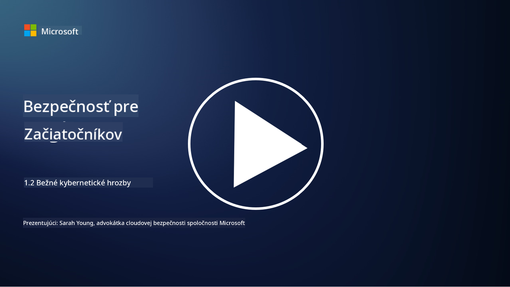

<!--
CO_OP_TRANSLATOR_METADATA:
{
  "original_hash": "6fc3030323139d7134a4ca9d03eccac9",
  "translation_date": "2025-09-03T23:28:19+00:00",
  "source_file": "1.2 Common cybersecurity threats.md",
  "language_code": "sk"
}
-->
# Bežné kybernetické hrozby

## Úvod

V tejto lekcii sa budeme venovať:

- Čo je to kybernetická hrozba?

- Prečo chcú škodliví aktéri kompromitovať dáta a IT systémy?

- Aké sú najbežnejšie typy kybernetických hrozieb?

- Čo je rámec MITRE ATT&CK?

- Kde môžem sledovať aktuálny stav kybernetických hrozieb?

## Čo je to kybernetická hrozba?

Kybernetická hrozba označuje akékoľvek potenciálne nebezpečenstvo alebo riziko, ktoré môže ohroziť dôvernosť, integritu alebo dostupnosť dát alebo IT systémov. Tieto hrozby pochádzajú od škodlivých aktérov, ktorí sa snažia zneužiť zraniteľnosti s cieľom získať neoprávnený prístup, ukradnúť citlivé informácie, narušiť prevádzku alebo spôsobiť škody jednotlivcom, organizáciám alebo dokonca celým krajinám. Kybernetické hrozby môžu mať rôzne podoby a zameriavajú sa na rôzne aspekty digitálnych systémov a dát.

## Prečo chcú škodliví aktéri kompromitovať dáta a IT systémy?

Škodliví aktéri kompromitujú dáta a IT systémy z rôznych dôvodov, často motivovaní osobným ziskom, ideologickými pohnútkami alebo túžbou spôsobiť narušenie. Pochopenie týchto motivácií môže pomôcť organizáciám a jednotlivcom lepšie sa brániť proti kybernetickým hrozbám. Medzi bežné dôvody, prečo sa škodliví aktéri zapájajú do kybernetických útokov, patria:

1. **Finančný zisk**: Mnohé útoky sú motivované túžbou po finančnom zisku. Škodliví aktéri môžu ukradnúť citlivé informácie, ako sú čísla kreditných kariet, údaje o bankových účtoch alebo osobné identifikačné údaje, aby spáchali podvody, krádež identity, vydierali jednotlivcov alebo organizácie, alebo predávali ukradnuté dáta na dark webe.

2. **Špionáž**: Štáty, konkurenti alebo iné subjekty sa môžu zapojiť do kybernetickej špionáže s cieľom ukradnúť citlivé vládne, firemné alebo výskumné údaje na politické, ekonomické alebo vojenské účely.

3. **Narušenie a sabotáž**: Niektoré útoky majú za cieľ narušiť kritickú infraštruktúru, služby alebo prevádzku z politických alebo ideologických dôvodov. Tieto útoky môžu spôsobiť rozsiahly chaos, finančné straty a poškodenie reputácie.

4. **Ideologické motivácie**: Hacktivisti a skupiny s ideologickými alebo politickými motiváciami môžu kompromitovať systémy, aby zvýšili povedomie o určitých problémoch, propagovali svoje presvedčenia alebo protestovali proti konkrétnym činnostiam alebo organizáciám.

5. **Neúmyselné činy**: Nie všetky škodlivé činy sú úmyselné; niektorí jednotlivci môžu nevedomky prispieť k kybernetickým hrozbám tým, že sa stanú obeťami sociálneho inžinierstva alebo sú súčasťou kompromitovanej siete.

Motivácie na kompromitovanie dát a IT systémov sa môžu značne líšiť a dopady týchto útokov môžu byť vážne. Je dôležité, aby jednotlivci, organizácie a vlády brali kybernetickú bezpečnosť vážne a zaviedli opatrenia na ochranu pred týmito hrozbami.

## Aké sú najbežnejšie typy kybernetických hrozieb?

Existuje niekoľko bežných typov kybernetických útokov, ktoré škodliví aktéri používajú na kompromitovanie systémov, krádež dát a spôsobovanie narušení. Tu sú niektoré z najrozšírenejších typov:

1. **Phishing**:

Phishing zahŕňa odosielanie klamlivých e-mailov alebo správ, ktoré sa tvária ako od dôveryhodných zdrojov, s cieľom oklamať príjemcov, aby odhalili citlivé informácie, ako sú heslá, čísla kreditných kariet alebo osobné údaje. Phishing môže tiež obete nasmerovať na škodlivé webové stránky alebo ich prinútiť stiahnuť malvér.

2. **Malvér**:

Malvér (škodlivý softvér) zahŕňa rôzne škodlivé programy navrhnuté na infikovanie systémov, krádež dát alebo spôsobenie škôd. Medzi typy malvéru patria:

- **Ransomvér**: Šifruje súbory a požaduje výkupné za ich dešifrovanie.

- **Trojany**: Maskované ako legitímny softvér, poskytujú útočníkom neoprávnený prístup.

- **Vírusy**: Samoreplikujúce sa programy, ktoré sa pripájajú k súborom a šíria sa.

- **Červy**: Samoreplikujúce sa programy, ktoré sa šíria cez siete.

3. **Útoky typu Denial of Service (DoS) a Distributed Denial of Service (DDoS)**:

Útoky DoS preťažujú cieľový systém, čím ho robia nedostupným pre používateľov. Útoky DDoS zahŕňajú použitie siete kompromitovaných zariadení na zaplavenie cieľa prevádzkou, čo sťažuje alebo úplne znemožňuje fungovanie systému.

4. **SQL Injection**:

Pri tomto útoku útočníci manipulujú vstupné polia webovej aplikácie na vloženie škodlivých SQL dotazov, čím môžu získať neoprávnený prístup k databázam a citlivým údajom.

5. **Cross-Site Scripting (XSS)**:

Útočníci vkladajú škodlivé skripty do webových aplikácií, ktoré sú následne vykonané v prehliadačoch nič netušiacich používateľov. To môže viesť k krádeži údajov používateľov a/alebo šíreniu malvéru.

6. **Sociálne inžinierstvo**:

Sociálne inžinierstvo využíva psychológiu na manipuláciu jednotlivcov, aby prezradili dôverné informácie alebo vykonali činnosti, ktoré ohrozujú bezpečnosť.

7. **Zero-Day (0day) Exploity**:

Tieto útoky sa zameriavajú na zraniteľnosti v softvéri alebo hardvéri, ktoré ešte nie sú známe dodávateľovi alebo verejnosti. Útočníci využívajú tieto zraniteľnosti skôr, ako sú vyvinuté opravy. Mnohé organizácie sa obávajú zero-day útokov, pretože na ne neexistuje oprava, ale nie sú také bežné ako ostatné útoky na tomto zozname. Keď sa zero-day objaví, bezpečnostní výskumníci rýchlo pracujú na vytvorení opravy, a preto sú zero-day útoky zvyčajne krátkodobé.

8. **Útoky na prihlasovacie údaje**:

Tieto útoky zahŕňajú útoky hrubou silou, pri ktorých útočníci opakovane hádajú heslá, a útoky typu credential stuffing, pri ktorých sú ukradnuté prihlasovacie údaje z jednej stránky použité na pokus o prístup na iné stránky.

## Čo je rámec MITRE ATT&CK?

[Rámec MITRE ATT&CK](https://attack.mitre.org/) (Adversarial Tactics, Techniques, and Common Knowledge) je rámec, ktorý katalogizuje a kategorizuje taktiky, techniky a postupy (TTP), ktoré protivníci používajú počas kybernetických útokov. Rámec vytvorila organizácia MITRE Corporation, nezisková organizácia, ktorá prevádzkuje výskumné a vývojové centrá pre rôzne vládne agentúry.

Rámec MITRE ATT&CK poskytuje štandardizovaný spôsob popisu a analýzy kybernetických hrozieb, čo umožňuje odborníkom na kybernetickú bezpečnosť lepšie pochopiť a brániť sa proti rôznym technikám útokov. Je široko používaný bezpečnostnými tímami, lovcami hrozieb a odborníkmi na riešenie incidentov na:

1. **Pochopenie správania protivníkov**: Rámec dokumentuje správanie útočníkov v reálnom svete, popisuje kroky, ktoré útočníci podnikajú od počiatočného vstupu až po dosiahnutie svojich cieľov. Pokrýva širokú škálu techník útokov používaných rôznymi skupinami hrozieb.

2. **Plánovanie a implementáciu obranných stratégií**: Bezpečnostné tímy môžu použiť rámec na vývoj proaktívnych obranných stratégií, ktoré sú v súlade s konkrétnymi taktikami a technikami, ktoré môžu protivníci použiť.

3. **Riešenie incidentov a lov hrozieb**: Pri vyšetrovaní incidentov alebo vykonávaní lovu hrozieb môžu odborníci na bezpečnosť odkazovať na rámec, aby identifikovali a zmiernili konkrétne techniky používané útočníkmi.

Rámec MITRE ATT&CK je organizovaný do matíc, ktoré zoskupujú techniky útokov na základe konkrétnych platforiem a prostredí, ako sú Windows, macOS, Linux a cloudové služby. Každá matica je rozdelená na taktiky (vysoké ciele) a techniky (konkrétne metódy použité na dosiahnutie týchto cieľov). Pre každú techniku rámec poskytuje informácie o tom, ako funguje, možné zmiernenia a relevantné odkazy na skutočných útočníkov, ktorí túto techniku použili.

Rámec je neustále aktualizovaný a rozširovaný na základe nových informácií o hrozbách a vývoja v oblasti kybernetickej bezpečnosti. Je to cenný zdroj na zlepšenie kybernetickej bezpečnosti organizácie tým, že umožňuje hlbšie pochopenie toho, ako útočníci operujú a ako sa brániť proti ich taktikám.

## Kde môžem sledovať aktuálny stav kybernetických hrozieb?

Existuje mnoho zdrojov, ktoré možno použiť na sledovanie kybernetických hrozieb. Tu je niekoľko z nich:

- [Open Web Application Security Project (OWASP) top 10 vulnerabilities](https://owasp.org/Top10/)
- [Common Vulnerabilities and Exposures (CVEs)](https://www.bing.com/ck/a?!&&p=53df6007f017bca2JmltdHM9MTY5MjU3NjAwMCZpZ3VpZD0zYmY4N2RiYS1jYWI1LTYwMDgtMWY1YS02ZmYyY2JjNjYxZWUmaW5zaWQ9NTc2OQ&ptn=3&hsh=3&fclid=3bf87dba-cab5-6008-1f5a-6ff2cbc661ee&psq=cve&u=a1aHR0cHM6Ly9iaW5nLmNvbS9hbGluay9saW5rP3VybD1odHRwcyUzYSUyZiUyZmN2ZS5taXRyZS5vcmclMmYmc291cmNlPXNlcnAtcnImaD1BZXN4S0VBWTNnbGhNZEFpd3daMlNSZkZQNTlrODhIUnYxRUtlSkY1RTk0JTNkJnA9a2NvZmZjaWFsd2Vic2l0ZQ&ntb=1 "Common Vulnerabilities and Exposures")
- [Microsoft Security Response Center blogs](https://msrc.microsoft.com/blog/)
- [National Institute of Standards and Technology (NIST)](https://www.dhs.gov/topics/cybersecurity): NIST poskytuje zdroje, upozornenia a najnovšie aktualizácie o potenciálnych kybernetických hrozbách.
- [Cybersecurity and Infrastructure Security Agency (CISA)](https://www.cisa.gov/resources-tools/resources/free-cybersecurity-services-and-tools): CISA poskytuje zdroje a osvedčené postupy v oblasti kybernetickej bezpečnosti pre podniky, vládne agentúry a ďalšie organizácie. CISA zdieľa aktuálne informácie o typoch bezpečnostných aktivít s vysokým dopadom, ktoré ovplyvňujú širšiu komunitu, a podrobné analýzy nových a vyvíjajúcich sa kybernetických hrozieb.
- [National Cybersecurity Center of Excellence (NCCoE)](https://www.dhs.gov/topics/cybersecurity): NCCoE je centrum, ktoré poskytuje praktické riešenia kybernetickej bezpečnosti, ktoré možno aplikovať v reálnych situáciách.
- [US-CERT](https://www.cisa.gov/resources-tools/resources/free-cybersecurity-services-and-tools): United States Computer Emergency Readiness Team (US-CERT) poskytuje rôzne zdroje kybernetickej bezpečnosti, vrátane upozornení, tipov a ďalších informácií.
- Kybernetický tím pre riešenie núdzových situácií (CERT) vo vašej krajine.

---

**Upozornenie**:  
Tento dokument bol preložený pomocou služby AI prekladu [Co-op Translator](https://github.com/Azure/co-op-translator). Hoci sa snažíme o presnosť, prosím, berte na vedomie, že automatizované preklady môžu obsahovať chyby alebo nepresnosti. Pôvodný dokument v jeho pôvodnom jazyku by mal byť považovaný za autoritatívny zdroj. Pre kritické informácie sa odporúča profesionálny ľudský preklad. Nie sme zodpovední za akékoľvek nedorozumenia alebo nesprávne interpretácie vyplývajúce z použitia tohto prekladu.