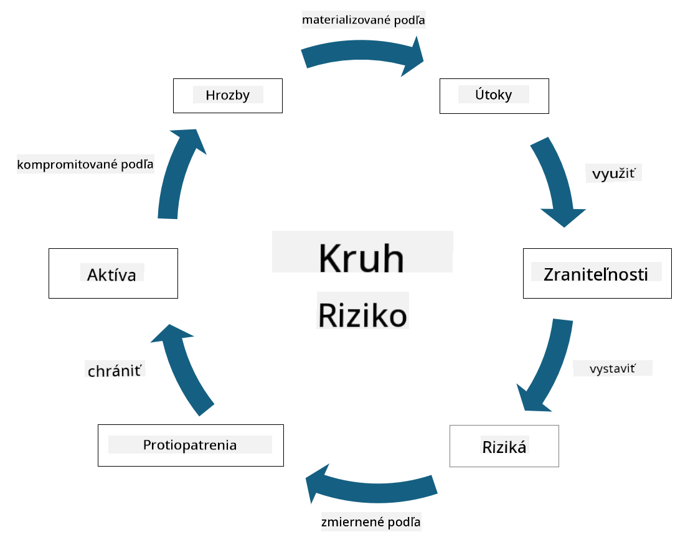

<!--
CO_OP_TRANSLATOR_METADATA:
{
  "original_hash": "fcca304f072cabf206388199e8e2e578",
  "translation_date": "2025-09-04T01:34:38+00:00",
  "source_file": "1.3 Understanding risk management.md",
  "language_code": "sk"
}
-->
# Pochopenie riadenia rizík

## Úvod

V tejto lekcii sa budeme venovať:

 - Definíciám bežne používaných bezpečnostných pojmov
   
 - Typom bezpečnostných opatrení

 - Hodnoteniu bezpečnostných rizík

## Definície bežne používaných bezpečnostných pojmov

Tieto pojmy sú základnými konceptmi v oblasti kybernetickej bezpečnosti a riadenia rizík. Poďme si ich rozobrať a vysvetliť, ako spolu súvisia:

1. **Agent hrozby**:

Agent hrozby je jednotlivec, skupina, organizácia alebo automatizovaný systém, ktorý má potenciál využiť zraniteľnosti systému alebo siete na spôsobenie škody. Agentmi hrozby môžu byť hackeri, autori malvéru, nespokojní zamestnanci alebo akýkoľvek subjekt, ktorý predstavuje riziko pre informačné a technologické systémy.

2. **Hrozba**:

Hrozba je potenciálna udalosť alebo akcia, ktorá môže využiť zraniteľnosti systému a spôsobiť škodu na aktíve. Hrozby môžu zahŕňať akcie ako hacking, úniky dát, útoky typu denial-of-service a podobne. Hrozby predstavujú „čo“ v zmysle potenciálnej škody, ktorú môžu spôsobiť na aktívach organizácie.

3. **Zraniteľnosť**:

Zraniteľnosť je slabina alebo chyba v dizajne, implementácii alebo konfigurácii systému, ktorú môže agent hrozby využiť na narušenie bezpečnosti systému. Zraniteľnosti môžu existovať v softvéri, hardvéri, procesoch alebo ľudskom správaní. Identifikácia a riešenie zraniteľností je kľúčové pre minimalizáciu rizika úspešných útokov.

4. **Riziko**:

Riziko je potenciálna strata, škoda alebo poškodenie, ktoré vyplýva z interakcie medzi hrozbou a zraniteľnosťou. Je to pravdepodobnosť, že agent hrozby využije zraniteľnosť na spôsobenie negatívneho dopadu. Riziká sa často hodnotia z hľadiska ich potenciálneho dopadu a pravdepodobnosti výskytu.

5. **Aktívum**:

Aktívum je čokoľvek hodnotné, čo organizácia chce chrániť. Aktíva môžu zahŕňať fyzické objekty (ako počítače a servery), dáta (informácie o zákazníkoch, finančné záznamy), duševné vlastníctvo (obchodné tajomstvá, patenty) a dokonca aj ľudské zdroje (zručnosti a vedomosti zamestnancov). Ochrana aktív je kľúčovým cieľom kybernetickej bezpečnosti.

6. **Expozícia**:

Expozícia označuje stav, keď je systém zraniteľný voči potenciálnym hrozbám. Nastáva, keď existuje zraniteľnosť, ktorú by mohol agent hrozby využiť. Expozícia zdôrazňuje riziko spojené s prítomnosťou zraniteľností v systéme alebo sieti.

7. **Opatrenie**:

Opatrenie je krok, ktorý sa prijíma na zníženie rizika spojeného so zraniteľnosťami a hrozbami. Opatrenia môžu byť technické, procedurálne alebo administratívne. Sú navrhnuté tak, aby predchádzali, detekovali alebo zmierňovali potenciálne hrozby a zraniteľnosti. Príklady zahŕňajú firewally, kontrolu prístupu, šifrovanie, bezpečnostné politiky a školenie zamestnancov.

Na zhrnutie vzťahu medzi týmito pojmami: Agenti hrozby využívajú zraniteľnosti na realizáciu hrozieb, ktoré môžu viesť k rizikám s potenciálom spôsobiť škodu na hodnotných aktívach. Expozícia nastáva, keď sú prítomné zraniteľnosti, a opatrenia sa zavádzajú na zníženie rizika tým, že predchádzajú alebo zmierňujú dopad hrozieb na aktíva. Tento rámec tvorí základ riadenia kybernetických rizík, ktorý organizáciám pomáha identifikovať, hodnotiť a riešiť potenciálne riziká pre ich informačné systémy a aktíva.

## Typy bezpečnostných opatrení

Bezpečnostné opatrenia sú kroky alebo ochranné mechanizmy implementované na ochranu informačných systémov a aktív pred rôznymi hrozbami a zraniteľnosťami. Môžu byť klasifikované do niekoľkých kategórií podľa ich zamerania a účelu. Tu sú niektoré bežné typy bezpečnostných opatrení:

1. **Administratívne opatrenia**:

Tieto opatrenia sa týkajú politík, postupov a smerníc, ktoré upravujú bezpečnostné praktiky organizácie a správanie používateľov.

- Bezpečnostné politiky a postupy: Dokumentované smernice, ktoré definujú, ako sa v organizácii udržiava bezpečnosť.

- Bezpečnostné povedomie a školenie: Programy na vzdelávanie zamestnancov o najlepších bezpečnostných praktikách a potenciálnych hrozbách.

- Reakcia na incidenty a ich riadenie: Plány na reakciu na bezpečnostné incidenty a ich zmiernenie.

2. **Technické opatrenia**:

Technické opatrenia zahŕňajú použitie technológie na presadzovanie bezpečnostných opatrení a ochranu systémov a dát. Príklady technických opatrení sú:

- Kontrola prístupu: Opatrenia, ktoré obmedzujú prístup používateľov k zdrojom na základe ich rolí a oprávnení.

- Šifrovanie: Konverzia dát do bezpečného formátu na zabránenie neoprávnenému prístupu.

- Firewally: Zariadenia na zabezpečenie siete, ktoré filtrujú a kontrolujú prichádzajúcu a odchádzajúcu komunikáciu.

- Systémy detekcie a prevencie narušení (IDPS): Nástroje na monitorovanie sieťovej komunikácie na podozrivú aktivitu.

- Antivírusový a antimalvérový softvér: Programy na detekciu a odstránenie škodlivého softvéru.

- Mechanizmy autentifikácie: Metódy na overenie identity používateľov, ako heslá, biometria a viacfaktorová autentifikácia.

- Správa záplat: Pravidelné aktualizovanie softvéru na riešenie známych zraniteľností.

3. **Fyzické opatrenia**:

Fyzické opatrenia sú kroky na ochranu fyzických aktív a zariadení.

- Bezpečnostní strážnici a personál na kontrolu prístupu: Personál, ktorý monitoruje a kontroluje prístup do fyzických priestorov.

- Kamerové systémy: Video monitorovacie systémy na sledovanie a zaznamenávanie aktivít.

- Zámky a fyzické bariéry: Fyzické opatrenia na obmedzenie prístupu do citlivých oblastí.

- Environmentálne opatrenia: Kroky na reguláciu teploty, vlhkosti a ďalších environmentálnych faktorov, ktoré ovplyvňujú zariadenia a dátové centrá.

4. **Operačné opatrenia**:

Tieto opatrenia sa týkajú každodenných operácií a aktivít, ktoré zabezpečujú nepretržitú bezpečnosť systémov.

- Riadenie zmien: Procesy na sledovanie a schvaľovanie zmien v systémoch a konfiguráciách.

- Zálohovanie a obnova po havárii: Plány na zálohovanie dát a ich obnovu v prípade zlyhania systémov alebo katastrof.

- Záznamy a auditovanie: Monitorovanie a zaznamenávanie aktivít systému na účely bezpečnosti a súladu.

- Bezpečné praktiky pri programovaní: Smernice na písanie softvéru s minimálnymi zraniteľnosťami.

5. **Právne a regulačné opatrenia**:

Tieto opatrenia zabezpečujú súlad s príslušnými zákonmi, reguláciami a priemyselnými normami. Normy, ktoré musí organizácia dodržiavať, závisia od jurisdikcie, odvetvia a ďalších faktorov.

- Regulácie ochrany dát: Súlad so zákonmi ako GDPR, HIPAA a CCPA.

- Priemyselné normy: Dodržiavanie noriem ako PCI DSS pre bezpečnosť údajov platobných kariet.

Tieto kategórie bezpečnostných opatrení spolupracujú na vytvorení komplexného bezpečnostného postavenia organizácií, ktoré pomáha chrániť ich systémy, dáta a aktíva pred širokou škálou hrozieb.

## Hodnotenie bezpečnostných rizík

Niektorí bezpečnostní odborníci si myslia, že riadenie rizík patrí výlučne odborníkom na riziká, ale pochopenie procesu riadenia bezpečnostných rizík je dôležité pre každého bezpečnostného odborníka, aby dokázal vyjadriť bezpečnostné riziko jazykom, ktorému zvyšok organizácie rozumie a na ktorý môže reagovať.

Organizácie musia neustále hodnotiť bezpečnostné riziká a rozhodovať, aké kroky (alebo nekroky) podniknú proti rizikám pre podnikanie. Nižšie je prehľad, ako sa to zvyčajne robí. Tento proces sa zvyčajne vykonáva naprieč viacerými tímami v rámci organizácie, je zriedkavé, aby jeden tím bol zodpovedný za kompletné riadenie rizík.

1. **Identifikácia aktív a hrozieb**:

Organizácia identifikuje aktíva, ktoré chce chrániť. Môžu zahŕňať dáta, systémy, hardvér, softvér, duševné vlastníctvo a ďalšie. Následne identifikuje potenciálne hrozby, ktoré by mohli tieto aktíva ohroziť.

2. **Hodnotenie zraniteľností**:

Organizácie potom identifikujú zraniteľnosti alebo slabiny v systémoch alebo procesoch, ktoré by mohli byť využité hrozbami. Tieto zraniteľnosti môžu pochádzať z chýb softvéru, nesprávnych konfigurácií, nedostatku bezpečnostných opatrení a ľudských chýb.

3. **Hodnotenie pravdepodobnosti**:

Organizácia potom vyhodnotí pravdepodobnosť výskytu každej hrozby. To zahŕňa zohľadnenie historických údajov, informácií o hrozbách, trendov v odvetví a interných faktorov. Pravdepodobnosť môže byť kategorizovaná ako nízka, stredná alebo vysoká na základe pravdepodobnosti realizácie hrozby.

4. **Hodnotenie dopadu**:

Ďalej organizácia určí potenciálny dopad každej hrozby, ak by využila zraniteľnosť. Dopad môže zahŕňať finančné straty, narušenie prevádzky, poškodenie reputácie, právne dôsledky a ďalšie. Dopad môže byť tiež kategorizovaný ako nízky, stredný alebo vysoký na základe potenciálnych následkov.

5. **Výpočet rizika**:

Hodnotenia pravdepodobnosti a dopadu sa kombinujú na výpočet celkovej úrovne rizika pre každú identifikovanú hrozbu. To sa často robí pomocou matice rizík, ktorá priraďuje číselné hodnoty alebo kvalitatívne popisy úrovniam pravdepodobnosti a dopadu. Výsledná úroveň rizika pomáha určiť, ktoré riziká si vyžadujú okamžitú pozornosť.

6. **Prioritizácia a rozhodovanie**:

Organizácia potom prioritizuje riziká tým, že sa zameriava na tie s najvyššími kombinovanými hodnotami pravdepodobnosti a dopadu. To jej umožňuje efektívnejšie alokovať zdroje a implementovať opatrenia. Hrozby s vysokým rizikom si vyžadujú okamžitú pozornosť, zatiaľ čo hrozby s nižším rizikom môžu byť riešené v dlhšom časovom horizonte.

7. **Riešenie rizík**:

Na základe hodnotenia rizík organizácia určí, ako zmierniť alebo riadiť každé riziko. To môže zahŕňať implementáciu bezpečnostných opatrení, prenesenie rizika prostredníctvom poistenia alebo dokonca akceptovanie určitých úrovní zvyškového rizika, ak sú považované za zvládnuteľné/príliš nákladné na odstránenie a pod.

8. **Neustále monitorovanie a prehodnocovanie**:

Hodnotenie rizík nie je jednorazový proces. Malo by sa vykonávať pravidelne alebo vždy, keď nastanú významné zmeny v prostredí organizácie. Neustále monitorovanie zabezpečuje, že nové hrozby, zraniteľnosti alebo zmeny v podnikateľskom prostredí sú zohľadnené.

Hodnotením bezpečnostných rizík týmto štruktúrovaným spôsobom môžu organizácie robiť informované rozhodnutia o alokácii zdrojov, bezpečnostných opatreniach a celkových stratégiách riadenia rizík. Cieľom je znížiť celkovú expozíciu organizácie voči rizikám a zároveň zosúladiť bezpečnostné úsilie s obchodnými cieľmi a prioritami organizácie.

---

**Upozornenie**:  
Tento dokument bol preložený pomocou služby na automatický preklad [Co-op Translator](https://github.com/Azure/co-op-translator). Aj keď sa snažíme o presnosť, upozorňujeme, že automatické preklady môžu obsahovať chyby alebo nepresnosti. Pôvodný dokument v jeho pôvodnom jazyku by mal byť považovaný za autoritatívny zdroj. Pre kritické informácie sa odporúča profesionálny ľudský preklad. Nezodpovedáme za akékoľvek nedorozumenia alebo nesprávne interpretácie vyplývajúce z použitia tohto prekladu.