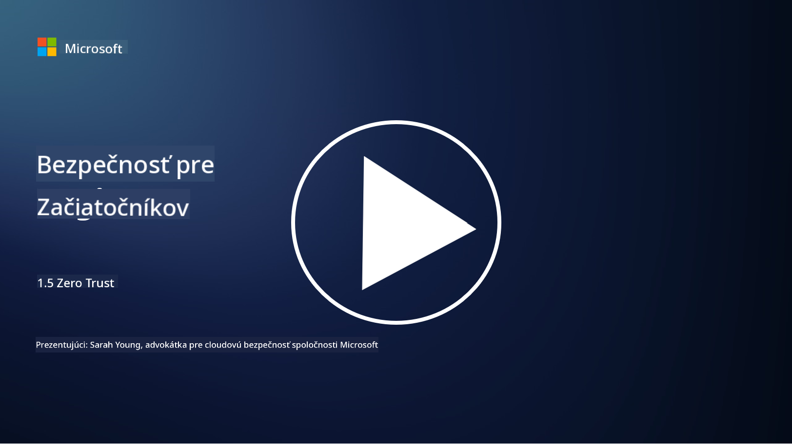

<!--
CO_OP_TRANSLATOR_METADATA:
{
  "original_hash": "75f77f972d2233c584f87c1eb96c983b",
  "translation_date": "2025-09-03T23:49:43+00:00",
  "source_file": "1.5 Zero trust.md",
  "language_code": "sk"
}
-->
# Zero Trust

„Zero trust“ je výraz, ktorý sa v súčasnosti často používa v bezpečnostných kruhoch. Ale čo vlastne znamená? Je to len módne slovo? V tejto lekcii sa podrobne pozrieme na to, čo zero trust skutočne je.

## Úvod

 - V tejto lekcii sa budeme venovať:
   
   
 - Čo je zero trust?

   
  

 - Ako sa zero trust líši od tradičných bezpečnostných architektúr?

   
   

 - Čo je obrana v hĺbke?

## Zero Trust

Zero Trust je prístup k kybernetickej bezpečnosti, ktorý spochybňuje tradičný koncept „dôveruj, ale preveruj“ tým, že predpokladá, že žiadny subjekt, či už vo vnútri alebo mimo siete organizácie, by nemal byť automaticky dôveryhodný. Namiesto toho Zero Trust presadzuje overovanie každého používateľa, zariadenia a aplikácie, ktoré sa pokúšajú získať prístup k zdrojom, bez ohľadu na ich umiestnenie. Hlavným princípom Zero Trust je minimalizácia „povrchu útoku“ a zníženie potenciálneho dopadu bezpečnostných narušení.

V modeli Zero Trust sa zdôrazňujú nasledujúce princípy:

1. **Overenie identity**: Autentifikácia a autorizácia sa dôsledne uplatňujú na všetkých používateľov a zariadenia, bez ohľadu na ich umiestnenie. Pamätajte, že identita nemusí byť nevyhnutne človek: môže to byť zariadenie, aplikácia atď.

2. **Najmenšie privilégium**: Používateľom a zariadeniam sa udeľuje minimálna úroveň prístupu potrebná na vykonanie ich úloh, čím sa znižuje potenciálne poškodenie v prípade kompromitácie.

3. **Mikrosegmentácia**: Sieťové zdroje sú rozdelené na menšie segmenty, aby sa obmedzil laterálny pohyb v rámci siete v prípade narušenia.

4. **Neustále monitorovanie**: Prebieha neustále monitorovanie a analýza správania používateľov a zariadení na detekciu anomálií a potenciálnych hrozieb. Moderné monitorovacie techniky využívajú strojové učenie, AI a spravodajstvo o hrozbách na poskytovanie ďalších detailov a kontextu monitorovania.

5. **Šifrovanie dát**: Dáta sú šifrované počas prenosu aj v pokoji, aby sa zabránilo neoprávnenému prístupu.

6. **Prísna kontrola prístupu**: Kontroly prístupu sa uplatňujú na základe kontextu, ako sú roly používateľov, stav zariadenia a umiestnenie v sieti.

Microsoft rozdeľuje zero trust do piatich pilierov, ktorým sa budeme venovať v neskoršej lekcii.

## Rozdiely oproti tradičným bezpečnostným architektúram

Zero Trust sa líši od tradičných bezpečnostných architektúr, ako sú modely založené na perimetri, v niekoľkých ohľadoch:

1. **Perimeter vs. identita**: Tradičné modely sa zameriavajú na zabezpečenie perimetra siete a predpokladajú, že interní používatelia a zariadenia môžu byť dôveryhodní, ak sú vo vnútri. Zero Trust naopak predpokladá, že hrozby môžu pochádzať zvnútra aj zvonka siete, a presadzuje prísne kontroly založené na identite.

2. **Implicitná vs. explicitná dôvera**: Tradičné modely implicitne dôverujú zariadeniam a používateľom v rámci siete, kým sa nepreukáže opak. Zero Trust explicitne overuje identity a neustále monitoruje anomálie.

3. **Plochá vs. segmentovaná sieť**: Tradičné architektúry často zahŕňajú ploché siete, kde majú interní používatelia široký prístup. Zero Trust presadzuje segmentáciu siete na menšie, izolované zóny, aby sa obmedzili potenciálne narušenia.

4. **Reaktívny vs. proaktívny**: Tradičná bezpečnosť často spolieha na reaktívne opatrenia, ako sú perimetrálne firewally a detekcia narušení. Zero Trust zaujíma proaktívny prístup tým, že predpokladá pravdepodobnosť narušení a minimalizuje ich dopad.

## Obrana v hĺbke

Obrana v hĺbke, známa aj ako vrstvená bezpečnosť, je stratégia kybernetickej bezpečnosti, ktorá zahŕňa nasadenie viacerých vrstiev bezpečnostných kontrol a opatrení na ochranu aktív organizácie. Cieľom je vytvoriť prekrývajúce sa vrstvy obrany, aby v prípade narušenia jednej vrstvy ostatné stále poskytovali ochranu. Každá vrstva sa zameriava na iný aspekt bezpečnosti a zvyšuje celkovú bezpečnostnú úroveň organizácie.

Obrana v hĺbke zahŕňa kombináciu technických, procedurálnych a fyzických bezpečnostných opatrení. Môžu to byť firewally, systémy detekcie narušení, kontroly prístupu, šifrovanie, školenie používateľov, bezpečnostné politiky a ďalšie. Myšlienkou je vytvoriť viacero bariér, ktoré spoločne sťažujú útočníkom preniknutie do systémov a sietí organizácie. Tento prístup je tiež známy ako „model švajčiarskeho syra“, ktorý sa používa aj v prevencii nehôd v iných odvetviach (napr. doprava).

## Ďalšie čítanie

[Čo je Zero Trust?](https://learn.microsoft.com/security/zero-trust/zero-trust-overview?WT.mc_id=academic-96948-sayoung)

[Evolúcia Zero Trust – Microsoft Position Paper](https://query.prod.cms.rt.microsoft.com/cms/api/am/binary/RWJJdT?WT.mc_id=academic-96948-sayoung)

[Zero Trust a BeyondCorp Google Cloud | Google Cloud Blog](https://cloud.google.com/blog/topics/developers-practitioners/zero-trust-and-beyondcorp-google-cloud)

---

**Upozornenie**:  
Tento dokument bol preložený pomocou služby na automatický preklad [Co-op Translator](https://github.com/Azure/co-op-translator). Aj keď sa snažíme o presnosť, upozorňujeme, že automatické preklady môžu obsahovať chyby alebo nepresnosti. Pôvodný dokument v jeho pôvodnom jazyku by mal byť považovaný za autoritatívny zdroj. Pre dôležité informácie sa odporúča profesionálny ľudský preklad. Nezodpovedáme za akékoľvek nedorozumenia alebo nesprávne interpretácie vyplývajúce z použitia tohto prekladu.