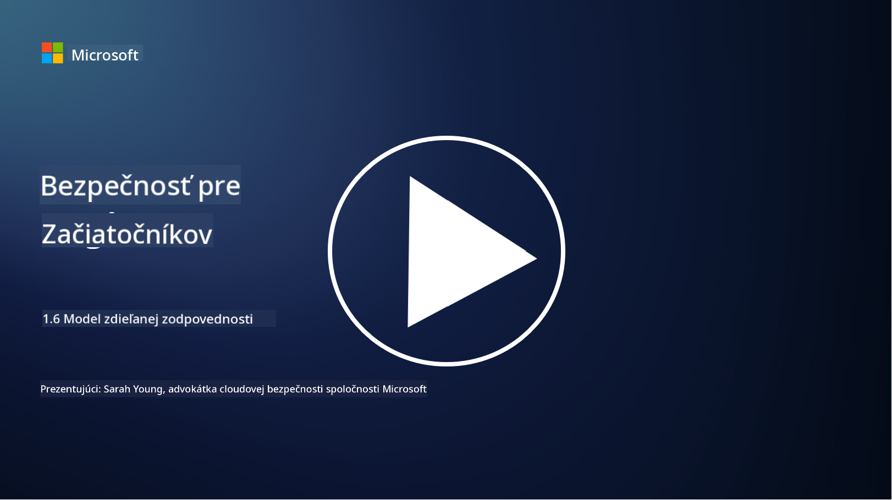

<!--
CO_OP_TRANSLATOR_METADATA:
{
  "original_hash": "a48db640d80c786b928ca178c414f084",
  "translation_date": "2025-09-04T00:28:23+00:00",
  "source_file": "1.6 Shared responsibility model.md",
  "language_code": "sk"
}
-->
# Model zdieľanej zodpovednosti

Zdieľaná zodpovednosť je novší koncept v IT, ktorý vznikol s príchodom cloud computingu. Z pohľadu kybernetickej bezpečnosti je kľúčové pochopiť, kto poskytuje ktoré bezpečnostné opatrenia, aby sa predišlo medzerám v obrane.

## Úvod

V tejto lekcii sa budeme venovať:

 - Čo je zdieľaná zodpovednosť v kontexte kybernetickej bezpečnosti?
   
 - Aký je rozdiel v zdieľanej zodpovednosti za bezpečnostné opatrenia
   medzi IaaS, PaaS a SaaS?

   

 - Kde môžete zistiť, aké bezpečnostné opatrenia poskytuje vaša cloudová platforma?

   
 

 - Čo znamená „dôveruj, ale preveruj“?

## Čo je zdieľaná zodpovednosť v kontexte kybernetickej bezpečnosti?

Zdieľaná zodpovednosť v kybernetickej bezpečnosti sa týka rozdelenia bezpečnostných povinností medzi poskytovateľa cloudových služieb (CSP) a jeho zákazníkov. V prostredí cloud computingu, ako je Infrastructure as a Service (IaaS), Platform as a Service (PaaS) a Software as a Service (SaaS), majú CSP aj zákazník svoje úlohy pri zabezpečovaní ochrany dát, aplikácií a systémov.

## Aký je rozdiel v zdieľanej zodpovednosti za bezpečnostné opatrenia medzi IaaS, PaaS a SaaS?

Rozdelenie zodpovedností zvyčajne závisí od typu používaných cloudových služieb:

 - **IaaS (Infrastructure as a Service)**: CSP poskytuje základnú infraštruktúru (servery, sieť, úložisko), zatiaľ čo zákazník je zodpovedný za správu operačných systémov, aplikácií a bezpečnostných konfigurácií na tejto infraštruktúre.
   
   
 - **PaaS (Platform as a Service):** CSP ponúka platformu, na ktorej môžu zákazníci vytvárať a nasadzovať aplikácie. CSP spravuje základnú infraštruktúru, zatiaľ čo zákazník sa sústreďuje na vývoj aplikácií a bezpečnosť dát.

   

 - **SaaS (Software as a Service)**: CSP poskytuje plne funkčné aplikácie dostupné cez internet. V tomto prípade je CSP zodpovedný za bezpečnosť aplikácie a infraštruktúry, zatiaľ čo zákazník spravuje prístup používateľov a používanie dát.

Pochopenie zdieľanej zodpovednosti je zásadné, pretože objasňuje, ktoré bezpečnostné aspekty pokrýva CSP a ktoré musí riešiť zákazník. Pomáha predchádzať nedorozumeniam a zabezpečuje, že bezpečnostné opatrenia sú implementované komplexne.

## Kde môžete zistiť, aké bezpečnostné opatrenia poskytuje vaša cloudová platforma?

Ak chcete zistiť, aké bezpečnostné opatrenia poskytuje vaša cloudová platforma, musíte sa obrátiť na dokumentáciu a zdroje poskytovateľa cloudových služieb. Tie zahŕňajú:

 - **Webová stránka a dokumentácia CSP**: Webová stránka CSP bude obsahovať informácie o bezpečnostných funkciách a opatreniach, ktoré sú súčasťou ich služieb. CSP zvyčajne ponúkajú podrobnú dokumentáciu, ktorá vysvetľuje ich bezpečnostné postupy, opatrenia a odporúčania. To môže zahŕňať whitepapery, bezpečnostné príručky a technickú dokumentáciu.
   
 - **Bezpečnostné hodnotenia a audity**: Väčšina CSP necháva svoje bezpečnostné opatrenia hodnotiť nezávislými bezpečnostnými expertmi a organizáciami. Tieto hodnotenia môžu poskytnúť prehľad o kvalite bezpečnostných opatrení CSP. Niekedy to vedie k získaniu certifikátu bezpečnostnej zhody (pozri nasledujúci bod).
 - **Certifikáty bezpečnostnej zhody**: Väčšina CSP získava certifikáty, ako sú ISO:27001, SOC 2 a FedRAMP, atď. Tieto certifikáty dokazujú, že poskytovateľ spĺňa konkrétne bezpečnostné a súladové normy.

Pamätajte, že úroveň detailov a dostupnosť informácií sa môže líšiť medzi poskytovateľmi cloudových služieb. Vždy sa uistite, že konzultujete oficiálne a aktuálne zdroje poskytované poskytovateľom cloudových služieb, aby ste mohli robiť informované rozhodnutia o bezpečnosti vašich cloudových aktív.

## Čo znamená „dôveruj, ale preveruj“?

V kontexte používania CSP, softvéru tretích strán alebo iných IT bezpečnostných služieb môže organizácia spočiatku dôverovať tvrdeniam poskytovateľa o bezpečnostných opatreniach. Avšak, aby skutočne zabezpečila ochranu svojich dát a systémov, mala by tieto tvrdenia preveriť prostredníctvom bezpečnostných hodnotení, penetračného testovania a preskúmania bezpečnostných opatrení externého subjektu pred úplnou integráciou softvéru alebo služby do svojich operácií. Všetci jednotlivci a organizácie by mali dôverovať, ale preverovať bezpečnostné opatrenia, za ktoré nie sú zodpovední.

## Zdieľaná zodpovednosť v rámci organizácie

Pamätajte, že zdieľaná zodpovednosť za bezpečnosť v rámci organizácie medzi rôznymi tímami musí byť tiež zohľadnená. Bezpečnostný tím zriedka implementuje všetky opatrenia sám a bude musieť spolupracovať s operačnými tímami, vývojármi a ďalšími časťami podniku, aby implementoval všetky bezpečnostné opatrenia potrebné na zabezpečenie organizácie.

## Ďalšie čítanie
- [Shared responsibility in the cloud - Microsoft Azure | Microsoft Learn](https://learn.microsoft.com/azure/security/fundamentals/shared-responsibility?WT.mc_id=academic-96948-sayoung)
- [What is shared responsibility model? – Definition from TechTarget.com](https://www.techtarget.com/searchcloudcomputing/definition/shared-responsibility-model)
- [The shared responsibility model explained and what it means for cloud security | CSO Online](https://www.csoonline.com/article/570779/the-shared-responsibility-model-explained-and-what-it-means-for-cloud-security.html)
- [Shared Responsibility for Cloud Security: What You Need to Know (cisecurity.org)](https://www.cisecurity.org/insights/blog/shared-responsibility-cloud-security-what-you-need-to-know)

---

**Upozornenie**:  
Tento dokument bol preložený pomocou služby na automatický preklad [Co-op Translator](https://github.com/Azure/co-op-translator). Aj keď sa snažíme o presnosť, upozorňujeme, že automatické preklady môžu obsahovať chyby alebo nepresnosti. Pôvodný dokument v jeho pôvodnom jazyku by mal byť považovaný za autoritatívny zdroj. Pre dôležité informácie sa odporúča profesionálny ľudský preklad. Nezodpovedáme za akékoľvek nedorozumenia alebo nesprávne interpretácie vyplývajúce z použitia tohto prekladu.