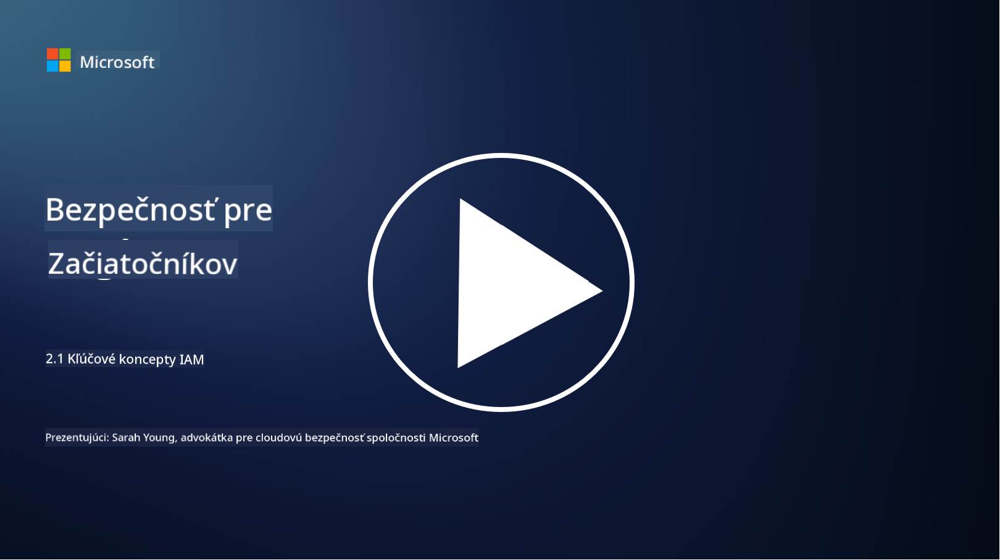

<!--
CO_OP_TRANSLATOR_METADATA:
{
  "original_hash": "2e3864e3d579f0dbb4ac2ec8c5f82acf",
  "translation_date": "2025-09-03T22:42:55+00:00",
  "source_file": "2.1 IAM key concepts.md",
  "language_code": "sk"
}
-->
# IAM kľúčové koncepty

Už ste sa niekedy prihlásili do počítača alebo na webovú stránku? Samozrejme, že áno! To znamená, že ste už vo svojom každodennom živote používali kontrolu identity. Riadenie identity a prístupu (IAM) je kľúčovým pilierom bezpečnosti, o ktorom sa dozvieme viac v nasledujúcich lekciách.

**Úvod**

V tejto lekcii sa budeme venovať:

- Čo znamená riadenie identity a prístupu (IAM) v kontexte kybernetickej bezpečnosti?

- Čo je princíp minimálnych oprávnení?

- Čo je oddelenie povinností?

- Čo je autentifikácia a autorizácia?

## Čo znamená riadenie identity a prístupu (IAM) v kontexte kybernetickej bezpečnosti?

Riadenie identity a prístupu (IAM) sa týka súboru procesov, technológií a politík, ktoré sa implementujú na zabezpečenie toho, aby správne osoby mali primeraný prístup k zdrojom v digitálnom prostredí organizácie. IAM zahŕňa správu digitálnych identít (používateľov, zamestnancov, partnerov) a ich prístupu k systémom, aplikáciám, dátam a sieťam. Hlavným cieľom IAM je zvýšiť bezpečnosť, zjednodušiť prístup používateľov a zabezpečiť súlad s politikami a predpismi organizácie. IAM riešenia zvyčajne zahŕňajú autentifikáciu používateľov, autorizáciu, vytváranie identít, kontrolu prístupu a správu životného cyklu používateľov (zabezpečenie, že účty sa odstránia, keď sa už nepoužívajú).

## Čo je princíp minimálnych oprávnení?

Princíp minimálnych oprávnení je základný koncept, ktorý odporúča udeľovať používateľom a systémom iba tie oprávnenia, ktoré sú nevyhnutné na vykonanie ich zamýšľaných úloh alebo rolí. Tento princíp pomáha obmedziť potenciálne škody, ktoré môžu vzniknúť v prípade bezpečnostného narušenia alebo hrozby zvnútra. Dodržiavaním princípu minimálnych oprávnení organizácie znižujú riziko neoprávneného prístupu, únikov dát a náhodného zneužitia oprávnení. V praxi to znamená, že používateľom sa udeľuje prístup iba k konkrétnym zdrojom a funkciám potrebným pre ich pracovné úlohy, a nič viac. Napríklad, ak potrebujete iba čítať dokument, bolo by nadbytočné, aby ste mali plné administrátorské oprávnenia k danému dokumentu.

## Čo je oddelenie povinností?

Oddelenie povinností je princíp zameraný na predchádzanie konfliktom záujmov a znižovanie rizika podvodov a chýb rozdelením kritických úloh a zodpovedností medzi rôznych jednotlivcov v organizácii. V kontexte kybernetickej bezpečnosti oddelenie povinností zahŕňa zabezpečenie, že žiadny jednotlivec nemá kontrolu nad všetkými aspektmi kritického procesu alebo systému. Cieľom je vytvoriť systém kontrol a rovnováh, ktorý zabráni tomu, aby jedna osoba mala schopnosť vykonať nastavenie aj schválenie procesu. Napríklad vo finančných systémoch to môže znamenať, že osoba, ktorá zadáva transakcie do systému, by nemala byť tá istá osoba, ktorá tieto transakcie schvaľuje. Tým sa znižuje riziko neoprávnených alebo podvodných akcií, ktoré by mohli zostať neodhalené.

## Čo je autentifikácia a autorizácia?

Autentifikácia a autorizácia sú dva základné koncepty v kybernetickej bezpečnosti, ktoré zohrávajú kľúčovú úlohu pri zabezpečení a integrite počítačových systémov a dát. Často sa používajú spoločne na kontrolu prístupu k zdrojom a ochranu citlivých informácií.

**1. Autentifikácia**: Autentifikácia je proces overovania identity používateľa, systému alebo entity, ktorá sa pokúša získať prístup k počítačovému systému alebo konkrétnemu zdroju. Zabezpečuje, že deklarovaná identita je pravá a presná. Metódy autentifikácie zvyčajne zahŕňajú použitie jedného alebo viacerých z nasledujúcich faktorov:

   a. Niečo, čo viete: Zahŕňa heslá, PIN kódy alebo iné tajné informácie, ktoré by mal vlastniť iba oprávnený používateľ.

   b. Niečo, čo máte: Zahŕňa fyzické tokeny alebo zariadenia, ako sú inteligentné karty, bezpečnostné tokeny alebo mobilné telefóny, ktoré sa používajú na potvrdenie identity používateľa.

   c. Niečo, čo ste: Týka sa biometrických faktorov, ako sú odtlačky prstov, rozpoznávanie tváre alebo skeny sietnice, ktoré sú jedinečné pre jednotlivca.

Mechanizmy autentifikácie sa používajú na potvrdenie, že používateľ je tým, za koho sa vydáva, predtým než mu je umožnený prístup k systému alebo zdroju. Pomáha to predchádzať neoprávnenému prístupu a zabezpečuje, že iba legitímni používatelia môžu vykonávať akcie v rámci systému.

**2. Autorizácia**: Autorizácia je proces udeľovania alebo odmietania konkrétnych povolení a oprávnení autentifikovaným používateľom alebo entitám po overení ich identity. Určuje, aké akcie alebo operácie môže používateľ vykonávať v rámci systému alebo na konkrétnych zdrojoch. Autorizácia je často založená na preddefinovaných politikách, pravidlách kontroly prístupu a rolách priradených používateľom.

Autorizáciu si môžete predstaviť ako odpoveď na otázku: "Čo môže autentifikovaný používateľ robiť?" Zahŕňa definovanie a presadzovanie politík kontroly prístupu na ochranu citlivých dát a zdrojov pred neoprávneným prístupom alebo úpravou.

**Zhrnutie:**

- Autentifikácia určuje identitu používateľov alebo entít.
- Autorizácia určuje, aké akcie a zdroje môžu autentifikovaní používatelia pristupovať alebo manipulovať.

## Ďalšie čítanie

- [Describe identity concepts - Training | Microsoft Learn](https://learn.microsoft.com/training/modules/describe-identity-principles-concepts/?WT.mc_id=academic-96948-sayoung)
- [Introduction to identity - Microsoft Entra | Microsoft Learn](https://learn.microsoft.com/azure/active-directory/fundamentals/identity-fundamental-concepts?WT.mc_id=academic-96948-sayoung)
- [What is Identity Access Management (IAM)? | Microsoft Security](https://www.microsoft.com/security/business/security-101/what-is-identity-access-management-iam?WT.mc_id=academic-96948-sayoung)
- [What is IAM? Identity and access management explained | CSO Online](https://www.csoonline.com/article/518296/what-is-iam-identity-and-access-management-explained.html)
- [What is IAM? (auth0.com)](https://auth0.com/blog/what-is-iam/)
- [Security+: implementing Identity and Access Management (IAM) controls [updated 2021] | Infosec (infosecinstitute.com)](https://resources.infosecinstitute.com/certifications/securityplus/security-implementing-identity-and-access-management-iam-controls/)
- [least privilege - Glossary | CSRC (nist.gov)](https://csrc.nist.gov/glossary/term/least_privilege)
- [Security: The Principle of Least Privilege (POLP) - Microsoft Community Hub](https://techcommunity.microsoft.com/t5/azure-sql-blog/security-the-principle-of-least-privilege-polp/ba-p/2067390?WT.mc_id=academic-96948-sayoung)
- [Principle of least privilege | CERT NZ](https://www.cert.govt.nz/it-specialists/critical-controls/principle-of-least-privilege/)
- [Why is separation of duties required by NIST 800-171 and CMMC? - (totem.tech)](https://www.totem.tech/cmmc-separation-of-duties/)

---

**Upozornenie**:  
Tento dokument bol preložený pomocou služby AI prekladu [Co-op Translator](https://github.com/Azure/co-op-translator). Hoci sa snažíme o presnosť, prosím, berte na vedomie, že automatizované preklady môžu obsahovať chyby alebo nepresnosti. Pôvodný dokument v jeho pôvodnom jazyku by mal byť považovaný za autoritatívny zdroj. Pre kritické informácie sa odporúča profesionálny ľudský preklad. Nie sme zodpovední za akékoľvek nedorozumenia alebo nesprávne interpretácie vyplývajúce z použitia tohto prekladu.