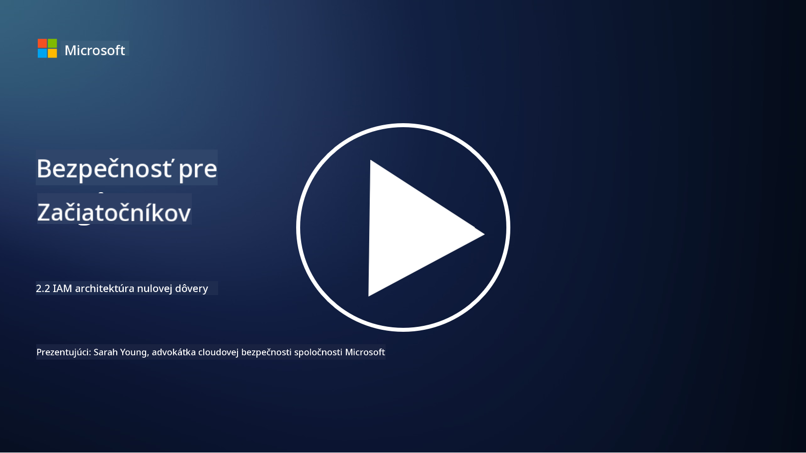

<!--
CO_OP_TRANSLATOR_METADATA:
{
  "original_hash": "4774a978af123f72ebb872199c4c4d4f",
  "translation_date": "2025-09-03T23:43:15+00:00",
  "source_file": "2.2 IAM zero trust architecture.md",
  "language_code": "sk"
}
-->
# IAM architektúra nulovej dôvery

Identita je kľúčovou súčasťou implementácie architektúry nulovej dôvery a budovania perimetra pre akékoľvek IT prostredie. V tejto sekcii preskúmame, prečo je dôležité používať kontrolu identity na implementáciu nulovej dôvery.

## Úvod

V tejto lekcii sa budeme venovať:

 - Prečo je potrebné používať identitu ako náš perimeter v moderných IT prostrediach?
   
 - Ako sa to líši od tradičných IT architektúr?

 - Ako sa identita používa na implementáciu architektúry nulovej dôvery?

## Prečo je potrebné používať identitu ako náš perimeter v moderných IT prostrediach?

V moderných IT prostrediach sa tradičný koncept fyzického perimetra (používanie nástrojov ako firewally a sieťové hranice) ako primárnej línie obrany proti kybernetickým hrozbám stáva menej efektívnym kvôli rastúcej komplexnosti technológií, nárastu práce na diaľku a prijatiu cloudových služieb. Namiesto toho sa organizácie presúvajú k používaniu identity ako nového perimetra. To znamená, že bezpečnosť sa sústreďuje na overovanie a správu identity používateľov, zariadení a aplikácií, ktoré sa pokúšajú získať prístup k zdrojom, bez ohľadu na ich fyzickú polohu.

Tu je dôvod, prečo je používanie identity ako perimetra kľúčové v moderných IT prostrediach:

**Práca na diaľku**: S prácou na diaľku a mobilnými zariadeniami, ktoré sa stávajú normou, môžu používatelia pristupovať k zdrojom z rôznych miest a zariadení. Tradičný prístup perimetra nefunguje, keď už používatelia nie sú obmedzení na fyzickú kanceláriu.

**Cloudové a hybridné prostredia**: Organizácie čoraz viac prijímajú cloudové služby a hybridné prostredia. Dáta a aplikácie už nie sú výlučne umiestnené v priestoroch organizácie, čo robí tradičné obranné perimeter menej relevantnými.

**Bezpečnosť nulovej dôvery**: Koncept bezpečnosti nulovej dôvery predpokladá, že žiadny subjekt, či už vo vnútri alebo mimo siete, by nemal byť automaticky dôveryhodný. Identita sa stáva základom pre overovanie požiadaviek na prístup, bez ohľadu na to, odkiaľ pochádzajú.

**Hrozby**: Kybernetické hrozby sa vyvíjajú a útočníci nachádzajú spôsoby, ako obísť tradičné obranné perimeter. Phishing, sociálne inžinierstvo a interné hrozby často využívajú ľudské zraniteľnosti namiesto pokusov o preniknutie cez sieťové perimeter.

**Prístup zameraný na dáta**: Ochrana citlivých dát je zásadná. Zameraním sa na identitu môžu organizácie kontrolovať, kto má prístup k akým dátam, čím znižujú riziko úniku dát.

## Ako sa to líši od tradičných IT architektúr?

Tradičné IT architektúry sa silno spoliehali na modely bezpečnosti založené na perimetri, kde firewally a sieťové hranice zohrávali významnú úlohu pri udržiavaní hrozieb mimo. Hlavné rozdiely medzi tradičným a prístupom zameraným na identitu sú:

|      Aspekt                 |      Tradičné IT architektúry                                                                  |      Prístup zameraný na identitu                                                                             |
|-----------------------------|------------------------------------------------------------------------------------------------|------------------------------------------------------------------------------------------------------------|
|     Zameranie               |     Zameranie na perimeter: Spoliehanie sa na obranu perimetra, ako sú   firewally a kontrola prístupu. |     Zameranie na overovanie identity: Presun od sieťových hraníc k overovaniu   identity používateľa/zariadenia. |
|     Poloha                  |     Závislosť na polohe: Bezpečnosť viazaná na fyzické kancelárske lokality a   sieťové hranice. |     Nezávislosť na polohe: Bezpečnosť nie je viazaná na konkrétne lokality; prístup   odkiaľkoľvek. |
|     Predpokladaná dôvera    |     Predpokladaná dôvera: Predpokladaná dôvera v rámci sieťového perimetra pre   používateľov/zariadenia. |     Prístup nulovej dôvery: Dôvera sa nikdy nepredpokladá; prístup je overovaný na   základe identity a kontextu. |
|     Zohľadnenie zariadení   |     Rozmanitosť zariadení: Predpokladalo sa, že zariadenia v rámci sieťového perimetra sú   bezpečné. |     Povedomie o zariadeniach: Zohľadnenie zdravia a bezpečnostného stavu zariadení,   bez ohľadu na polohu. |
|     Ochrana dát             |     Ochrana dát: Zameranie na zabezpečenie sieťových perimetrov pre ochranu   dát. |     Ochrana zameraná na dáta: Zameranie na kontrolu prístupu k dátam na základe   identity a citlivosti dát. |
|                             |                                                                                              |                                                                                                            |

## Ako sa identita používa na implementáciu architektúry nulovej dôvery?

V architektúre nulovej dôvery je základným princípom nikdy automaticky nedôverovať žiadnemu subjektu, bez ohľadu na to, či je vo vnútri alebo mimo sieťového perimetra. Identita zohráva ústrednú úlohu pri implementácii prístupu nulovej dôvery tým, že umožňuje neustále overovanie subjektov, ktoré sa pokúšajú získať prístup k zdrojom. Moderné bezpečnostné kontroly identity umožňujú, aby každý používateľ, zariadenie, aplikácia a služba, ktorá žiada o prístup k zdrojom, bola dôkladne identifikovaná a autentifikovaná pred udelením prístupu. To zahŕňa overovanie ich digitálnej identity prostredníctvom metód, ako sú kombinácie používateľského mena/hesla, viacfaktorová autentifikácia (MFA), biometria a iné silné autentifikačné mechanizmy.

## Ďalšie čítanie

- [Securing identity with Zero Trust | Microsoft Learn](https://learn.microsoft.com/security/zero-trust/deploy/identity?WT.mc_id=academic-96948-sayoung)
- [Zero Trust Principles and Guidance for Identity and Access | CSA (cloudsecurityalliance.org)](https://cloudsecurityalliance.org/artifacts/zero-trust-principles-and-guidance-for-iam/)
- [Zero Trust Identity Controls - Essentials Series - Episode 2 - YouTube](https://www.youtube.com/watch?v=fQZQznIKcGM&list=PLXtHYVsvn_b_gtX1-NB62wNervQx1Fhp4&index=13)

---

**Upozornenie**:  
Tento dokument bol preložený pomocou služby na automatický preklad [Co-op Translator](https://github.com/Azure/co-op-translator). Aj keď sa snažíme o presnosť, upozorňujeme, že automatické preklady môžu obsahovať chyby alebo nepresnosti. Pôvodný dokument v jeho pôvodnom jazyku by mal byť považovaný za autoritatívny zdroj. Pre dôležité informácie sa odporúča profesionálny ľudský preklad. Nezodpovedáme za akékoľvek nedorozumenia alebo nesprávne interpretácie vyplývajúce z použitia tohto prekladu.