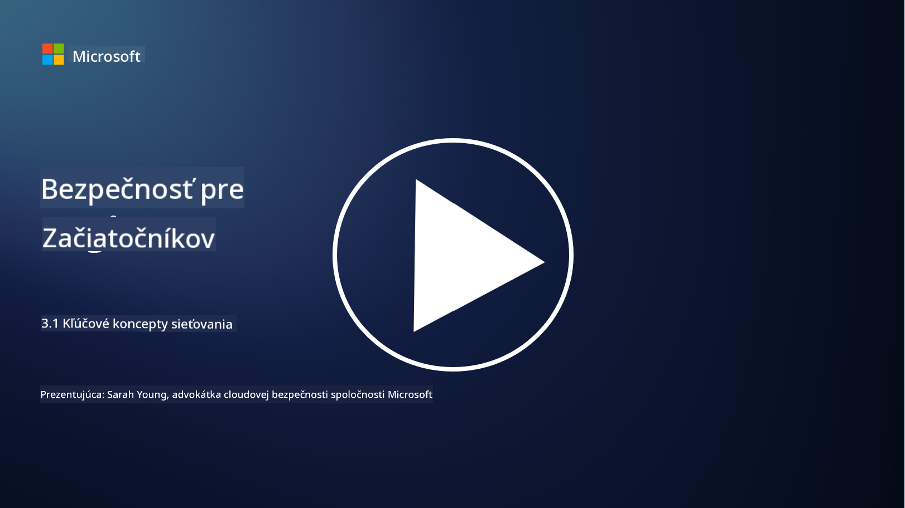
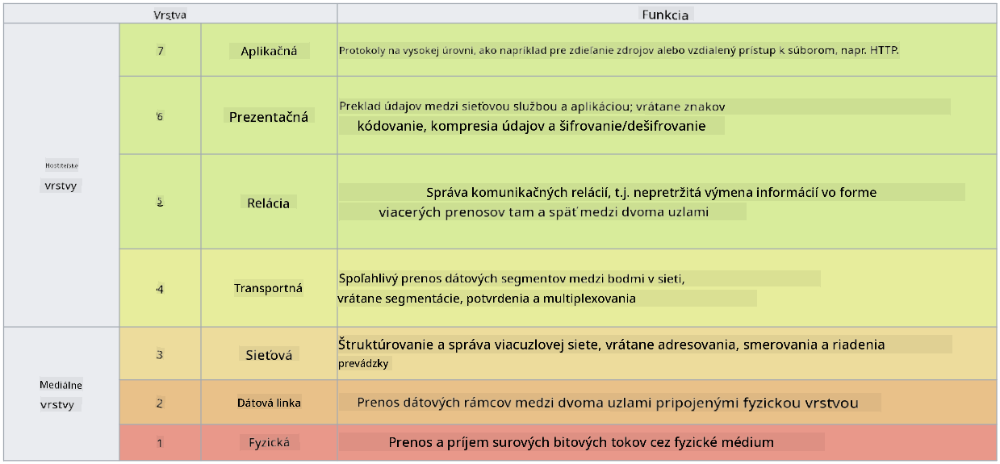

<!--
CO_OP_TRANSLATOR_METADATA:
{
  "original_hash": "252724eceeb183fb9018f88c5e1a3f0c",
  "translation_date": "2025-09-04T01:49:40+00:00",
  "source_file": "3.1 Networking key concepts.md",
  "language_code": "sk"
}
-->
# Kľúčové koncepty sieťovania

Ak ste niekedy pracovali v IT, pravdepodobne ste sa stretli s konceptmi sieťovania. Aj keď v moderných prostrediach používame identitu ako primárnu kontrolu perimetra, neznamená to, že sieťové kontroly sú zbytočné. Hoci ide o rozsiahlu tému, v tejto lekcii sa zameriame na niektoré kľúčové koncepty sieťovania.

V tejto lekcii sa budeme venovať:

 - Čo je IP adresa?
   
 - Čo je OSI model?

 

 - Čo je TCP/UDP?

   
 

 - Čo sú portové čísla?

   
  

 - Čo je šifrovanie v pokoji a počas prenosu?

## Čo je IP adresa?

IP adresa, alebo Internet Protocol adresa, je číselný identifikátor priradený každému zariadeniu pripojenému k počítačovej sieti, ktorá používa internetový protokol na komunikáciu. Slúži ako jedinečný identifikátor zariadení v sieti, čo im umožňuje odosielať a prijímať dáta cez internet alebo iné prepojené siete. Existujú dve hlavné verzie IP adries: IPv4 (Internet Protocol verzia 4) a IPv6 (Internet Protocol verzia 6). IP adresa sa zvyčajne uvádza vo formáte IPv4 (napr. 192.168.1.1) alebo IPv6 (napr. 2001:0db8:85a3:0000:0000:8a2e:0370:7334).

## Čo je OSI model?

OSI (Open Systems Interconnection) model je konceptuálny rámec, ktorý štandardizuje funkcie komunikačného systému do siedmich samostatných vrstiev. Každá vrstva vykonáva špecifické úlohy a komunikuje so susednými vrstvami, aby zabezpečila efektívnu a spoľahlivú komunikáciu medzi zariadeniami v sieti. Vrstvy, odspodu nahor, sú nasledovné:

 1. Fyzická vrstva
    
 
 2. Dátová spojová vrstva

    
    

 1. Sieťová vrstva

    
   

 1. Transportná vrstva

    

 1. Relačná vrstva

    
   

 1. Prezentačná vrstva

    
    

 1. Aplikačná vrstva

OSI model poskytuje spoločný referenčný rámec na pochopenie, ako sieťové protokoly a technológie spolupracujú, bez ohľadu na konkrétne hardvérové alebo softvérové implementácie.

_ref: https://en.wikipedia.org/wiki/OSI_model_

## Čo je TCP/UDP?

TCP (Transmission Control Protocol) a UDP (User Datagram Protocol) sú dva základné protokoly transportnej vrstvy používané v počítačových sieťach na uľahčenie komunikácie medzi zariadeniami cez internet alebo v lokálnej sieti. Sú zodpovedné za rozdelenie dát na pakety na prenos a následné zloženie týchto paketov do pôvodných dát na prijímacej strane. Líšia sa však svojimi vlastnosťami a spôsobmi použitia.

**TCP (Transmission Control Protocol)**:

TCP je protokol orientovaný na spojenie, ktorý poskytuje spoľahlivé a usporiadané doručovanie dát medzi zariadeniami. Pred začiatkom výmeny dát vytvára spojenie medzi odosielateľom a prijímateľom. TCP zabezpečuje, že dátové pakety dorazia v správnom poradí a dokáže opätovne preniesť stratené pakety, aby zaručil integritu a úplnosť dát. To robí TCP vhodným pre aplikácie, ktoré vyžadujú spoľahlivé doručovanie dát, ako je prehliadanie webu, e-mail, prenos súborov (FTP) a komunikácia s databázami.

**UDP (User Datagram Protocol)**:

UDP je protokol bez spojenia, ktorý ponúka rýchlejší prenos dát, ale neposkytuje rovnakú úroveň spoľahlivosti ako TCP. Nevytvára formálne spojenie pred odoslaním dát a neobsahuje mechanizmy na potvrdenie alebo opätovný prenos stratených paketov. UDP je vhodný pre aplikácie, kde je rýchlosť a efektivita dôležitejšia ako zaručené doručenie, ako napríklad pri komunikácii v reálnom čase, streamovaní médií, online hrách a DNS dotazoch.

Zhrnuté, TCP uprednostňuje spoľahlivosť a usporiadané doručovanie, čo ho robí vhodným pre aplikácie, ktoré vyžadujú presnosť dát, zatiaľ čo UDP kladie dôraz na rýchlosť a efektivitu, čo ho robí vhodným pre aplikácie, kde je prijateľná menšia strata dát alebo zmena poradia výmenou za nižšiu latenciu. Voľba medzi TCP a UDP závisí od konkrétnych požiadaviek aplikácie alebo služby.

## Čo sú portové čísla?

V sieťovaní je portové číslo číselný identifikátor používaný na rozlíšenie medzi rôznymi službami alebo aplikáciami, ktoré bežia na jednom zariadení v sieti. Porty pomáhajú smerovať prichádzajúce dáta na správnu aplikáciu. Portové čísla sú 16-bitové nezáporné celé čísla, čo znamená, že sa pohybujú v rozsahu od 0 do 65535. Sú rozdelené do troch rozsahov:

- Známe porty (0-1023): Rezervované pre štandardné služby ako HTTP (port 80) a FTP (port 21).

- Registrované porty (1024-49151): Používané pre aplikácie a služby, ktoré nie sú súčasťou známeho rozsahu, ale sú oficiálne registrované.

- Dynamické/Súkromné porty (49152-65535): Dostupné na dočasné alebo súkromné použitie aplikáciami.

## Čo je šifrovanie v pokoji a počas prenosu?

Šifrovanie je proces konverzie dát do zabezpečeného formátu, aby sa chránili pred neoprávneným prístupom alebo manipuláciou. Šifrovanie sa môže aplikovať na dáta „v pokoji“ (uložené na zariadení alebo serveri) a „počas prenosu“ (prenášané medzi zariadeniami alebo cez siete).

Šifrovanie v pokoji: Zahŕňa šifrovanie dát, ktoré sú uložené na zariadeniach, serveroch alebo úložných systémoch. Aj keď útočník získa fyzický prístup k úložnému médiu, bez šifrovacích kľúčov nemôže získať prístup k dátam. Toto je kľúčové pre ochranu citlivých dát v prípade krádeže zariadenia, úniku dát alebo neoprávneného prístupu.

Šifrovanie počas prenosu: Zahŕňa šifrovanie dát počas ich prenosu medzi zariadeniami alebo cez siete. Tým sa zabraňuje odpočúvaniu a neoprávnenému zachytávaniu dát počas prenosu. Bežné protokoly na šifrovanie počas prenosu zahŕňajú HTTPS pre webovú komunikáciu a TLS/SSL na zabezpečenie rôznych typov sieťovej prevádzky.

## Ďalšie čítanie
- [How Do IP Addresses Work? (howtogeek.com)](https://www.howtogeek.com/341307/how-do-ip-addresses-work/)
- [Understanding IP Address: An Introductory Guide (geekflare.com)](https://geekflare.com/understanding-ip-address/)
- [What is the OSI model? The 7 layers of OSI explained (techtarget.com)](https://www.techtarget.com/searchnetworking/definition/OSI)
- [The OSI Model – The 7 Layers of Networking Explained in Plain English (freecodecamp.org)](https://www.freecodecamp.org/news/osi-model-networking-layers-explained-in-plain-english/)
- [TCP/IP protocols - IBM Documentation](https://www.ibm.com/docs/en/aix/7.3?topic=protocol-tcpip-protocols)
- [Common Ports Cheat Sheet: The Ultimate Ports & Protocols List (stationx.net)](https://www.stationx.net/common-ports-cheat-sheet/)
- [Azure Data Encryption-at-Rest - Azure Security | Microsoft Learn](https://learn.microsoft.com/azure/security/fundamentals/encryption-atrest?WT.mc_id=academic-96948-sayoung)

---

**Upozornenie**:  
Tento dokument bol preložený pomocou služby na automatický preklad [Co-op Translator](https://github.com/Azure/co-op-translator). Aj keď sa snažíme o presnosť, upozorňujeme, že automatické preklady môžu obsahovať chyby alebo nepresnosti. Pôvodný dokument v jeho pôvodnom jazyku by mal byť považovaný za autoritatívny zdroj. Pre kritické informácie sa odporúča profesionálny ľudský preklad. Nezodpovedáme za akékoľvek nedorozumenia alebo nesprávne interpretácie vyplývajúce z použitia tohto prekladu.