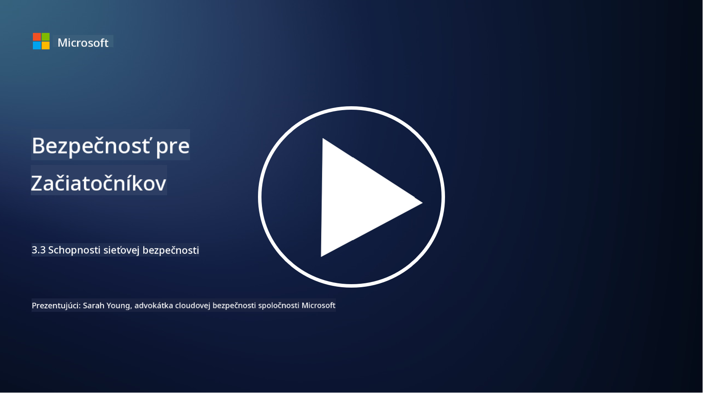

<!--
CO_OP_TRANSLATOR_METADATA:
{
  "original_hash": "c3aba077bb98eebc925dd58d870229ab",
  "translation_date": "2025-09-03T23:35:39+00:00",
  "source_file": "3.3 Network security capabilities.md",
  "language_code": "sk"
}
-->
# Schopnosti zabezpečenia siete

V tejto lekcii sa naučíme o nasledujúcich schopnostiach, ktoré môžu byť použité na zabezpečenie siete:

 - Tradičné firewally
 - Firewally pre webové aplikácie
 - Bezpečnostné skupiny v cloude
 - CDN
 - Load balancery
 - Bastion hosty
 - VPN
 - Ochrana proti DDoS útokom

## Tradičné firewally

Tradičné firewally sú bezpečnostné zariadenia, ktoré kontrolujú a monitorujú prichádzajúcu a odchádzajúcu sieťovú komunikáciu na základe preddefinovaných bezpečnostných pravidiel. Pôsobia ako bariéra medzi dôveryhodnou internou sieťou a nedôveryhodnými externými sieťami, filtrujú komunikáciu, aby zabránili neoprávnenému prístupu a potenciálnym hrozbám.

## Firewally pre webové aplikácie

Firewally pre webové aplikácie (WAF) sú špecializované firewally navrhnuté na ochranu webových aplikácií pred rôznymi útokmi, ako sú SQL injekcie, cross-site scripting a iné zraniteľnosti. Analyzujú HTTP požiadavky a odpovede, aby identifikovali a blokovali škodlivú komunikáciu zameranú na webové aplikácie.

## Bezpečnostné skupiny v cloude

Bezpečnostné skupiny sú základnou funkciou zabezpečenia siete poskytovanou poskytovateľmi cloudových služieb. Pôsobia ako virtuálne firewally, ktoré kontrolujú prichádzajúcu a odchádzajúcu komunikáciu do a z cloudových zdrojov, ako sú virtuálne stroje (VM) a inštancie. Bezpečnostné skupiny umožňujú organizáciám definovať pravidlá, ktoré určujú, aké typy komunikácie sú povolené a zakázané, čím pridávajú ďalšiu vrstvu ochrany do cloudových nasadení.

## Content Delivery Network (CDN)

Content Delivery Network je distribuovaná sieť serverov umiestnených v rôznych geografických lokalitách. CDN pomáhajú zlepšiť výkon a dostupnosť webových stránok tým, že ukladajú obsah do vyrovnávacej pamäte a poskytujú ho zo serverov, ktoré sú bližšie k používateľovi. Poskytujú tiež určitú úroveň ochrany proti DDoS útokom tým, že rozdeľujú komunikáciu medzi viaceré serverové lokality.

## Load balancery

Load balancery rozdeľujú prichádzajúcu sieťovú komunikáciu medzi viaceré servery, aby optimalizovali využitie zdrojov, zabezpečili vysokú dostupnosť a zlepšili výkon aplikácií. Pomáhajú predchádzať preťaženiu serverov a udržiavajú efektívne časy odozvy, čím zvyšujú odolnosť siete.

## Bastion hosty

Bastion hosty sú vysoko zabezpečené a izolované servery, ktoré poskytujú kontrolovaný prístup do siete z externých, nedôveryhodných sietí (ako je internet). Slúžia ako vstupné body pre administrátorov na bezpečný prístup k interným systémom. Bastion hosty sú zvyčajne konfigurované s prísnymi bezpečnostnými opatreniami na minimalizáciu rizika útokov.

## Virtuálne privátne siete (VPN)

VPN vytvárajú šifrované tunely medzi zariadením používateľa a vzdialeným serverom, čím zabezpečujú bezpečnú a súkromnú komunikáciu cez potenciálne nebezpečné siete, ako je internet. VPN sa často používajú na poskytovanie vzdialeného prístupu k interným sieťam, čo umožňuje používateľom prístup k zdrojom, akoby boli fyzicky pripojení k rovnakej sieti.

## Nástroje na ochranu proti DDoS útokom

Nástroje a služby na ochranu proti DDoS (Distributed Denial of Service) útokom sú navrhnuté na zmiernenie dopadu DDoS útokov, pri ktorých viaceré kompromitované zariadenia zaplavujú sieť alebo službu, aby ju preťažili. Riešenia na ochranu proti DDoS identifikujú a filtrujú škodlivú komunikáciu, čím zabezpečujú, že legitímna komunikácia môže stále dosiahnuť svoj cieľ.

## Ďalšie čítanie

- [Čo je firewall? - Cisco](https://www.cisco.com/c/en/us/products/security/firewalls/what-is-a-firewall.html#~types-of-firewalls)
- [Čo vlastne robí firewall? (howtogeek.com)](https://www.howtogeek.com/144269/htg-explains-what-firewalls-actually-do/)
- [Čo je firewall? Ako funguje firewall a typy firewallov (kaspersky.com)](https://www.kaspersky.com/resource-center/definitions/firewall)
- [Bezpečnostná skupina siete - ako funguje | Microsoft Learn](https://learn.microsoft.com/azure/virtual-network/network-security-group-how-it-works)
- [Úvod do Azure Content Delivery Network (CDN) - Školenie | Microsoft Learn](https://learn.microsoft.com/training/modules/intro-to-azure-content-delivery-network/?WT.mc_id=academic-96948-sayoung)
- [Čo je Content Delivery Network (CDN)? - Azure | Microsoft Learn](https://learn.microsoft.com/azure/cdn/cdn-overview?WT.mc_id=academic-96948-sayoung)
- [Čo je load balancing? Ako fungujú load balancery (nginx.com)](https://www.nginx.com/resources/glossary/load-balancing/)
- [Bastion hosty vs. VPN · Tailscale](https://tailscale.com/learn/bastion-hosts-vs-vpns/)
- [Čo je VPN? Ako funguje, typy VPN (kaspersky.com)](https://www.kaspersky.com/resource-center/definitions/what-is-a-vpn)
- [Úvod do Azure DDoS Protection - Školenie | Microsoft Learn](https://learn.microsoft.com/training/modules/introduction-azure-ddos-protection/?WT.mc_id=academic-96948-sayoung)
- [Čo je DDoS útok? | Microsoft Security](https://www.microsoft.com/security/business/security-101/what-is-a-ddos-attack?WT.mc_id=academic-96948-sayoung)

---

**Upozornenie**:  
Tento dokument bol preložený pomocou služby AI prekladu [Co-op Translator](https://github.com/Azure/co-op-translator). Hoci sa snažíme o presnosť, prosím, berte na vedomie, že automatizované preklady môžu obsahovať chyby alebo nepresnosti. Pôvodný dokument v jeho pôvodnom jazyku by mal byť považovaný za autoritatívny zdroj. Pre kritické informácie sa odporúča profesionálny ľudský preklad. Nenesieme zodpovednosť za akékoľvek nedorozumenia alebo nesprávne interpretácie vyplývajúce z použitia tohto prekladu.