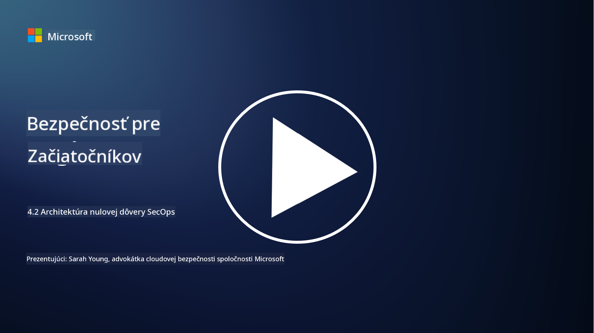

<!--
CO_OP_TRANSLATOR_METADATA:
{
  "original_hash": "45bbdc114e70936816b0b3e7c40189cf",
  "translation_date": "2025-09-04T00:46:57+00:00",
  "source_file": "4.2 SecOps zero trust architecture.md",
  "language_code": "sk"
}
-->
# Architektúra nulovej dôvery pre bezpečnostné operácie

Bezpečnostné operácie tvoria dve časti architektúry nulovej dôvery a v tejto lekcii sa naučíme o oboch:

- Ako by mali byť IT architektúry navrhnuté, aby umožnili centralizovaný zber logov?

- Aké sú najlepšie postupy pre bezpečnostné operácie v moderných IT prostrediach?

## Ako by mali byť IT architektúry navrhnuté, aby umožnili centralizovaný zber logov?

Centralizovaný zber logov je kľúčovou súčasťou moderných bezpečnostných operácií. Umožňuje organizáciám agregovať logy a dáta z rôznych zdrojov, ako sú servery, aplikácie, sieťové zariadenia a bezpečnostné nástroje, do centrálneho úložiska na analýzu, monitorovanie a reakciu na incidenty. Tu sú niektoré najlepšie postupy pri budovaní IT architektúr na podporu centralizovaného zberu logov:

1. **Integrácia zdrojov logov**:

- Uistite sa, že všetky relevantné zariadenia a systémy sú nakonfigurované na generovanie logov. To zahŕňa servery, firewally, smerovače, prepínače, aplikácie a bezpečnostné zariadenia.

- Nakonfigurujte zdroje logov tak, aby odosielali logy do centralizovaného zberača alebo systému správy logov.

2. **Výber správneho SIEM nástroja**:

- Vyberte SIEM (Security Information and Event Management) riešenie, ktoré zodpovedá potrebám a rozsahu vašej organizácie.

- Uistite sa, že vybrané riešenie podporuje zber, agregáciu, analýzu a reportovanie logov.

3. **Škálovateľnosť a redundancia**:

- Navrhnite architektúru tak, aby bola škálovateľná a zvládla rastúci počet zdrojov logov a zvýšený objem logov.

- Implementujte redundanciu pre vysokú dostupnosť, aby ste predišli výpadkom spôsobeným zlyhaním hardvéru alebo siete.

4. **Bezpečný prenos logov**:

- Používajte bezpečné protokoly, ako TLS/SSL alebo IPsec, na prenos logov zo zdrojov do centrálneho úložiska.

- Implementujte autentifikáciu a kontrolu prístupu, aby ste zabezpečili, že logy môžu odosielať iba autorizované zariadenia.

5. **Normalizácia**:

- Štandardizujte formáty logov a normalizujte dáta, aby ste zabezpečili konzistenciu a jednoduchšiu analýzu.

6. **Úložisko a uchovávanie**:

- Určte vhodnú dobu uchovávania logov na základe požiadaviek na súlad a bezpečnosť.

- Uchovávajte logy bezpečne, chráňte ich pred neoprávneným prístupom a manipuláciou.

## Aké sú najlepšie postupy pre bezpečnostné operácie v moderných IT prostrediach?

Okrem centralizovaného zberu logov tu sú niektoré najlepšie postupy pre bezpečnostné operácie v moderných IT prostrediach:

1. **Kontinuálne monitorovanie**: Implementujte kontinuálne monitorovanie sieťových a systémových aktivít na detekciu a reakciu na hrozby v reálnom čase.

2. **Inteligencia o hrozbách**: Sledujte nové hrozby a zraniteľnosti pomocou zdrojov a služieb inteligencie o hrozbách.

3. **Školenie používateľov**: Pravidelne vykonávajte školenia o bezpečnostnom povedomí pre zamestnancov, aby ste znížili riziká spojené so sociálnym inžinierstvom a phishingovými útokmi.

4. **Plán reakcie na incidenty**: Vypracujte a otestujte plán reakcie na incidenty, aby ste zabezpečili rýchlu a efektívnu reakciu na bezpečnostné incidenty.

5. **Automatizácia bezpečnosti**: Využívajte nástroje na automatizáciu a orchestráciu bezpečnosti na zjednodušenie reakcie na incidenty a opakujúcich sa úloh.

6. **Zálohovanie a obnova**: Implementujte robustné riešenia zálohovania a obnovy, aby ste zabezpečili dostupnosť dát v prípade straty dát alebo útokov ransomvéru.

## Ďalšie čítanie

- [Microsoft Security Best Practices module: Security operations | Microsoft Learn](https://learn.microsoft.com/security/operations/security-operations-videos-and-decks?WT.mc_id=academic-96948-sayoung)
- [Security operations - Cloud Adoption Framework | Microsoft Learn](https://learn.microsoft.com/azure/cloud-adoption-framework/secure/security-operations?WT.mc_id=academic-96948-sayoung)
- [What is Security Operations and Analytics Platform Architecture? A Definition of SOAPA, How It Works, Benefits, and More (digitalguardian.com)](https://www.digitalguardian.com/blog/what-security-operations-and-analytics-platform-architecture-definition-soapa-how-it-works#:~:text=All%20in%20all%2C%20security%20operations%20and%20analytics%20platform,become%20more%20efficient%20and%20operative%20with%20your%20security.)

---

**Upozornenie**:  
Tento dokument bol preložený pomocou služby na automatický preklad [Co-op Translator](https://github.com/Azure/co-op-translator). Hoci sa snažíme o presnosť, upozorňujeme, že automatické preklady môžu obsahovať chyby alebo nepresnosti. Pôvodný dokument v jeho pôvodnom jazyku by mal byť považovaný za autoritatívny zdroj. Pre dôležité informácie odporúčame profesionálny ľudský preklad. Nezodpovedáme za akékoľvek nedorozumenia alebo nesprávne interpretácie vyplývajúce z použitia tohto prekladu.