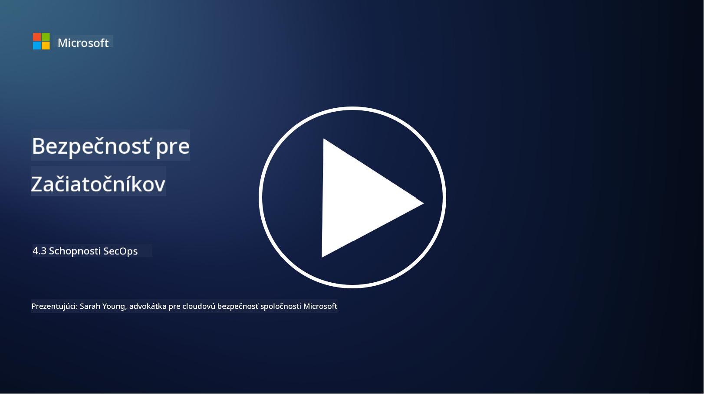

<!--
CO_OP_TRANSLATOR_METADATA:
{
  "original_hash": "553eb694c89f1caca0694e8d8ab89e0e",
  "translation_date": "2025-09-04T01:22:14+00:00",
  "source_file": "4.3 SecOps capabilities.md",
  "language_code": "sk"
}
-->
# Schopnosti SecOps

V tejto časti sa podrobnejšie pozrieme na základné nástroje a schopnosti, ktoré je možné využiť v bezpečnostných operáciách.

V tejto lekcii sa dozviete:

- Čo je nástroj na správu bezpečnostných informácií a udalostí (SIEM)?

- Čo je XDR?

- Aké schopnosti môžu byť využité na zlepšenie bezpečnostných operácií?

## Čo je nástroj na správu bezpečnostných informácií a udalostí (SIEM)?

Nástroj na správu bezpečnostných informácií a udalostí (SIEM) poskytuje analýzu bezpečnostných upozornení generovaných v rámci IT prostredia organizácie. Zbiera, agreguje, koreluje a analyzuje údaje z logov a bezpečnostné udalosti z rôznych zdrojov, ako sú sieťové zariadenia, servery, aplikácie a bezpečnostné systémy.

Kľúčové funkcie a schopnosti nástrojov SIEM zahŕňajú:

1. **Zber logov**: Nástroje SIEM zbierajú logy a údaje o bezpečnostných udalostiach z rôznych zariadení, systémov a aplikácií, vrátane firewallov, systémov na detekciu narušení, antivírusového softvéru a ďalších.

2. **Normalizácia údajov**: Normalizujú údaje z logov do spoločného formátu, aby uľahčili analýzu a koreláciu.

3. **Korelácia udalostí**: Nástroje SIEM korelujú udalosti, aby identifikovali vzory a anomálie, ktoré môžu naznačovať bezpečnostné incidenty alebo hrozby.

4. **Upozornenia a notifikácie**: Generujú upozornenia a notifikácie v reálnom čase, keď sú zistené podozrivé aktivity alebo porušenia bezpečnosti, čo umožňuje okamžitú reakciu.

5. **Detekcia incidentov**: Umožňujú detekciu bezpečnostných incidentov, vrátane neoprávneného prístupu, únikov dát, infekcií malvérom a vnútorných hrozieb.

6. **Analýza správania používateľov a entít (UEBA)**: Niektoré nástroje SIEM obsahujú schopnosti UEBA na identifikáciu abnormálneho správania používateľov a entít, ktoré môžu naznačovať kompromitované účty alebo vnútorné hrozby.

7. **Integrácia s hrozbovou inteligenciou**: Nástroje SIEM môžu integrovať zdroje hrozbovej inteligencie na zlepšenie detekcie hrozieb porovnávaním známych indikátorov kompromitácie (IOC) s aktivitou v sieti.

8. **Automatizácia a orchestrácia**: Automatizačné funkcie umožňujú SIEM nástrojom automatizovať reakcie na bežné bezpečnostné incidenty, čím sa znižuje čas reakcie a manuálna práca.

9. **Dashboardy a vizualizácia**: Ponúkajú dashboardy a nástroje na vizualizáciu na monitorovanie bezpečnostných údajov a vytváranie vlastných reportov.

10. **Integrácia s inými bezpečnostnými nástrojmi**: Nástroje SIEM sa často integrujú s inými bezpečnostnými nástrojmi a technológiami, ako sú riešenia na detekciu a reakciu na koncové body (EDR), aby poskytli holistický pohľad na bezpečnostný stav organizácie.

## Čo je XDR?

XDR (Extended Detection and Response) je technológia, ktorá rozširuje schopnosti tradičného riešenia na detekciu a reakciu na koncové body (EDR) a kombinuje ich so širšou bezpečnostnou telemetriou z rôznych zdrojov, aby poskytla komplexnejší pohľad na bezpečnostný stav organizácie. XDR si kladie za cieľ zlepšiť detekciu hrozieb, reakciu na incidenty a celkovú bezpečnosť tým, že rieši obmedzenia spoliehania sa výlučne na EDR, SIEM alebo iné individuálne bezpečnostné nástroje.

Kľúčové charakteristiky a komponenty XDR zahŕňajú:

1. **Integrácia údajov**: XDR integruje údaje z viacerých zdrojov, vrátane koncových bodov, sieťovej prevádzky, cloudových služieb, e-mailov a ďalších. Táto komplexná agregácia údajov poskytuje širší kontext pre detekciu a analýzu hrozieb.

2. **Pokročilá analytika**: XDR využíva pokročilú analytiku, strojové učenie a analýzu správania na identifikáciu a prioritizáciu bezpečnostných hrozieb. Hľadá vzory a anomálie v integrovaných údajoch na detekciu známych aj neznámych hrozieb.

3. **Automatizovaná detekcia hrozieb**: XDR automatizuje detekciu bezpečnostných hrozieb a anomálií koreláciou informácií z rôznych zdrojov. Dokáže identifikovať komplexné reťazce útokov, ktoré môžu zahŕňať viacero vektorov.

4. **Vyšetrovanie a reakcia na incidenty**: XDR poskytuje nástroje na vyšetrovanie a reakciu na incidenty, ktoré pomáhajú bezpečnostným tímom rýchlo posúdiť rozsah a dopad incidentov a prijať vhodné nápravné opatrenia.

5. **Integrácia s hrozbovou inteligenciou**: Integruje zdroje hrozbovej inteligencie a údaje na zlepšenie detekcie hrozieb porovnávaním známych indikátorov kompromitácie (IOC) s aktivitou v sieti a na koncových bodoch organizácie.

6. **Zjednotená konzola**: XDR zvyčajne ponúka zjednotenú konzolu alebo dashboard, kde môžu bezpečnostné tímy centrálne spravovať bezpečnostné upozornenia a incidenty z rôznych zdrojov.

7. **Pokrytie viacerých platforiem**: Riešenia XDR pokrývajú širokú škálu platforiem, vrátane koncových bodov, serverov, cloudových prostredí a mobilných zariadení, čo ich robí vhodnými pre moderné, multiplatformové IT prostredia.

## Aké schopnosti môžu byť využité na zlepšenie bezpečnostných operácií?

Na zlepšenie bezpečnostných operácií môžu organizácie využiť niekoľko schopností okrem nástrojov SIEM:

1. **Strojové učenie a umelá inteligencia**: Implementujte pokročilú analytiku, strojové učenie a AI na detekciu vyvíjajúcich sa hrozieb a automatizáciu lovu hrozieb.

2. **Analýza správania používateľov a entít (UEBA)**: Analyzujte správanie používateľov a entít na detekciu anomálií a vnútorných hrozieb.

3. **Hrozbové informačné zdroje**: Integrujte hrozbové informačné zdroje, aby ste zostali informovaní o najnovších hrozbách a indikátoroch kompromitácie.

4. **Orchestrácia, automatizácia a reakcia na bezpečnosť (SOAR)**: Implementujte platformy SOAR na automatizáciu reakcie na incidenty a zefektívnenie pracovných tokov bezpečnostných operácií.

5. **Technológie klamu**: Nasadzujte technológie klamu na zavádzanie a detekciu útočníkov v rámci siete.

## Ďalšie čítanie

- [What is SIEM? | Microsoft Security](https://www.microsoft.com/security/business/security-101/what-is-siem?WT.mc_id=academic-96948-sayoung)
- [What Is SIEM? - Security Information and Event Management - Cisco](https://www.cisco.com/c/en/us/products/security/what-is-siem.html)
- [Security information and event management - Wikipedia](https://en.wikipedia.org/wiki/Security_information_and_event_management)
- [What Is XDR? | Microsoft Security](https://www.microsoft.com/security/business/security-101/what-is-xdr?WT.mc_id=academic-96948-sayoung)
- [XDR & XDR Security (kaspersky.com.au)](https://www.kaspersky.com.au/resource-center/definitions/what-is-xdr)
- [The Power of SecOps: Redefining Core Security Capabilities - The New Stack](https://thenewstack.io/the-power-of-secops-redefining-core-security-capabilities/)
- [Seven Steps to Improve Your Security Operations and Response (securityintelligence.com)](https://securityintelligence.com/seven-steps-to-improve-your-security-operations-and-response/)

---

**Upozornenie**:  
Tento dokument bol preložený pomocou služby na automatický preklad [Co-op Translator](https://github.com/Azure/co-op-translator). Hoci sa snažíme o presnosť, upozorňujeme, že automatické preklady môžu obsahovať chyby alebo nepresnosti. Pôvodný dokument v jeho pôvodnom jazyku by mal byť považovaný za autoritatívny zdroj. Pre dôležité informácie odporúčame profesionálny ľudský preklad. Nezodpovedáme za akékoľvek nedorozumenia alebo nesprávne interpretácie vyplývajúce z použitia tohto prekladu.