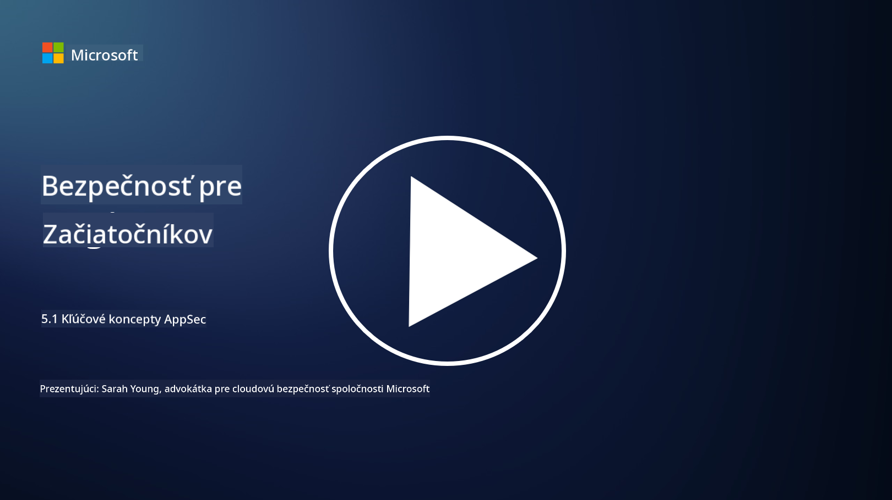

<!--
CO_OP_TRANSLATOR_METADATA:
{
  "original_hash": "e4b56bb23078d3ffb7ad407d280b0c36",
  "translation_date": "2025-09-04T00:33:53+00:00",
  "source_file": "5.1 AppSec key concepts.md",
  "language_code": "sk"
}
-->
# Kľúčové koncepty AppSec

Bezpečnosť aplikácií je samostatná špecializácia v oblasti bezpečnosti. V tejto časti kurzu sa bližšie pozrieme na bezpečnosť aplikácií.

## Úvod

V tejto lekcii sa budeme venovať:

- Čo je bezpečnosť aplikácií?

- Aké sú kľúčové koncepty/princípy bezpečnosti aplikácií?

## Čo je bezpečnosť aplikácií?

Bezpečnosť aplikácií, často skrátene označovaná ako "AppSec," sa týka praxe ochrany softvérových aplikácií pred bezpečnostnými hrozbami, zraniteľnosťami a útokmi. Zahŕňa procesy, techniky a nástroje používané na identifikáciu, zmiernenie a prevenciu bezpečnostných rizík počas vývoja, nasadenia a údržby aplikácie.

Bezpečnosť aplikácií je kľúčová, pretože aplikácie sú častým cieľom kybernetických útokov. Zlomyseľní aktéri využívajú zraniteľnosti a slabiny v softvéri na získanie neoprávneného prístupu, krádež údajov, narušenie služieb alebo vykonávanie iných škodlivých aktivít. Efektívna bezpečnosť aplikácií pomáha zabezpečiť dôvernosť, integritu a dostupnosť aplikácie a jej súvisiacich údajov.

## Aké sú kľúčové koncepty/princípy bezpečnosti aplikácií?

Kľúčové koncepty a princípy, ktoré tvoria základ bezpečnosti aplikácií, zahŕňajú:

1. **Bezpečnosť už pri návrhu**:

- Bezpečnosť by mala byť integrovaná do návrhu a architektúry aplikácie od samého začiatku, namiesto toho, aby sa pridávala dodatočne.

2. **Validácia vstupov**:

- Všetky vstupy od používateľov by mali byť validované, aby sa zabezpečilo, že zodpovedajú očakávaným formátom a neobsahujú škodlivý kód alebo údaje.

3. **Kódovanie výstupov**:

- Dáta odosielané klientovi by mali byť správne kódované, aby sa predišlo zraniteľnostiam, ako je cross-site scripting (XSS).

4. **Autentifikácia a autorizácia**:

- Overte používateľov a povoľte ich prístup k zdrojom na základe ich rolí a oprávnení.

5. **Ochrana údajov**:

- Citlivé údaje by mali byť šifrované pri ukladaní, prenose a spracovaní, aby sa zabránilo neoprávnenému prístupu.

6. **Správa relácií**:

- Bezpečná správa relácií zabezpečuje ochranu používateľských relácií pred únosom a neoprávneným prístupom.

7. **Bezpečné závislosti**:

- Udržiavajte všetky softvérové závislosti aktuálne s bezpečnostnými záplatami, aby ste predišli zraniteľnostiam.

8. **Spracovanie chýb a logovanie**:

- Implementujte bezpečné spracovanie chýb, aby sa predišlo odhaleniu citlivých informácií, a zabezpečte bezpečné praktiky logovania.

9. **Bezpečnostné testovanie**:

- Pravidelne testujte aplikácie na zraniteľnosti pomocou metód, ako sú penetračné testy, revízie kódu a automatizované nástroje na skenovanie.

10. **Bezpečný životný cyklus vývoja softvéru (SDLC)**:

- Integrujte bezpečnostné praktiky do každej fázy životného cyklu vývoja softvéru, od požiadaviek až po nasadenie a údržbu.

## Ďalšie čítanie

- [SheHacksPurple: What is Application Security? - YouTube](https://www.youtube.com/watch?v=eNmccQNzSSY)
- [What Is Application Security? - Cisco](https://www.cisco.com/c/en/us/solutions/security/application-first-security/what-is-application-security.html#~how-does-it-work)
- [What is application security? A process and tools for securing software | CSO Online](https://www.csoonline.com/article/566471/what-is-application-security-a-process-and-tools-for-securing-software.html)
- [OWASP Cheat Sheet Series | OWASP Foundation](https://owasp.org/www-project-cheat-sheets/)

---

**Upozornenie**:  
Tento dokument bol preložený pomocou služby AI prekladu [Co-op Translator](https://github.com/Azure/co-op-translator). Hoci sa snažíme o presnosť, prosím, berte na vedomie, že automatizované preklady môžu obsahovať chyby alebo nepresnosti. Pôvodný dokument v jeho pôvodnom jazyku by mal byť považovaný za autoritatívny zdroj. Pre kritické informácie sa odporúča profesionálny ľudský preklad. Nie sme zodpovední za žiadne nedorozumenia alebo nesprávne interpretácie vyplývajúce z použitia tohto prekladu.