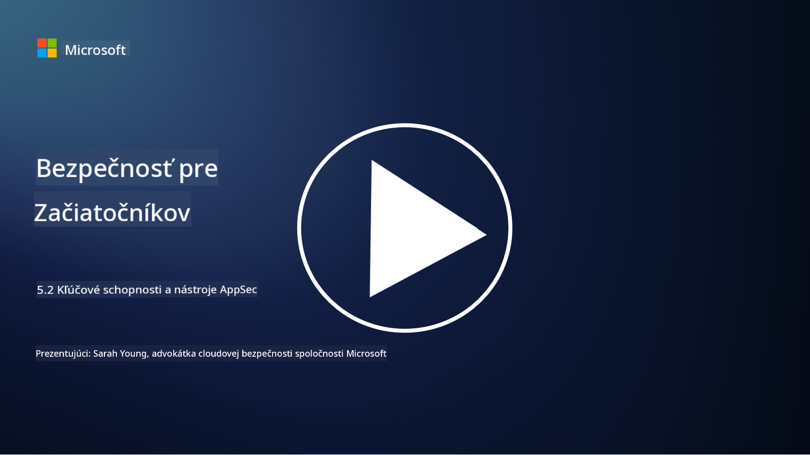

<!--
CO_OP_TRANSLATOR_METADATA:
{
  "original_hash": "790a3fa7e535ec60bb51bde13e759781",
  "translation_date": "2025-09-04T00:52:28+00:00",
  "source_file": "5.2 AppSec key capabilities.md",
  "language_code": "sk"
}
-->
## Úvod

V tejto lekcii sa budeme venovať kľúčovým schopnostiam a nástrojom, ktoré sa používajú v oblasti bezpečnosti aplikácií.

## Kľúčové schopnosti a nástroje v oblasti bezpečnosti aplikácií

Kľúčové schopnosti a nástroje používané v oblasti bezpečnosti aplikácií sú nevyhnutné na identifikáciu, zmiernenie a prevenciu bezpečnostných zraniteľností a hrozieb v softvérových aplikáciách. Tu sú niektoré z najdôležitejších:

**1. Statické testovanie bezpečnosti aplikácií (SAST)**:

- **Schopnosti**: Analyzuje zdrojový kód, bytecode alebo binárny kód na identifikáciu bezpečnostných zraniteľností v kóde aplikácie.

- **Nástroje**: Príklady zahŕňajú Fortify, Checkmarx a Veracode.

**2. Dynamické testovanie bezpečnosti aplikácií (DAST)**:

- **Schopnosti**: Skenuje bežiacu aplikáciu na identifikáciu zraniteľností prostredníctvom odosielania vstupných požiadaviek a analýzy odpovedí.

- **Nástroje**: Príklady zahŕňajú ZAP, Burp Suite a Qualys Web Application Scanning.

**3. Interaktívne testovanie bezpečnosti aplikácií (IAST)**:

- **Schopnosti**: Kombinuje prvky SAST a DAST na analýzu kódu počas behu aplikácie, poskytuje presnejšie výsledky a znižuje počet falošných pozitív.

- **Nástroje**: Príklady zahŕňajú Contrast Security a HCL AppScan.

**4. Ochrana aplikácií počas behu (RASP)**:

- **Schopnosti**: Monitoruje a chráni aplikácie v reálnom čase, detekuje a reaguje na bezpečnostné hrozby, keď sa vyskytnú.

- **Nástroje**: Príklady zahŕňajú Veracode Runtime Protection a F5 Advanced WAF s RASP.

**5. Webové aplikačné firewally (WAFs)**:

- **Schopnosti**: Poskytujú ochrannú vrstvu medzi aplikáciou a internetom, filtrujú prichádzajúcu prevádzku a blokujú škodlivé požiadavky.

- **Nástroje**: Príklady zahŕňajú ModSecurity, AWS WAF a Akamai Kona Site Defender.

**6. Skenovanie závislostí**:

- **Schopnosti**: Identifikuje zraniteľnosti v knižniciach a komponentoch tretích strán, ktoré sa používajú v aplikácii.

- **Nástroje**: Príklady zahŕňajú OWASP Dependency-Check a Snyk.

**7. Penetračné testovanie (Pen Testing)**:

- **Schopnosti**: Simuluje útoky z reálneho sveta na odhalenie zraniteľností a posúdenie bezpečnosti aplikácie.

- **Nástroje**: Vykonávajú certifikovaní etickí hackeri a bezpečnostní profesionáli pomocou rôznych nástrojov, ako sú Metasploit a Nmap.

**8. Skenovanie a analýza bezpečnosti**:

- **Schopnosti**: Skenuje známe zraniteľnosti, chyby konfigurácie a bezpečnostné nesprávne nastavenia.

- **Nástroje**: Príklady zahŕňajú Nessus, Qualys Vulnerability Management a OpenVAS.

**9. Nástroje na bezpečnosť kontajnerov**:

- **Schopnosti**: Zameriavajú sa na zabezpečenie kontajnerových aplikácií a ich prostredí.

- **Nástroje**: Príklady zahŕňajú Docker Security Scanning a Aqua Security.

**10. Školenie o bezpečnom vývoji**:

- **Schopnosti**: Poskytuje školenia a programy zvyšovania povedomia pre vývojové tímy na podporu bezpečných postupov pri písaní kódu.

- **Nástroje**: Prispôsobené školiace programy a platformy.

**11. Rámce na testovanie bezpečnosti**:

- **Schopnosti**: Poskytujú komplexné testovacie rámce pre rôzne potreby testovania bezpečnosti aplikácií.

- **Nástroje**: OWASP Amass, OWASP OWTF a FrAppSec.

**12. Nástroje na kontrolu bezpečnosti kódu**:

- **Schopnosti**: Kontrolujú zdrojový kód na bezpečnostné zraniteľnosti a najlepšie postupy pri písaní kódu.

- **Nástroje**: Príklady zahŕňajú SonarQube a Checkmarx.

**13. Nástroje na zabezpečenie API a mikroslužieb**:

- **Schopnosti**: Zameriavajú sa na zabezpečenie API a mikroslužieb vrátane autentifikácie, autorizácie a ochrany údajov.

- **Nástroje**: Príklady zahŕňajú Apigee, AWS API Gateway a Istio.

## Ďalšie čítanie

- [What Is Application Security? Concepts, Tools & Best Practices | HackerOne](https://www.hackerone.com/knowledge-center/what-application-security-concepts-tools-best-practices)
- [What is IAST? (Interactive Application Security Testing) (comparitech.com)](https://www.comparitech.com/net-admin/what-is-iast/)
- [10 Types of Application Security Testing Tools: When and How to Use Them (cmu.edu)](https://insights.sei.cmu.edu/blog/10-types-of-application-security-testing-tools-when-and-how-to-use-them/)
- [Shifting the Balance of Cybersecurity Risk: Principles and Approaches for Security-by-Design and Default | Cyber.gov.au](https://www.cyber.gov.au/about-us/view-all-content/publications/principles-and-approaches-for-security-by-design-and-default)

---

**Upozornenie**:  
Tento dokument bol preložený pomocou služby na prekladanie AI [Co-op Translator](https://github.com/Azure/co-op-translator). Aj keď sa snažíme o presnosť, upozorňujeme, že automatizované preklady môžu obsahovať chyby alebo nepresnosti. Pôvodný dokument v jeho pôvodnom jazyku by mal byť považovaný za autoritatívny zdroj. Pre kritické informácie sa odporúča profesionálny ľudský preklad. Nezodpovedáme za žiadne nedorozumenia alebo nesprávne interpretácie vyplývajúce z použitia tohto prekladu.