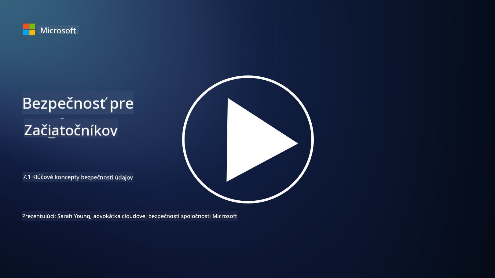

<!--
CO_OP_TRANSLATOR_METADATA:
{
  "original_hash": "9703868f41dcddd5a98dea9ea6fcd94d",
  "translation_date": "2025-09-03T23:59:23+00:00",
  "source_file": "7.1 Data security key concepts.md",
  "language_code": "sk"
}
-->
# Kľúčové koncepty ochrany údajov

V tomto kurze sme sa už viackrát dotkli témy ochrany údajov. Teraz sa na túto tému pozrieme podrobnejšie. V tejto lekcii sa dozviete:

- Čo je ochrana údajov?

- Čo je klasifikácia údajov?

- Čo je správa životného cyklu údajov?

- Čo je prevencia straty údajov (DLP)?

- Prečo je ochrana údajov dôležitá pre organizáciu?

## Čo je ochrana údajov?

**Ochrana údajov** označuje prax ochrany digitálnych údajov, ako sú databázy, súbory a citlivé informácie, pred neoprávneným prístupom, zverejnením, zmenou alebo zničením. Hlavným cieľom ochrany údajov je zabezpečiť dôvernosť, integritu a dostupnosť údajov. To zahŕňa implementáciu kombinácie technických, administratívnych a fyzických bezpečnostných opatrení na ochranu údajov pred rôznymi hrozbami a zraniteľnosťami, vrátane kybernetických útokov, vnútorných hrozieb a únikov údajov. Medzi opatrenia na ochranu údajov patrí šifrovanie, kontrola prístupu, autentifikácia, záznamy o audite a bezpečnostné politiky.

## Čo je klasifikácia údajov?

**Klasifikácia údajov** je proces kategorizácie údajov na základe ich citlivosti, hodnoty a dôležitosti pre organizáciu. Účelom klasifikácie údajov je pomôcť organizáciám identifikovať a prioritizovať ochranu a spracovanie rôznych typov údajov. Bežné kategórie klasifikácie údajov zahŕňajú „verejné“, „interné“, „dôverné“ a „obmedzené“ alebo „vysoko dôverné“. Po klasifikácii údajov môžu organizácie aplikovať vhodné bezpečnostné opatrenia a obmedzenia prístupu, aby zabezpečili primeranú ochranu citlivých údajov a dodržiavanie regulačných požiadaviek.

## Čo je správa životného cyklu údajov?

**Správa životného cyklu údajov** je štruktúrovaný prístup k správe údajov počas celého ich životného cyklu, od ich vytvorenia alebo získania až po archiváciu alebo vymazanie. Životný cyklus údajov zvyčajne zahŕňa fázy, ako sú vytvorenie, ukladanie, spracovanie, prenos, archivácia a likvidácia. Správa životného cyklu údajov zahŕňa definovanie politík a postupov pre každú fázu životného cyklu údajov, vrátane uchovávania údajov, kontroly prístupu, zálohovania a čistenia údajov. Efektívna správa životného cyklu údajov pomáha organizáciám optimalizovať ukladanie údajov, zlepšiť kvalitu údajov a zabezpečiť súlad s predpismi na ochranu údajov.

## Čo je prevencia straty údajov (DLP)?

**Prevencia straty údajov (DLP)** označuje súbor technológií, politík a postupov navrhnutých na zabránenie neoprávnenému prístupu, zdieľaniu alebo úniku citlivých alebo dôverných údajov. Riešenia DLP využívajú kontrolu obsahu a kontextovú analýzu na monitorovanie a kontrolu údajov v pohybe (napr. e-mail, webový prenos), údajov v pokoji (napr. uložené súbory a databázy) a údajov v používaní (napr. údaje, ku ktorým majú používatelia prístup alebo ich manipulujú). Cieľom DLP je identifikovať a blokovať alebo šifrovať citlivé údaje, aby sa zabránilo únikom údajov, dodržiavali predpisy na ochranu údajov a chránila reputácia organizácie.

## Prečo je ochrana údajov dôležitá pre organizáciu?

Ochrana údajov je pre organizácie mimoriadne dôležitá z viacerých dôvodov:

- **Ochrana citlivých informácií**: Organizácie často uchovávajú citlivé údaje, ako sú záznamy zákazníkov, duševné vlastníctvo, finančné údaje a informácie o zamestnancoch. Ochrana údajov chráni tieto citlivé informácie pred neoprávneným prístupom alebo krádežou.

- **Súlad s predpismi**: Mnohé odvetvia a jurisdikcie majú prísne predpisy na ochranu údajov a súkromia. Ochrana údajov pomáha organizáciám dodržiavať tieto zákony, čím sa vyhýbajú právnym sankciám a poškodeniu reputácie.

- **Prevencia únikov údajov**: Úniky údajov môžu mať za následok finančné straty, poškodenie reputácie a právne dôsledky. Efektívne opatrenia na ochranu údajov pomáhajú predchádzať únikom údajov alebo minimalizovať ich dopad.

- **Zachovanie dôvery**: Zákazníci a zainteresované strany dôverujú organizáciám so svojimi údajmi. Úniky údajov narúšajú dôveru. Udržiavanie silnej ochrany údajov pomáha zachovať dôveru a dôveru zákazníkov.

- **Konkurenčná výhoda**: Preukázanie záväzku k ochrane údajov môže byť konkurenčnou výhodou. Zákazníci a partneri sú ochotnejší spolupracovať s organizáciami, ktoré berú ochranu údajov vážne.

- **Prevádzková kontinuita**: Opatrenia na ochranu údajov, vrátane zálohovania údajov a plánovania obnovy po katastrofe, pomáhajú zabezpečiť dostupnosť kritických údajov a kontinuitu podnikania v prípade straty údajov alebo katastrof.

- **Ochrana pred vnútornými hrozbami**: Opatrenia na ochranu údajov sa zameriavajú aj na hrozby v rámci organizácie, vrátane náhodného vystavenia údajov zamestnancami a škodlivých činov zo strany interných osôb.

Zhrnuté, ochrana údajov je nevyhnutná na ochranu citlivých informácií, dodržiavanie predpisov, prevenciu únikov údajov, zachovanie dôvery a zabezpečenie pokračujúceho úspechu a reputácie organizácie.

## Ďalšie čítanie

- [What Is Data Security? | Microsoft Security](https://www.microsoft.com/en-au/security/business/security-101/what-is-data-security?WT.mc_id=academic-96948-sayoung)
- [Automatically Classify & Protect Documents & Data | Microsoft Purview Information Protection](https://youtu.be/v8LqmzBUaOo)
- [Example data classification policy](https://www.cmu.edu/data/guidelines/data-classification.html)
- [What is Data Security? Data Security Definition and Overview | IBM](https://www.ibm.com/topics/data-security)
- [Data Lifecycle Management: A 2023 Guide for Your Business (cloudwards.net)](https://www.cloudwards.net/data-lifecycle-management/)
- [What is data loss prevention (DLP)? | Microsoft Security](https://www.microsoft.com/security/business/security-101/what-is-data-loss-prevention-dlp?WT.mc_id=academic-96948-sayoung)
- [What is DLP? How data loss prevention software works and why you need it | CSO Online](https://www.csoonline.com/article/569559/what-is-dlp-how-data-loss-prevention-software-works-and-why-you-need-it.html)

---

**Upozornenie**:  
Tento dokument bol preložený pomocou služby AI prekladu [Co-op Translator](https://github.com/Azure/co-op-translator). Aj keď sa snažíme o presnosť, prosím, berte na vedomie, že automatizované preklady môžu obsahovať chyby alebo nepresnosti. Pôvodný dokument v jeho pôvodnom jazyku by mal byť považovaný za autoritatívny zdroj. Pre kritické informácie sa odporúča profesionálny ľudský preklad. Nie sme zodpovední za akékoľvek nedorozumenia alebo nesprávne interpretácie vyplývajúce z použitia tohto prekladu.