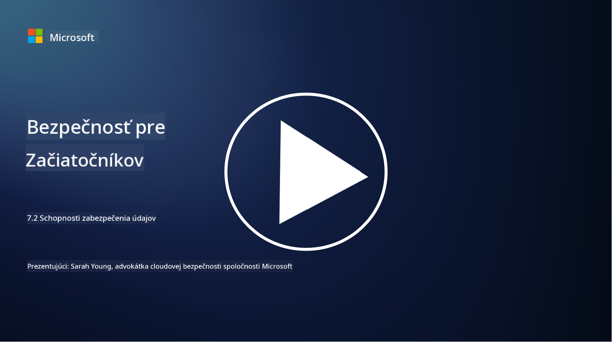

<!--
CO_OP_TRANSLATOR_METADATA:
{
  "original_hash": "50697add9758e54693442d502d2d5f8a",
  "translation_date": "2025-09-04T00:57:50+00:00",
  "source_file": "7.2 Data security capabilities.md",
  "language_code": "sk"
}
-->
# Schopnosti zabezpečenia údajov

V tejto sekcii sa podrobnejšie pozrieme na základné nástroje a schopnosti, ktoré sa používajú pri zabezpečení údajov:

**Úvod**

V tejto lekcii sa dozviete:

- Čo je nástroj na prevenciu straty údajov?

- Čo je nástroj na riadenie rizík od insiderov?

- Aké nástroje na uchovávanie údajov sú dostupné?

## Čo je nástroj na prevenciu straty údajov?

Nástroje na prevenciu straty údajov (Data Loss Prevention, DLP) predstavujú súbor softvérových riešení a technológií navrhnutých na zabránenie neoprávnenému prístupu, zdieľaniu alebo úniku citlivých či dôverných údajov v rámci organizácie. Tieto nástroje využívajú kontrolu obsahu, presadzovanie politík a monitorovanie na identifikáciu a ochranu citlivých údajov pred ich zneužitím alebo vystavením. Príklady DLP produktov zahŕňajú: Symantec Data Loss Prevention, McAfee Total Protection for Data Loss Prevention, Microsoft 365 DLP**: Integruje sa s aplikáciami Microsoft 365, aby pomohla organizáciám identifikovať a chrániť citlivé údaje v e-mailoch, dokumentoch a správach.

## Čo je nástroj na riadenie rizík od insiderov?

Nástroje na riadenie rizík od insiderov pomáhajú organizáciám identifikovať a zmierňovať riziká, ktoré predstavujú zamestnanci, dodávatelia alebo partneri, ktorí môžu úmyselne alebo neúmyselne ohroziť bezpečnosť údajov. Tieto nástroje monitorujú správanie používateľov, vzory prístupu a používanie údajov na detekciu podozrivých aktivít a potenciálnych hrozieb od insiderov. Príklady produktov na riadenie rizík od insiderov zahŕňajú: Microsoft Insider Risk Management (súčasť Microsoft 365), Forcepoint Insider Threat Data Protection, Varonis Insider Threat Detection.

## Aké nástroje na uchovávanie údajov sú dostupné?

Nástroje na uchovávanie údajov zahŕňajú softvér a riešenia navrhnuté na správu uchovávania a mazania údajov v súlade s politikami uchovávania údajov organizácie a právnymi požiadavkami. Tieto nástroje pomáhajú automatizovať proces uchovávania údajov na konkrétne obdobia a ich bezpečné mazanie, keď už nie sú potrebné. Príklady produktov na uchovávanie údajov zahŕňajú: Veritas Enterprise Vault, Commvault Complete Data Protection, Microsoft data lifecycle management. Tieto riešenia pomáhajú organizáciám udržiavať kontrolu nad uchovávaním a likvidáciou údajov, zabezpečovať súlad s predpismi o ochrane údajov a efektívne spravovať údaje počas ich životného cyklu.

## Ďalšie čítanie

- [Guide to Data Security Posture Management (DSPM) | CSA (cloudsecurityalliance.org)](https://cloudsecurityalliance.org/blog/2023/03/31/the-big-guide-to-data-security-posture-management-dspm/)
- [Data Loss Prevention across endpoints, apps, & services | Microsoft Purview](https://youtu.be/hvqq8L_0kgI)
- [18 Best Data Loss Prevention Software Tools 2023 (Free + Paid) (comparitech.com)](https://www.comparitech.com/data-privacy-management/data-loss-prevention-tools-software/)
- [Data Loss Prevention (nist.gov)](https://tsapps.nist.gov/publication/get_pdf.cfm?pub_id=904672)
- [Learn about insider risk management | Microsoft Learn](https://learn.microsoft.com/purview/insider-risk-management?WT.mc_id=academic-96948-sayoung)
- [Data Lifecycle Management | IBM](https://www.ibm.com/topics/data-lifecycle-management)
- [What Is Data Lifecycle Management (DLM)? | 2023 Best Practices (selecthub.com)](https://www.selecthub.com/big-data-analytics/data-lifecycle-management/)

---

**Upozornenie**:  
Tento dokument bol preložený pomocou služby AI prekladu [Co-op Translator](https://github.com/Azure/co-op-translator). Hoci sa snažíme o presnosť, prosím, berte na vedomie, že automatizované preklady môžu obsahovať chyby alebo nepresnosti. Pôvodný dokument v jeho pôvodnom jazyku by mal byť považovaný za autoritatívny zdroj. Pre kritické informácie sa odporúča profesionálny ľudský preklad. Nie sme zodpovední za akékoľvek nedorozumenia alebo nesprávne interpretácie vyplývajúce z použitia tohto prekladu.