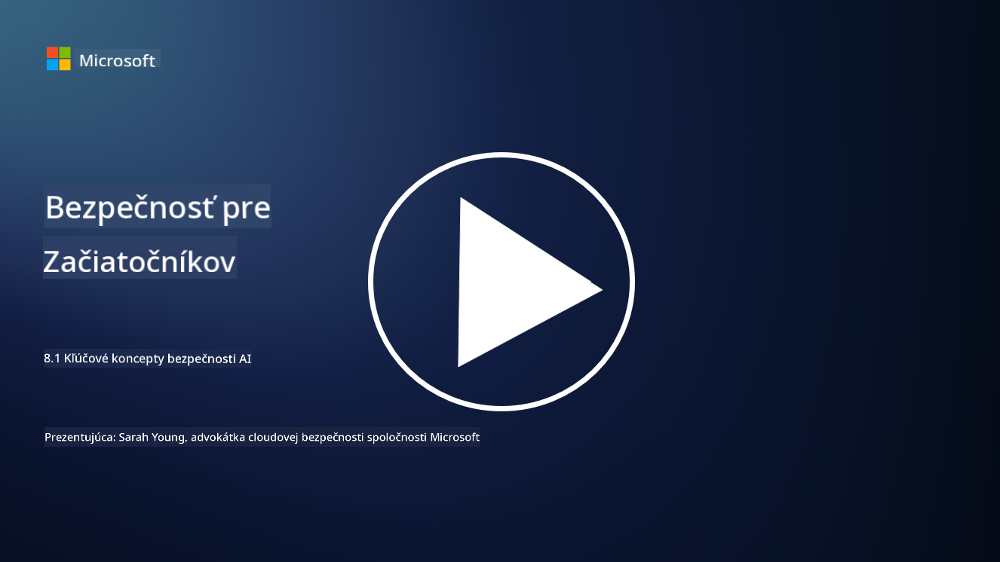

<!--
CO_OP_TRANSLATOR_METADATA:
{
  "original_hash": "66b61d96936cf25d20fcb411d4ce5227",
  "translation_date": "2025-09-03T22:50:42+00:00",
  "source_file": "8.1 AI security key concepts.md",
  "language_code": "sk"
}
-->
# Kľúčové koncepty bezpečnosti AI

## Ako sa bezpečnosť AI líši od tradičnej kybernetickej bezpečnosti?

Zabezpečenie AI systémov prináša jedinečné výzvy v porovnaní s tradičnou kybernetickou bezpečnosťou, hlavne kvôli povaze schopností učenia a rozhodovacích procesov AI. Tu sú niektoré kľúčové rozdiely:

-   **Integrita dát**: AI systémy sa vo veľkej miere spoliehajú na dáta pri učení. [Zabezpečenie integrity týchto dát je kľúčové, pretože útočníci môžu manipulovať s dátami, aby ovplyvnili správanie AI, čo je taktika známa ako otrava dát.
-   **Bezpečnosť modelu**: Samotný rozhodovací model AI môže byť cieľom útoku. [Útočníci sa môžu pokúsiť o reverzné inžinierstvo modelu alebo využiť jeho slabiny na vykonanie nesprávnych alebo škodlivých rozhodnutí.
-   **Adversariálne útoky**: AI systémy môžu byť náchylné na adversariálne útoky, pri ktorých drobné, často nepostrehnuteľné zmeny vstupných dát môžu spôsobiť chyby alebo nesprávne predpovede.
-   **Bezpečnosť infraštruktúry**: Zatiaľ čo tradičná kybernetická bezpečnosť sa tiež zameriava na ochranu infraštruktúry, AI systémy môžu mať ďalšie vrstvy komplexnosti, ako sú cloudové služby alebo špecializovaný hardvér, ktoré vyžadujú špecifické bezpečnostné opatrenia.
-   **Etické aspekty**: Použitie AI v bezpečnosti prináša etické otázky, ako sú obavy o súkromie a potenciálna zaujatost v rozhodovaní, ktoré musia byť zahrnuté do bezpečnostnej stratégie.

Celkové zabezpečenie AI systémov vyžaduje odlišný prístup, ktorý zohľadňuje jedinečné aspekty AI technológie, vrátane ochrany dát, modelov a procesu učenia AI, pričom sa zároveň zaoberá etickými dôsledkami nasadenia AI.

Bezpečnosť AI a tradičná kybernetická bezpečnosť majú mnoho spoločných prvkov, ale tiež niektoré výrazné rozdiely kvôli jedinečným charakteristikám a schopnostiam systémov umelej inteligencie. Tu je, ako sa líšia:

- **Komplexnosť hrozieb**: AI systémy prinášajú nové vrstvy komplexnosti do kybernetickej bezpečnosti. Tradičná kybernetická bezpečnosť sa primárne zaoberá hrozbami, ako sú malware, phishingové útoky a narušenia siete. AI systémy však môžu byť zraniteľné voči útokom, ako sú adversariálne útoky, otrava dát a obchádzanie modelov, ktoré cielia priamo na algoritmy strojového učenia.

- **Plocha útoku**: AI systémy často majú väčšiu plochu útoku v porovnaní s tradičnými systémami. Je to preto, že sa nespoliehajú len na softvér, ale aj na dáta a modely. Útočníci môžu cieliť na tréningové dáta, manipulovať s modelmi alebo využívať zraniteľnosti v samotných algoritmoch.

- **Prispôsobivosť hrozieb**: AI systémy sa môžu prispôsobovať a učiť sa zo svojho prostredia, čo ich môže robiť náchylnejšími na adaptívne a vyvíjajúce sa hrozby. Tradičné opatrenia kybernetickej bezpečnosti nemusia byť dostatočné na obranu proti útokom, ktoré sa neustále vyvíjajú na základe správania AI systému.

- **Interpretovateľnosť a vysvetliteľnosť**: Pochopenie, prečo AI systém urobil konkrétne rozhodnutie, je často náročnejšie v porovnaní s tradičnými softvérovými systémami. Tento nedostatok interpretovateľnosti a vysvetliteľnosti môže sťažiť detekciu a zmiernenie útokov na AI systémy.

- **Obavy o súkromie dát**: AI systémy sa často spoliehajú na veľké množstvo dát, čo môže priniesť riziká pre súkromie, ak nie sú správne spracované. Tradičné opatrenia kybernetickej bezpečnosti nemusia dostatočne riešiť tieto obavy o súkromie dát špecifické pre AI systémy.

- **Regulačné požiadavky**: Regulačné prostredie pre bezpečnosť AI sa stále vyvíja, pričom vznikajú špecifické regulácie a normy na riešenie jedinečných výziev, ktoré prinášajú AI systémy. Tradičné rámce kybernetickej bezpečnosti môžu byť potrebné rozšíriť alebo prispôsobiť, aby zabezpečili súlad s týmito novými reguláciami.

- **Etické aspekty**: Bezpečnosť AI zahŕňa nielen ochranu systémov pred škodlivými útokmi, ale aj zabezpečenie, že AI systémy sú používané eticky a zodpovedne. To zahŕňa aspekty, ako sú spravodlivosť, transparentnosť a zodpovednosť, ktoré nemusia byť tak výrazné v tradičnej kybernetickej bezpečnosti.

## Ako je AI podobná zabezpečeniu tradičných IT systémov?

Zabezpečenie AI systémov zdieľa niekoľko základných princípov s tradičnou kybernetickou bezpečnosťou:

-   **Ochrana pred hrozbami**: AI aj tradičné systémy musia byť chránené pred neoprávneným prístupom, modifikáciou dát a ich zničením, ako aj pred ďalšími bežnými hrozbami.
-   **Riadenie zraniteľností**: Mnohé zraniteľnosti, ktoré ovplyvňujú tradičné systémy, ako sú softvérové chyby alebo nesprávne konfigurácie, môžu ovplyvniť aj AI systémy.
-   **Bezpečnosť dát**: Ochrana spracovávaných dát je kľúčová v oboch oblastiach, aby sa zabránilo únikom dát a zabezpečila ich dôvernosť.
-   **Bezpečnosť dodávateľského reťazca**: Oba typy systémov sú náchylné na útoky na dodávateľský reťazec, kde kompromitovaná súčasť môže ohroziť bezpečnosť celého systému.

Tieto podobnosti zdôrazňujú, že zatiaľ čo AI systémy prinášajú nové bezpečnostné výzvy, vyžadujú aj aplikáciu osvedčených postupov kybernetickej bezpečnosti na zabezpečenie robustnej ochrany. Ide o kombináciu využívania tradičnej bezpečnostnej múdrosti a prispôsobenia sa jedinečným aspektom AI technológie.

## Ďalšie čítanie

 - [Not with a Bug, But with a Sticker [Book] (oreilly.com)](https://www.oreilly.com/library/view/not-with-a/9781119883982/)
   
  -  [Intro to AI Security Part 1: AI Security 101 | by HarrietHacks | Medium](https://medium.com/@harrietfarlow/intro-to-ai-security-part-1-ai-security-101-b8662a9efe5)
   
-    [Best practices for AI security risk management | Microsoft Security Blog](https://www.microsoft.com/en-us/security/blog/2021/12/09/best-practices-for-ai-security-risk-management/?WT.mc_id=academic-96948-sayoung)
   
-    [OWASP AI Security and Privacy Guide | OWASP Foundation](https://owasp.org/www-project-ai-security-and-privacy-guide/)

---

**Upozornenie**:  
Tento dokument bol preložený pomocou služby na automatický preklad [Co-op Translator](https://github.com/Azure/co-op-translator). Hoci sa snažíme o presnosť, upozorňujeme, že automatické preklady môžu obsahovať chyby alebo nepresnosti. Pôvodný dokument v jeho pôvodnom jazyku by mal byť považovaný za autoritatívny zdroj. Pre dôležité informácie odporúčame profesionálny preklad vykonaný človekom. Nezodpovedáme za žiadne nedorozumenia alebo nesprávne interpretácie vyplývajúce z použitia tohto prekladu.