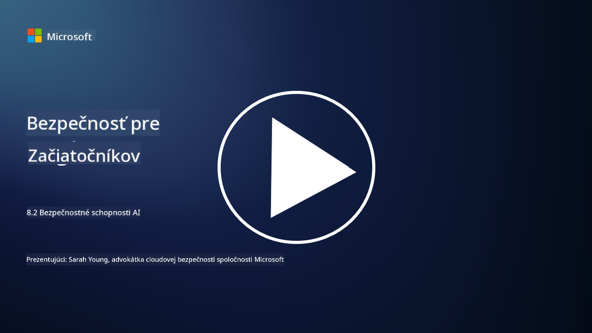

<!--
CO_OP_TRANSLATOR_METADATA:
{
  "original_hash": "b6bb7175672298d1e2f73ba7e0006f95",
  "translation_date": "2025-09-04T01:06:54+00:00",
  "source_file": "8.2 AI security capabilities.md",
  "language_code": "sk"
}
-->
# Bezpečnostné schopnosti AI

## Aké nástroje a schopnosti máme v súčasnosti na zabezpečenie AI systémov?

V súčasnosti existuje niekoľko nástrojov a schopností na zabezpečenie AI systémov:

-   **Counterfit**: Open-source automatizačný nástroj na testovanie bezpečnosti AI systémov, navrhnutý na pomoc organizáciám pri hodnotení rizík bezpečnosti AI a zabezpečení odolnosti ich algoritmov.
-   **Nástroje na adversariálne strojové učenie**: Tieto nástroje hodnotia odolnosť modelov strojového učenia voči adversariálnym útokom, čím pomáhajú identifikovať a zmierniť zraniteľnosti.
-   **Bezpečnostné nástroje pre AI**: Existujú open-source nástroje, ktoré poskytujú zdroje na zabezpečenie AI systémov, vrátane knižníc a rámcov na implementáciu bezpečnostných opatrení.
-   **Spolupracujúce platformy**: Partnerstvá medzi spoločnosťami a komunitami AI na vývoj špecifických bezpečnostných skenerov pre AI a ďalších nástrojov na zabezpečenie dodávateľského reťazca AI.

Tieto nástroje a schopnosti sú súčasťou rastúceho odvetvia zameraného na zlepšenie bezpečnosti AI systémov voči rôznym hrozbám. Predstavujú kombináciu výskumu, praktických nástrojov a spolupráce v priemysle, ktorá sa snaží riešiť jedinečné výzvy, ktoré prinášajú technológie AI.

## Čo AI red teaming? Ako sa líši od tradičného red teamingu v oblasti bezpečnosti?

AI red teaming sa líši od tradičného red teamingu v oblasti bezpečnosti v niekoľkých kľúčových aspektoch:

-   **Zameranie na AI systémy**: AI red teaming sa špecificky zameriava na jedinečné zraniteľnosti AI systémov, ako sú modely strojového učenia a dátové pipeline, namiesto tradičnej IT infraštruktúry.
-   **Testovanie správania AI**: Zahŕňa testovanie, ako AI systémy reagujú na neobvyklé alebo neočakávané vstupy, čo môže odhaliť zraniteľnosti, ktoré by mohli byť zneužité útočníkmi.
-   **Skúmanie zlyhaní AI**: AI red teaming sa zaoberá tak škodlivými, ako aj neškodnými zlyhaniami, pričom zohľadňuje širší súbor osobností a potenciálnych zlyhaní systémov nad rámec bezpečnostných narušení.
-   **Injekcia promptov a generovanie obsahu**: AI red teaming zahŕňa aj skúmanie zlyhaní, ako je injekcia promptov, kde útočníci manipulujú AI systémy, aby produkovali škodlivý alebo neoverený obsah.
-   **Etická a zodpovedná AI**: Je súčasťou zabezpečenia zodpovednej AI už od návrhu, aby sa zabezpečilo, že AI systémy sú odolné voči pokusom o ich neúmyselné správanie.

Celkovo je AI red teaming rozšírenou praxou, ktorá zahŕňa nielen skúmanie bezpečnostných zraniteľností, ale aj testovanie iných typov zlyhaní systémov špecifických pre technológie AI. Je to kľúčová súčasť vývoja bezpečnejších AI systémov prostredníctvom pochopenia a zmiernenia nových rizík spojených s nasadením AI.

## Ďalšie čítanie

 - [Microsoft AI Red Team building future of safer AI | Microsoft Security Blog](https://www.microsoft.com/en-us/security/blog/2023/08/07/microsoft-ai-red-team-building-future-of-safer-ai/?WT.mc_id=academic-96948-sayoung)
 - [Announcing Microsoft’s open automation framework to red team generative AI Systems | Microsoft Security Blog](https://www.microsoft.com/en-us/security/blog/2024/02/22/announcing-microsofts-open-automation-framework-to-red-team-generative-ai-systems/?WT.mc_id=academic-96948-sayoung)
 - [AI Security Tools: The Open-Source Toolkit | Wiz](https://www.wiz.io/academy/ai-security-tools)

---

**Upozornenie**:  
Tento dokument bol preložený pomocou služby na automatický preklad [Co-op Translator](https://github.com/Azure/co-op-translator). Hoci sa snažíme o presnosť, upozorňujeme, že automatické preklady môžu obsahovať chyby alebo nepresnosti. Pôvodný dokument v jeho pôvodnom jazyku by mal byť považovaný za autoritatívny zdroj. Pre dôležité informácie sa odporúča profesionálny ľudský preklad. Nezodpovedáme za akékoľvek nedorozumenia alebo nesprávne interpretácie vyplývajúce z použitia tohto prekladu.